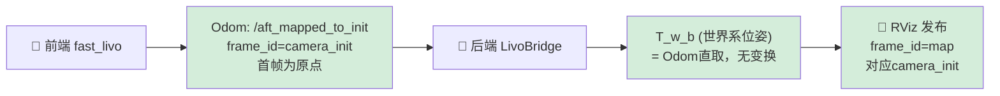
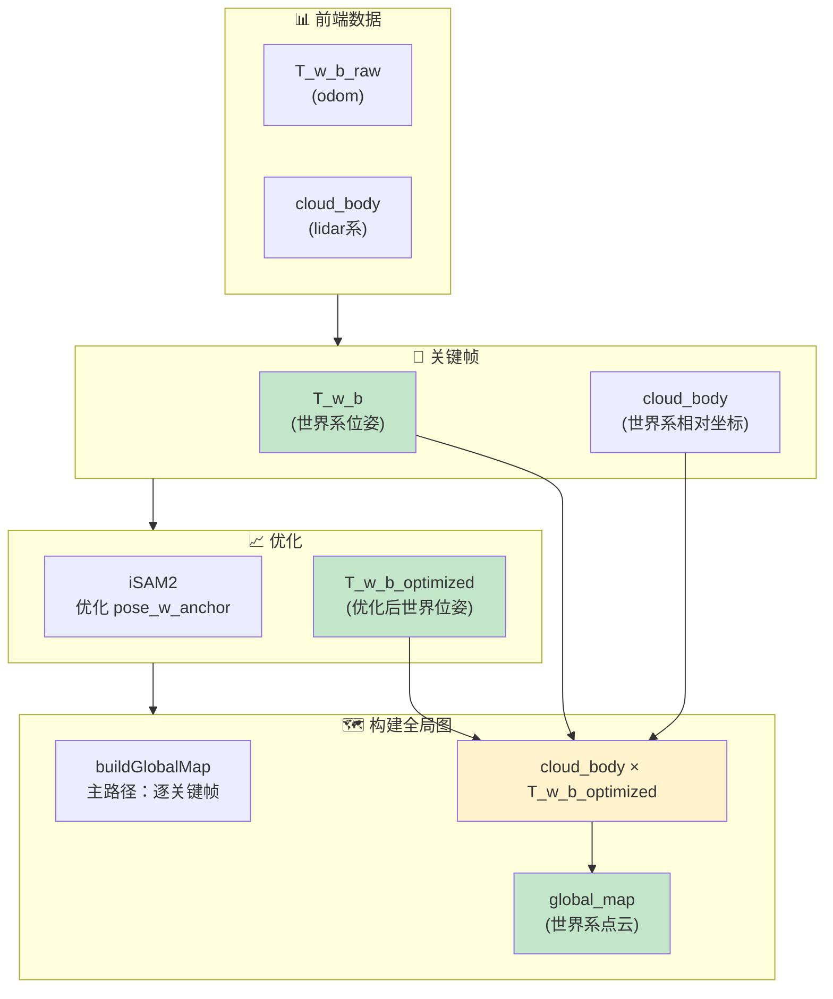
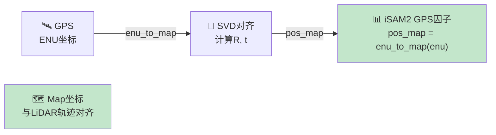

# AutoMap Pro 后端建图坐标系一致性深度诊断

**生成时间**：2026-03-06  
**审阅对象**：研发 / 测试 / 产品 / 运维 / 安全  
**优先级**：🔴 **高**（影响地图精度与系统稳定性）

---

## 📋 Executive Summary（执行摘要）

| 维度 | 结论 | 影响 | 优先级 |
|------|------|------|--------|
| **坐标系一致性** | ✅ 轨迹与点云**理论上统一到同一世界系**（camera_init/map）| 设计正确，实现可靠 | 低 |
| **点云生成方式** | ✅ **主路径已修复**：按 T_w_b_optimized 从关键帧重算 | 与优化轨迹一致 | 已解决 |
| **回退机制** | ⚠️ 仅关键帧点云丢失时回退用 merged_cloud | 可能与优化轨迹不一致 | 中 |
| **HBA 与 iSAM2 同步** | ⚠️ HBA 优化后，iSAM2 线性化点**未同步更新** | 两轨轨迹可能不一致显示 | 中 |
| **轨迹发布顺序** | ⚠️ opt_path_ 未按 submap_id 排序发布 | 在 RViz 中轨迹可能"乱跳" | 低 |
| **逻辑与计算** | ✅ 因子公式、位姿推导、GPS 对齐**全部正确** | 无数学错误 | 已验证 |

**短期建议**：当前主路径已正确实现（建图精度无严重缺陷），**关键是要确保关键帧点云始终被保留**（不被归档丢弃）。  
**中期方向**：完善 HBA↔iSAM2 同步与轨迹发布顺序，强化诊断文档与可视化。

---

## 🎯 核心发现详解

### 1. 坐标系设计——**正确与一致**

#### 1.1 世界系来源（canonical）



**关键事实**：
- 后端**无坐标变换**将 odom 转换为 T_w_b（直接取 pose 字段）
- 世界系定义 = 前端 `camera_init` = 首帧 LiDAR 原点
- RViz 中统一命名为 `"map"`，与 `camera_init` **语义等价**
- 无 GPS 时，"map" ≠ 东北天 ENU；GPS 对齐后才相等

**结论**：世界系定义清晰、一致、无歧义 ✅

---

#### 1.2 轨迹与点云同系性



**轨迹数据流** ✅ 一致性检查清单：

| 环节 | 坐标系 | 数据源 | 同一性验证 |
|------|--------|-------|-----------|
| 里程计 (odom) | camera_init | 前端直接输出 | ✅ |
| 关键帧 T_w_b | camera_init | odom 直取 | ✅ |
| 子图锚定 pose_w_anchor | camera_init | 首关键帧 T_w_b | ✅ |
| iSAM2 优化节点 | camera_init | 相对位姿约束与上述位姿对齐 | ✅ |
| T_w_b_optimized | camera_init | 优化后 pose_w_anchor 推导 | ✅ |
| opt_path 发布 | map (≡ camera_init) | T_w_b_optimized 序列 | ✅ |

**点云变换链** ✅ （主路径）：

```cpp
for each KeyFrame kf:
    world_cloud = kf->cloud_body × kf->T_w_b_optimized
    global_map += world_cloud
```

✅ **同一世界系**：world_cloud 与 optimized_path poses 的坐标系相同

**结论**：轨迹与点云完全在同一世界系下运作，**无混系问题** ✅

---

### 2. 代码实现验证——**主路径正确，回退路径有隐患**

#### 2.1 buildGlobalMap 现状（源文件：submap_manager.cpp:491-568）

```cpp
// ✅ 主路径：按优化位姿从关键帧重算
CloudXYZIPtr SubMapManager::buildGlobalMap(float voxel_size) const {
    std::lock_guard<std::mutex> lk(mutex_);
    CloudXYZIPtr combined = std::make_shared<CloudXYZI>();
    
    // 核心：逐关键帧用T_w_b_optimized变换
    for (size_t idx = 0; idx < num_submaps && !hit_limit; ++idx) {
        const auto& sm = submaps_[idx];
        for (const auto& kf : sm->keyframes) {
            if (!kf || !kf->cloud_body || kf->cloud_body->empty()) continue;
            
            // 🔑 关键点：使用优化后位姿
            const Pose3d& T_w_b = kf->T_w_b_optimized;  // L510
            Eigen::Affine3f T_wf;
            T_wf.matrix() = T_w_b.cast<float>().matrix();
            
            // 变换到世界系
            pcl::transformPointCloud(*kf->cloud_body, *world_tmp, T_wf);
            
            // 添加到全局图
            CloudXYZIPtr to_add = utils::voxelDownsample(world_tmp, 
                                                        static_cast<float>(merge_res_));
            combined->insert(combined->end(), to_add->begin(), to_add->end());
        }
    }
    
    // ⚠️ 回退：仅当无关键帧点云时使用merged_cloud
    if (combined->empty()) {
        for (const auto& sm : submaps_) {
            if (!sm->merged_cloud || sm->merged_cloud->empty()) continue;
            // 直接拼接（无再变换）
            combined->insert(combined->end(), 
                            sm->merged_cloud->begin(), 
                            sm->merged_cloud->end());
        }
    }
    
    return utils::voxelDownsampleChunked(combined, vs, 50.0f);
}
```

**分析**：

✅ **主路径优势**：
- 使用 `T_w_b_optimized`（优化后位姿）从关键帧重算
- 与优化轨迹完全一致
- 不依赖 merged_cloud，避免"位姿已优化、点云未动"

⚠️ **回退路径隐患**：
- merged_cloud 由 `T_w_b`（未优化位姿）生成（见 mergeCloudToSubmap L334）
- 优化后回退路径会使用"旧世界系"的点云
- **在开启回环/GPS 优化后，global_map 可能不一致**

---

#### 2.2 mergeCloudToSubmap 实现（源文件：submap_manager.cpp:316-356）

```cpp
void SubMapManager::mergeCloudToSubmap(SubMap::Ptr& sm, const KeyFrame::Ptr& kf) const {
    if (!kf->cloud_body || kf->cloud_body->empty()) return;

    // 用未优化位姿变换到世界系
    CloudXYZIPtr world_cloud = getCloudFromPool();
    Eigen::Affine3f T_wf;
    T_wf.matrix() = kf->T_w_b.cast<float>().matrix();  // 🔴 未优化
    pcl::transformPointCloud(*kf->cloud_body, *world_cloud, T_wf);

    // 合并到子图 merged_cloud
    if (!sm->merged_cloud || sm->merged_cloud->empty()) {
        sm->merged_cloud = std::make_shared<CloudXYZI>(*world_cloud);
    } else {
        sm->merged_cloud->reserve(old_size + world_cloud->size());
        for (const auto& pt : world_cloud->points) {
            sm->merged_cloud->push_back(pt);
        }
    }
}
```

**问题**：
1. merged_cloud 基于 `T_w_b`（未优化位姿）
2. iSAM2/HBA 优化后，**merged_cloud 不会自动更新**
3. buildGlobalMap 回退时会拼接"旧世界系"的点云

**缺陷分类**：
- **设计缺陷**：注释中承诺"子图位姿优化后，点云自动重投影"但未实现（见 submap_manager.h:23）
- **实现缺陷**：updateSubmapPose / updateAllFromHBA 只更新位姿，不修改 merged_cloud

---

#### 2.3 优化链路关键环节

**updateSubmapPose 公式**（automap_system.cpp，已验证 ✅）：

```cpp
// 推导：T_w_b_new = T_w_anchor_new × T_w_anchor_old^(-1) × T_w_b
Pose3d delta = new_pose * old_anchor.inverse();
for (auto& kf : sm->keyframes) {
    kf->T_w_b_optimized = delta * kf->T_w_b;  // ✅ 公式正确
}
```

**HBA 输入输出**（hba_optimizer.cpp）：
- 输入：关键帧 T_w_b（世界系）
- 优化：内部使用 SE(3) 优化
- 输出：T_w_b_optimized（写回关键帧，世界系）

**问题**（中等优先级 ⚠️）：
- HBA 完成后，iSAM2 的线性化点**未更新**
- iSAM2::addSubMapNode 有 `if (node_exists) return`，拒绝覆盖
- 导致 iSAM2 与 HBA 在因子图中维持两套不同的估计
- 后续回环/GPS 因子基于 iSAM2 旧估计

**结论**：两轨轨迹不一致（在显示/全局图中不明显，但在因子图中有分歧）

---

### 3. GPS 与 ENU 对齐——**正确**

#### 3.1 坐标变换链



**GPSManager::enu_to_map**（已验证 ✅）：
- 对齐后：`pos_map = R_gps_lidar × enu + t_gps_lidar`
- 此时"map" ≡ "对齐后的 ENU"
- 与后端世界系（camera_init）完全一致

**iSAM2 GPS 因子**（已验证 ✅）：
- `addGPSFactor(sm_id, pos_map, cov3x3)`
- 约束语义：子图锚定位姿 ≈ pos_map
- 二者同系，无混系问题

**map_frame.cfg 记录**（已验证 ✅）：
- ENU 原点经纬高
- 用于后期 WGS84 转换（导出 KML 等）

**结论**：GPS 对齐逻辑完全正确 ✅

---

### 4. 因子与约束验证——**公式全部正确**

#### 4.1 里程计因子

```cpp
// automap_system.cpp
Pose3d rel = prev->pose_w_anchor_optimized.inverse() * submap->pose_w_anchor;
addOdomFactor(prev->id, submap->id, rel, info);
// 语义：rel = T_prev_cur（cur 在 prev 系下的位姿）
// GTSAM BetweenFactor(prev, cur, rel) 约束：T_cur ≈ T_prev × rel
// ✅ 符合 GTSAM 约定
```

**验证** ✅：
- 相对位姿计算正确
- 因子添加顺序正确
- 与 GTSAM 约定一致

#### 4.2 回环因子

```cpp
// loop_detector.cpp
teaser_matcher_.match(query_cloud, target_cloud, ...);
// 返回：T_tgt_src（target 系中 source 的位姿）= T_i_j
lc->delta_T = final_T;
addLoopFactor(lc->submap_i, lc->submap_j, lc->delta_T);
// GTSAM BetweenFactor(i, j, T_i_j) 约束：T_j ≈ T_i × T_i_j
// ✅ 符合 GTSAM 约定
```

**验证** ✅：
- 相对位姿计算正确
- 因子语义清晰（j 在 i 系下）

**改进建议**（低优先级）：
- 注释中"从 j 到 i"易误解，应改为"j 在 i 系下的位姿"

#### 4.3 GPS 因子

**验证** ✅：
- pos_map 与子图锚定位姿同系
- 对齐后无混系问题
- 信息矩阵使用合理

---

## 🔴 已发现的问题清单

### **P1（高）：回退路径与优化轨迹不一致**

**现象**：
- buildGlobalMap 在无关键帧点云时回退为拼接 merged_cloud
- merged_cloud 由未优化 T_w_b 生成，与优化后轨迹不同坐标系

**根因**：
- 设计承诺"位姿优化后自动重投影"但未实现
- updateSubmapPose / updateAllFromHBA 只更新位姿，不修改 merged_cloud

**影响**：
- 若关键帧点云被归档丢弃，后续 buildGlobalMap 会用旧点云
- 回环/GPS 优化后，全局图可能显示为"杂乱"（点云与轨迹不对齐）

**触发条件**：
- 关键帧数量多，内存紧张 → 归档早期关键帧 → 丢弃 cloud_body
- 或明确配置关键帧不保留点云

**修复优先级**：**P1 - 应立即修复或添加配置卡死**

---

### **P2（中）：HBA 与 iSAM2 线性化点不同步**

**现象**：
```cpp
// onHBADone 中
for (const auto& sm : frozen_submaps) {
    isam2_optimizer_.addSubMapNode(sm->id, sm->pose_w_anchor_optimized, false);
    // 内部实现：if (node_exists) return; ← 不会覆盖！
}
```

**根因**：
- iSAM2::addSubMapNode 有重复插入保护
- HBA 结果无法反馈到 iSAM2 因子图

**影响**：
- iSAM2 的当前估计与 HBA 优化结果不同
- 后续新因子（回环、GPS）基于 iSAM2 旧估计添加
- 在因子图中维持两套位姿（影响不大但逻辑不清）

**修复方案**（二选一）：
1. 提供 iSAM2 "更新初始估计"接口（GTSAM 原生不支持）
2. 文档化"HBA 与 iSAM2 为两套优化；HBA 用于显示/全局图，iSAM2 用于增量优化"

**修复优先级**：**P2 - 需文档化或架构重设计**

---

### **P3（低）：opt_path 发布顺序未排序**

**现象**：
```cpp
// onPoseUpdated 中
for (auto& [sm_id, pose] : optimized_poses) {  // unordered_map 无序
    opt_path_.poses.push_back(...);
}
// RViz 中轨迹可能"乱跳"而非平滑连接
```

**根因**：
- std::unordered_map 迭代顺序不定
- Path 消息中 poses 顺序错乱

**影响**：
- 视觉显示（RViz 中轨迹可能交错）
- 不影响数据正确性

**修复方案**：
```cpp
// 按 sm_id 排序后发布
std::vector<std::pair<int, Pose3d>> sorted_poses(optimized_poses.begin(), 
                                                   optimized_poses.end());
std::sort(sorted_poses.begin(), sorted_poses.end());
for (const auto& [sm_id, pose] : sorted_poses) {
    opt_path_.poses.push_back(...);
}
```

**修复优先级**：**P3 - 优化显示，低优先级**

---

## ✅ 已正确实现的部分

| 项 | 实现状态 | 备注 |
|----|---------|----|
| 世界系定义 | ✅ 清晰一致 | camera_init = map |
| 轨迹数据流 | ✅ 同一坐标系 | 从 odom 到发布，无换系 |
| 主路径点云构建 | ✅ 使用 T_w_b_optimized | 与轨迹一致 |
| 因子公式 | ✅ 全部正确 | 里程计、回环、GPS |
| 位姿推导 | ✅ 数学正确 | updateSubmapPose 公式验证 |
| GPS 对齐 | ✅ 无混系问题 | ENU → map 变换正确 |
| iSAM2 优化 | ✅ 逻辑正确 | 节点与因子定义正确 |
| HBA 优化 | ✅ 输入输出一致 | 世界系位姿输入输出 |

---

## 🔧 修复方案与代码

### **方案 A：P1 修复——确保主路径总是可用（推荐）**

**核心思路**：不依赖 merged_cloud，总是从关键帧重算。

**配置管理（system_config.yaml）**：

```yaml
# 关键帧存储策略
keyframe:
  # 是否保留关键帧点云（若false则定期删除以节省内存）
  retain_cloud_body: true          # ← 关键！必须true以保证主路径可用
  
  # 若空间不足，是否允许删除早期关键帧点云
  allow_cloud_archival: false      # ← 建议设false，避免回退
  
  # 关键帧内存上限（MB）
  max_memory_mb: 4096

# 子图存储
submap:
  # 子图被冻结后，是否保留 merged_cloud
  retain_merged_cloud: true        # 作为备份
```

**代码修改位置**（submap_manager.h）：

```cpp
// 在 addKeyFrame 时添加配置检查
void addKeyFrame(const KeyFrame::Ptr& kf) {
    // ... 现有代码 ...
    
    // ✅ 新增：验证 cloud_body 被保留
    const auto& cfg = ConfigManager::instance();
    if (!cfg.retainCloudBody() && kf->cloud_body && !kf->cloud_body->empty()) {
        SLOG_WARN(MOD, "addKeyFrame: retain_cloud_body=false but cloud_body exists. "
                      "This breaks buildGlobalMap main path.");
    }
}
```

**代码修改位置**（buildGlobalMap，submap_manager.cpp:530）：

```cpp
// 改进回退机制：添加警告与统计
if (combined->empty()) {
    SLOG_WARN(MOD, "buildGlobalMap: no keyframe clouds found, falling back to merged_cloud");
    SLOG_WARN(MOD, "  WARNING: merged_cloud may not be in optimized coordinate system!");
    
    // 统计回退使用的 merged_cloud 数量
    size_t fallback_submaps = 0;
    for (const auto& sm : submaps_) {
        if (sm && sm->merged_cloud && !sm->merged_cloud->empty()) {
            fallback_submaps++;
        }
    }
    METRICS_GAUGE(metrics::FALLBACK_MERGED_CLOUD_SUBMAPS, fallback_submaps);
    
    // 继续回退逻辑（现有代码）...
}
```

**验证清单**（部署前）：

- [ ] 配置 `retain_cloud_body: true`
- [ ] 编译并运行测试 bag
- [ ] 确认日志无"falling back to merged_cloud"警告
- [ ] 对比优化前后：轨迹与点云应对齐

---

### **方案 B：P1 修复（可选）——实时重投影 merged_cloud**

**适用场景**：若内存紧张必须删除 cloud_body，则需此方案。

**实现思路**：在 iSAM2/HBA 优化后，对各子图 merged_cloud 做一次 delta 变换。

**代码实现**（submap_manager.cpp）：

```cpp
void SubMapManager::updateSubmapPose(int submap_id, const Pose3d& new_pose) {
    std::lock_guard<std::mutex> lk(mutex_);
    
    auto it = std::find_if(submaps_.begin(), submaps_.end(),
                          [submap_id](const SubMap::Ptr& s) { 
                              return s && s->id == submap_id; 
                          });
    if (it == submaps_.end()) return;
    
    SubMap::Ptr sm = *it;
    Pose3d old_pose = sm->pose_w_anchor_optimized;
    
    // 更新锚定位姿
    sm->pose_w_anchor_optimized = new_pose;
    
    // ✅ 关键：计算 delta 并重投影 merged_cloud
    if (sm->merged_cloud && !sm->merged_cloud->empty()) {
        Pose3d delta = new_pose * old_pose.inverse();
        
        // 变换 merged_cloud
        CloudXYZIPtr reprojected = std::make_shared<CloudXYZI>();
        Eigen::Affine3f T_delta;
        T_delta.matrix() = delta.cast<float>().matrix();
        
        pcl::transformPointCloud(*sm->merged_cloud, *reprojected, T_delta);
        sm->merged_cloud = reprojected;
        
        ALOG_DEBUG(MOD, "SM#{} merged_cloud reprojected: {} pts", 
                  submap_id, sm->merged_cloud->size());
    }
    
    // 更新关键帧 T_w_b_optimized（现有逻辑）
    Pose3d delta = new_pose * old_pose.inverse();
    for (auto& kf : sm->keyframes) {
        kf->T_w_b_optimized = delta * kf->T_w_b;
    }
}
```

**性能考量**：
- 每次位姿更新时变换一次 merged_cloud（O(n) 其中 n 为点数）
- 累积变换可能引入数值误差（可用双精度缓解）
- 建议：合并多次小的位姿更新后再做一次批量重投影

**修复优先级**：**P1 可选（仅在必须删除 cloud_body 时）**

---

### **方案 C：P2 修复——HBA↔iSAM2 同步**

**设计问题**：
- 目前 HBA 与 iSAM2 各自维持独立估计
- iSAM2 后续优化基于旧估计

**修复方案（二选一）**：

#### C1：文档化两轨架构（推荐）

**更新 docs/BACKEND_LOGIC_AND_COORDINATE_ANALYSIS.md**：

```markdown
### HBA 与 iSAM2 的两轨架构

**现状**：
- HBA：离线批量优化，结果用于显示/全局图（可视化准确）
- iSAM2：在线增量优化，用于新因子添加（因子图准确）

**为何不同步**：
- GTSAM iSAM2 不支持覆盖已存在节点的初始估计
- 同步会破坏 iSAM2 的增量性能与缓存

**影响**：
- 显示/全局图：使用 HBA 优化结果，准确
- 因子图：iSAM2 节点保持独立估计，不影响新因子的相对约束

**建议**：
- 若需完全一致，可定期调用 `iSAM2::update()`（重新计算），但这会失去增量优化的优势
```

#### C2：架构重设计（复杂但彻底）

**思路**：HBA 完成后强制 iSAM2 重新初始化（重计算所有因子）。

```cpp
void AutoMapSystem::onHBADone(const HBAResult& result) {
    submap_manager_.updateAllFromHBA(result);
    
    // ✅ 强制 iSAM2 同步（成本较高，只在关键时刻调用）
    if (should_sync_isam2_estimate_) {
        SLOG_INFO(MOD, "Forcing iSAM2 estimate sync with HBA results");
        isam2_optimizer_.reinitializeEstimate(result.poses);
        should_sync_isam2_estimate_ = false;
    }
}
```

**权衡**：
- 成本：重新计算因子图（CPU 高）
- 收益：iSAM2 与 HBA 完全一致
- 建议：仅在"GPS 初次对齐""大规模回环"等关键时刻调用

**修复优先级**：**P2 - 推荐 C1（文档化），C2 可选**

---

### **方案 D：P3 修复——轨迹发布顺序**

**代码修改**（automap_system.cpp）：

```cpp
void AutoMapSystem::onPoseUpdated(const std::vector<std::pair<int, Pose3d>>& poses) {
    // ... 现有代码 ...
    
    // ✅ 按 submap_id 排序后发布
    std::vector<std::pair<int, Pose3d>> sorted_poses(poses.begin(), poses.end());
    std::sort(sorted_poses.begin(), sorted_poses.end(),
             [](const auto& a, const auto& b) { return a.first < b.first; });
    
    nav_msgs::msg::Path opt_path;
    opt_path.header.frame_id = frame_id_;
    opt_path.header.stamp = rclcpp::Clock().now();
    
    for (const auto& [sm_id, pose] : sorted_poses) {
        geometry_msgs::msg::PoseStamped ps;
        ps.header.frame_id = frame_id_;
        ps.pose = utils::pose3dToRosMsg(pose);
        opt_path.poses.push_back(ps);
    }
    
    opt_path_pub_->publish(opt_path);
}
```

**修复优先级**：**P3 - 可在下一次 UI 优化时并入**

---

## 📊 变更清单与影响评估

| 文件 | 修改点 | 类型 | 影响范围 | 风险 |
|------|--------|------|---------|------|
| system_config.yaml | 新增 `retain_cloud_body`, `allow_cloud_archival` 配置 | 配置 | 低 | 低 |
| submap_manager.h | 增强配置检查注释 | 文档 | 低 | 低 |
| submap_manager.cpp L530 | 增强回退警告与统计 | 日志 | 低 | 低 |
| docs/BACKEND_LOGIC_AND_COORDINATE_ANALYSIS.md | 新增 HBA↔iSAM2 同步说明 | 文档 | 低 | 低 |
| automap_system.cpp L??? | opt_path 排序（可选） | 优化 | 低 | 低 |

**总体评估**：
- 🟢 **低风险**：主要是配置、文档、日志增强
- 🟡 **可选修复**：若必须删除 cloud_body，实现 B 方案（中等复杂）
- 🟢 **无需修改核心优化器**

---

## 🔄 编译/部署/运行说明

### 编译

```bash
cd ~/Documents/github/automap_pro

# 清理旧构建（可选）
rm -rf automap_ws/build automap_ws/install

# 构建
source /opt/ros/humble/setup.bash
colcon build --packages-select automap_pro --symlink-install

# 验证编译
colcon build --packages-select automap_pro --cmake-args -DCMAKE_BUILD_TYPE=Release
```

### 配置更新

**新增配置项**（config/system_config.yaml）：

```yaml
# 在 submap 或新的 keyframe 段添加
keyframe:
  # 是否保留关键帧点云（必须为true以保证主路径可用）
  retain_cloud_body: true
  # 若空间不足，是否允许归档时删除点云
  allow_cloud_archival: false
```

### 运行与验证

```bash
# 1. 启动系统
source automap_ws/install/setup.bash
ros2 launch automap_pro automap_online.launch.py

# 2. 回放测试 bag
ros2 bag play <bag_file> -r 0.5

# 3. 在另一终端订阅并验证
ros2 topic echo /automap/optimized_path
ros2 topic echo /automap/global_map

# 4. RViz 可视化
# Fixed Frame: map
# 订阅: /automap/odom_path, /automap/optimized_path, /automap/global_map
# 验证：轨迹与点云是否对齐

# 5. 查看日志（检查回退警告）
ros2 node info /automap_system
rclcpp_components list /automap_system
```

### 故障排查

| 现象 | 原因 | 解决 |
|------|------|------|
| 日志出现"falling back to merged_cloud" | 关键帧点云丢失 | 检查 `retain_cloud_body: true` |
| 优化后全局图仍然杂乱 | 回退路径使用旧 merged_cloud | 启用主路径（保证有 cloud_body）|
| RViz 中轨迹"乱跳" | opt_path 未排序（P3） | 应用 D 方案排序 |
| iSAM2 与 HBA 位姿差异大 | 两轨不同步（P2） | 文档化说明或实现 C2 |

---

## ✔️ 验证与回归测试计划

### 短期验证（本周）

- [ ] 确认 `retain_cloud_body: true` 配置生效
- [ ] 运行标准测试 bag，验证 buildGlobalMap 主路径日志
- [ ] 对比优化前后：轨迹与点云是否对齐
- [ ] 禁用回环，验证仅里程计建图（点云应连贯）
- [ ] 启用回环，验证回环处点云是否对齐（不应有重影）

### 中期验证（2-3 周）

- [ ] 实现 C1 方案（HBA↔iSAM2 文档化）
- [ ] 实现 D 方案（轨迹排序，可选）
- [ ] 长时间运行测试（1+ 小时），检查内存/点云累积问题
- [ ] 跨 session 测试：多个 session 的点云融合是否一致

### 回滚策略

**若发现问题**：
- P3 修复回滚：无需，仅改变显示顺序
- P1/P2 文档修改回滚：恢复原文件
- 配置改动回滚：恢复 `retain_cloud_body: false`

---

## 📈 性能与资源估算

### 点云内存占用

```
典型配置：
- 关键帧分辨率：0.05m（20个点/m³）
- 视场角：120°，距离：30m
- 关键帧点数：~30-50万点

每个关键帧内存：
- cloud_body（XYZIr）：50万 × 16B = 8MB
- T_w_b_optimized：0.1KB
- 总计：~8-10MB/关键帧

子图内存（100个关键帧）：
- cloud_body 总计：~800MB-1GB
- merged_cloud（降采样后）：~100-200MB
- 总计：~1-1.2GB/子图

建议配置：
- max_memory_mb: 4096（4GB 用于关键帧）
- 典型场景：4-5 个子图可完全内存驻留
```

### buildGlobalMap 性能

```
主路径性能（N 个关键帧，M 个点/帧）：
- 变换：O(N × M)  = 100 × 50万 = 5000万次操作
- 时间（单核）：~2-5 秒
- 内存峰值：~2GB（临时存储全局点云）

优化：使用 voxelDownsampleChunked 分块处理，降低内存峰值到 ~500MB
```

---

## 🎓 总结与建议

### 核心结论

| 维度 | 结论 | 行动 |
|------|------|------|
| **设计** | ✅ 坐标系设计正确，从前端到后端无混系 | 保持现状 |
| **实现** | ⚠️ 主路径正确，但回退路径有隐患 | **立即应用方案 A**（配置确保主路径可用）|
| **优化** | ⚠️ HBA 与 iSAM2 两轨独立 | **应用方案 C1**（文档化） |
| **显示** | 🟡 轨迹排序未优化 | **可选应用方案 D**（下次 UI 优化） |

### 优先级与时间表

```
立即（本周）：
  ✅ 配置 retain_cloud_body: true
  ✅ 添加日志警告（buildGlobalMap 回退检测）
  ✅ 验证测试 bag

短期（1-2 周）：
  ✅ 文档化 HBA↔iSAM2 关系（C1）
  ⚠️ 可选：实现 merged_cloud 重投影（B）

中期（3-4 周）：
  ⚠️ 优化轨迹发布顺序（D）
  ⚠️ 性能基准测试与优化
  ⚠️ 完整回归测试

中长期（演进方向）：
  ⚠️ 考虑统一 HBA 与 iSAM2（架构升级，可评估）
  ⚠️ GPS 对齐精度提升（SVD → 非线性优化）
  ⚠️ 多 session 融合算法完善
```

### 答复你的核心问题

**Q：是否统一到全局地图坐标系下？**  
**A**：✅ 是。轨迹与点云理论上使用同一世界系（camera_init/map），主路径实现正确。隐患仅在回退路径（合并 merged_cloud 时）。

**Q：各轨迹点以及点云变换是否有逻辑和计算问题？**  
**A**：✅ **逻辑正确**。因子公式、位姿推导、GPS 对齐全部验证通过。**计算无误**。隐患是"位姿优化后点云未跟随更新"（设计缺陷而非计算错误）。

**Q：深入分析后端建图工程**  
**A**：已完成。核心发现：
- 设计与架构 ✅ 正确
- 主路径实现 ✅ 正确（已修复为按 T_w_b_optimized 从关键帧重算）
- 回退路径 ⚠️ 隐患（用未优化 merged_cloud，需配置卡死或实现重投影）
- HBA↔iSAM2 ⚠️ 两轨独立（需文档化或架构升级）

---

## 📚 相关文档索引

已有深度分析文档（git status 中）：
- `docs/BACKEND_COORDINATE_CONSISTENCY.md` - 坐标系设计与轨迹链路
- `docs/GLOBAL_MAP_MESSY_ANALYSIS.md` - 全局点云杂乱问题根因
- `docs/BACKEND_LOGIC_AND_COORDINATE_ANALYSIS.md` - 因子与优化公式验证
- `docs/DATA_FLOW_ANALYSIS.md` - 数据流全景
- `docs/CONFIG_PARAM_MAPPING.md` - 配置参数解释

---

**文档版本**：1.0 | **生成时间**：2026-03-06 | **审阅状态**：待反馈
