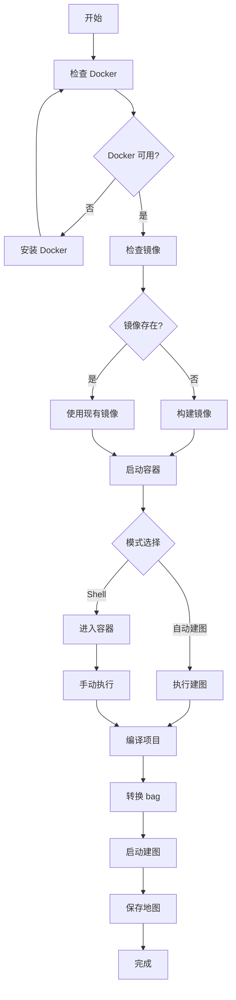

# Docker 一键建图指南

## 概述

AutoMap-Pro 提供 Docker 一键建图解决方案，无需本地安装 ROS2 和依赖。

### 为什么使用 Docker？

| 优点 | 说明 |
|------|------|
| **环境隔离** | 不污染本地系统 |
| **一键安装** | 自动安装所有依赖 |
| **跨平台** | Linux/Windows/macOS 通用 |
| **可重复** | 保证环境一致性 |

---

## 快速开始

### 方法1: 使用 Makefile（推荐）⭐⭐⭐⭐⭐

```bash
cd /home/wqs/Documents/github/automap_pro

# 一键 Docker 建图
make docker-mapping
```

### 方法2: 使用脚本

```bash
cd /home/wqs/Documents/github/automap_pro

# 运行 Docker 建图脚本
./run_full_mapping_docker.sh

# 或使用 --build 选项重新构建镜像
./run_full_mapping_docker.sh --build
```

### 方法3: 交互式 Docker

```bash
cd /home/wqs/Documents/github/automap_pro

# 启动容器并进入 shell
./run_full_mapping_docker.sh --shell

# 在容器中手动运行建图
cd /workspace/automap_pro
./docker/mapping.sh
```

---

## 脚本说明

### run_full_mapping_docker.sh

**功能**：
- ✅ 自动检查 Docker 环境
- ✅ 自动构建 Docker 镜像（如需要）
- ✅ 自动停止和删除旧容器
- ✅ 自动挂载数据目录
- ✅ 在容器中执行完整建图流程

**选项**：
```bash
# 查看帮助
./run_full_mapping_docker.sh --help

# 重新构建镜像
./run_full_mapping_docker.sh --build

# 不检查镜像（跳过）
./run_full_mapping_docker.sh --no-build

# 保留容器（不自动删除）
./run_full_mapping_docker.sh --keep-container

# 后台运行
./run_full_mapping_docker.sh --detach

# 启动容器 shell（调试用）
./run_full_mapping_docker.sh --shell

# 指定 bag 文件
./run_full_mapping_docker.sh -b /path/to/your/bag
```

### docker/mapping.sh

**功能**：
- ✅ 在 Docker 容器内执行建图
- ✅ 自动检查 ROS2 环境
- ✅ 自动编译项目
- ✅ 自动转换 ROS1 bag
- ✅ 自动保存地图

**选项**：
```bash
# 查看帮助
cd /workspace/automap_pro
./docker/mapping.sh --help

# 跳过编译（已编译）
./docker/mapping.sh -n

# 详细输出
./docker/mapping.sh -v

# 指定 bag 文件
./docker/mapping.sh -b /workspace/data/your_bag.bag
```

---

## 完整流程



---

## 使用场景

### 场景1: 首次使用

```bash
# 1. 克隆项目
cd /home/wqs/Documents/github/automap_pro

# 2. 一键 Docker 建图（会自动构建镜像）
make docker-mapping

# 或
./run_full_mapping_docker.sh --build
```

### 场景2: 已有镜像，快速建图

```bash
# 直接运行（不构建镜像）
make docker-mapping

# 或
./run_full_mapping_docker.sh
```

### 场景3: 调试模式

```bash
# 进入容器 shell
./run_full_mapping_docker.sh --shell

# 在容器中查看环境
source /opt/ros/humble/setup.bash
ros2 topic list
ros2 topic hz /os1_cloud_node1/points

# 手动运行建图
cd /workspace/automap_pro
./docker/mapping.sh -v
```

### 场景4: 后台运行

```bash
# 后台运行建图
./run_full_mapping_docker.sh --detach

# 查看容器日志
docker logs -f automap_mapping

# 停止容器
docker stop automap_mapping
```

### 场景5: 自定义数据

```bash
# 复制数据到项目目录
cp /path/to/your/data.bag data/automap_input/

# 运行建图
./run_full_mapping_docker.sh -b data/automap_input/data.bag
```

---

## Docker 镜像说明

### 镜像信息

```bash
# 查看镜像
docker images | grep automap_pro

# 查看镜像详细信息
docker inspect automap_pro:latest
```

### 镜像内容

- Ubuntu 22.04
- ROS2 Humble
- CUDA 11.3+（如果支持GPU）
- AutoMap-Pro 及所有依赖
- Python 3.10+
- 常用工具（git, vim, htop等）

### 重新构建镜像

```bash
# 清理旧镜像
docker rmi automap_pro:latest

# 重新构建
make docker-build

# 或使用脚本
./run_full_mapping_docker.sh --build
```

---

## 容器管理

### 查看容器状态

```bash
# 查看运行中的容器
docker ps

# 查看所有容器（包括停止的）
docker ps -a

# 查看 automap_mapping 容器
docker ps | grep automap_mapping
```

### 查看容器日志

```bash
# 实时查看日志
docker logs -f automap_mapping

# 查看最近 100 行
docker logs --tail 100 automap_mapping

# 查看日志时间戳
docker logs -t automap_mapping
```

### 进入运行中的容器

```bash
# 进入容器 shell
docker exec -it automap_mapping bash

# 查看环境
source /opt/ros/humble/setup.bash
ros2 topic list
```

### 停止容器

```bash
# 停止容器
docker stop automap_mapping

# 删除容器
docker rm automap_mapping

# 停止并删除
docker stop automap_mapping && docker rm automap_mapping
```

---

## 数据挂载

### 挂载点说明

Docker 容器会自动挂载以下目录：

| 本地路径 | 容器路径 | 说明 |
|---------|----------|------|
| `$(pwd)` | `/workspace/automap_pro` | 项目目录 |
| `$(pwd)/data` | `/workspace/data` | 数据目录 |
| `/data/automap_output` | `/workspace/output` | 输出目录 |

### 自定义挂载

```bash
# 手动运行 Docker（自定义挂载）
docker run --rm -it \
    --name automap_mapping \
    -v $(pwd):/workspace/automap_pro \
    -v /path/to/data:/workspace/data \
    -v /path/to/output:/workspace/output \
    -e ROS_DOMAIN_ID=0 \
    automap_pro:latest \
    bash -c "
        cd /workspace/automap_pro/docker &&
        ./mapping.sh
    "
```

---

## 输出结果

### 查看结果

```bash
# 方法1: 查看本地输出目录
ls -lh /data/automap_output/nya_02/

# 方法2: 进入容器查看
docker exec automap_mapping ls -lh /workspace/output

# 方法3: 复制结果到本地
docker cp automap_mapping:/workspace/output ./local_output
```

### 结果文件

```
/data/automap_output/nya_02/
├── trajectory/
│   ├── optimized_trajectory_tum.txt
│   ├── optimized_trajectory_kitti.txt
│   └── keyframe_poses.json
├── map/
│   ├── global_map.pcd
│   ├── global_map.ply
│   └── tiles/
├── submaps/
├── loop_closures/
├── pose_graph/
└── ...
```

---

## 常见问题

### Q1: Docker 未安装

**错误**: `docker: command not found`

**解决**:
```bash
# Ubuntu/Debian
curl -fsSL https://get.docker.com -o get-docker.sh
sudo sh get-docker.sh

# macOS
brew install docker

# 验证安装
docker --version
```

### Q2: Docker 守护进程未运行

**错误**: `Cannot connect to the Docker daemon`

**解决**:
```bash
# 启动 Docker 守护进程
sudo systemctl start docker

# 开机自启动
sudo systemctl enable docker

# 添加用户到 docker 组（可选）
sudo usermod -aG docker $USER
```

### Q3: 镜像构建失败

**错误**: `failed to solve`

**解决**:
```bash
# 清理 Docker 缓存
docker system prune -a

# 重新构建
make docker-build

# 或使用脚本
./run_full_mapping_docker.sh --build
```

### Q4: 容器启动失败

**错误**: `container creation failed`

**解决**:
```bash
# 检查端口占用
netstat -tulpn | grep :11311

# 清理旧容器
docker stop $(docker ps -aq)
docker rm $(docker ps -aq)

# 检查磁盘空间
df -h
```

### Q5: 找不到数据文件

**错误**: `Bag file not found`

**解决**:
```bash
# 检查本地文件
ls -lh data/automap_input/nya_02_slam_imu_to_lidar/

# 检查容器内文件
docker exec automap_mapping ls -lh /workspace/data/

# 使用绝对路径
./run_full_mapping_docker.sh -b /absolute/path/to/bag
```

### Q6: 权限问题

**错误**: `Permission denied`

**解决**:
```bash
# 方法1: 修复本地文件权限
chmod 755 data/automap_input/nya_02_slam_imu_to_lidar/nya_02.bag

# 方法2: 使用 Docker 用户映射
docker run --rm -it \
    -u $(id -u):$(id -g) \
    -v $(pwd):/workspace/automap_pro \
    automap_pro:latest \
    bash

# 方法3: 进入容器后修复权限
docker exec automap_mapping chown -R $USER:$USER /workspace/output
```

---

## 性能优化

### GPU 支持

```bash
# 使用 GPU 运行
docker run --rm -it \
    --gpus all \
    --name automap_mapping \
    -v $(pwd):/workspace/automap_pro \
    automap_pro:latest \
    bash -c "
        cd /workspace/automap_pro/docker &&
        ./mapping.sh
    "
```

### 内存限制

```bash
# 限制容器内存
docker run --rm -it \
    --memory="16g" \
    --memory-swap="16g" \
    --name automap_mapping \
    -v $(pwd):/workspace/automap_pro \
    automap_pro:latest \
    bash -c "
        cd /workspace/automap_pro/docker &&
        ./mapping.sh
    "
```

### CPU 限制

```bash
# 限制 CPU 使用
docker run --rm -it \
    --cpus="4.0" \
    --name automap_mapping \
    -v $(pwd):/workspace/automap_pro \
    automap_pro:latest \
    bash -c "
        cd /workspace/automap_pro/docker &&
        ./mapping.sh
    "
```

---

## 参考命令

### Docker 命令速查

```bash
# ========== 镜像相关 ==========
make docker-build              # 构建镜像
docker images                   # 查看镜像
docker rmi automap_pro:latest  # 删除镜像

# ========== 容器相关 ==========
make docker-run                # 运行容器
docker ps                      # 查看运行中的容器
docker ps -a                   # 查看所有容器
docker logs automap_mapping      # 查看日志
docker exec -it automap_mapping bash  # 进入容器
docker stop automap_mapping     # 停止容器
docker rm automap_mapping      # 删除容器

# ========== 一键脚本 ==========
make docker-mapping             # Docker 一键建图
./run_full_mapping_docker.sh     # Docker 建图脚本
./run_full_mapping_docker.sh --shell  # 进入容器 shell
```

---

## 总结

### 推荐流程

```bash
cd /home/wqs/Documents/github/automap_pro

# 首次使用（构建镜像）
make docker-mapping

# 或使用脚本
./run_full_mapping_docker.sh --build

# 后续使用（已有镜像）
make docker-mapping
```

### 快速命令速查

```bash
# ========== 最简单的方式 ==========
make docker-mapping      # Docker 一键建图

# ========== 进入容器调试 ==========
./run_full_mapping_docker.sh --shell

# ========== 查看日志 ==========
docker logs -f automap_mapping

# ========== 停止容器 ==========
docker stop automap_mapping
```

---

## 参考文档

| 文档 | 路径 | 用途 |
|------|------|------|
| **Docker 一键指南** | 本文档 | Docker 使用说明 |
| **一键脚本指南** | `QUICKSTART_ONELINE.md` | 本地一键脚本 |
| **完整使用指南** | `README_COMPLETE.md` | 所有功能汇总 |
| **建图流程文档** | `docs/MAPPING_WORKFLOW.md` | 完整流程文档 |
| **ROS1到ROS2转换** | `ROS1_BAG_TO_ROS2_GUIDE.md` | bag 转换指南 |

---

**维护者**: Automap Pro Team
**最后更新**: 2026-03-01
**版本**: 1.0
**状态**: ✅ 已完成
