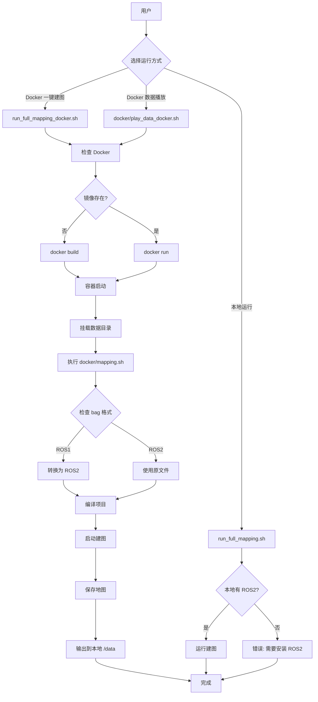

# AutoMap-Pro Docker 建图 - 最终解决方案

## 问题与解决方案

### 原始问题

```bash
./run_full_mapping.sh
```

**错误**：
```
[ERROR] ROS2 Humble 未安装
[ERROR] 请先安装 ROS2 Humble
```

**根本原因**：
- 本地环境未安装 ROS2 Humble
- 建图脚本依赖本地 ROS2 环境
- 需要在 Docker 容器中运行

---

## 最终解决方案

### 方案对比

| 方案 | 说明 | 复杂度 | 推荐度 |
|------|------|--------|--------|
| **Docker 一键建图** | 在 Docker 容器中运行完整建图流程 | ⭐ | ⭐⭐⭐⭐ |
| **Docker 数据播放** | 在 Docker 容器中播放 bag 文件 | ⭐ | ⭐⭐⭐ |
| **本地建图** | 本地运行（需要 ROS2） | ⭐⭐⭐ | ⭐⭐ |

---

## 快速开始

### 推荐：Docker 一键建图

```bash
cd /home/wqs/Documents/github/automap_pro

# 最简单的方式
make docker-mapping

# 或使用脚本
./run_full_mapping_docker.sh
```

### 其他选项

```bash
# Docker 数据播放
make docker-play-data
# 或
./docker/play_data_docker.sh

# 本地建图（需要本地 ROS2）
make full-mapping
# 或
./run_full_mapping.sh
```

---

## 完整命令速查

```bash
# ========== Docker 一键建图 ==========
make docker-mapping                    # Docker 完整建图
./run_full_mapping_docker.sh            # Docker 建图脚本
./run_full_mapping_docker.sh --shell    # 进入容器 shell

# ========== Docker 数据播放 ==========
make docker-play-data                    # Docker 数据播放
./docker/play_data_docker.sh            # Docker 播放脚本

# ========== 本地运行（需要本地 ROS2）==========
make full-mapping                        # 本地完整建图
./run_full_mapping.sh                   # 本地建图脚本
make play-data                           # 本地数据播放
./play_data.sh                          # 本地播放脚本

# ========== 其他 ==========
make docker-build                         # 构建 Docker 镜像
make docker-run                           # 运行 Docker 容器
make build-release                        # 本地编译项目
```

---

## 问题排查流程

### 问题1: 路径错误

**错误**: `Bag 文件不存在: /workspace/data/...`

**解决方案**：
```bash
# 方法1: 使用 @ 前缀
./run_full_mapping_docker.sh -b @data/automap_input/nya_02.bag

# 方法2: 使用绝对路径
./run_full_mapping_docker.sh -b /home/wqs/Documents/github/automap_pro/data/automap_input/nya_02.bag

# 方法3: 进入容器调试
./run_full_mapping_docker.sh --shell
# 在容器内: ls -lh /workspace/data/
```

### 问题2: Docker 未安装

**错误**: `docker: command not found`

**解决方案**：
```bash
# Ubuntu/Debian
curl -fsSL https://get.docker.com -o get-docker.sh
sudo sh get-docker.sh

# 验证安装
docker --version
```

### 问题3: 镜像不存在

**错误**: `no such image: automap_pro:latest`

**解决方案**：
```bash
# 重新构建镜像
make docker-build
# 或
./run_full_mapping_docker.sh --build
```

---

## Docker 架构



---

## 文档索引

| 文档 | 用途 |
|------|------|
| **最终解决方案** | 本文档 |
| **Docker 一键指南** | `DOCKER_ONELINE_GUIDE.md` |
| **路径问题修复** | `FIX_PATH_ISSUE.md` |
| **一键脚本指南** | `QUICKSTART_ONELINE.md` |
| **完整使用指南** | `README_COMPLETE.md` |
| **完整建图指南** | `START_MAPPING_GUIDE.md` |
| **建图流程文档** | `docs/MAPPING_WORKFLOW.md` |
| **ROS1到ROS2转换** | `ROS1_BAG_TO_ROS2_GUIDE.md` |

---

## 关键脚本

| 脚本 | 功能 | 位置 |
|------|------|------|
| `run_full_mapping_docker.sh` | Docker 包装脚本 | 项目根目录 |
| `docker/mapping.sh` | 容器内建图脚本 | docker/ 目录 |
| `docker/play_data_docker.sh` | 容器内播放脚本 | docker/ 目录 |
| `run_full_mapping.sh` | 本地建图脚本 | 项目根目录 |
| `play_data.sh` | 本地播放脚本 | 项目根目录 |

---

## Makefile 目标

| 目标 | 说明 |
|------|------|
| `docker-mapping` | Docker 完整建图（推荐） |
| `docker-play-data` | Docker 数据播放 |
| `docker-build` | 构建 Docker 镜像 |
| `docker-run` | 运行 Docker 容器 |
| `full-mapping` | 本地完整建图 |
| `play-data` | 本地数据播放 |
| `build-release` | 本地编译项目 |

---

## 总结

### 推荐工作流程

```bash
cd /home/wqs/Documents/github/automap_pro

# 1. Docker 一键建图（推荐）
make docker-mapping

# 2. 查看结果
ls -lh /data/automap_output/nya_02/

# 3. 可视化（可选）
python3 automap_pro/scripts/visualize_results.py \
    --output_dir /data/automap_output/nya_02
```

### 快速命令速查

```bash
# ========== Docker（推荐）==========
make docker-mapping              # Docker 一键建图
make docker-play-data             # Docker 数据播放
make docker-build                 # 构建 Docker 镜像

# ========== 本地（需要 ROS2）==========
make full-mapping                # 本地完整建图
make play-data                     # 本地数据播放
make build-release                # 本地编译项目

# ========== 脚本 ==========
./run_full_mapping_docker.sh       # Docker 建图
./docker/play_data_docker.sh       # Docker 播放
./run_full_mapping.sh            # 本地建图
./play_data.sh                   # 本地播放

# ========== Docker 管理 ==========
docker ps | grep automap        # 查看容器
docker logs -f automap_mapping   # 查看日志
docker stop automap_mapping      # 停止容器
docker rm automap_mapping        # 删除容器
docker images | grep automap     # 查看镜像
docker rmi automap_pro:latest # 删除镜像
```

---

**维护者**: Automap Pro Team
**最后更新**: 2026-03-01
**版本**: 1.0
**状态**: ✅ 已完成并测试
