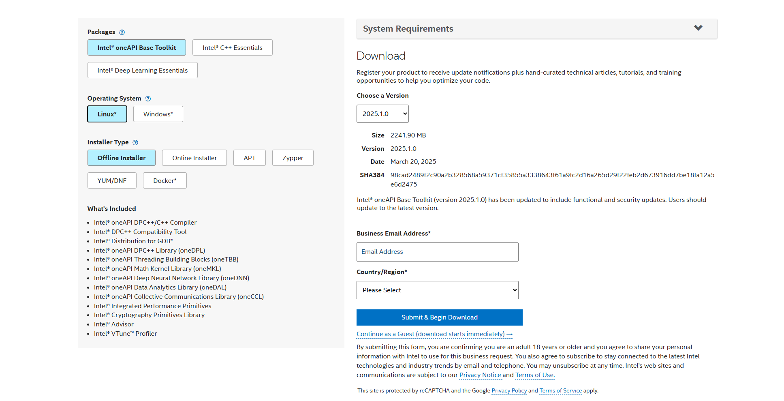

# **HBA_ROS2**
## 依赖安装
### 1. ROS2 HUMBLE 安装
* 本项目均在ubuntu 22.04下运行，因此可以直接安装ROS2 Humble，推荐使用如下命令实现一键安装：

        wget http://fishros.com/install -O fishros && . fishros
***
* **手动编译ROS2 Humble:**
1. 设置编码
    ```
    sudo apt update && sudo apt install locales
    sudo locale-gen en_US en_US.UTF-8
    sudo update-locale LC_ALL=en_US.UTF-8 LANG=en_US.UTF-8
    export LANG=en_US.UTF-8
    ```

2. 设置Ubuntu软件源
   ```
   // 使用如下命令进行检查是否启用universe源
   apt-cache policy | grep universe
   // 添加universe源
   sudo apt install software-properties-common
   sudo add-apt-repository universe
    ```
3. 添加ROS 2 apt 仓库  
   ___curl步骤需要科学上网或者sudo vi /etc/hosts将ROS官网的IP和域名添加到/etc/hosts文件___

    ```
    // 添加证书，
    sudo apt update && sudo apt install curl gnupg lsb-release
    sudo curl -sSL https://raw.githubusercontent.com/ros/rosdistro/master/ros.key -o /usr/sharekeyrings/ros-archive-keyring.gpg
    // 添加ROS仓库
    echo "deb [arch=$(dpkg --print-architecture) signed-by=/usr/share/keyrings/ros-archive-keyring.gpg] http://packages.ros.org/ros2/ubuntu $(source /etc/os-release && echo $UBUNTU_CODENAME) main" | sudo tee /etc/apt/sources.list.d/ros2.list > /dev/null
    ```
4. 安装ROS2包
    ```
    sudo apt update
    sudo apt upgrade
    sudo apt install ros-humble-desktop
    ```
5. 设置环境变量
   ```
   source /opt/ros/humble/setup.bash
   echo " source /opt/ros/humble/setup.bash" >> ~/.bashrc 
   ```
### 2. PCL && Eigen3 安装 (可以直接使用ROS自带版本)
* 参考PCL官网：https://pointclouds.org/ 
  ```
  sudo apt install libpcl-dev
  ```
* 参考Eigen官网进行安装配置：https://eigen.tuxfamily.org/

### 3. GTSAM 安装
* Boost >= 1.65 
  ```
  sudo apt-get install libboost-all-dev
  ```
* CMake >= 3.0 
    ```
    sudo apt-get install cmake
    ```
* **Intel MKL 库**
    ***
    1. 下载地址：https://software.intel.com/en-us/mkl/choose-download
    >
    2. 下载解包后，在对应文件夹下执行：
     ```
    ./install.sh
     ``` 
   ***
* **Intel TBB 库**
  ***
  直接命令行安装：
  ```
  sudo apt-get install libtbb-dev
  ```
  ***
* **GTSAM 安装（需>=4.1.1）**
  ***
    1. 下载安装包：https://github.com/borglab/gtsam/releases/  

    2. 下载完成解包之后，执行以下命令：
    ```
    cd gtsam-4.X.X #替换成自己的目录
    mkdir build
    cd build
    cmake -DGTSAM_BUILD_WITH_MARCH_NATIVE=OFF 
    make check
    sudo make install 
    ```
  ***
## 程序运行
1. 运行代码：
    ```
    git clone https://github.com/JHua07/HBA.git
    // 将文件组织为/ws_hba_ros2/src/HBA_ROS2/
    cd /ws_hba_ros2/
    source /opt/ros/humble/setup.bash
    colcon build
    source install/setup.bash

    // **运行HBA优化节点**
    ros2 launch hba hba_launch.py

    // **运行HBA可视化节点**
    ros2 launch hba visualize_launch.py

    // **运行计算一致性精度MME节点**
    ros2 launch hba cal_MME_launch,py
    ```
2. 数据格式要求：    

   * 需要按照如下格式进行源数据的组织，目标文件夹下需要有<kbd>./pcd</kbd> + <kbd>pose.json</kbd>，即：
        ```
        .
        ├── pcd
        │   ├── 0.pcd
        │   └── 1.pcd
        └── pose.json
        ```
    * 其中<kbd>pose.json</kbd>中位姿的顺序为：<kbd>tx</kbd>,<kbd>ty</kbd>,<kbd>tz</kbd>,<kbd>w</kbd>,<kbd>qx</kbd>,<kbd>qy</kbd>,<kbd>qz</kbd>
3. **参数说明：**  

   * <kbd>total_layer_num:</kbd> 处理层数，越大执行越久，默认设置3
   * <kbd>pcd_name_fill_num:</kbd> PCD文件前缀，例如当值为3时，需读取的pcd名称为：<kbd>0001.pcd</kbd> ，默认设置为0
   * <kbd>thread_num:</kbd> 并行计算时所使用线程数，根据自己硬件情况设置，默认16
        ***
    
        以下参数设置需考虑场景物理实际，最好采用默认参数，具体组合可以自己试试
   * <kbd>downsample_size:</kbd> 体素降采样大小，越小越稠密，默认为0.1
   * <kbd>voxel_size:</kbd> 在BA时采用的体素大小，也就是进行BA时点云的最小容器。体素越小，效果越好，但是执行速度显著变慢。
   * <kbd>eigen_ratio:</kbd> 用于判断该体素是否包含有效平面特征的阈值。值越大，阈值越宽松。默认值为0.1
   * <kbd>reject_ratio:</kbd> 用于去除优化中的离群体素（残差）的阈值。默认值为0.05
   * <kbd>WIN_SIZE:</kbd> 滑动窗口的大小，默认设置为10，即一个窗口内包含10个位姿，每个位姿相应会输入一帧点云
   * <kbd>GAP:</kbd> 滑动窗口的步长，默认为5
   * **其余定义的参数在源代码中均有注释**
4. **启动完成后，它只会优化一次姿态。因此，如果您对结果不满意，可以再次执行启动**

# GPS Factor模块
***
1. **基础算法说明**
   * **两种输入模式：**<br>
   1）在前端（如FAST-LIO2）直接输出的IMU坐标系下的GPS坐标。<br>
   2）直接从Bag中导出的WGS84坐标系下的GPS原始经纬度坐标。首先需要将该经纬高坐标，利用GeoGraphicLib转为ENU坐标，再通过轨迹匹配获取ENU坐标系到IMU坐标系的变换矩阵，即可将GPS原始坐标转到IMU坐标系下。
   * **里程计点及点云插值：**<br>
   1）为了在后续准确添加GPS-Factor的约束，需要获取到每一个GPS点对应的里程计点，就需要进行线性插值。首先，依据GPS与里程计的时间戳，搜索到GPS点最近的里程计点，记录索引。根据此索引，基于时间戳将最临近的里程计点插值到对应的GPS点时刻，再记录索引。此刻得到里程计+GPS点的总点集。例如，有2500帧里程计点，对应的GPS点且与里程计时间戳差值小于0.1s的共计248帧，因此插值后得到2748个里程计点。
   2）由于HBA整体还需要点云进行特征的约束，因此需要对点云进行赋值，简单的方法就是，若要获取第k帧后的第k+1帧（GPS点）的点云，则计算第k到k+1的变换矩阵，将k帧的点云根据该变换矩阵转换到k+1帧。
   * **执行GPS_Factor：**<br>
   将上述得到的点与点云全部输入HBA,在HBA::pose_graph_optimization中，根据上述的索引添加GPS_Factor，**目前点云插值可能存在Bug**，目前是在优化后只根据索引，导出原有数量的里程计点，并用原始PCD进行点云可视化。
2. **参数说明** <br>
   * <kbd>gps_time_raw:</kbd> GPS原始时间
   * <kbd>gps_time</kbd> 能够有匹配点的GPS时间
   * <kbd>enu_pose</kbd> ENU坐标系下GPS坐标
   * <kbd>gps_pose_tran</kbd> 转换到IMU坐标系下的GPS坐标
   * <kbd>index_interpolate</kbd> 记录GPS插值后，对应的lio的索引，例如，对于第k个GPS点，在插值之后的pose_vec_tran中，该点的索引为index_interpolate[k]
   * <kbd>enable_gps_factor</kbd> 是否启用GPS因子
   * <kbd>gps_imu_info</kbd> 是否启用GPS外参
   * **其余定义的参数在源代码中均有注释**
# 致谢及参考
源代码来自：[HBA](https://github.com/hku-mars/HBA)