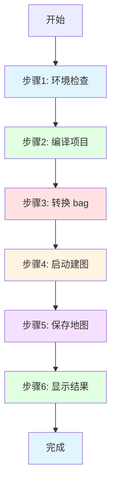

# 一键脚本快速开始指南

## 概述

AutoMap-Pro 提供了两个一键脚本：
1. **run_full_mapping.sh** - 完整建图流程（推荐）
2. **play_data.sh** - 数据播放和可视化

---

## 一键完整建图

### 快速开始（最简单）

```bash
cd /home/wqs/Documents/github/automap_pro

# 一键运行完整建图流程
./run_full_mapping.sh
```

### 使用自定义参数

```bash
# 指定 bag 文件
./run_full_mapping.sh -b /path/to/your/data.bag

# 指定输出目录
./run_full_mapping.sh -o /path/to/output

# 跳过编译（已编译）
./run_full_mapping.sh --no-compile

# 详细模式
./run_full_mapping.sh --verbose
```

### 常用选项

| 选项 | 说明 | 默认值 |
|------|------|--------|
| `-b, --bag` | bag 文件路径 | `data/automap_input/nya_02_slam_imu_to_lidar/nya_02.bag` |
| `-c, --config` | 配置文件路径 | `automap_pro/config/system_config_nya02.yaml` |
| `-o, --output-dir` | 输出目录 | `/data/automap_output/nya_02` |
| `--no-compile` | 跳过编译步骤 | false |
| `--no-convert` | 跳过 bag 转换 | false |
| `--no-mapping` | 跳过建图步骤 | false |
| `--no-save` | 跳过保存地图 | false |
| `--clean` | 清理工作空间 | false |
| `--verbose` | 详细输出 | false |

### 完整建图流程

脚本会自动完成以下步骤：



---

## 一键数据播放

### 快速开始（最简单）

```bash
cd /home/wqs/Documents/github/automap_pro

# 一键播放数据
./play_data.sh
```

### 使用自定义参数

```bash
# 指定 bag 文件
./play_data.sh -b /path/to/your/data.bag

# 2倍速播放
./play_data.sh -r 2.0

# 不启动 RViz
./play_data.sh --no-rviz

# 循环播放
./play_data.sh -l

# 只播放指定话题
./play_data.sh --topics /os1_cloud_node1/points,/imu/imu
```

### 常用选项

| 选项 | 说明 | 默认值 |
|------|------|--------|
| `-b, --bag` | bag 文件路径 | `data/automap_input/nya_02_slam_imu_to_lidar/nya_02.bag` |
| `-r, --rate` | 回放速率 | 1.0 |
| `--start` | 开始时间（秒） | 0 |
| `--duration` | 播放时长（秒） | 全部 |
| `--no-rviz` | 不启动 RViz | false |
| `--topics` | 只播放指定话题（逗号分隔） | 无 |
| `-l, --loop` | 循环播放 | false |
| `--pause` | 暂停播放 | false |
| `--clock` | 发布 /clock | false |
| `--verbose` | 详细输出 | false |

---

## 典型使用场景

### 场景1: 使用 nya_02 数据集完整建图

```bash
# 方法1: 使用默认配置
./run_full_mapping.sh

# 方法2: 跳过编译（如果已编译）
./run_full_mapping.sh --no-compile

# 方法3: 详细模式
./run_full_mapping.sh --verbose
```

### 场景2: 使用自定义数据集建图

```bash
# 准备数据
cp /path/to/your/data.bag data/automap_input/

# 运行建图
./run_full_mapping.sh -b data/automap_input/data.bag -o /data/output/my_map
```

### 场景3: 播放数据查看传感器数据

```bash
# 方法1: 默认播放
./play_data.sh

# 方法2: 2倍速播放
./play_data.sh -r 2.0

# 方法3: 不启动 RViz（只发布数据）
./play_data.sh --no-rviz
```

### 场景4: 只播放 LiDAR 和 IMU 数据

```bash
# 只播放指定话题
./play_data.sh --topics /os1_cloud_node1/points,/imu/imu

# 不启动 RViz，用于后台播放
./play_data.sh --topics /os1_cloud_node1/points,/imu/imu --no-rviz
```

### 场景5: 循环播放用于测试

```bash
# 循环播放
./play_data.sh -l

# 循环播放 + 不启动 RViz
./play_data.sh -l --no-rviz

# 循环播放 + 2倍速
./play_data.sh -l -r 2.0
```

---

## 完整工作流程示例

### 示例1: 首次使用 nya_02 数据集

```bash
# 1. 克隆/更新代码
cd /home/wqs/Documents/github/automap_pro
git pull origin main

# 2. 运行完整建图
./run_full_mapping.sh

# 3. 查看结果
ls -lh /data/automap_output/nya_02/

# 4. 可视化结果
python3 automap_pro/scripts/visualize_results.py --output_dir /data/automap_output/nya_02
```

### 示例2: 先播放数据，再建图

```bash
# 1. 播放数据查看传感器
./play_data.sh

# 2. 按 Ctrl+C 停止播放

# 3. 运行建图
./run_full_mapping.sh

# 4. 保存地图
make save-map
```

### 示例3: 使用已编译的工作空间

```bash
# 跳过编译步骤
./run_full_mapping.sh --no-compile

# 或只运行建图（跳过编译和转换）
./run_full_mapping.sh --no-compile --no-convert
```

### 示例4: 调试建图配置

```bash
# 1. 只播放数据（不建图）
./play_data.sh --no-rviz

# 2. 新开终端，查看话题
ros2 topic list
ros2 topic hz /os1_cloud_node1/points

# 3. 修改配置文件
vim automap_pro/config/system_config_nya02.yaml

# 4. 运行建图
./run_full_mapping.sh --no-compile
```

### 示例5: 批量处理多个 bag

```bash
# 创建批量处理脚本
cat > batch_mapping.sh << 'EOF'
#!/bin/bash

for bag in data/automap_input/*.bag; do
    bag_name=$(basename "$bag" .bag)
    echo "处理: $bag_name"
    
    ./run_full_mapping.sh \
        -b "$bag" \
        -o "/data/automap_output/$bag_name" \
        --no-compile
done
EOF

chmod +x batch_mapping.sh

# 运行批量处理
./batch_mapping.sh
```

---

## 输出结果

### 完整建图输出

```
/data/automap_output/nya_02/
├── trajectory/
│   ├── optimized_trajectory_tum.txt      # 优化后的轨迹
│   ├── optimized_trajectory_kitti.txt    # KITTI格式轨迹
│   └── keyframe_poses.json            # 关键帧位姿
├── map/
│   ├── global_map.pcd                 # PCD格式地图
│   ├── global_map.ply                 # PLY格式地图
│   └── tiles/                         # 分块地图
├── submaps/
│   ├── submap_0001/
│   ├── submap_0002/
│   └── ...
├── loop_closures/
│   └── loop_report.json              # 回环检测报告
├── pose_graph/
│   └── pose_graph.g2o                # 位姿图
└── ...
```

### 查看输出

```bash
# 查看输出目录
ls -lh /data/automap_output/nya_02/

# 可视化地图
python3 automap_pro/scripts/visualize_results.py --output_dir /data/automap_output/nya_02

# 查看轨迹
cat /data/automap_output/nya_02/trajectory/optimized_trajectory_tum.txt | head -20

# 查看回环报告
cat /data/automap_output/nya_02/loop_closures/loop_report.json | python3 -m json.tool
```

---

## 常见问题

### Q1: run_full_mapping.sh 找不到 bag 文件

**解决方案**:
```bash
# 使用绝对路径
./run_full_mapping.sh -b /home/wqs/Documents/github/automap_pro/data/automap_input/nya_02_slam_imu_to_lidar/nya_02.bag

# 或设置环境变量
export BAG_FILE=/path/to/your/bag
./run_full_mapping.sh
```

### Q2: play_data.sh 无法播放 bag

**解决方案**:
```bash
# 检查 bag 格式
file data/automap_input/nya_02_slam_imu_to_lidar/nya_02.bag

# 如果是 ROS1，先转换（见 ROS1_BAG_TO_ROS2_GUIDE.md）
./run_full_mapping.sh  # 会自动转换
```

### Q3: 编译失败

**解决方案**:
```bash
# 清理并重新编译
./run_full_mapping.sh --clean

# 或手动清理
cd /home/wqs/Documents/github/automap_pro
make clean
make build-release
```

### Q4: RViz 无法启动

**解决方案**:
```bash
# 不启动 RViz
./run_full_mapping.sh --no-rviz

# 或手动启动 RViz
source ~/automap_ws/install/setup.bash
rviz2
```

### Q5: 建图速度慢

**解决方案**:
```bash
# 提高回放速率
./play_data.sh -r 2.0

# 或修改配置文件
vim automap_pro/config/system_config_nya02.yaml
```

---

## 性能优化

### 加速建图

```bash
# 方法1: 使用已编译的工作空间
./run_full_mapping.sh --no-compile --no-convert

# 方法2: 提高回放速率
./play_data.sh -r 2.0

# 方法3: 只播放需要的部分
./play_data.sh --topics /os1_cloud_node1/points,/imu/imu --no-rviz
```

### 减少输出

```bash
# 只输出地图，不输出轨迹和子图
# 修改配置文件
vim automap_pro/config/system_config_nya02.yaml
```

---

## 参考文档

| 文档 | 用途 |
|------|------|
| **一键脚本指南** | 本文档 |
| **完整建图指南** | `START_MAPPING_GUIDE.md` |
| **建图流程文档** | `docs/MAPPING_WORKFLOW.md` |
| **ROS1到ROS2转换** | `ROS1_BAG_TO_ROS2_GUIDE.md` |
| **快速开始** | `QUICKSTART_MAPPING.md` |
| **系统配置** | `automap_pro/config/system_config_nya02.yaml` |

---

## 下一步

1. **运行建图**: `./run_full_mapping.sh`
2. **查看结果**: `ls -lh /data/automap_output/nya_02/`
3. **可视化**: `python3 automap_pro/scripts/visualize_results.py --output_dir /data/automap_output/nya_02`
4. **评估质量**: `make eval-traj` 和 `make eval-map`

---

**维护者**: Automap Pro Team
**最后更新**: 2026-03-01
**版本**: 1.0
