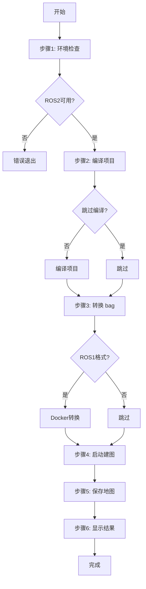
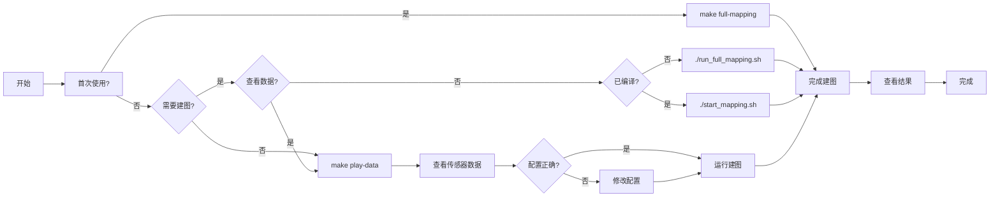

# AutoMap-Pro 完整使用指南

## 项目概述

AutoMap-Pro 是一个端到端的自动化3D点云建图系统，支持：
- ✅ 离线建图（ROS bag 回放）
- ✅ 在线建图（实时传感器数据）
- ✅ 增量式建图（多会话合并）
- ✅ ROS1 到 ROS2 bag 自动转换
- ✅ 一键完整建图流程
- ✅ 一键数据播放

---

## 快速开始

### 方法1: 一键完整建图（推荐）⭐⭐⭐⭐⭐

```bash
cd /home/wqs/Documents/github/automap_pro

# 使用 Makefile
make full-mapping

# 或直接运行脚本
./run_full_mapping.sh
```

### 方法2: 一键数据播放

```bash
cd /home/wqs/Documents/github/automap_pro

# 使用 Makefile
make play-data

# 或直接运行脚本
./play_data.sh
```

### 方法3: 使用启动脚本

```bash
cd /home/wqs/Documents/github/automap_pro

# 启动建图
./start_mapping.sh

# 指定 bag 文件
./start_mapping.sh -b data/automap_input/nya_02_slam_imu_to_lidar/nya_02.bag
```

---

## 脚本对比

| 脚本 | 功能 | 复杂度 | 推荐场景 |
|------|------|--------|----------|
| `run_full_mapping.sh` | 完整建图流程（6步骤） | ⭐ | 首次使用、完整流程 |
| `play_data.sh` | 数据播放和可视化 | ⭐ | 数据查看、调试 |
| `start_mapping.sh` | 启动建图（单一步骤） | ⭐⭐ | 已有环境、快速建图 |

---

## 完整建图流程

### run_full_mapping.sh 自动执行的步骤



### 执行命令

```bash
# 默认配置运行
./run_full_mapping.sh

# 指定 bag 文件
./run_full_mapping.sh -b /path/to/your/bag

# 指定输出目录
./run_full_mapping.sh -o /path/to/output

# 跳过编译（已编译）
./run_full_mapping.sh --no-compile

# 详细模式
./run_full_mapping.sh --verbose

# 查看帮助
./run_full_mapping.sh --help
```

### 选项说明

| 选项 | 说明 | 默认值 |
|------|------|--------|
| `-b, --bag` | bag 文件路径 | `data/automap_input/nya_02_slam_imu_to_lidar/nya_02.bag` |
| `-c, --config` | 配置文件路径 | `automap_pro/config/system_config_nya02.yaml` |
| `-o, --output-dir` | 输出目录 | `/data/automap_output/nya_02` |
| `--no-compile` | 跳过编译步骤 | false |
| `--no-convert` | 跳过 bag 转换 | false |
| `--no-mapping` | 跳过建图步骤 | false |
| `--no-save` | 跳过保存地图 | false |
| `--clean` | 清理工作空间 | false |
| `--verbose` | 详细输出 | false |

---

## 数据播放流程

### play_data.sh 功能

- ✅ 自动检测 bag 格式（ROS1/ROS2）
- ✅ 支持调整回放速率
- ✅ 支持指定播放话题
- ✅ 自动启动 RViz 可视化
- ✅ 支持循环播放

### 执行命令

```bash
# 默认配置播放
./play_data.sh

# 指定 bag 文件
./play_data.sh -b /path/to/your/bag

# 2倍速播放
./play_data.sh -r 2.0

# 不启动 RViz
./play_data.sh --no-rviz

# 循环播放
./play_data.sh -l

# 只播放指定话题
./play_data.sh --topics /os1_cloud_node1/points,/imu/imu

# 查看帮助
./play_data.sh --help
```

### 选项说明

| 选项 | 说明 | 默认值 |
|------|------|--------|
| `-b, --bag` | bag 文件路径 | `data/automap_input/nya_02_slam_imu_to_lidar/nya_02.bag` |
| `-r, --rate` | 回放速率 | 1.0 |
| `--start` | 开始时间（秒） | 0 |
| `--duration` | 播放时长（秒） | 全部 |
| `--no-rviz` | 不启动 RViz | false |
| `--topics` | 只播放指定话题 | 无 |
| `-l, --loop` | 循环播放 | false |
| `--pause` | 暂停播放 | false |
| `--clock` | 发布 /clock | false |
| `--verbose` | 详细输出 | false |

---

## 使用场景示例

### 场景1: 首次使用 nya_02 数据集

```bash
# 一键完整建图（最简单）
cd /home/wqs/Documents/github/automap_pro
make full-mapping

# 脚本会自动：
# 1. 检查环境
# 2. 编译项目
# 3. 转换 ROS1 bag 到 ROS2
# 4. 启动建图
# 5. 保存地图
# 6. 显示结果
```

### 场景2: 使用自定义数据集

```bash
# 1. 复制数据到指定目录
cp /path/to/your/data.bag data/automap_input/

# 2. 运行完整建图
./run_full_mapping.sh -b data/automap_input/data.bag

# 3. 查看结果
ls -lh /data/automap_output/data/
```

### 场景3: 先播放数据查看，再建图

```bash
# 步骤1: 播放数据
./play_data.sh

# 步骤2: 在 RViz 中查看传感器数据
# 步骤3: 按 Ctrl+C 停止播放

# 步骤4: 运行建图
./run_full_mapping.sh --no-compile
```

### 场景4: 已编译工作空间，快速建图

```bash
# 跳过编译和 bag 转换（如果已转换）
./run_full_mapping.sh --no-compile --no-convert
```

### 场景5: 调试建图配置

```bash
# 步骤1: 只播放数据（不启动建图）
./play_data.sh --no-rviz

# 步骤2: 新开终端，查看话题
ros2 topic list
ros2 topic hz /os1_cloud_node1/points

# 步骤3: 修改配置文件
vim automap_pro/config/system_config_nya02.yaml

# 步骤4: 运行建图
./run_full_mapping.sh --no-compile
```

### 场景6: 批量处理多个 bag

```bash
# 创建批量处理脚本
cat > batch_process.sh << 'EOF'
#!/bin/bash

for bag in data/automap_input/*.bag; do
    bag_name=$(basename "$bag" .bag)
    echo "处理: $bag_name"
    
    ./run_full_mapping.sh \
        -b "$bag" \
        -o "/data/automap_output/$bag_name" \
        --no-compile
done
EOF

chmod +x batch_process.sh

# 运行批量处理
./batch_process.sh
```

---

## Makefile 命令速查

| 命令 | 说明 |
|------|------|
| `make setup` | 设置工作空间 |
| `make build` | 编译（Debug 模式） |
| `make build-release` | 编译（Release 模式） |
| `make test` | 运行测试 |
| `make run-online` | 在线建图 |
| `make run-offline` | 离线建图 |
| `make full-mapping` | 完整建图流程（一键） |
| `make play-data` | 数据播放（一键） |
| `make save-map` | 保存地图 |
| `make trigger-opt` | 触发优化 |
| `make status` | 查看系统状态 |
| `make eval-traj` | 评估轨迹 |
| `make eval-map` | 评估地图 |
| `make visualize` | 可视化结果 |
| `make clean` | 清理工作空间 |

---

## 输出结果

### 目录结构

```
/data/automap_output/nya_02/
├── trajectory/
│   ├── optimized_trajectory_tum.txt      # TUM格式轨迹
│   ├── optimized_trajectory_kitti.txt    # KITTI格式轨迹
│   └── keyframe_poses.json            # 关键帧位姿
├── map/
│   ├── global_map.pcd                 # PCD格式地图
│   ├── global_map.ply                 # PLY格式地图
│   └── tiles/                         # 分块地图
├── submaps/
│   ├── submap_0001/
│   ├── submap_0002/
│   └── ...
├── loop_closures/
│   └── loop_report.json              # 回环检测报告
├── pose_graph/
│   └── pose_graph.g2o                # 位姿图
└── ...
```

### 查看结果

```bash
# 查看输出目录
ls -lh /data/automap_output/nya_02/

# 查看地图
pcl_viewer /data/automap_output/nya_02/map/global_map.pcd

# 查看轨迹
python3 automap_pro/scripts/visualize_results.py \
    --output_dir /data/automap_output/nya_02

# 评估轨迹（如果有真值）
make eval-traj

# 评估地图
make eval-map
```

---

## 常见问题

### Q1: 找不到 bag 文件

```bash
# 使用绝对路径
./run_full_mapping.sh -b /absolute/path/to/bag

# 或设置环境变量
export BAG_FILE=/absolute/path/to/bag
./run_full_mapping.sh
```

### Q2: 编译失败

```bash
# 清理并重新编译
./run_full_mapping.sh --clean

# 或手动清理
cd /home/wqs/Documents/github/automap_pro
make clean
make build-release
```

### Q3: ROS1 bag 无法播放

```bash
# 使用完整建图脚本（会自动转换）
./run_full_mapping.sh

# 或先手动转换（见 ROS1_BAG_TO_ROS2_GUIDE.md）
```

### Q4: RViz 无法启动

```bash
# 不启动 RViz
./run_full_mapping.sh --no-rviz

# 或手动启动 RViz
source ~/automap_ws/install/setup.bash
rviz2
```

### Q5: 建图速度慢

```bash
# 提高回放速率
./play_data.sh -r 2.0

# 或修改配置文件
vim automap_pro/config/system_config_nya02.yaml
```

---

## 文档索引

| 文档 | 路径 | 用途 |
|------|------|------|
| **一键脚本指南** | `QUICKSTART_ONELINE.md` | 一键脚本使用 |
| **完整建图指南** | `START_MAPPING_GUIDE.md` | 详细建图步骤 |
| **建图流程文档** | `docs/MAPPING_WORKFLOW.md` | 完整流程文档 |
| **ROS1到ROS2转换** | `ROS1_BAG_TO_ROS2_GUIDE.md` | bag 转换指南 |
| **快速开始** | `QUICKSTART_MAPPING.md` | 快速上手 |
| **Git LFS指南** | `docs/GIT_LFS_GUIDE.md` | 大文件管理 |
| **系统配置** | `automap_pro/config/system_config_nya02.yaml` | nya_02配置 |
| **项目README** | `automap_pro/README.md` | 系统介绍 |

---

## 总结

### 推荐工作流程



### 快速命令速查

```bash
# ========== 一键命令 ==========
make full-mapping    # 完整建图
make play-data       # 数据播放

# ========== 建图相关 ==========
make run-offline    # 离线建图
make run-online     # 在线建图
make save-map       # 保存地图
make trigger-opt    # 触发优化
make status         # 查看状态

# ========== 脚本相关 ==========
./run_full_mapping.sh      # 完整建图
./play_data.sh            # 数据播放
./start_mapping.sh        # 启动建图

# ========== 评估相关 ==========
make eval-traj       # 评估轨迹
make eval-map        # 评估地图
make visualize       # 可视化结果

# ========== 编译相关 ==========
make build-release   # 编译项目
make clean          # 清理工作空间
```

---

## 联系与支持

- **项目**: AutoMap-Pro
- **文档**: 见文档索引
- **问题**: 提交 Issue

---

**维护者**: Automap Pro Team
**最后更新**: 2026-03-01
**版本**: 1.0
**状态**: ✅ 已完成
