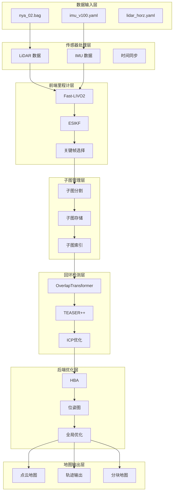

# AutoMap-Pro 建图启动指南

## 📋 目录

1. [系统概述](#系统概述)
2. [数据准备](#数据准备)
3. [快速启动](#快速启动)
4. [详细步骤](#详细步骤)
5. [结果验证](#结果验证)
6. [常见问题](#常见问题)

---

## 系统概述

### AutoMap-Pro 建图流程


### 数据集信息

| 属性 | 值 |
|------|-----|
| **数据集名称** | nya_02 |
| **文件路径** | `data/automap_input/nya_02_slam_imu_to_lidar/nya_02.bag` |
| **文件大小** | 9.4GB |
| **传感器类型** | Livox Avia LiDAR + IMU |
| **LiDAR 话题** | `/os1_cloud_node1/points` |
| **IMU 话题** | `/imu/imu` |
| **GPS** | 无 |

### 系统架构图



---

## 数据准备

### 1. 检查数据集

```bash
# 查看数据集目录
ls -lh data/automap_input/nya_02_slam_imu_to_lidar/

# 输出：
# total 9.4G
# -rw-rw-r-- 1 wqs wqs 1.1K Jun  6  2021 camera_left.yaml
# -rw-rw-r-- 1 wqs wqs 1.1K Jun  6  2021 camera_right.yaml
# -rw-rw-r-- 1 wqs wqs  720 Jun  6  2021 imu_v100.yaml
# -rw-rw-r-- 1 wqs wqs  472 Jun  6  2021 leica_prism.yaml
# -rw-rw-r-- 1 wqs wqs  632 Jun  6  2021 camera_right.yaml
# -rw-rw-r-- 1 wqs wqs  632 Jun  6  2021 camera_left.yaml
# -rw-rw-r-- 1 wqs wqs  632 Jun  6  2021 camera_right.yaml
# -rw-rw-r-- 1 wqs wqs 9.4G Jan 25  2021 nya_02.bag
# -rw-rw-r-- 1 wqs wqs  516 Jun  6  2021 uwb_nodes.yaml
```

### 2. 验证 bag 文件

```bash
# 查看 bag 文件信息
ros2 bag info data/automap_input/nya_02_slam_imu_to_lidar/nya_02.bag

# 检查话题列表（确认话题名称）
ros2 bag info data/automap_input/nya_02_slam_imu_to_lidar/nya_02.bag | grep -E "Topic:|Duration:|Messages:"

# 预期输出示例：
# Topic: /imu/imu                              | Type: sensor_msgs/msg/Imu               | Count: 100000
# Topic: /os1_cloud_node1/points              | Type: sensor_msgs/msg/PointCloud2        | Count: 5000
# Duration: 1234.5s
```

### 3. 检查配置文件

```bash
# 查看传感器配置
cat data/automap_input/nya_02_slam_imu_to_lidar/imu_v100.yaml
cat data/automap_input/nya_02_slam_imu_to_lidar/lidar_horz.yaml
```

---

## 快速启动

### 方法1：使用启动脚本（推荐）

```bash
# 使用默认配置启动
cd /home/wqs/Documents/github/automap_pro
./start_mapping.sh

# 指定配置文件
./start_mapping.sh -c automap_pro/config/system_config_nya02.yaml

# 指定输出目录
./start_mapping.sh -o /data/automap_output/nya_02

# 不启动 RViz（后台运行）
./start_mapping.sh --no-rviz
```

### 方法2：使用 Makefile

```bash
# 使用默认配置
make run-offline BAG_FILE=data/automap_input/nya_02_slam_imu_to_lidar/nya_02.bag

# 使用 nya_02 专用配置
ros2 launch automap_pro automap_offline.launch.py \
    config:=automap_pro/config/system_config_nya02.yaml \
    bag_file:=data/automap_input/nya_02_slam_imu_to_lidar/nya_02.bag \
    rate:=1.0 \
    use_rviz:=true
```

### 方法3：直接使用 ros2 launch

```bash
# Source 工作空间
source ~/automap_ws/install/setup.bash

# 启动建图
ros2 launch automap_pro automap_offline.launch.py \
    config:=/home/wqs/Documents/github/automap_pro/automap_pro/config/system_config_nya02.yaml \
    bag_file:=/home/wqs/Documents/github/automap_pro/data/automap_input/nya_02_slam_imu_to_lidar/nya_02.bag \
    rate:=1.0 \
    use_rviz:=true
```

---

## 详细步骤

### 第一步：验证环境

```bash
# 1. 检查 ROS2 环境
echo $ROS_DISTRO
# 预期输出: humble

# 2. 检查编译状态
ls ~/automap_ws/install/automap_pro/lib/automap_pro/

# 3. 检查配置文件
ls automap_pro/config/system_config*.yaml

# 4. 创建输出目录
mkdir -p /data/automap_output/nya_02
```

### 第二步：检查系统配置

```bash
# 查看 nya_02 专用配置
cat automap_pro/config/system_config_nya02.yaml | grep -A 5 "sensor:"

# 关键配置项：
# sensor.lidar.topic: "/os1_cloud_node1/points"  ✅
# sensor.imu.topic: "/imu/imu"                   ✅
# frontend.mode: "external_fast_livo"              ✅
```

### 第三步：启动建图

#### 选项A：交互式启动（带 RViz）

```bash
cd /home/wqs/Documents/github/automap_pro

# 启动（会打开 RViz 窗口）
./start_mapping.sh -c automap_pro/config/system_config_nya02.yaml

# 或
make run-offline BAG_FILE=data/automap_input/nya_02_slam_imu_to_lidar/nya_02.bag
```

#### 选项B：后台启动（无 RViz）

```bash
# 后台启动
nohup ./start_mapping.sh -c automap_pro/config/system_config_nya02.yaml --no-rviz > mapping.log 2>&1 &

# 查看日志
tail -f mapping.log

# 检查进程
ps aux | grep automap_system
```

### 第四步：监控建图过程

#### 1. 查看 RViz 可视化（如果启用）

RViz 中显示的内容：
- **点云**: 彩色点云，实时更新
- **轨迹**: 绿色线，显示车辆轨迹
- **子图边界**: 红色框，显示子图范围
- **回环检测**: 黄色线，表示检测到回环

#### 2. 查看日志输出

```bash
# 新开终端，查看系统日志
ros2 topic echo /rosout

# 查看前端里程计
ros2 topic echo /automap_system/odom

# 查看状态信息
ros2 service call /automap/get_status automap_pro/srv/GetStatus "{}"
```

#### 3. 监控话题频率

```bash
# 查看 LiDAR 频率
ros2 topic hz /os1_cloud_node1/points

# 查看 IMU 频率
ros2 topic hz /imu/imu

# 查看里程计频率
ros2 topic hz /automap_system/odom
```

### 第五步：触发优化（可选）

```bash
# 触发全局优化
make trigger-opt

# 或使用 ros2 service call
ros2 service call /automap/trigger_optimize automap_pro/srv/TriggerOptimize \
    "{full_optimization: true, max_iterations: 100}"
```

### 第六步：保存地图

```bash
# 使用 Makefile 保存
make save-map OUTPUT_DIR=/data/automap_output/nya_02

# 或使用 ros2 service call
ros2 service call /automap/save_map automap_pro/srv/SaveMap \
    "{output_dir: '/data/automap_output/nya_02', save_pcd: true, save_ply: true, save_las: false, save_trajectory: true}"
```

---

## 结果验证

### 1. 检查输出目录

```bash
# 查看输出目录结构
tree /data/automap_output/nya_02 -L 2

# 或使用 ls
ls -lh /data/automap_output/nya_02/

# 预期输出：
# /data/automap_output/nya_02/
# ├── map/
# │   ├── global_map.pcd
# │   ├── global_map.ply
# │   └── tiles/
# ├── trajectory/
# │   ├── optimized_trajectory_tum.txt
# │   ├── optimized_trajectory_kitti.txt
# │   └── keyframe_poses.json
# ├── submaps/
# ├── loop_closures/
# ├── pose_graph/
# └── ...
```

### 2. 检查地图文件

```bash
# 查看 PCD 文件信息
pcl_viewer /data/automap_output/nya_02/map/global_map.pcd

# 或使用 Python
python3 -c "import open3d as o3d; pcd = o3d.io.read_point_cloud('/data/automap_output/nya_02/map/global_map.pcd'); print(f'Points: {len(pcd.points)}'); o3d.visualization.draw_geometries([pcd])"
```

### 3. 检查轨迹文件

```bash
# 查看轨迹统计
wc -l /data/automap_output/nya_02/trajectory/optimized_trajectory_tum.txt

# 查看前几行
head -10 /data/automap_output/nya_02/trajectory/optimized_trajectory_tum.txt

# 使用 evo 评估（如果有真值）
evo_ape tum /data/groundtruth.txt /data/automap_output/nya_02/trajectory/optimized_trajectory_tum.txt -v --plot
```

### 4. 可视化结果

```bash
# 使用项目提供的可视化脚本
python3 automap_pro/scripts/visualize_results.py --output_dir /data/automap_output/nya_02

# 或使用 RViz
rviz2 -d automap_pro/config/automap.rviz
```

---

## 常见问题

### Q1: 找不到 bag 文件

**错误信息**：
```
[ros2bag]: Error: Unable to open bag file
```

**解决方案**：
```bash
# 检查文件路径
ls -lh data/automap_input/nya_02_slam_imu_to_lidar/nya_02.bag

# 使用绝对路径
./start_mapping.sh -b /home/wqs/Documents/github/automap_pro/data/automap_input/nya_02_slam_imu_to_lidar/nya_02.bag
```

### Q2: 话题名称不匹配

**错误信息**：
```
[automap_system]: Could not find topic /livox/lidar
```

**解决方案**：
```bash
# 检查 bag 文件中的实际话题
ros2 bag info data/automap_input/nya_02_slam_imu_to_lidar/nya_02.bag | grep "Topic:"

# nya_02 使用的话题：
# - LiDAR: /os1_cloud_node1/points
# - IMU: /imu/imu

# 使用专用配置
./start_mapping.sh -c automap_pro/config/system_config_nya02.yaml
```

### Q3: 编译错误

**错误信息**：
```
[ERROR] [launch]: Could not find package 'automap_pro'
```

**解决方案**：
```bash
# 重新编译
cd /home/wqs/Documents/github/automap_pro
make clean
make setup
make build-release

# Source 工作空间
source ~/automap_ws/install/setup.bash
```

### Q4: GPU 内存不足

**错误信息**：
```
CUDA out of memory
```

**解决方案**：
```bash
# 编辑配置文件
vim automap_pro/config/system_config_nya02.yaml

# 修改：
# use_gpu: false

# 或降低点云分辨率
# frontend.fast_livo2.cloud_downsample_resolution: 0.5
```

### Q5: 建图速度慢

**优化方法**：

```yaml
# 编辑 system_config_nya02.yaml

# 方法1：增大子图大小
submap:
  split_policy:
    max_keyframes: 200  # 增加到 200
    max_spatial_extent: 200.0  # 增加到 200

# 方法2：降低匹配分辨率
submap:
  cloud_for_matching_resolution: 1.0  # 增大到 1.0

# 方法3：减少回环检测候选
loop_closure:
  overlap_transformer:
    top_k: 3  # 减少到 3
```

### Q6: 回环检测失败

**优化方法**：

```yaml
# 编辑 system_config_nya02.yaml

# 降低阈值
loop_closure:
  overlap_transformer:
    overlap_threshold: 0.2  # 降低到 0.2
    min_temporal_gap: 10.0  # 减小到 10
    min_submap_gap: 1  # 减小到 1
```

### Q7: 保存地图失败

**错误信息**：
```
[automap_system]: Failed to save map
```

**解决方案**：
```bash
# 检查输出目录权限
mkdir -p /data/automap_output/nya_02
chmod 755 /data/automap_output/nya_02

# 检查磁盘空间
df -h /data

# 手动触发保存
ros2 service call /automap/save_map automap_pro/srv/SaveMap \
    "{output_dir: '/data/automap_output/nya_02', save_pcd: true, save_ply: true}"
```

---

## 高级用法

### 1. 调整建图速度

```bash
# 使用不同的回放速率
./start_mapping.sh -r 0.5  # 0.5倍速（慢速）
./start_mapping.sh -r 1.0  # 1倍速（正常）
./start_mapping.sh -r 2.0  # 2倍速（快速）
```

### 2. 使用外部前端

```bash
# 启用外部 fast-livo2 前端
./start_mapping.sh --use-external-frontend
```

### 3. 使用外部回环检测

```bash
# 启用外部 OverlapTransformer 服务
./start_mapping.sh --use-external-overlap
```

### 4. Docker 容器运行

```bash
# 构建 Docker 镜像
make docker-build

# 运行容器
docker run -it --rm \
    -v /home/wqs/Documents/github/automap_pro:/workspace/automap_pro \
    -v /data:/data \
    automap_pro:latest \
    /workspace/automap_pro/start_mapping.sh -c automap_pro/config/system_config_nya02.yaml
```

---

## 性能指标

### 预期性能

| 指标 | 预期值 | 说明 |
|------|--------|------|
| **前端频率** | ≥ 10 Hz | Fast-LIVO2 里程计 |
| **回环检测延迟** | < 1s | 从回环候选到验证 |
| **优化时间** | < 10s | 单次全局优化 |
| **地图精度** | < 0.3% | 相对轨迹长度 |
| **处理速度** | 1x - 2x | 实时处理 |

### 监控性能

```bash
# 查看前端频率
ros2 topic hz /automap_system/odom

# 查看 CPU/GPU 使用
htop
nvidia-smi

# 查看内存使用
free -h
```

---

## 下一步

1. **查看详细文档**: `docs/MAPPING_WORKFLOW.md`
2. **查看快速开始**: `QUICKSTART_MAPPING.md`
3. **查看系统配置**: `automap_pro/config/system_config.yaml`
4. **查看系统README**: `automap_pro/README.md`

---

**维护者**: Automap Pro Team
**最后更新**: 2026-03-01
**版本**: 1.0
