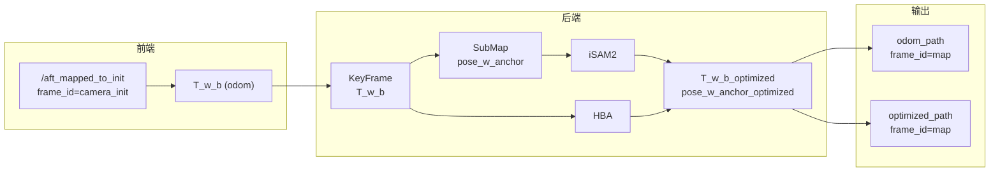
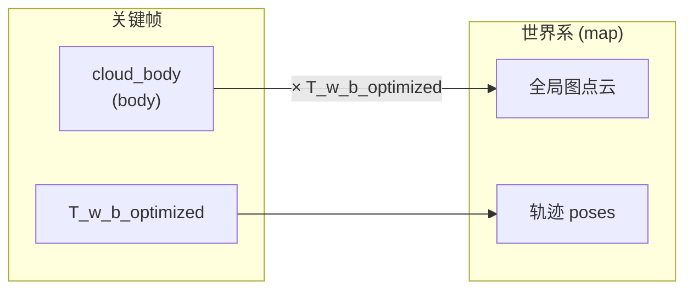

# 后端轨迹与点云坐标系一致性分析

## 0. Executive Summary

| 结论 | 说明 |
|------|------|
| **轨迹与点云是否同一坐标系** | **是**。后端内部统一使用同一“世界系”（语义上为前端首帧原点，即 fast_livo 的 `camera_init`）；轨迹位姿（T_w_b / pose_w_anchor_optimized）与该系下的点云变换使用同一套位姿，保证一致性。 |
| **当前“世界系”定义** | 来自前端 odom：**首帧为原点、轴向与前端约定一致**（与 fast_livo 的 `camera_init` 一致）；RViz 中该系被命名为 `frame_id = "map"`。 |
| **与 ENU 的关系** | 无 GPS 时，“map”≠ 东北天 ENU；有 GPS 且完成对齐后，通过 SVD 将 ENU 对齐到 LiDAR 轨迹，此时“map”与对齐后的 ENU 一致，且 map_frame.cfg 记录 ENU 原点经纬高。 |
| **需注意点** | 回退路径（仅用 merged_cloud 拼全局图）时，merged_cloud 由未优化 T_w_b 生成，与优化后轨迹可能不一致；主路径（按 T_w_b_optimized 从关键帧重算）已保证一致。 |

---

## 1. 坐标系定义与数据源

### 1.1 “世界系”来源

- **前端**：fast_livo 发布 `/aft_mapped_to_init`，其 `header.frame_id` 为 **`camera_init`**，表示“第一帧 LiDAR 位姿为原点”的坐标系。
- **后端**：LivoBridge 从 odom 解析 `pose.pose.position/orientation`，得到 `Pose3d`，**不经任何坐标变换**直接作为 `T_w_b`（世界系到 body 的变换）使用。
- **约定**：后端将“世界”与前端 `camera_init` 视为同一系；RViz 发布时统一使用 **`frame_id = "map"`**，即用“map”这个名字表示该同一世界系。

因此：

- **轨迹**：odom_path、optimized_path、子图锚定位姿、关键帧 T_w_b / T_w_b_optimized，均在 **同一世界系**（camera_init/map）下。
- **点云**：body 点云通过 **同一世界系下的位姿** 变换到世界系后再合并或发布，与轨迹同系。

### 1.2 符号与语义

| 符号 | 含义 | 坐标系 |
|------|------|--------|
| T_w_b | 世界系到 body 的变换 | 世界 = camera_init（首帧原点） |
| T_w_b_optimized | 优化后的世界到 body | 同上 |
| pose_w_anchor / pose_w_anchor_optimized | 子图锚定帧在世界系下的位姿 | 同上 |
| cloud_body | 关键帧点云（body 系） | body |
| 全局图点云 | body 点云经 T_w_b_optimized 变换到世界 | 世界 = map |

---

## 2. 轨迹链路（全在同一世界系）

- **odom → KeyFrame**：`poseFromOdom(msg)` 直接取 `msg.pose.pose`，无坐标系转换，T_w_b 即 camera_init 下位姿。
- **KeyFrame → SubMap**：子图锚定用首帧的 `T_w_b`，即 `pose_w_anchor`，仍在同一世界系。
- **iSAM2**：节点为子图位姿（同一世界系）；里程计/回环因子为相对位姿；GPS 因子为 `pos_map = enu_to_map(gps_enu)`，对齐后与轨迹同系（见下）。
- **HBA**：输入为 KeyFrame 的 T_w_b，输出写回 T_w_b_optimized，仍为同一世界系。
- **发布**：odom_path / optimized_path 的 pose 均来自上述位姿，且 `header.frame_id = "map"`，与“世界系”一致。

结论：**整条轨迹链路从 odom 到发布，始终在同一世界系（camera_init/map）下，无中途换系。**

---

## 3. 点云变换链路（与轨迹同系）

### 3.1 主路径：buildGlobalMap 按关键帧重算（当前默认）

- 对每个关键帧：取 **T_w_b_optimized**，将 **cloud_body** 变换到世界系后合并。
- 世界系与轨迹使用的世界系一致，因此 **全局图点云与优化后轨迹在同一坐标系下**。

### 3.2 子图内合并：mergeCloudToSubmap

- 使用 **T_w_b**（当时未优化位姿）将 cloud_body 变换到世界系，写入 **merged_cloud**。
- merged_cloud 所在系与当时轨迹（camera_init）一致；若之后发生位姿优化，merged_cloud 不会自动更新。

### 3.3 回退路径：无关键帧点云时仅拼 merged_cloud

- buildGlobalMap 在“无关键帧点云”时回退为：直接拼接各子图 **merged_cloud**（无再变换）。
- merged_cloud 由 **T_w_b** 生成，若该子图后来被 iSAM2/HBA 更新了位姿，则 **回退路径下的全局图与优化后轨迹会不一致**。
- 主路径（从关键帧 + T_w_b_optimized 重算）不依赖 merged_cloud，**推荐始终走主路径**以保证轨迹与点云一致。

### 3.4 数据流小结

轨迹与点云共用同一套“世界系”和同一套优化位姿，故 **在主路径下轨迹与地图点云坐标一致**。

---

## 4. GPS 与 ENU 的关系

- **ENU 原点**：由第一个有效 GPS 的 (lat, lon, alt) 确定，并写入 **map_frame.cfg**。
- **enu_to_map**：当 GPS 已对齐时，`enu_to_map(enu) = R_gps_lidar * enu + t_gps_lidar`，将 ENU 坐标变换到“与 LiDAR 轨迹对齐”的坐标系；对齐后该系与后端使用的世界系（camera_init）一致。
- **iSAM2 GPS 因子**：使用 `pos_map = enu_to_map(sm->gps_center)`，即约束“子图位姿（世界系）≈ pos_map（对齐后 ENU）”，二者同系，无混系问题。
- **语义**：有 GPS 且对齐后，“map”既等于后端世界系，也等于“对齐后的 ENU”；map_frame.cfg 中的经纬高为该 ENU 原点，用于导出/可视化等需要 WGS84 的场景。

---

## 5. frame_id 与 RViz 一致性

| 话题 / 消息 | frame_id | 含义 |
|-------------|----------|------|
| /automap/odom_path | map | 里程计轨迹（世界系） |
| /automap/optimized_path | map | 优化后轨迹（世界系） |
| /automap/global_map | map | 全局点云（世界系） |
| RvizPublisher 各类 Marker/Path | frame_id_（init 时设为 "map"） | 同上 |

所有后端发布的轨迹与点云均使用 **同一 frame_id（"map"）**，在 RViz 中设 Fixed Frame = "map" 即可保证轨迹与点云对齐显示。

---

## 6. 一致性检查清单

- [x] **轨迹来源**：T_w_b 直接来自 odom，无额外变换，与 camera_init 一致。
- [x] **点云变换**：主路径使用 T_w_b_optimized 将 cloud_body 变到世界系，与轨迹同系。
- [x] **优化器**：iSAM2/HBA 输入输出均为同一世界系位姿，无换系。
- [x] **GPS 因子**：pos_map = enu_to_map(enu)，对齐后与轨迹同系。
- [x] **发布**：轨迹与全局图均 header.frame_id = "map"。
- [ ] **回退路径**：仅用 merged_cloud 时与优化后轨迹可能不一致；建议仅在无关键帧点云时使用，并尽量保证主路径可用。

---

## 7. 建议与可选增强

1. **保持主路径**：尽量保证关键帧保留 cloud_body，使 buildGlobalMap 始终按 T_w_b_optimized 从关键帧重算，避免依赖 merged_cloud 回退。
2. **明确文档**：在配置或文档中说明“map 即首帧原点系（camera_init），与 ENU 一致仅在对齐后成立”。
3. **导出/可视化需 WGS84 时**：使用 map_frame.cfg 中的 ENU 原点，将“map”系下的轨迹/点云用 ENU↔WGS84 转换到经纬高（如 MapExporter、KML 等已有或可接 MapFrameConfig::read）。
4. **可选**：若需“地图即 ENU”的强语义，可在发布前对轨迹与点云统一乘一次 T_enu_map（由对齐结果或首帧 + map_frame.cfg 计算），并保持内部仍用当前世界系计算，仅对外发布为 ENU。

---

**文档版本**：与当前代码一致；若前端 frame 约定或 GPS 对齐接口变更，需同步复核本文“世界系”定义与数据流。
