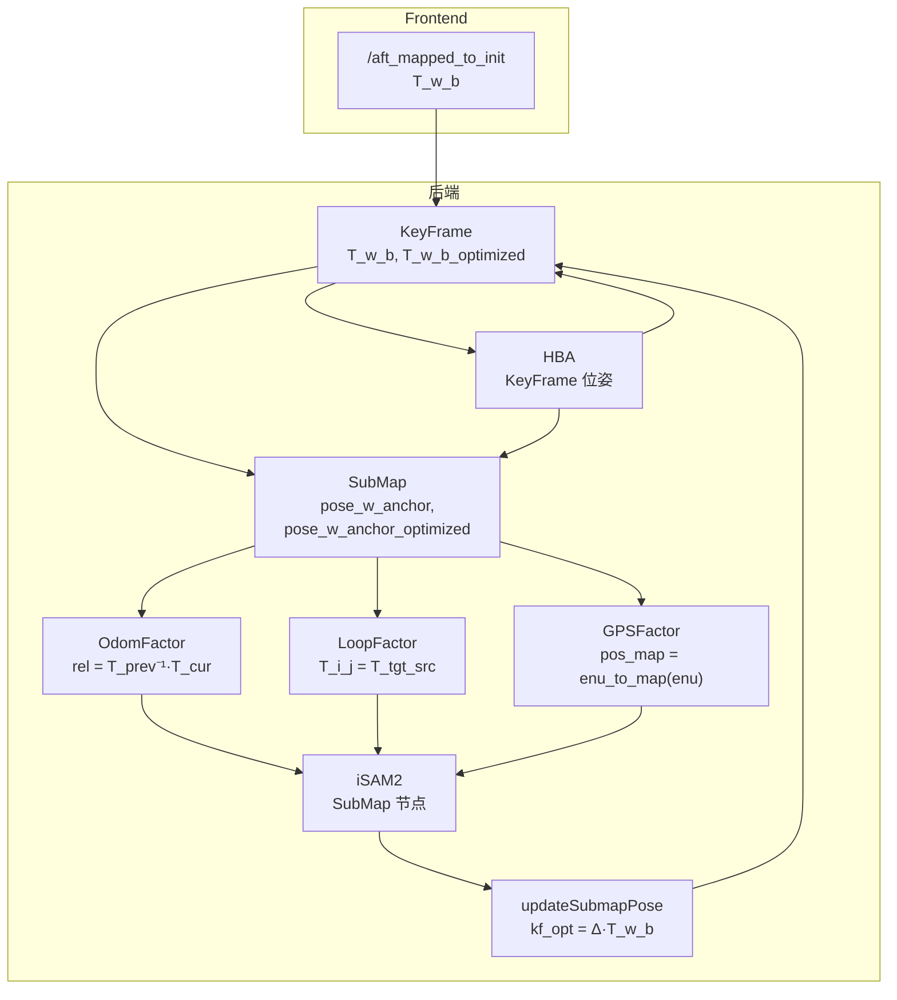

# 后端逻辑与坐标计算分析（二次复核）

## 0. Executive Summary

| 结论 | 说明 |
|------|------|
| **坐标与因子语义** | 里程计因子、回环因子、GPS 因子的相对/绝对位姿计算与 GTSAM BetweenFactor/GPSFactor 约定一致，未发现公式错误。 |
| **关键帧/子图位姿推导** | `updateSubmapPose` 中由锚定优化位姿推导关键帧 `T_w_b_optimized` 的公式正确；`buildGlobalMap` 使用 `T_w_b_optimized` 与轨迹同系。 |
| **需修复/澄清点** | ① HBA 后 iSAM2 线性化点未真正同步；② 仅里程计不触发 commit 属设计选择但需文档化；③ `LoopConstraint.delta_T` 注释易误解；④ `opt_path_` 发布顺序未按 submap_id 排序。 |

---

## 1. 坐标系与符号约定（与 BACKEND_COORDINATE_CONSISTENCY 一致）

- **世界系**：前端 `camera_init`（首帧为原点），后端/RViz 统一用 `frame_id = "map"`。
- **T_w_b**：世界系到 body 的变换（关键帧位姿）。
- **pose_w_anchor / pose_w_anchor_optimized**：子图锚定帧（首关键帧）在世界系下的位姿。
- 轨迹与点云均在同一世界系下，无中途换系。

---

## 2. 里程计因子（子图间）

### 2.1 代码位置与公式

- **automap_system.cpp**（子图冻结时）：
  - `rel = prev->pose_w_anchor_optimized.inverse() * submap->pose_w_anchor`
  - `addOdomFactor(prev->id, submap->id, rel, info)`

### 2.2 语义校验

- GTSAM `BetweenFactor(from, to, measurement)` 约束：**T_to ≈ T_from * measurement**，即 measurement = **T_from_to**（to 在 from 系下的位姿）。
- 此处 `rel = T_prev^{-1} * T_cur` = 当前子图锚定在“上一子图”系下的位姿 = **T_prev_cur**，且调用为 `addOdomFactor(prev, cur, rel)`，即 (from=prev, to=cur, rel=T_prev_to)，与 GTSAM 约定一致。
- 使用 `pose_w_anchor_optimized`（上一子图）与 `pose_w_anchor`（当前子图）是刻意设计：相对量在优化前后应近似不变，约束“当前子图相对上一子图”的几何关系，正确。

---

## 3. 回环因子

### 3.1 相对位姿来源

- **loop_detector.cpp**：`teaser_matcher_.match(query_cloud, target_cloud, ...)`  
  - query = 当前子图 j（source），target = 候选子图 i（target）。  
  - 返回 `T_tgt_src`：**p_tgt = T_tgt_src * p_src**，即 **T_i_j**（子图 j 在子图 i 系下的位姿）。
- 约束写入：`lc->delta_T = final_T`（= T_i_j），`addLoopFactor(lc->submap_i, lc->submap_j, lc->delta_T)` = **addLoopFactor(i, j, T_i_j)**。

### 3.2 与 GTSAM 一致性

- BetweenFactor(i, j, T_i_j) 表示 **T_j ≈ T_i * T_i_j**，即 T_i_j = T_i^{-1} * T_j，与“j 在 i 系下的位姿”一致。  
- **结论**：回环相对位姿计算与 GTSAM 约定一致，无符号/顺序错误。

### 3.3 注释建议（data_types.h）

- 当前：`delta_T = T_i_j（从j到i的相对变换）`  
- “从 j 到 i”易被理解为 T_j_i。实际为 **T_i_j**（j 在 i 系下）。  
- **建议**：改为  
  `/** T_i_j：子图 j 在子图 i 系下的位姿（target=i, source=j），用于 BetweenFactor(i, j, delta_T) */`

---

## 4. 关键帧优化位姿的推导（updateSubmapPose）

### 4.1 公式

```cpp
Pose3d delta = new_pose * old_anchor.inverse();
for (auto& kf : sm->keyframes)
    kf->T_w_b_optimized = delta * kf->T_w_b;
```

### 4.2 推导校验

- 设锚定在世界系下旧/新位姿为 T_w_anchor_old、T_w_anchor_new。  
- 关键帧与锚定刚性：T_w_b = T_w_anchor * T_anchor_b ⇒ T_anchor_b = T_w_anchor^{-1} * T_w_b。  
- 期望的优化后关键帧位姿：  
  **T_w_b_new = T_w_anchor_new * T_anchor_b = T_w_anchor_new * T_w_anchor_old^{-1} * T_w_b**。  
- 代码中 `delta = T_w_anchor_new * T_w_anchor_old^{-1}`，故 `T_w_b_optimized = delta * T_w_b`，与上式一致。  
- **结论**：公式正确。

---

## 5. GPS 因子

- **addGPSFactor(sm_id, pos_map, cov3x3)**：pos_map 为“已对齐到地图系”的位置（米）。  
- **automap_system** 中：`pos_map = gps_manager_.enu_to_map(gps.position_enu)`（或子图 gps_center 的 enu_to_map）。  
- **GPSManager::enu_to_map**：对齐后为 `R_gps_lidar * enu + t_gps_lidar`，与 BACKEND_COORDINATE_CONSISTENCY 中“对齐后 ENU 与 map 一致”的约定一致。  
- **结论**：GPS 因子坐标系与 iSAM2 节点（世界系）一致，无混系问题。

---

## 6. HBA 与关键帧

- HBA 输入为关键帧的 **T_w_b**（世界系），输出按时间序写回 **T_w_b_optimized**。  
- **updateAllFromHBA**：用各子图首帧的 `T_w_b_optimized` 同步 `pose_w_anchor_optimized`。  
- 坐标系始终为同一世界系，无问题。

---

## 7. 已发现的问题与建议

### 7.1 HBA 后 iSAM2 线性化点未真正同步（建议修复或文档化）

- **现象**：`onHBADone` 中对每个 submap 调用  
  `isam2_optimizer_.addSubMapNode(sm->id, sm->pose_w_anchor_optimized, false)`。  
- **实际**：`IncrementalOptimizer::addSubMapNode` 对已存在节点有 `if (node_exists_.count(sm_id)) return;`，因此不会插入新值，**iSAM2 的线性化点/估计不会被 HBA 结果覆盖**。  
- **影响**：HBA 结果只体现在 submap_manager 与关键帧位姿（显示与 buildGlobalMap）；后续回环/里程计仍基于 iSAM2 的旧估计，两轨（iSAM2 与 HBA）在图上会不一致。  
- **建议**（二选一或组合）：  
  1. 提供“更新已存在节点初始估计”的接口（若 GTSAM iSAM2 支持），在 HBA 后调用，使 iSAM2 线性化点与 HBA 一致；或  
  2. 在文档中明确：“HBA 与 iSAM2 为两轨；HBA 仅更新关键帧/子图显示与全局图，不反馈到 iSAM2 因子图。”

### 7.2 仅里程计不触发 commit（设计选择，建议文档化）

- **现象**：`addOdomFactor` 只往 `pending_graph_`/`pending_values_` 添加，不调用 `commitAndUpdate()`；只有 `addLoopFactor`、`addGPSFactor` 或显式 `forceUpdate()` 会触发 iSAM2 update。  
- **影响**：无回环、无 GPS 时，iSAM2 的 `current_estimate_` 从未更新；显示依赖 submap 的 `pose_w_anchor_optimized`（初始等于 `pose_w_anchor`），行为合理。  
- **建议**：在文档或注释中说明“仅里程计不触发优化；首次优化发生在首次回环或首次 GPS 因子添加时”。若未来需要“仅里程计也做图优化”，可在 addOdomFactor 后按策略（如每 N 个子图）调用 `forceUpdate()`。

### 7.3 opt_path_ 发布顺序（小优化）

- **现象**：`onPoseUpdated` 中 `opt_path_.poses` 由 `std::unordered_map<int, Pose3d>` 迭代填入，顺序非 submap_id。  
- **影响**：Path 在 RViz 中可能按错误顺序连线，轨迹“乱跳”。  
- **建议**：在填充 `opt_path_.poses` 前，按 `sm_id` 排序再发布（或从 `getFrozenSubmaps()` 等已按 id 排序的列表取位姿），保证路径按子图顺序连接。

### 7.4 回退路径（merged_cloud）

- 与 BACKEND_COORDINATE_CONSISTENCY 一致：无关键帧点云时用各子图 `merged_cloud` 拼接，其由未优化 T_w_b 生成，与优化后轨迹可能不一致；主路径（按 T_w_b_optimized 从关键帧重算）已保证一致，建议尽量保证主路径可用。

---

## 8. 数据流简图（Mermaid）



---

## 9. 校验清单（结论）

| 项 | 结论 |
|----|------|
| 里程计 rel = T_prev^{-1} * T_cur，addOdomFactor(prev, cur, rel) | 正确 |
| 回环 delta_T = T_i_j，addLoopFactor(i, j, delta_T) | 正确 |
| updateSubmapPose 中 kf_opt = delta * T_w_b，delta = T_new * T_old^{-1} | 正确 |
| GPS pos_map = enu_to_map(enu)，与地图系一致 | 正确 |
| buildGlobalMap 使用 T_w_b_optimized，与轨迹同系 | 正确 |
| 关键帧创建时 T_w_b_optimized = T_w_b | 正确 |
| HBA 后 iSAM2 线性化点同步 | 未实现，建议修复或文档化 |
| opt_path_ 按 submap_id 排序 | 未做，建议按 id 排序后发布 |

---

**文档版本**：与当前代码一致；若 iSAM2 API 或 HBA 接口变更，需同步复核本文。
