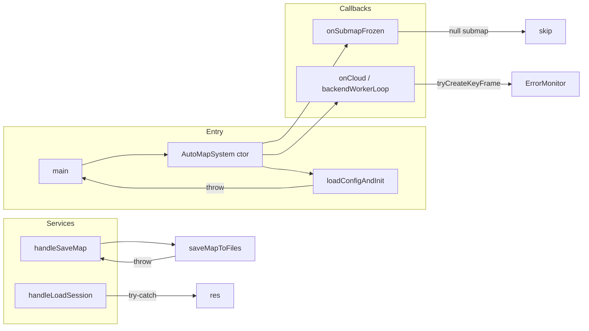

# AutoMap-Pro 崩溃点分析与异常加固说明

## Executive Summary

- **目标**：识别工程中可能导致崩溃的点，增加异常处理与错误上报，避免未捕获异常或空指针导致进程退出。
- **收益**：入口与关键路径具备 try-catch、空指针校验与统一错误上报（ErrorMonitor/ErrorCode），配置/IO/服务失败可被捕获并返回明确错误，而非直接崩溃。
- **风险**：部分模块（如 fast-livo2、HBA 第三方）未在本轮加固；回环/ICP 等路径若遇异常仍可能仅记录日志，需结合监控观察。

---

## 1. 潜在崩溃点清单（已识别）

| 位置 | 风险类型 | 描述 | 处理状态 |
|------|----------|------|----------|
| `automap_system_node.cpp` main() | 未捕获异常 | 构造 `AutoMapSystem` 时 `loadConfigAndInit()` → `ConfigManager::load()` 可能抛异常，导致进程直接退出 | ✅ 已加 try-catch，打印错误并 return 1 |
| `LivoBridge::init(node)` | 空指针 | `node` 为空时后续 `node_->get_logger()` 等会崩溃 | ✅ 已加 null 检查，抛 `std::invalid_argument` |
| `SubMapManager::addKeyFrame(kf)` | 空指针 | `kf` 为空时访问 `kf->id` 等会崩溃 | ✅ 已加 null 检查，记录错误并 return |
| `AutoMapSystem::onSubmapFrozen(submap)` | 空指针 | 回调若传入空 submap，访问 `submap->pose_w_anchor` 会崩溃 | ✅ 已加 null 检查并 return |
| `handleLoadSession` | 异常 | `fs::directory_iterator`、`std::stoi` 可能抛异常，导致服务无响应或崩溃 | ✅ 已加 try-catch，设置 res->success=false 并填写 message |
| `saveMapToFiles(output_dir)` | 异常/空路径 | 空 `output_dir` 或 IO 异常仅被内部 catch 且未向调用方反馈，且析构中调用时需避免二次抛出不退出 | ✅ 空路径抛 `invalid_argument`；catch 中先日志再 rethrow，由 handleSaveMap 设置 res->success |
| `saveMapToFiles` 循环 | 空指针 | `all_sm` 中元素或 `sm->keyframes` 中 kf 为空时访问会崩溃 | ✅ 已加 `if (!sm) continue`、`if (!kf) continue` |
| `SubMapManager::updateAllFromHBA` | 空指针 | `sm` 或 `sm->keyframes.front()` 理论上可能异常（防御性） | ✅ 已加 `if (!sm)`、`if (!anchor)` 跳过 |
| `backendWorkerLoop` tryCreateKeyFrame | 未上报 | 已有 try-catch 打日志，但未接入 ErrorMonitor | ✅ 已加 ErrorMonitor::recordException / recordError |
| `ConfigManager::load` | 异常 | YAML 解析/文件缺失会抛异常 | ✅ 原有 catch + ErrorMonitor，调用方现由 main try-catch 兜底 |
| `utils::voxelDownsample` / 点云路径 | PCL/异常 | 大点云或异常数据可能触发 PCL 内部错误 | ✅ 已有 try-catch 与 overflow 防护（此前已实现） |
| `TeaserMatcher::preprocess` + PCL VoxelGrid | double-free (SIGSEGV) | 用 no-op deleter 的 shared_ptr 传给 setInputCloud 时，若 PCL 内部从 raw 指针再构造一份带默认 deleter 的 shared_ptr，会导致同一块内存被 delete 两次 | ✅ 改为直接传 input_copy（共享所有权），并强化 preprocess/match 与 processMatchTask 的 use_count/指针日志；target 点云在持锁下取强引用 |
| `FpfhExtractor::compute` + PCL FPFHEstimation | 析构时 free() SIGSEGV | PCL 1.11-1.12 中 FPFHEstimation/NormalEstimation 析构时内部释放（含 Eigen 对齐缓冲）可能 double-free 或与 SIMD 构建不一致导致崩溃（参见 PCL #4877） | ✅ 改为**静态复用**：`static NormalEstimation s_ne` 与 `static FPFHEstimation s_fpfh`，每次 compute 后仅 `setInput*`/`setSearchMethod` 置空释放引用，**永不析构** PCL 对象，彻底避开析构路径；并增加 `FPFH_CRASH_LOG` 关键步骤双路日志（ALOG + cerr）便于 GDB 崩溃时精确定位 |

---

## 2. 变更清单（文件/模块）

| 文件 | 变更说明 |
|------|----------|
| `src/nodes/automap_system_node.cpp` | main 中对 `rclcpp::init`、`make_shared<AutoMapSystem>` 与 `spin` 包 try-catch，异常时 cerr 输出并 return 1 |
| `src/frontend/livo_bridge.cpp` | `init()` 入口检查 `node == nullptr`，为空则抛 `std::invalid_argument` |
| `src/submap/submap_manager.cpp` | `addKeyFrame()` 入口检查 `!kf`，记录 ErrorDetail(KEYFRAME_CREATE_FAILED)、ErrorMonitor、METRICS 并 return；`updateAllFromHBA` 中增加 `!sm`、`!anchor` 判断 |
| `src/system/automap_system.cpp` | `onSubmapFrozen` 入口检查 `!submap` 并 return；`handleLoadSession` 全流程 try-catch（含 directory_iterator、stoi、空 session_dir），设置 res 错误信息；`saveMapToFiles` 增加空 `output_dir` 检查、all_sm/kf 空指针跳过、catch 中 rethrow；backendWorkerLoop 的 catch 中增加 ErrorMonitor::recordException/recordError |
| `src/loop_closure/teaser_matcher.cpp` | preprocess 中移除 no_own，改为 `vg.setInputCloud(input_copy)` 共享所有权；增加 preprocess_enter/copy_done/voxel_done/exit 与 match 内 src/tgt 的 ptr/use_count 日志 |
| `src/loop_closure/loop_detector.cpp` | processMatchTask 中在持 shared_lock 下取 `target_ref = sm->downsampled_cloud`，再在锁外深拷贝；增加 task_start 的 query_cloud_use_count 与 cand_geom 的 target_ref_use_count 日志 |
| `src/loop_closure/fpfh_extractor.cpp` | 使用静态复用的 `s_ne`/`s_fpfh`，不再堆分配/析构 PCL 对象；每轮 compute 后显式 setInputCloud/setInputNormals/setSearchMethod 置空；增加 FPFH_CRASH_LOG 关键步骤日志（ALOG + cerr）用于崩溃精准分析 |

---

## 3. 数据流与异常传播（简要）



- **入口**：main 捕获所有来自 init/构造/spin 的异常，打印并退出码 1。
- **服务**：SaveMap 通过 saveMapToFiles 的 rethrow 得到失败原因并写入 res；LoadSession 在内部 catch 后写入 res。
- **回调**：onSubmapFrozen、addKeyFrame 对空指针做防护；worker 内异常统一上报 ErrorMonitor。

---

## 4. 编译与验证建议

- **编译**（在已安装 ROS2 与 colcon 的环境下）：
  ```bash
  cd automap_ws && source /opt/ros/humble/setup.bash
  colcon build --packages-select automap_pro --cmake-args -DCMAKE_BUILD_TYPE=Release
  ```
- **验证建议**：
  1. **配置错误**：启动时指定错误或缺失的 `config_file`，期望日志/cerr 报错且进程以码 1 退出，不 core dump。
  2. **LoadSession**：调用 `/automap/load_session` 传入不存在或非法 `session_dir`，期望 res->success=false 且 message 含原因。
  3. **SaveMap**：传入空 `output_dir` 或无写权限路径，期望 res->success=false 且 message 正确。
  4. **回放/实车**：长时间运行观察是否有新增 `[EXCEPTION]`、`recordError`/ErrorMonitor 告警，确认无未捕获异常导致退出。

---

## 5. 风险与回滚

- **风险**：saveMapToFiles 在 catch 中 rethrow 后，析构里调用 saveMapToFiles 时若再次抛异常，会被析构外层的 catch 捕获并只打日志（当前析构已有 try-catch），不会导致 std::terminate；若未来在析构中移除 catch，则需避免在析构中 rethrow。
- **回滚**：若新逻辑导致行为异常，可逐文件还原本次修改（见变更清单），重点还原 saveMapToFiles 的 rethrow 与 handleLoadSession 的 try-catch，以恢复“失败仅日志、不反馈给服务”的旧行为（不推荐）。

---

## 6. 后续可加强点（未在本轮实现）

- **fast-livo2 / LIVMapper**：第三方模块内部 `.front()`、`.back()` 等需结合其维护方式做边界检查或 try-catch。
- **HBA 优化器 / 回环 ICP**：runHBA、ICP 等若抛异常，目前仅在调用链局部处理，可考虑统一一层 try-catch 并上报 ErrorMonitor。
- **deferredSetupModules**：若某一步（如 submap_manager_.init）抛异常，整个延迟初始化会中断，可对单步加 try-catch 并标记状态为 ERROR，避免后续回调误用未初始化组件。

---

## 7. 术语与参考

- **ErrorMonitor**：`automap_pro/core/error_monitor.h`，错误聚合与告警。
- **ErrorDetail / errors::**：`automap_pro/core/error_code.h`，结构化错误码与上下文。
- **PIPELINE 事件**：日志中 `[AutoMapSystem][PIPELINE] event=...` 用于追踪建图流程，便于排查崩溃前后事件。
