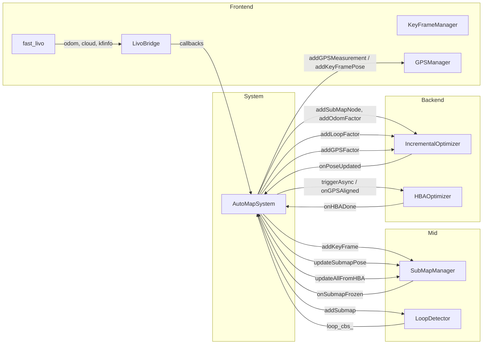

# AutoMap-Pro 工程数据流与处理逻辑分析报告

## 0. Executive Summary

| 维度 | 结论 |
|------|------|
| **整体架构** | 分层清晰：前端(LivoBridge/KF) → 子图(SubMapManager) → 回环(LoopDetector) → 后端(iSAM2/HBA) → 地图(GlobalMap)，数据流闭环完整。 |
| **数据流正确性** | 主链路（odom/cloud → KF → SubMap → Loop/iSAM2 → 位姿更新）**逻辑正确**；存在若干设计取舍与可改进点。 |
| **风险与异常** | ① 里程计与点云顺序依赖 fast_livo 实现（无强制同步）；② 纯里程计链在无回环/GPS 时 iSAM2 不触发 update；③ 全局点云未按优化位姿重投影；④ KeyFrame id 双源（SubMapManager 覆盖 KeyFrameManager）。 |
| **建议** | 短期：为 odom/cloud 乱序加防护、可选“仅里程计也周期 forceUpdate”；中长期：全局地图按优化位姿重算或增量修正、统一 KF id 来源。 |

---

## 1. 整体架构与模块划分

### 1.1 分层与职责

```
┌─────────────────────────────────────────────────────────────────────────────┐
│  Layer 1  传感器 / 外部前端 (Fast-LIVO2)                                      │
│  /lidar, /imu → fast_livo → /aft_mapped_to_init, /cloud_registered,         │
│  /fast_livo/keyframe_info, /gps (可选)                                       │
└─────────────────────────────────────────────────────────────────────────────┘
                                      │
                                      ▼
┌─────────────────────────────────────────────────────────────────────────────┐
│  Layer 2  前端桥接 (LivoBridge) + 关键帧 (KeyFrameManager) + GPS (GPSManager) │
│  订阅 odom/cloud/kfinfo/gps → 回调 → AutoMapSystem 驱动 KF 决策与创建         │
└─────────────────────────────────────────────────────────────────────────────┘
                                      │
                                      ▼
┌─────────────────────────────────────────────────────────────────────────────┐
│  Layer 3  子图 (SubMapManager)                                                │
│  addKeyFrame → 合并点云、切分/冻结子图 → 回调 onSubmapFrozen                  │
└─────────────────────────────────────────────────────────────────────────────┘
                                      │
              ┌───────────────────────┼───────────────────────┐
              ▼                       ▼                       ▼
┌─────────────────────┐  ┌─────────────────────┐  ┌─────────────────────┐
│  Layer 4a 回环       │  │  Layer 4b 位姿图     │  │  Layer 6 HBA         │
│  LoopDetector        │  │  IncrementalOptimizer│  │  HBAOptimizer         │
│  描述子→TEASER→ICP   │  │  iSAM2 节点/里程计/  │  │  异步全局优化         │
│  → LoopConstraint    │  │  回环/GPS 因子       │  │  → 写回 KF 位姿       │
└─────────────────────┘  └─────────────────────┘  └─────────────────────┘
              │                       │                       │
              └───────────────────────┼───────────────────────┘
                                      ▼
┌─────────────────────────────────────────────────────────────────────────────┐
│  Layer 7  地图与输出 (SubMapManager.buildGlobalMap / saveMapToFiles)          │
│  全局点云、TUM 轨迹、session 归档                                             │
└─────────────────────────────────────────────────────────────────────────────┘
```

### 1.2 主入口与数据入口

- **主节点**：`AutoMapSystem`（Composable Node），单节点内聚所有子模块。
- **数据入口**：`LivoBridge` 订阅 `/aft_mapped_to_init`、`/cloud_registered`、`/fast_livo/keyframe_info`、GPS（可选）；通过回调把 **odom / cloud / kfinfo / gps** 交给 `AutoMapSystem`。

---

## 2. 数据流逐段分析

### 2.1 前端：LivoBridge → AutoMapSystem

| 数据 | 来源话题 | 处理 | 下游 |
|------|----------|------|------|
| 里程计 | `/aft_mapped_to_init` | `poseFromOdom` / `covFromOdom` → `onOdometry(ts, pose, cov)` | 更新 `last_odom_pose_`/`last_odom_ts_`/`last_cov_`；`gps_manager_.addKeyFramePose`；发布 odom_path |
| 点云 | `/cloud_registered` | `pcl::fromROSMsg` → `onCloud(ts, cloud)` | 更新 `last_cloud_`/`last_cloud_ts_`；**触发 `tryCreateKeyFrame(ts)`** |
| KF 扩展信息 | `/fast_livo/keyframe_info` | 解析 → `onKFInfo(info)` | `last_livo_info_`；`kf_manager_.updateLivoInfo`（影响 KF 阈值） |
| GPS | `/gps` (NavSatFix) | 解析 → `onGPS(ts, lat, lon, alt, hdop, sats)` | `gps_manager_.addGPSMeasurement` |

**设计假设**：代码注释明确依赖「fast_livo 先发 odom 再发 cloud」；关键帧由 **点云驱动**，在 `onCloud` 里用当前的 `last_odom_*` 作为该帧位姿。

**一致性检查**：`tryCreateKeyFrame` 中若 `odom_ts >= 0` 且 `|ts - odom_ts| > 0.15s` 会打 THROTTLE 告警，说明允许一定时间差，但**不保证严格同帧**。

**结论**：逻辑正确；若 fast_livo 某帧先发 cloud 再发 odom，会用到**上一帧**的 odom 作为当前 cloud 的位姿，存在 pose-cloud 错帧风险。建议：对乱序（cloud_ts < last_odom_ts）做丢弃或缓冲。

#### 2.1.1 后端帧队列与 Worker（为何队列只增不消）

- **设计**：`onCloud` 只把 `(ts, cloud)` 入队并 `notify_one()`；独立线程 `backendWorkerLoop` 从队列取帧，按 `ts` 从 `odom_cache_`/`kfinfo_cache_` 对齐 pose/kfinfo 后调用 `tryCreateKeyFrame`。
- **Worker 启动时机**：在**构造函数末尾**即启动 `backend_worker_` 线程（不再等 0ms 定时器），避免 executor 繁忙时 deferred 未及时执行导致“队列有数据但无人消费”。
- **可能原因与诊断**：
  1. **Worker 未启动**：若曾依赖 0ms 定时器，首 spin 前若先处理大量 bag 回调，队列会先涨；现已在 ctor 启动 worker，应能看到 `[BACKEND] worker thread running, entering wait for first frame`。
  2. **Odom 晚于 Cloud**：worker 弹出帧后 `odomCacheGet(ts)` 若空则 `continue` 跳过。若 bag/前端先发 cloud 再发 odom，会连续出现 `[BACKEND][DIAG] no odom in cache for ts=... skip #N`，队列仍被消费但帧被丢弃，**需保证同帧 odom 先于或与 cloud 同序到达**。
- **诊断日志（grep 建议）**：
  - `[BACKEND][DIAG]`：首帧入队、首次 odom 缓存、每次 pop（前 20 帧）、odom 缺失 skip（前 15 次）、进入 tryCreateKeyFrame（前 5 帧）。
  - 若见 `first frame in queue` 且随后有 `popped frame_no=1` → worker 已唤醒；若随后有 `no odom in cache ... skip` → 根因为 odom 未到或 ts 不对齐。

- **已修复死锁（首帧卡住根因）**：
  - **同锁重入**：`addKeyFrame` 持 `SubMapManager::mutex_` 时调用 `HEALTH_UPDATE_QUEUE("submap", getFrozenSubmaps().size())`，而 `getFrozenSubmaps()` 再次锁同一 `mutex_` → 死锁，worker 永远不返回，队列只增不消。
  - **冻结链死锁**：`addKeyFrame` 持锁下调用 `freezeActiveSubmap()` → `onSubmapFrozen()` → `submap_manager_.getFrozenSubmaps()` → 再次申请 `mutex_` → 死锁。
  - **修复**：① `addKeyFrame` 内用“持锁下内联统计 frozen 数量”替代 `getFrozenSubmaps().size()`；② 在 `isFull` 时先 `unlock` 再调用 `freezeActiveSubmap(to_freeze)`（重载为接受 `SubMap::Ptr`），冻结与回调在无锁下执行，回调中可安全调用 `getFrozenSubmaps()`。

---

### 2.2 关键帧创建：tryCreateKeyFrame

- **触发**：仅由 `onCloud` 调用，保证“按点云帧”决策。
- **输入**：`last_odom_pose_`、`last_cloud_`、`last_odom_ts_`、`last_cov_`（均在 `data_mutex_` 下读取）。
- **流程**：
  1. 空点云直接 return。
  2. `kf_manager_.shouldCreateKeyFrame(cur_pose, ts)`：平移/旋转/时间间隔满足其一即建 KF；ESIKF 退化时 `adaptive_dist_scale_` 降低，更易建 KF。
  3. 点云下采样（`submapMatchRes`）得到 `cloud_ds`。
  4. `gps_manager_.queryByTimestamp(ts)` 取 GPS（若有）。
  5. `kf_manager_.createKeyFrame(...)` 创建 KF（**此处会设置 `kf->id`**，见下节）。
  6. `submap_manager_.addKeyFrame(kf)`：**会覆盖 `kf->id`**，并设置 `kf->submap_id`。
  7. 若已 GPS 对齐且本帧有 GPS，`isam2_optimizer_.addGPSFactor(kf->submap_id, ...)`。

**结论**：KF 创建与子图绑定逻辑正确；`kf->submap_id` 在 `addKeyFrame` 内赋值，后续 GPS 因子使用的 `kf->submap_id` 有效。

---

### 2.3 子图：SubMapManager.addKeyFrame / freeze

- **addKeyFrame**：
  - 无当前子图则 `createNewSubmap(kf)` 并加入 `submaps_`。
  - `kf->submap_id = active_submap_->id`；`kf->id = kf_id_counter_++`（**覆盖** KeyFrameManager 赋的 id）。
  - 合并点云：`mergeCloudToSubmap(active_submap_, kf)`，使用 **`kf->T_w_b`** 将 body 点云变换到世界系累加。
  - `isFull(active_submap_)` 时调用 `freezeActiveSubmap()`，然后 `active_submap_ = nullptr`。

- **freezeActiveSubmap**：
  - 对 `merged_cloud` 做 VoxelGrid 得到 `downsampled_cloud`（回环用）。
  - `state = FROZEN`，**依次调用** `frozen_cbs_`（即 `onSubmapFrozen`）。

- **onSubmapFrozen（AutoMapSystem）**：
  1. `isam2_optimizer_.addSubMapNode(sm_id, pose_w_anchor, is_first)`。
  2. 若有上一冻结子图，`addOdomFactor(prev_id, cur_id, rel, info)`，其中 `rel = prev->pose_w_anchor_optimized.inverse() * submap->pose_w_anchor`，信息矩阵由 `computeOdomInfoMatrix` 动态计算。
  3. `loop_detector_.addSubmap(submap)` 入队描述子计算与匹配。
  4. 若 `frozen_submap_count_ % hba_trigger == 0`，`hba_optimizer_.triggerAsync(getAllSubmaps(), false)`。

**getAllSubmaps()**：返回 `submaps_`（含刚冻结的子图，不含“当前活跃”的，因 freeze 末尾已置 `active_submap_ = nullptr`），故传给 HBA 的列表正确。

**结论**：子图生命周期与回调链正确；里程计因子、回环入队、HBA 周期触发均符合设计。

---

### 2.4 回环：LoopDetector

- **addSubmap**：子图入队 `desc_queue_`，worker 计算 OverlapTransformer 描述子后 `onDescriptorReady`。
- **onDescriptorReady**：`addToDatabase(submap)`；`overlap_infer_.retrieve(...)` 取 top-k 候选；过滤时间/子图间隔后入 `match_queue_`。
- **matchWorkerLoop**：TEASER++ 粗配准 → 可选 ICP 精化 → 构造 `LoopConstraint`（submap_i=target, submap_j=query, delta_T=T_tgt_src），发布消息并 **调用 `loop_cbs_`**。

**约束含义**：`delta_T` 为“从 query 到 target”的变换，即 pose_query = pose_target * delta_T；GTSAM 的 BetweenFactor(from, to, rel) 表示 to = from * rel，故 `addLoopFactor(submap_i, submap_j, delta_T)` 与 pose_j = pose_i * delta_T 一致，**正确**。

---

### 2.5 后端：IncrementalOptimizer (iSAM2)

- **addSubMapNode**：插入节点与（首节点或 fixed）先验。
- **addOdomFactor**：仅加入 `pending_graph_`，**不调用** `commitAndUpdate()`（注释：累积到回环或 GPS 再提交，减少计算）。
- **addLoopFactor** / **addGPSFactor**：加入因子后**立即** `commitAndUpdate()`。
- **commitAndUpdate**：`isam2_.update(pending_graph_, pending_values_)`，清空 pending，从 `current_estimate_` 取所有位姿，**notifyPoseUpdate(poses)** → AutoMapSystem 的 `onPoseUpdated`。

因此：**仅当发生回环或添加 GPS 因子时，iSAM2 才会 update 并回调位姿**；纯里程计链不会触发 update，`opt_path_` 在无回环/无 GPS 时会长期不更新。

**结论**：设计上为节省算力；若需“仅里程计也可见优化轨迹”，可周期性调用 `forceUpdate()` 或在小阈值下对 odom 因子也触发 update。

---

### 2.6 位姿更新与 HBA

- **onPoseUpdated**：对每个 (sm_id, pose) 调用 `submap_manager_.updateSubmapPose(sm_id, pose)`；发布 `opt_path_` 与 RViz 优化路径。
- **updateSubmapPose**：更新子图 `pose_w_anchor_optimized`；子图内每个 KF：`T_w_b_optimized = delta * T_w_b`（delta = new_pose * old_anchor.inverse()），保持子图内相对关系一致。
- **onHBADone**：`submap_manager_.updateAllFromHBA(result)`（用各子图首帧的 `T_w_b_optimized` 更新 `pose_w_anchor_optimized`）；然后对每个冻结子图 `isam2_optimizer_.addSubMapNode(sm->id, sm->pose_w_anchor_optimized, false)` 以更新 iSAM2 线性化点（不调用 commit，等下次回环/GPS 时一起更新）。

HBA 写回：`runHBA` 内对 `sorted_kfs`（按时间戳排序）与 `api_result.optimized_poses` 一一对应写回 `sorted_kfs[i]->T_w_b_optimized`，顺序一致，**正确**。

---

### 2.7 地图与保存

- **buildGlobalMap**：遍历 `submaps_`，直接 `*combined += *sm->merged_cloud`，无按优化位姿重投影。即**全局点云几何仍基于建图时的 T_w_b（里程计）**，优化只体现在轨迹与子图锚点，不体现在点云坐标上。
- **saveMapToFiles**：
  - 全局 PCD：来自 `buildGlobalMap` → **未按优化位姿修正**。
  - TUM 轨迹：使用 `kf->T_w_b_optimized` → **正确**。
  - Session 归档：按子图归档，供增量建图加载。

**结论**：轨迹输出与优化一致；全局地图点云与优化轨迹存在几何不一致，属设计取舍（避免重算整图）。若需“优化后地图”，需在 buildGlobalMap 或导出前按 `T_w_b_optimized` 重投影或单独实现“优化版”合并。

---

## 3. 数据流总览（Mermaid）



```mermaid
sequenceDiagram
    participant FL as fast_livo
    participant LB as LivoBridge
    participant AS as AutoMapSystem
    participant SM as SubMapManager
    participant ISAM as iSAM2
    participant LD as LoopDetector
    FL->>LB: odom (ts, pose, cov)
    LB->>AS: onOdometry → last_odom_*
    FL->>LB: cloud (ts, cloud)
    LB->>AS: onCloud → tryCreateKeyFrame(ts)
    AS->>AS: last_odom_pose_ + last_cloud_ → createKeyFrame
    AS->>SM: addKeyFrame(kf)
    SM->>SM: mergeCloudToSubmap; maybe freeze
    SM->>AS: onSubmapFrozen(submap)
    AS->>ISAM: addSubMapNode; addOdomFactor(prev,cur)
    AS->>LD: addSubmap(submap)
    LD->>LD: descriptor → match → LoopConstraint
    LD->>AS: onLoopDetected(lc)
    AS->>ISAM: addLoopFactor → commitAndUpdate
    ISAM->>AS: onPoseUpdated(poses)
    AS->>SM: updateSubmapPose(sm_id, pose)
```

---

## 4. 问题与建议汇总

| # | 问题 | 严重程度 | 建议 |
|---|------|----------|------|
| 1 | odom/cloud 顺序依赖 fast_livo 实现，无强制同步 | 中 | 对 cloud_ts < last_odom_ts 或 dt 过大做丢弃/缓冲并打日志 |
| 2 | 纯里程计链不触发 iSAM2 update，opt_path 长期不更新 | 低 | 可选：每 N 个子图或定时 forceUpdate()，或为 odom 因子设“轻量 update”策略 |
| 3 | 全局地图 buildGlobalMap 未使用优化位姿 | 中 | 文档标明“地图为建图时几何”；若需一致可增加“按 T_w_b_optimized 重投影”的 build 路径或后处理 |
| 4 | KeyFrame.id 先由 KeyFrameManager 赋值再被 SubMapManager 覆盖 | 低 | 统一由 SubMapManager 赋值，或 KeyFrameManager 不再赋 id，避免双源 |
| 5 | HBA 后仅更新 iSAM2 线性化点不立即 commit | 设计 | 保持现状即可；若希望 HBA 后立刻反映到 iSAM2 估计可考虑一次 forceUpdate（需注意与因子图一致性） |

---

## 5. 验证建议

- **数据流**：运行离线 bag，观察日志中 `[AutoMapSystem][PIPELINE]`、`[LivoBridge][DATA]`、`event=kf_created`、`event=sm_frozen`、`event=loop_detected`、`event=pose_updated` 顺序与数量是否符合预期。
- **后端只收到第一帧**：每 5s 会打印 `[AutoMapSystem][DATA_FLOW]`（含 `odom=`、`cloud=`、`empty_cloud=`、`backend_frames=`、`last_cloud_ts=`）。若 `cloud=1` 且 `odom>1`，会打印 `[AutoMapSystem][DIAG]` 提示 fast_livo 未再发布 `/cloud_registered`。对照 fast_livo 日志：`[fast_livo][LIO] frame skipped (no points)` 与 `[ LIO ]: No point!!!` 表示该帧未发布点云；`[fast_livo][PUB] /cloud_registered #N` 表示第 N 帧已发布。LivoBridge 前 5 帧会打 `[LivoBridge][DATA] odom #N` / `cloud #N`，空点云会打 `[LivoBridge][DATA] empty cloud discarded`。
- **前后端解耦**：fast_livo 发布与后端接收/处理相互独立。后端 `onCloud` 只做快照入队并立即返回，不阻塞 ROS 回调；独立 worker 线程从 `frame_queue_` 取帧并调用 `tryCreateKeyFrame(ts,pose,cov,cloud)` 慢慢处理。队列满（默认 500）时丢弃最旧帧并打 `frame_queue full, drop oldest`。DATA_FLOW 中 `frame_queue=%zu dropped=%d` 表示当前排队帧数与累计丢弃数。
- **各环节不阻塞**：① **onOdometry**：不做 O(n) 的 path 裁剪，仅追加并节流发布（每 3 帧发一次 odom_path）；path 裁剪在 `publishDataFlowSummary` 定时器内做。② **onKFInfo**：只写 `last_livo_info_`（加 data_mutex_），不在此调用 `kf_manager_.updateLivoInfo`；worker 处理每帧前拷贝 `last_livo_info_` 并调用 `updateLivoInfo`。③ **LivoBridge**：odom/cloud/kfinfo/gps 各回调里对下游 callback 包 try-catch，单路异常不阻塞其它消息。④ 各链路均有缓存（ROS 订阅队列、frame_queue_、path/state 仅写不重算），避免回调内长时持锁或重计算。
- **按时间戳对齐**：每一帧带时间戳；odom / kfinfo 分别进入有界缓存 `odom_cache_` / `kfinfo_cache_`（add 仅 push+trim，不阻塞）；帧队列只存 `(ts, cloud)`。Worker 单线程按序取帧，用 `odomCacheGet(ts)`、`kfinfoCacheGet(ts)` 按时间戳取最近一条 `<= ts` 的 odom/kfinfo 再 `tryCreateKeyFrame`，保证对齐且不阻塞回调。DATA_FLOW 中 `cache: odom=%zu kfinfo=%zu` 为两缓存当前条数。
- **后端接收入口**：在 AutoMapSystem 三个回调入口统一打 `[AutoMapSystem][BACKEND][RECV]`，便于确认数据是否到达后端。`grep BACKEND\]\[RECV` 可只看后端接收流水：`odom #N`（前 5 帧 + 每 500）、`cloud entry ts=... pts=...`（每帧）、`kfinfo #N`（前 5 帧 + 每 200）。若只有一条 `cloud entry`，说明 LivoBridge→后端只回调了一次。
- **后端阻塞与异常**：`[AutoMapSystem][BACKEND][RECV] cloud #N done duration_ms=...` 表示该帧 tryCreateKeyFrame 耗时；若 `duration_ms > 500` 会打 WARN（executor 被阻塞，后续 /cloud_registered 会排队）。异常时打 `[AutoMapSystem][BACKEND][EXCEPTION] tryCreateKeyFrame ...`，捕获后继续接收下一帧。LivoBridge 回调异常打 `[LivoBridge][EXCEPTION] cloud callback`。
- **设计：1:1:1**：fast_livo 处理一帧雷达就发一帧 `/cloud_registered`，LivoBridge 收一帧就触发一次回调并入队一帧，后端 worker 取一帧处理一帧。若仍出现「发送/接收不一致」，常见原因只有两类：**① 派发延迟**：默认单线程 executor，spin() 轮流执行所有回调（bag、odom、cloud、定时器等），若其它回调占用多，cloud 回调被延后，表现为「前端已发多帧、后端才陆续收到」；**② sync_packages 未通过**：ONLY_LIO 要求 IMU 覆盖到当前 lidar 结束时间，未满足时本帧不发布（算法要求，非 bug）。waiting_imu 已改为 DEBUG 级别，正常跑不会刷屏。
- **后端收的比发的少**：设计上是一帧对一帧；若 DATA_FLOW 里 cloud 明显小于前端发布数，多半是 **executor 派发延迟**（单线程下其它回调先跑）。可对照 `[LivoBridge][RECV] delta_recv_ms`（大间隔=派发晚）、`[fast_livo][PUB] published #N done (publish() took X ms)`（X 大=同进程下 publish 阻塞）。cloud 订阅已用 RELIABLE KeepLast(100) 与前端一致。
- **时间戳**：检查是否存在 `odom_ts=... cloud_ts=... dt=... (expected <0.15s)` 的 THROTTLE 告警。
- **回环**：有回环时确认 `event=loop_factor_added success=1` 与 `event=pose_updated` 出现，且 RViz 中优化轨迹与回环约束一致。
- **GPS**：开启 GPS 时确认 `event=gps_aligned`、`event=gps_batch_factors_added`、HBA 的 `enable_gps` 行为正确。
- **保存**：对比 `global_map.pcd` 与 `trajectory_tum.txt` 的坐标系与尺度；确认 trajectory 使用优化位姿。

---

## 6. 术语与缩写

| 术语 | 含义 |
|------|------|
| KF | KeyFrame 关键帧 |
| SM / SubMap | 子图 |
| iSAM2 | GTSAM 增量平滑与建图 |
| HBA | 层次化束调整 |
| ESIKF | 误差状态卡尔曼滤波（fast_livo 前端） |
| T_w_b | 世界系下 body 位姿 |
| pose_w_anchor | 子图锚定帧世界系位姿 |

---

*报告基于当前代码库静态分析生成；实际行为以运行与回放为准。*
