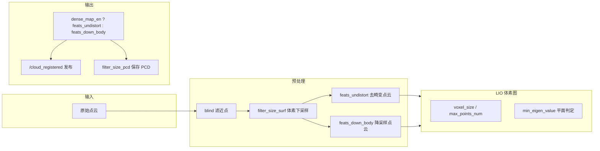

# Fast-LIVO 提高点云清晰度指南

## 0. Executive Summary

| 目标 | 在保证 LIO/LIVO 稳定与实时性的前提下，提高 Fast-LIVO 输出点云的清晰度（更密、更锐、少重影）。 |
|------|----------------------------------------------------------------------------------------------|
| **收益** | 前端点云更清晰 → 关键帧质量更好 → 全局图观感与后续建图/定位更可靠。 |
| **代价** | 计算量与内存略增；需在清晰度与实时性之间做权衡。 |
| **与本工程** | 参数通过 `system_config_*.yaml` 的 `fast_livo` 节注入，launch 用 `params_from_system_config.get_fast_livo2_params` 生成节点参数。全局图模糊优化见 [CONFIG_M2DGR_BLUR_OPTIMIZATION.md](CONFIG_M2DGR_BLUR_OPTIMIZATION.md)。 |

**高优先级可调项（按影响从大到小）：**

1. **publish.dense_map_en**：必须 `true`，否则发布的是降采样点云，观感明显更糊。
2. **preprocess.filter_size_surf**：越小点越密；在 LIO 稳定前提下可降到 0.15～0.2。
3. **lio.voxel_size**：体素地图分辨率；略小（如 0.2）可提高配准与地图细节，计算更重。
4. **lio.max_points_num**：单体素内最大点数；适当增大可保留更多细节（如 80～100）。
5. **pcd_save.filter_size_pcd**：仅影响保存 PCD 时的下采样；要更清晰保存可减小（如 0.1～0.15）。

---

## 1. 背景与 Fast-LIVO2 要点（参考最新资料）

- **FAST-LIVO2（2024）**：直接对**原始 LiDAR 点**做配准，不提取边缘/平面特征，几何细节保留更好；采用**统一体素图**，LiDAR 建几何、视觉在 LiDAR 点上挂图像块，并利用平面先验与曝光估计提升对齐质量。
- **点云“清晰度”在本工程中的含义**：
  - **密度**：每帧/单位体积内点数（受预处理下采样、体素图参数、是否发稠密图影响）。
  - **锐度**：少块状、少重影（受体素大小、位姿精度、平面拟合阈值等影响）。
  - **一致性**：轨迹与回环优化好 → 少重影、少“厚度”。

以下参数均可在**不改动 Fast-LIVO 源码**的前提下，通过 YAML 配置调整。

---

## 2. 参数与数据流（影响清晰度的环节）



- **发布时**：`dense_map_en == true` 时发布 **feats_undistort**（仅去畸变，无体素下采样），否则发布 **feats_down_body**（经 `filter_size_surf` 下采样），清晰度差异明显。
- **体素图**：`lio.voxel_size`、`lio.max_points_num`、`lio.min_eigen_value` 等决定地图结构与配准质量，间接影响位姿与后续帧叠加效果。
- **保存 PCD**：仅影响磁盘文件，用 `filter_size_pcd` 做体素下采样。

---

## 3. 参数逐项说明与建议

### 3.1 发布：是否发稠密点云（影响最大）

| 参数 | 类型 | 建议值 | 说明 |
|------|------|--------|------|
| **publish.dense_map_en** | bool | **true** | 为 true 时对外发布 **feats_undistort**（高密度）；为 false 时发布 **feats_down_body**（经 filter_size_surf 下采样）。要“清晰”必须 true。 |

代码依据：`LIVMapper.cpp` 第 636 行  
`PointCloudXYZI::Ptr laserCloudFullRes(dense_map_en ? feats_undistort : feats_down_body);`

---

### 3.2 预处理：点云密度与盲区

| 参数 | 类型 | 建议范围（提高清晰度） | 说明与取舍 |
|------|------|------------------------|------------|
| **preprocess.filter_size_surf** | double | **0.15～0.20** | 面点体素滤波边长(m)。越小点越密，观感更清晰；过小会显著增加 LIO 计算量。当前 M2DGR 已用 0.20，可尝试 0.18 或 0.15。 |
| preprocess.point_filter_num | int | 2～3 | 每 N 点取 1；越小保留点越多，计算量越大。 |
| preprocess.blind | double | 0.5～1.0 | 最小量程(m)，近于此距离的点被滤除。近处结构重要时可略减；过小易引入近处噪点。 |

`filter_size_surf` 同时用于构造 **downSizeFilterSurf**，影响送入 LIO 的 **feats_down_body**；若 **dense_map_en=true**，发布的是未下采样的 **feats_undistort**，但体素图更新仍用降采样后的点，故调小仍能提升**配准与地图结构**，从而间接提升清晰度与一致性。

---

### 3.3 LIO 体素图：分辨率与单格点数

| 参数 | 类型 | 建议范围（提高清晰度） | 说明与取舍 |
|------|------|------------------------|------------|
| **lio.voxel_size** | double | **0.2～0.25** | 体素边长(m)。越小地图越细、配准越精细，重影与块状感可减轻；计算与内存增加。M2DGR 当前 0.25，可试 0.2。 |
| **lio.max_points_num** | int | **50～100** | 单体素内最大点数，超过后不再添加新点（见 voxel_map 逻辑）。适当增大可保留更多细节；HILTI22 示例用 100。 |
| lio.min_eigen_value | double | 0.0025～0.005 | 平面判定特征值阈值，过小易把非平面当平面；一般保持默认即可。 |
| lio.max_layer | int | 2 | 八叉树层数，通常保持 2。 |
| lio.layer_init_num | vector | [5,5,5,5,5] | 各层触发分裂所需点数，一般保持默认。 |

代码依据：`voxel_map.cpp` 中 `loadVoxelConfig`、体素创建与 `points_size_ > max_points_num_` 的截断逻辑。

---

### 3.4 保存 PCD 时的下采样（仅影响导出文件）

| 参数 | 类型 | 建议范围（更清晰保存） | 说明 |
|------|------|------------------------|------|
| **pcd_save.filter_size_pcd** | double | **0.10～0.15** | 保存 PCD 时体素滤波边长(m)。越小保存的点云越密；0.15 为常见折中，要更细可试 0.1。 |

代码依据：`LIVMapper.cpp` 第 716 行附近，对 `pcl_wait_save` 做 VoxelGrid 滤波后写入 downsampled 文件。

---

### 3.5 其他相关（VIO/IMU/回环）

- **VIO**：若开 LIVO（img_en=1），`normal_en: true`、`exposure_estimate_en: true` 有助于图像对齐与鲁棒性，间接有利于融合后的观感。
- **回环与后端**：位姿更准可减少重影与“厚度”，见 [CONFIG_M2DGR_BLUR_OPTIMIZATION.md](CONFIG_M2DGR_BLUR_OPTIMIZATION.md) 中回环/HBA/子图分辨率等。

---

## 4. 本工程中的配置位置与示例

- 所有 Fast-LIVO 参数由 **system_config 的 `fast_livo`（或 `frontend.fast_livo2`）** 经 `params_from_system_config.get_fast_livo2_params` 生成，再通过 launch 注入到 **fastlivo_mapping** 节点。
- 若使用 **system_config_M2DGR.yaml**，在 **fast_livo** 下已有与清晰度相关的优化（如 `filter_size_surf: 0.20`、`voxel_size: 0.25`、`dense_map_en: true`、`filter_size_pcd: 0.25`）。

**建议在现有基础上微调（按需二选一或组合）：**

```yaml
# 在 system_config_M2DGR.yaml 的 fast_livo 下

preprocess:
  filter_size_surf: 0.18   # 原 0.20，再密一点（可试 0.15）
  # point_filter_num: 3    # 可试 2，保留更多点

lio:
  voxel_size:      0.2     # 原 0.25，更细体素
  max_points_num:  80       # 原 50，单格保留更多点

publish:
  dense_map_en:    true     # 必须 true

pcd_save:
  filter_size_pcd: 0.15     # 原 0.25，保存更密（或 0.1）
```

**注意**：`voxel_map` 与 VIO 中部分 voxel 尺寸在代码中写死为 0.5（如 `vio_surface.cpp`、`vio.cpp`、`vio_lru.cpp` 中的 `voxel_size = 0.5`），仅影响视觉相关体素索引，不改变上述 LIO 体素图与发布点云分辨率。

---

## 5. 验证建议

1. **确认稠密发布**：`dense_map_en: true` 时，`/cloud_registered` 的点数应明显多于 `false`（同帧）。
2. **观感**：在 RViz 中查看 `/cloud_registered`，对比不同 `filter_size_surf`、`lio.voxel_size` 下的锐度与块状感。
3. **性能**：关注单帧 LIO 耗时与内存；若实时性不足，优先回调 `filter_size_surf` 或 `voxel_size`。
4. **全局图**：前端更清晰后，再配合 [CONFIG_M2DGR_BLUR_OPTIMIZATION.md](CONFIG_M2DGR_BLUR_OPTIMIZATION.md) 中的 `map.voxel_size`、关键帧与子图参数，整体模糊会进一步改善。

---

## 6. 风险与回滚

| 风险 | 缓解与回滚 |
|------|------------|
| LIO 变慢或丢帧 | 将 `filter_size_surf`、`lio.voxel_size` 调回原值（如 0.20、0.25）。 |
| 内存增长 | 适当减小 `lio.max_points_num` 或 `voxel_size`；必要时开启 `local_map.map_sliding_en` 控制范围。 |
| 轨迹抖动或发散 | 恢复 `lio.min_eigen_value`、`dept_err`/`beam_err` 为默认；先保证稳定性再追求清晰度。 |

---

## 7. 参考文献与链接

- FAST-LIVO2: Fast, Direct LiDAR-Inertial-Visual Odometry（arXiv:2408.14035，2024）：统一体素图、直接点云配准、稠密建图与曝光估计。
- 本仓库：`automap_pro/src/modular/fast-livo2-humble/`（voxel_map、LIVMapper、preprocess）；`CONFIG_M2DGR_BLUR_OPTIMIZATION.md`（全局图模糊优化）。
