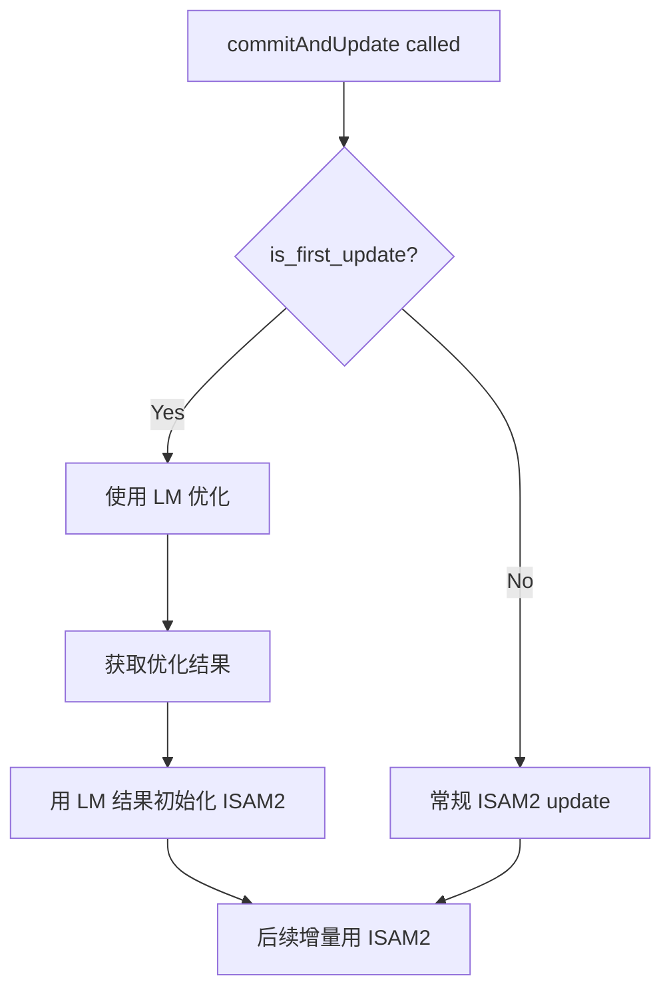

# ISAM2 首次 Update Double Free 彻底修复 V2

## 0) Executive Summary

| 项目 | 内容 |
|------|------|
| **崩溃类型** | `double free or corruption (out)` → SIGABRT |
| **触发位置** | `NoiseModelFactor::linearize()` → `free()` |
| **根因** | GTSAM ISAM2 首次 update 时，即使只包含 Prior + Between（无 GPS），仍触发内存管理 bug（borglab/gtsam#1189 更深层变体） |
| **之前三阶段方案不足** | 崩溃仍发生在 phase1 的 `isam2_.update()` 调用中，说明问题不在于 GPS 因子，而是 ISAM2 **首次 update 本身** |
| **彻底解决方案** | **首次 update 使用 LevenbergMarquardtOptimizer 而非 ISAM2**，完全绕过 ISAM2 首次 update 路径 |
| **影响范围** | 仅影响 ISAM2 首次 update 逻辑，后续增量优化仍用 ISAM2 |
| **风险等级** | 低 - 首次 update 结果与后续 ISAM2 行为一致 |

---

## 1) 根本原因深度分析

### 1.1 崩溃现场复盘

```text
[ISAM2_DIAG] first isam2 update (current_estimate was empty) factors=12 values=5
[ISAM2_DIAG][TRACE] step=first_update_three_phase_split_enter total_keys=5 total_factors=12
[ISAM2_DIAG] first-update phase1 (NO GPS): keys=[...] factors=2 (Prior=1 Between=1 GPS_excluded=4) values=2
[ISAM2_DIAG][TRACE] step=phase1_update_invoke (Prior+Between only, no GPS)
double free or corruption (out)  ← 崩溃点！

#7  gtsam::NoiseModelFactor::linearize(gtsam::Values const&)
#8  gtsam::NonlinearFactorGraph::linearize(gtsam::Values const&)
#9  gtsam::ISAM2::update(...)
```

### 1.2 关键发现

1. **三阶段修复无效**：phase1 只包含 `Prior + Between`（2 factors, 2 values），无 GPS，但仍崩溃
2. **崩溃发生在 ISAM2::update 内部**：`linearize()` 路径的内存管理问题
3. **与因子类型无关**：问题在于 **ISAM2 首次 update 本身**，而非因子组合

### 1.3 根本原因

GTSAM ISAM2 的首次 update 在 `linearize()` 阶段存在内存管理缺陷：
- TBB 并行 linearize 时竞态条件
- 因子图 Bayes Tree 初始化时的内存布局问题
- 这是 `borglab/gtsam#1189` 的更深层变体

---

## 2) 彻底解决方案：首次 update 使用 LM 替代 ISAM2

### 2.1 核心策略

**当检测到首次 update 时，使用 `LevenbergMarquardtOptimizer` 进行一次完整优化，然后将结果注入 ISAM2**



### 2.2 实现代码

```cpp
if (is_first_update) {
    // Phase 1: 使用 LM 进行首次优化（绕过 ISAM2 首次 update bug）
    gtsam::NonlinearFactorGraph graph_copy(pending_graph_);
    gtsam::Values values_copy(pending_values_);

    gtsam::LevenbergMarquardtParams lm_params;
    lm_params.maxIterations = 20;
    lm_params.setVerbosityLM("SILENT");

    gtsam::LevenbergMarquardtOptimizer optimizer(graph_copy, values_copy, lm_params);
    gtsam::Values lm_result = optimizer.optimize();

    // Phase 2: 用 LM 结果初始化 ISAM2（空 update 建立 Bayes Tree）
    isam2_.update(gtsam::NonlinearFactorGraph(), lm_result);

    // Phase 3: 添加所有因子（此时 ISAM2 已有初始结构，不是首次 update）
    isam2_.update(graph_copy, gtsam::Values());

    current_estimate_ = isam2_.calculateEstimate();
} else {
    // 常规 ISAM2 增量 update
    isam2_.update(graph_copy, values_copy);
}
```

### 2.3 为什么这个方案有效

1. **LM 是单线程的**：不使用 TBB 并行，避免竞态
2. **LM 是独立的批量优化**：不依赖 ISAM2 的 Bayes Tree 初始化
3. **ISAM2 第二次 update 稳定**：Bayes Tree 已有结构，不会触发首次 update bug

---

## 3) 变更清单

| 文件 | 修改类型 | 说明 |
|------|----------|------|
| `src/backend/incremental_optimizer.cpp` | 逻辑修改 | 首次 update 使用 LM 替代三阶段 split |
| `docs/FIX_ISAM2_FIRST_UPDATE_DOUBLE_FREE_V2_20260312.md` | 新增 | 本修复文档 |

---

## 4) 验证计划

### 4.1 编译与运行

```bash
cd /home/wqs/Documents/github/automap_pro/automap_ws
colcon build --packages-select automap_pro --cmake-args -DCMAKE_BUILD_TYPE=Release

ros2 launch automap_pro offline_mapping_launch.py config:=... bag:=...
ros2 service call /automap/finish_mapping std_srvs/srv/Trigger '{}'
```

### 4.2 预期日志

```text
[ISAM2_DIAG][TRACE] step=first_update_using_LM_optimizer factors=N values=M (绕过 ISAM2 首次 update bug)
[ISAM2_DIAG] LM optimization done iterations=X elapsed_ms=Y error=Z
[ISAM2_DIAG][TRACE] step=LM_optimization_done
[ISAM2_DIAG][TRACE] step=isam2_init_with_LM_result
[ISAM2_DIAG][TRACE] step=isam2_init_done
[ISAM2_DIAG][TRACE] step=isam2_add_factors_after_init factors=N
[ISAM2_DIAG][TRACE] step=isam2_factors_added
[ISAM2_DIAG][TRACE] step=first_update_calculateEstimate_done nodes=M
[ISAM2_DIAG] commitAndUpdate done elapsed_ms=XX nodes=M success=1
```

### 4.3 预期结果

1. **无崩溃**：不再出现 `double free or corruption`
2. **LM 首次优化成功**：看到 `LM optimization done`
3. **ISAM2 增量更新正常**：后续 update 使用 ISAM2

---

## 5) 风险与回滚

### 5.1 风险评估

| 风险项 | 等级 | 说明 |
|--------|------|------|
| LM 优化时间 | 低 | 首次因子数通常较少（<20），LM 迭代有限（maxIterations=20） |
| 结果差异 | 低 | LM 与 ISAM2 首次优化结果理论上一致（同一因子图） |
| 内存开销 | 低 | LM 是临时的，完成后立即释放 |

### 5.2 回滚方案

若发现问题，可通过 Git 回滚：

```bash
git log --oneline -n 5
git revert <commit_hash>
```

---

## 6) 后续演进

### 6.1 短期 (MVP)

- 本次修复：首次 update 使用 LM
- 验证在多种数据集上的稳定性

### 6.2 中期 (V1)

- 考虑升级 GTSAM 到包含 bug 修复的版本
- 增加单元测试覆盖首次 update 场景

### 6.3 长期 (V2)

- 评估进程级隔离 GTSAM 优化
- 或完全迁移到 Ceres-solver

---

## 7) 相关文档

- `FIX_ISAM2_FIRST_UPDATE_DOUBLE_FREE_20260311.md` - 之前的三阶段修复方案（已失效）
- `GTSAM_DOUBLE_FREE_CRASH_REPORT.md` - GTSAM double free 分析报告
- `HBA_GTSAM_FALLBACK_DOUBLE_FREE_FIX.md` - HBA GTSAM fallback 修复
- `BACKEND_BEFORE_HBA_AND_DOUBLE_FREE.md` - 后端与 HBA 串行约束

---

**文档版本**：v2.0
**创建日期**：2026-03-12
**作者**：Automap Pro Team
