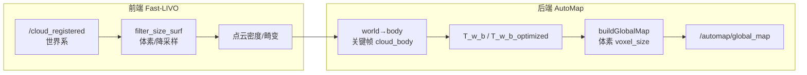

# 全局点云地图模糊——根因分析与精准诊断

## 0. Executive Summary

| 目标 | 分析 `/automap/global_map` 点云“模糊”的成因，并给出可落地的精准诊断方法。 |
|------|-----------------------------------------------------------------------------|
| **模糊类型** | ① 重影/厚度（多叠层） ② 分辨率低/块状 ③ 噪点/抖动 |
| **主要根因** | 位姿误差（含未优化/回退）、体素下采样过大、前端点云密度与运动畸变。 |
| **诊断手段** | 日志 grep、bbox/点数统计、参数表、轨迹对比、可选点云指标。 |

---

## 1. 背景与“模糊”的三种表现

“模糊”在点云上通常对应三种可区分现象：

| 表现 | 描述 | 典型原因 |
|------|------|----------|
| **重影/厚度** | 同一面出现多层点或边缘“发虚” | 多帧位姿不一致，同一物点被不同位姿投到不同位置 |
| **分辨率低/块状** | 表面像马赛克、细节丢失 | 体素下采样过粗、或前端已稀疏 |
| **噪点/抖动** | 点云在真实表面附近随机散布 | 前端配准噪声、运动畸变、时间不同步 |

下面按**数据流**梳理各环节可能引入的模糊来源，并对应到**精准分析手段**。

---

## 2. 数据流与可能出错环节（总览）



- **前端**：点云密度、运动畸变、时间同步 → 影响单帧清晰度与多帧一致性。
- **后端**：位姿（T_w_b_optimized vs T_w_b、回退路径）、体素大小 → 影响多帧叠加是否“对齐”以及最终分辨率。

---

## 3. 根因分析（按环节）

### 3.1 位姿误差导致“重影/厚度”（最常见）

**机制**：同一物理点在不同关键帧中由不同位姿变换到世界系，若位姿有误差，会落在不同位置，叠加后形成重影或边缘变厚。

| 可能来源 | 说明 | 代码/配置位置 |
|----------|------|----------------|
| 使用回退路径 | 无关键帧点云时用 `merged_cloud`（按 T_w_b 建图），与优化后轨迹不一致 | `submap_manager.cpp` buildGlobalMap，见 [GLOBAL_MAP_DIAGNOSIS.md](./GLOBAL_MAP_DIAGNOSIS.md) |
| T_w_b_optimized 未更新 | 部分 KF 的优化位姿为 Identity，自动回退用 T_w_b | `submap_manager.cpp` L628–651，日志 `T_w_b_optimized=Identity` |
| 优化尚未收敛/约束不足 | HBA/ISAM2 未跑或约束弱，轨迹仍有漂移 | 回环/GPS 配置、HBA trigger |
| 子图间相对位姿误差 | 子图锚点优化不充分，子图交界处错位 | 回环检测与 TEASER/ICP 参数 |

**精准判断**：

- 日志中是否出现 `path=fallback_merged_cloud` → 是则全局图与优化轨迹错位，易重影。
- 统计 `kf_fallback_unopt`：若 >0 表示部分 KF 用未优化位姿参与建图。
- 对比 RViz 中 `odom_path`、`optimized_path` 与 `global_map`：若轨迹已拉直而点云仍“拖影”，多半是历史点云用旧位姿导致。

### 3.2 体素下采样过大导致“块状/糊”

**机制**：`buildGlobalMap` 最后一步对合并点云做体素下采样，体素越大，同一体素内多点合并为一点，细节丢失，观感“糊”。

| 参数 | 含义 | 默认/典型值 | 配置键 |
|------|------|-------------|--------|
| 全局图体素 | 发布前体素滤波 leaf size | 0.2（代码默认）～0.35（M2DGR） | `map.voxel_size` |
| 分块尺寸 | 大点云分块下采样时的块大小 | 50 m | `submap_manager.cpp` L802 `chunk_size_m=50.0f` |

**代码路径**：

- `ConfigManager::mapVoxelSize()` ← `map.voxel_size`（`config_manager.h` L125）
- `automap_system.cpp`：`map_voxel_size_` 在初始化时缓存，`publishGlobalMap()` 调用 `buildGlobalMap(voxel_size)`
- `submap_manager.cpp` L794–802：`voxelDownsampleChunked(combined, vs, 50.0f)`，且 `leaf_size` 会被 clamp 到至少 `kMinVoxelLeafSize`（0.2 m）

**精准判断**：

- 看日志 `buildGlobalMap enter voxel_size=` 与 `after_downsample out_pts=`：若 voxel 偏大且 out_pts 明显小于 combined_pts，说明下采样狠，可尝试减小 `map.voxel_size`（如 0.2）。
- 若 `voxelDownsampleChunked` 因范围过大而 `skip_final_voxel`，合并块边界可能有轻微重复，一般影响小于“体素过大”本身。

### 3.3 关键帧点云本身稀疏或带噪

**机制**：关键帧的 `cloud_body` 若在源头就稀疏或带噪，即使用对位姿、体素适中，全局图也会显得“糊”或“脏”。

| 来源 | 说明 | 配置/位置 |
|------|------|-----------|
| 前端体素/滤波 | Fast-LIVO 预处理 `filter_size_surf`、`point_filter_num` 等 | `fast_livo.preprocess`（如 M2DGR 中 filter_size_surf: 0.25） |
| 盲区/距离 | `blind`、最大距离截断 | `fast_livo.preprocess.blind` 等 |
| 运动畸变 | 一帧内 LiDAR 与位姿未完全去畸变 | 前端 LIO 质量、时间对齐 |
| 世界→body 转换 | 若 pose 与点云时间不一致，body 系点云会带误差 | `automap_system.cpp` world→body 用当前帧 pose |

**精准判断**：

- 看关键帧日志中 `pts=` 与 `ds_pts=`：若单帧 pts 就很少，说明前端已很稀疏。
- 若有轨迹/点云时间戳日志，可检查 pose 与 cloud 时间差（文档中建议 odom_cloud_dt < 0.15 s）。

### 3.4 分块体素边界带来的次要影响

**机制**：`voxelDownsampleChunked` 按 50 m 分块分别体素再合并；若最终因范围过大跳过“最终一次体素”，合并结果在块边界可能略有多余点，密度略不均匀，通常不如前几项明显。

**精准判断**：日志中是否有 `skip_final_voxel (extent overflow risk)`；若有，可关注大场景下边界区域是否略糊。

---

## 4. 精准诊断方法（可执行清单）

### 4.1 日志一键过滤与关键字段

```bash
# 仅保留全局图相关诊断
ros2 run automap_pro automap_system_node 2>&1 | grep GLOBAL_MAP_DIAG

# 精准定位模糊：单行汇总（源码中 buildGlobalMap 末尾输出）
grep GLOBAL_MAP_BLUR full.log

# 或离线
grep GLOBAL_MAP_DIAG full.log
```

**源码中新增的 [GLOBAL_MAP_BLUR] 单行汇总**（每次 buildGlobalMap 成功时输出一条，便于脚本解析）：

| 字段 | 含义 | 异常与处理 |
|------|------|------------|
| `path=from_kf` / `path=fallback` | 主路径 vs 回退路径 | fallback → 易重影，保证 retain_cloud_body=true |
| `kf_unopt=N` | 使用 T_w_b 未优化位姿的 KF 数 | N>0 → 部分帧未优化，易重影 |
| `voxel=X` | 体素大小 (m) | X>0.3 → 易块状，可减小 map.voxel_size |
| `combined=` / `out=` | 下采样前/后点数 | — |
| `comp_pct=Y%` | 下采样保留比例 | Y<5% → 下采样过狠，易糊 |
| `blur_risk=yes` / `no` | 是否触发模糊风险判断 | yes 时下方会打 WARN 说明原因 |

另有关键帧稀疏告警（关键帧点云点数 <500 时）：`[GLOBAL_MAP_BLUR] sparse_keyframe kf_pts=...`，表示该帧输入就很少，可能来自前端过滤波或盲区。

**必看项**（与模糊强相关）：

| 日志片段 | 含义 | 正常/异常参考 |
|----------|------|-------------------------------|
| `path=from_kf` | 主路径：从关键帧 + T_w_b_optimized 重算 | 期望每次发布均为 from_kf |
| `path=fallback_merged_cloud` | 回退路径 | 出现即可能重影/错位 |
| `kf_fallback_unopt=` | 使用 T_w_b 的 KF 数 | 0 为佳；>0 表示部分未优化 |
| `buildGlobalMap enter voxel_size=` | 本次体素大小 | 过大（如 ≥0.35）易块状 |
| `combined_pts=` / `after_downsample out_pts=` | 下采样前后点数 | 比例过小说明下采样很狠 |
| `T_w_b_optimized=Identity → using T_w_b` | 某 KF 未用优化位姿 | 出现次数多会加重重影 |

### 4.2 使用现有诊断脚本

```bash
./diagnose_global_map.sh full.log
```

脚本已检查：主路径 vs 回退、kf_skipped_null/empty、kf_fallback_unopt、bbox 等。若报告“回退路径运行”或“未被优化的关键帧数”偏多，优先从位姿/回退路径排查重影。

### 4.3 参数速查表（与模糊相关）

| 配置键 | 建议范围 | 作用 |
|--------|----------|------|
| `map.voxel_size` | 0.15～0.25 追求清晰；0.3～0.5 省内存 | 全局图体素，越小越清晰、点数越多 |
| `keyframe.retain_cloud_body` | true | 保证主路径可用，避免回退 |
| `submap.match_resolution` | 0.3～0.5 | 关键帧下采样仅用于匹配，不直接决定全局图分辨率，但影响子图质量 |
| `fast_livo.preprocess.filter_size_surf` | 0.2～0.3 | 前端面点体素，过大会导致输入就稀疏 |

### 4.4 可视化交叉验证

1. **RViz**：Fixed Frame = `map`，同时显示 `/automap/odom_path`、`/automap/optimized_path`、`/automap/global_map`。
2. **判断**：若优化轨迹已闭合/平滑，而全局图在闭合处仍“双层”或错位 → 位姿/回退问题。若轨迹与点云一致但整体像马赛克 → 体素或前端密度问题。
3. **轨迹对比**：若有轨迹对比脚本（如 `plot_trajectory_compare.py`），可对比优化前后轨迹，确认优化是否生效。

### 4.5 可选：点云指标（进阶）

若需量化“模糊”程度，可考虑（需自行实现或脚本）：

- 在**重叠区域**（如回环前后）采样小范围，统计点到最近邻距离的分布（对齐好则距离小且集中）。
- 对比不同 `map.voxel_size` 下同一段数据的点数和局部密度分布。

---

## 5. 代码位置索引（与模糊相关）

| 文件 | 位置/函数 | 说明 |
|------|-----------|------|
| `src/submap/submap_manager.cpp` | `buildGlobalMap` 末尾 | **模糊精准定位**：`used_fallback_path`、单行 `[GLOBAL_MAP_BLUR]`（path/kf_unopt/voxel/comp_pct/blur_risk）、blur_risk 时 WARN |
| `src/submap/submap_manager.cpp` | `buildGlobalMap` | 主路径 T_w_b_optimized、回退 merged_cloud、体素 voxel_size、chunk 50 m |
| `src/system/automap_system.cpp` | `tryCreateKeyFrame` 内创建 KF 前 | **稀疏关键帧判断**：`cur_cloud->size() < 500` 时打 `[GLOBAL_MAP_BLUR] sparse_keyframe` |
| `src/system/automap_system.cpp` | `map_voxel_size_`、`publishGlobalMap` | 使用缓存的 map.voxel_size 调用 buildGlobalMap |
| `src/system/automap_system.cpp` | `transformWorldToBody`、backend 用 pose | 世界→body 与 pose 对应关系 |
| `src/core/utils.cpp` | `voxelDownsampleChunked` | 分块体素、skip_final_voxel 逻辑 |
| `include/automap_pro/core/config_manager.h` | `mapVoxelSize()` | 读 `map.voxel_size`，下限 0.2 |
| `config/system_config_M2DGR.yaml` | `map.voxel_size` | 当前 0.35，可适当减小试效果 |

---

## 6. 建议排查顺序（针对“模糊”）

1. **确认是否走回退路径**  
   `grep "path=fallback_merged_cloud" full.log` → 若有，设 `retain_cloud_body: true` 并保证关键帧点云未丢失，避免回退。
2. **确认是否有 Identity 回退**  
   `grep "T_w_b_optimized=Identity" full.log` → 若有，检查 HBA/ISAM2 是否正常写回 T_w_b_optimized。
3. **看体素与点数**  
   看 `voxel_size=` 与 `combined_pts`/`after_downsample out_pts`；若体素大且压缩比高，将 `map.voxel_size` 降到 0.2～0.25 试跑。
4. **看轨迹与点云是否一致**  
   RViz 中对比 optimized_path 与 global_map；若轨迹好、点云仍重影，重点查位姿与回退。
5. **看单帧密度**  
   看 KF 日志中 `pts=`；若单帧就很少，适当减小前端 filter_size_surf 或检查盲区/距离。

---

## 7. 风险与回滚

- **减小 map.voxel_size**：全局图点数增加，buildGlobalMap 与传输/显示负担变大，大场景可能触发分块或内存压力；可先在小范围/短 bag 上试。
- **修改前端预处理**：可能影响 LIO 稳定性与实时性，建议单独做 A/B 对比或回放验证。

---

## 8. 与现有文档关系

- **[GLOBAL_MAP_DIAGNOSIS.md](./GLOBAL_MAP_DIAGNOSIS.md)**：侧重“点云混乱”的环节定位与数据流、日志含义；本文在其基础上专门展开“模糊”的成因与分辨率/位姿/前端三类原因。
- **diagnose_global_map.sh**：已覆盖主路径/回退、kf_fallback_unopt 等，与本文 4.1、4.2 一致；本文补充体素与前端参数、可视化验证顺序，便于精准定位是“重影”还是“块状”还是“噪点”。
