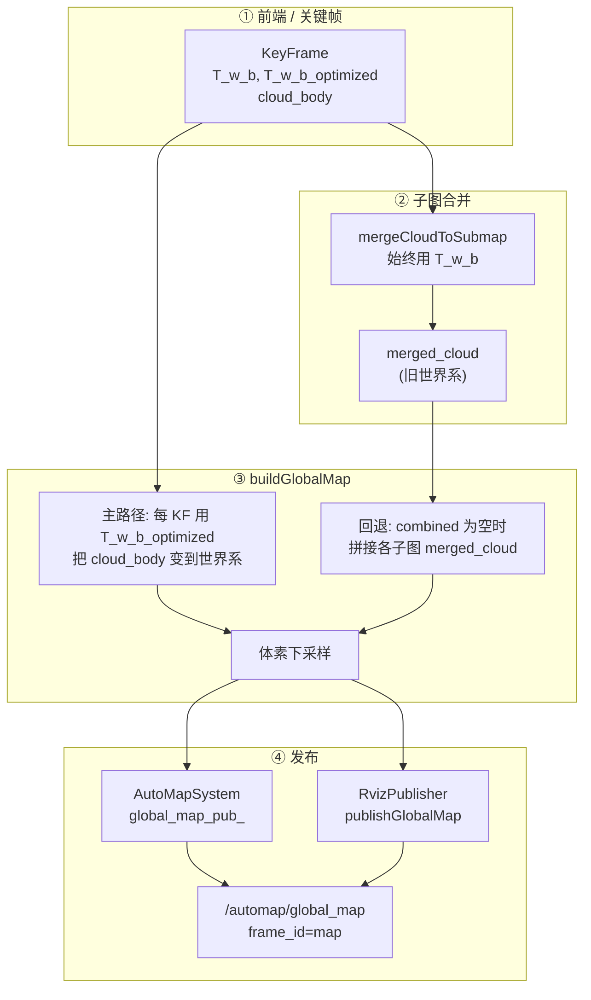

# 全局图点云混乱——精准定位与诊断

## 0. Executive Summary

| 目标 | 通过增强日志与数据流梳理，精准定位 `/automap/global_map` 点云混乱发生的环节。 |
|------|-----------------------------------------------------------------------------|
| **日志 TAG** | 所有相关诊断日志统一带 `[GLOBAL_MAP_DIAG]`，便于 grep 过滤。 |
| **主要环节** | ① mergeCloudToSubmap（写入 merged_cloud）→ ② buildGlobalMap（主路径/回退路径）→ ③ 发布。 |
| **已做修复** | buildGlobalMap 主路径已按 `T_w_b_optimized` 从关键帧重算；若 `T_w_b_optimized` 为 Identity 则自动回退用 `T_w_b` 并打 WARN。 |

---

## 1. 数据流总览（从关键帧到话题）



**可能出错环节简述：**

| 环节 | 若出错表现 | 日志/排查 |
|------|------------|-----------|
| mergeCloudToSubmap 用错位姿 | merged_cloud 与轨迹不一致（仅影响回退路径） | 看 `[GLOBAL_MAP_DIAG] merge` 的 T_w_b |
| 主路径用了 Identity | 部分点云落在原点附近，整体混乱 | 看 `T_w_b_optimized=Identity, using T_w_b` |
| 走了回退路径 | 全局图 = 旧世界系，与优化轨迹错位 | 看 `path=fallback_merged_cloud` 与 `fallback sm_id=` |
| frame_id 与 RViz 不一致 | 点云显示错位或不可见 | 看 `publish frame_id=`，RViz Fixed Frame 设为 map |

---

## 2. 诊断日志与 grep 用法

### 2.1 一键过滤所有全局图诊断日志

```bash
# 运行节点时重定向，只保留 GLOBAL_MAP_DIAG
ros2 run automap_pro automap_system_node 2>&1 | grep GLOBAL_MAP_DIAG

# 或录制后离线过滤
ros2 bag play xxx && ... 2>&1 | tee full.log
grep GLOBAL_MAP_DIAG full.log
```

### 2.2 各阶段日志含义

| 日志片段 | 含义 | 正常/异常判断 |
|----------|------|-------------------------------|
| `buildGlobalMap enter voxel_size=` | 进入构建，体素大小 | 仅确认调用 |
| `path=from_kf submaps_with_kf= kf_used= combined_pts=` | 主路径：从关键帧用优化位姿合并 | 若 `kf_used=0` 且 `combined_pts=0` 会走回退 |
| `path=fallback_merged_cloud` | 使用了回退路径（拼接 merged_cloud） | 若同时点云混乱，多为“优化后点云未重投影” |
| `fallback sm_id= merged_pts=` | 回退时每个子图贡献的点数 | 用于确认哪些子图参与 |
| `combined_pts= bbox_min= bbox_max=` | 合并后点数与包围盒 | 若 bbox 异常大/小或明显不对，说明上游位姿或坐标系有问题 |
| `after_downsample out_pts= bbox_*` | 下采样后输出点数与包围盒 | 与 combined 的 bbox 量级一致 |
| `kf_id= sm_id= T_w_b_optimized=Identity, using T_w_b` | 某关键帧优化位姿未初始化，改用里程计位姿 | 出现说明有 KF 未参与优化或未正确写回 T_w_b_optimized |
| `publish /automap/global_map frame_id= pts=` | 实际发布的话题 frame_id 与点数 | RViz Fixed Frame 必须与此 frame_id 一致 |
| `merge sm_id= kf_id= body_pts= T_w_b=(...) merged_pts=` | 每次合并到子图时用的位姿与点数 | DEBUG 级；用于核对 merged_cloud 是否用 T_w_b |

### 2.3 建议排查顺序

1. **确认是否走回退路径**  
   `grep "path=fallback_merged_cloud"` → 若出现且配置为 `retain_cloud_body=true`，说明关键帧点云被清空或未保留，需查归档/内存策略。

2. **确认是否有 Identity 回退**  
   `grep "T_w_b_optimized=Identity"` → 若出现，说明部分关键帧的优化位姿未写入，全局图会混入“未优化”的 body 系点云。

3. **对比 bbox**  
   看 `combined_pts= ... bbox_min= bbox_max=` 与 `after_downsample ... bbox_*` 是否在合理范围（与场景尺度一致）；若某轴范围异常（如仅几米或数千米），可能是单子图错位或坐标系错误。

4. **确认 RViz**  
   RViz 中 Fixed Frame 设为 `map`，与日志中 `publish frame_id=map` 一致。

---

## 3. 代码位置索引

| 文件 | 函数/位置 | 说明 |
|------|-----------|------|
| `src/submap/submap_manager.cpp` | `mergeCloudToSubmap` | 用 `T_w_b` 写 `merged_cloud`；打 `[GLOBAL_MAP_DIAG] merge`（DEBUG） |
| `src/submap/submap_manager.cpp` | `buildGlobalMap` | 主路径用 `T_w_b_optimized`（Identity 时回退 `T_w_b`）；回退路径拼接 `merged_cloud`；打 path/bbox/fallback 等 |
| `src/system/automap_system.cpp` | `publishGlobalMap` | 调用 buildGlobalMap，发布到 `/automap/global_map`，打 `[GLOBAL_MAP_DIAG] publish` |
| `src/visualization/rviz_publisher.cpp` | `publishGlobalMap` | 再次发布同一 cloud（frame_id_ 由 setFrameId 设置，通常为 map），打 DEBUG 日志 |

---

## 4. 与 GLOBAL_MAP_MESSY_ANALYSIS 的关系

- **GLOBAL_MAP_MESSY_ANALYSIS.md**：描述根因（优化后点云未重投影）与修复方向（按优化位姿从关键帧重算 / 位姿更新时重投影 merged_cloud）。
- **本文（GLOBAL_MAP_DIAGNOSIS.md）**：在已实现“主路径按 T_w_b_optimized 重算”和“Identity 回退 T_w_b”的前提下，通过 **增强日志** 与 **数据流说明** 做运行期精准定位，便于确认问题出在合并、构建路径、回退路径还是发布/坐标系。

若日志中出现 `path=fallback_merged_cloud` 且点云仍乱，可继续参考 GLOBAL_MAP_MESSY_ANALYSIS 的排查清单与修复方案（例如确保 `retain_cloud_body=true`、检查归档策略）。
