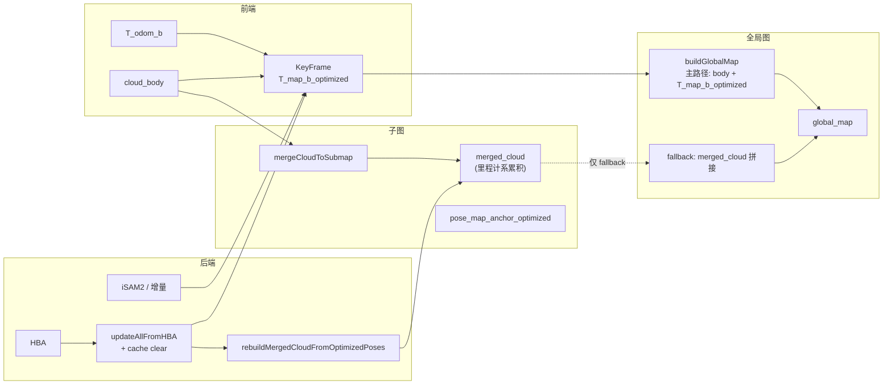

# 全局点云地图杂乱问题——分析与定位指南

## 0. Executive Summary

| 维度 | 结论 |
|------|------|
| **现象** | 生成的全局点云地图（`/automap/global_map`）非常杂乱，子图间错位、重影、断裂。 |
| **历史根因（已修复主路径）** | 旧版 **`buildGlobalMap` 直接拼接各子图 `merged_cloud`**，而 `merged_cloud` 在**未优化/里程计位姿**下生成；后端只更新优化位姿时，全局图仍用旧几何。 |
| **当前主路径（与代码一致）** | `SubMapManager::buildGlobalMap` **主路径**：对每个关键帧用 **`kf->cloud_body` + `T_map_b_optimized`** 变换到 map 系再合并、体素下采样；日志中常见 `[SubMapMgr][POSE_DIAG] … pose_source=T_map_b_optimized`。HBA 写回后另执行 `rebuildMergedCloudFromOptimizedPoses` 以统一 **fallback** 用的 `merged_cloud`。 |
| **仍可能出现的杂乱** | ① **回环不足 / GPS–激光几何不一致**导致 `T_map_b_optimized` 本身在重访处未对齐（漂移叠图）；② **异步全局图**在 HBA 写回前后与快照竞态（已通过 **HBA 后清空缓存** + **终局 `handleSaveMap` 前 `invalidateGlobalMapCache`** 缓解）；③ **fallback_merged_cloud** 路径若未经过 rebuild 仍可能与优化轨迹不一致（见构建日志 `fallback_merged_cloud`）。 |
| **建议** | 排障时先用日志确认走的是主路径还是 fallback；再结合回环 KPI、`diff_to_odom`、HBA/GPS 杆臂诊断区分「几何未优化」与「构建路径错误」。 |

---

## 1. 背景与数据流

### 1.1 全局图从哪里来

- **发布入口**：`AutoMapSystem::publishGlobalMap()` → 发布 `GlobalMapBuildRequestEvent` → `MappingModule::handleGlobalMapBuild` → `SubMapManager::buildGlobalMap` 或 **`buildGlobalMapAsync`**（由 `performance.async_global_map_build` 决定）。
- **同步保存**：`SaveMapRequestEvent` → `MappingModule::handleSaveMap` → **`invalidateGlobalMapCache()`** 后 **`buildGlobalMap`** → `global_map_final.pcd`。

### 1.2 当前 `buildGlobalMap` 主路径（优化位姿 + body 点云）

1. 遍历子图与关键帧，将 **`cloud_body`** 用 **`T_map_b_optimized`** 变换到 map 系，合并入 `combined`。
2. 对 `combined` 做体素下采样（可并行）后写入/返回；若命中缓存（同 KF 数、同 `current_map_version_`、同 voxel）则直接返回缓存。

**`merged_cloud` 的角色**：仍在 `mergeCloudToSubmap` 中按里程计/子图逻辑累积；**主路径全局图不再依赖其几何正确性**。当主路径 `combined` 为空时，代码可能走 **拼接各子图 `merged_cloud` 的 fallback**（日志 `fallback_merged_cloud`），此时必须保证已执行 **`rebuildMergedCloudFromOptimizedPoses`**（HBA 回调链中调用）。

### 1.3 位姿与版本、缓存

- **HBA**：`updateAllFromHBA` 写回 `T_map_b_optimized`，**递增 `current_map_version_`**，并在持锁路径内 **清空 `cached_global_map_`**，避免继续发布旧体素图。
- **iSAM2 等增量更新**：若仅更新位姿而未 bump 版本，理论上仍存在缓存与位姿不一致窗口；重影排查时需对照日志时间线与 `POSE_DIAG`。

---

## 2. 数据流与问题点（Mermaid）

**关键断点（当前）**：主路径下断点主要在 **「优化位姿是否真能对齐重访」**（回环/GPS/HBA），而非「未重投影 merged_cloud」；**fallback 路径**仍依赖 `merged_cloud` 是否已按优化位姿 rebuild。

---

## 3. 根因小结（对照历史与现状）

| 环节 | 历史问题行为 | 当前主路径行为 |
|------|----------------|----------------|
| 合并点云 | `merged_cloud` 基于未优化位姿 | 仍存在；用于子图内可视化/merge，**不作为主路径全局图唯一来源** |
| 位姿优化 | 只更新优化位姿 | 同左；全局图用 **`T_map_b_optimized` 重算** |
| 构建全局图 | 仅拼接 `merged_cloud` | **body 点云 × 优化位姿**；empty 时 fallback `merged_cloud` |

---

## 4. 排查清单（如何确认并区分其他可能原因）

按下面顺序做，可确认是否为“优化位姿与点云构建不一致”导致，并排除其他因素。

### 4.1 确认是否为“构建路径 / 缓存”导致

1. **grep 主路径与 fallback**  
   - `pose_source=T_map_b_optimized`、`buildGlobalMap 主路径`  
   - 若出现 `fallback_merged_cloud`、`GHOSTING_RISK`，对照是否刚完成 HBA、`rebuildMergedCloudFromOptimizedPoses` 是否执行。

2. **缓存与版本**  
   - `buildGlobalMap hit`（DEBUG）与 `global map cache cleared after HBA writeback`、`invalidateGlobalMapCache` 终局保存前是否出现。

### 4.2 确认是否为“优化未收敛 / 无回环”导致

1. **轨迹对比**  
   - `/automap/odom_path` vs `/automap/optimized_path`；若优化轨迹已收口而点云仍分层，且日志确认主路径，则优先查 **回环 KPI、GPS 杆臂、HBA 写回**。

2. **关回环做对比**  
   - 关闭回环：全局图应与里程计一致（仅漂移）；打开回环后若轨迹改善而点云仍乱，再区分是 **回环误配** 还是 **构建/fallback**。

### 4.3 排除其他可能原因

| 可能原因 | 如何排查 | 若排除则 |
|----------|----------|----------|
| **odom 与 cloud 错帧** | 查日志 `[BACKEND][DIAG] no odom in cache`、时间戳 THROTTLE | 避免误用错误位姿建图 |
| **坐标系不一致** | `frame_id` 与 RViz Fixed Frame、TF | 排除显示错误 |
| **回环误匹配** | `loop_detector`、`pose_consistency`、RMSE | 修回环筛选/验证 |
| **HBA/GPS 杆臂不一致** | `[HBA][GPS_LEVER_ARM_DIAG]`、`CONFIG_READ_BACK` | 修配置同源与缓存读路径 |

### 4.4 建议的日志/话题抓取

- 日志：`[SubMapMgr][POSE_DIAG]`、`[SubMapMgr][GHOSTING_DIAG]`、`[GLOBAL_MAP_DIAG]`、`[HBA]`、`LOOP_STEP`。  
- 话题：`/automap/global_map`、`/automap/odom_path`、`/automap/optimized_path`。

---

## 5. 修复方向（与实现要点）

### 5.1 主路径：KF + `T_map_b_optimized`（已实现）

- **思路**：全局图由 **`cloud_body` 与 `T_map_b_optimized`** 重算，与当前优化一致。
- **注意**：`T_map_b_optimized` 未初始化且非退化场景时，代码侧有硬失败路径（见 `T_map_b_optimized_UNOPT` 日志），需保证后端写回完整。

### 5.2 Fallback 与 HBA 后一致化

- **`rebuildMergedCloudFromOptimizedPoses`**：在 HBA 成功写回后重建各子图 `merged_cloud`，避免 fallback 仍用里程计系。
- **缓存**：HBA 写回后 **`cached_global_map_.reset()`**；终局保存前 **`invalidateGlobalMapCache()`** 再 **`buildGlobalMap`**。

### 5.3 线程与异步

- **`buildGlobalMapAsync`**：持锁快照 `(cloud_body, T_map_b_optimized)` 再离线体素；若快照落在 HBA enter~exit 之间，日志有 `pose_snapshot_taken` 与 `GHOSTING_DIAG` 可对时。
- **终局**：`finish_mapping` → quiesce → `SaveMapRequestEvent` → **同步** `buildGlobalMap`（非 async 保存路径）。

### 5.4 `diff_to_opt`、回环与「真实世界无重影」

- **`[SubMapMgr][POSE_DIAG] diff_to_opt=0`** 只说明：**用于构图的位姿与当前 `T_map_b_optimized` 一致**（图内自洽），**不**保证与真实世界或 LIO 原始轨迹一致。
- **重访无重影**在数学上需要：**子图级激光回环**或**等价的强几何约束**（如高质量全轨迹 RTK/绝对位姿）。仅靠 GPS 往往无法单独消除「同一物理街道两幅偏移点云」。
- **离线补丁**：`automap_offline.launch.py` 在写入 `system_config_offline_patched.yaml` 前合并顶层 `gps:`，写后校验 `sensor.gps.enabled=true` 时 **`gps.lever_arm_imu` 必须为长度 ≥3 的序列**，避免 HBA 零杆臂与主配置分裂。
- **跑后 / CI**：仓库脚本 `scripts/check_automap_mapping_log_health.sh` 扫描 `full.log`：出现 **`[HBA] GPS lever arm is zero`** 则失败；若存在 **`CONSTRAINT_KPI[HBA]`** 但**从未**出现 **`loop_added>0`**，则告警（长轨迹**不能保证**无重访重影）。严格模式：`STRICT_LOOP=1` 时无激光回环即非零退出。

---

## 6. 验证与回滚

- **验证**：同一 bag 对比修复前后日志：主路径无异常 fallback；终局 `global_map_final.pcd` 与 `optimized_path` 在重访处一致；并运行  
  `scripts/check_automap_mapping_log_health.sh logs/run_*/full.log`。  
- **回滚**：若仅调配置（回环阈值等），恢复 YAML；若回退代码路径，需评估是否重新引入「仅拼接 merged_cloud」的旧行为。

---

## 7. 相关文件索引

| 文件 | 作用 |
|------|------|
| `automap_pro/src/submap/submap_manager.cpp` | `buildGlobalMap`、`buildGlobalMapAsync`、`updateAllFromHBA`（含缓存清理）、`rebuildMergedCloudFromOptimizedPoses` |
| `automap_pro/src/v3/mapping_module.cpp` | `handleSaveMap`（invalidate + 同步 `buildGlobalMap`）、`handleGlobalMapBuild` |
| `automap_pro/src/system/modules/tasks_and_utils.cpp` | `publishGlobalMap`（发布异步/同步构建请求） |
| `automap_pro/include/automap_pro/core/data_types.h` | `KeyFrame::T_map_b_optimized`、`cloud_body` 等 |
| `automap_pro/launch/automap_offline.launch.py` | 离线补丁：合并 `gps`、校验 `lever_arm_imu` |
| `scripts/check_automap_mapping_log_health.sh` | 跑后检查：`GPS lever arm is zero`、`loop_added` |

---

**文档版本**：含「gps 补丁校验、杆臂缓存、回环健康脚本、diff_to_opt 语义」；若子图/后端接口变更，请同步更新本节与文件索引。
