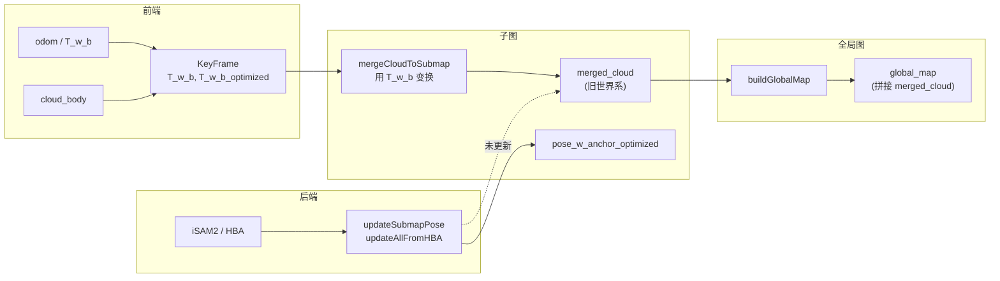

# 全局点云地图杂乱问题——分析与定位指南

## 0. Executive Summary

| 维度 | 结论 |
|------|------|
| **现象** | 生成的全局点云地图（`/automap/global_map`）非常杂乱，子图间错位、重影、断裂。 |
| **根因** | **子图合并点云（`merged_cloud`）在“未优化位姿”下构建，后端优化只更新了位姿，未对点云做重投影**；`buildGlobalMap()` 直接拼接各子图 `merged_cloud`，相当于在用“旧世界系”的点云，与优化后的轨迹不一致。 |
| **影响** | 回环/ iSAM2 / HBA 优化后，轨迹已对齐，但发布/导出的全局图仍是优化前的几何，视觉上杂乱。 |
| **建议** | 短期：按本文“排查清单”确认根因并做可视化对比；**修复**：在 `buildGlobalMap` 中按**优化后位姿**从关键帧 body 点云重算全局图（或位姿更新时对子图点云做重投影）。 |

---

## 1. 背景与数据流

### 1.1 全局图从哪里来

- **发布入口**：`AutoMapSystem::publishGlobalMap()` → `submap_manager_.buildGlobalMap(voxel_size)` → 发布到 `/automap/global_map` 与 RViz。
- **构建实现**：`SubMapManager::buildGlobalMap()` 仅做两件事：
  1. 遍历所有子图，把每个子图的 `merged_cloud` **直接拼接到** `combined`（**无任何位姿变换**）；
  2. 对 `combined` 做体素下采样后返回。

因此：**全局图 = 各子图 `merged_cloud` 的简单拼接**，且设计上假定“每个 `merged_cloud` 已在同一世界系”。

### 1.2 子图 `merged_cloud` 是如何产生的

- **写入位置**：`SubMapManager::mergeCloudToSubmap(sm, kf)`（在 `addKeyFrame` 时对当前活跃子图调用）。
- **关键代码**（节选）：
  - 使用 **`kf->T_w_b`**（未优化位姿）将 `kf->cloud_body` 变换到“世界系”并合并到 `sm->merged_cloud`。
- **结论**：`merged_cloud` 是在**前端里程计/未优化位姿**下生成的“世界系”点云；子图冻结后，**不再根据新位姿更新**。

### 1.3 位姿何时被优化、点云是否跟随

- **iSAM2**：`onPoseUpdated(poses)` → `submap_manager_.updateSubmapPose(sm_id, pose)` → 更新 `pose_w_anchor_optimized` 与每个 KF 的 `T_w_b_optimized`，**不修改** `merged_cloud`。
- **HBA**：`updateAllFromHBA(result)` → 用首帧 `T_w_b_optimized` 同步 `pose_w_anchor_optimized`，**同样不修改** `merged_cloud`。
- **头文件设计说明**（`submap_manager.h`）：注释写“子图位姿优化后，点云自动重新投影（reproject）”，但**当前代码中未实现该重投影**。

因此：**优化只改了位姿，没有把“旧世界系”的 `merged_cloud` 重投影到“新世界系”**；`buildGlobalMap` 仍在使用旧几何 → 与优化后轨迹不一致 → 表现杂乱。

---

## 2. 数据流与问题点（Mermaid）

**关键断点**：`UpdatePose` 只更新位姿，不更新 `merged_cloud`，导致 `Global` 与优化后轨迹不一致。

---

## 3. 根因小结

| 环节 | 当前行为 | 导致问题 |
|------|----------|----------|
| 合并点云 | 用 `kf->T_w_b` 把 body 点云变到世界系写入 `merged_cloud` | `merged_cloud` 对应“未优化世界系” |
| 位姿优化 | 只更新 `pose_w_anchor_optimized`、`T_w_b_optimized` | 点云仍在旧世界系 |
| 构建全局图 | 直接拼接各子图 `merged_cloud`，无变换 | 全局图 = 旧世界系几何 → 与优化轨迹错位 → 杂乱 |

---

## 4. 排查清单（如何确认并区分其他可能原因）

按下面顺序做，可确认是否为“未按优化位姿重投影”导致，并排除其他因素。

### 4.1 确认是否为“优化后未重投影”导致

1. **看优化轨迹与原始轨迹**
   - 订阅/录制：`/automap/odom_path`（未优化）、`/automap/optimized_path`（优化后）。
   - 在 RViz 中对比：若两条路径在回环处明显收口、优化路径更一致，而**全局点云在回环处仍错位/重影**，则高度符合“点云未随优化更新”。

2. **看子图中心与点云是否一致**
   - 若已发布子图中心或子图 ID 的 Marker，观察：子图**中心**是否已对齐到优化轨迹；若中心对齐但该子图的**点云块**仍偏离，即“位姿已优化、点云未动”。

3. **关回环做对比**
   - 关闭回环（或禁用回环因子），仅用里程计建图：若此时全局图**不再杂乱**（仅漂移），而打开回环后轨迹被优化但点云仍乱，可断定是“优化后点云未重投影”。

### 4.2 排除其他可能原因

| 可能原因 | 如何排查 | 若排除则 |
|----------|----------|----------|
| **odom 与 cloud 错帧** | 查日志 `[BACKEND][DIAG] no odom in cache`、时间戳 THROTTLE；检查 bag 中 odom/cloud 顺序与时间差 | 避免误用错误位姿建图 |
| **坐标系不一致** | 确认 `frame_id`（如 `map`/`world`/`lidar_init`）与 RViz 的 Fixed Frame 一致；查 TF 树 | 排除显示/坐标系错误 |
| **单子图内就乱** | 只看单个子图点云（若有按子图发布）：若单子图内就重影，问题在前端或单子图合并逻辑 | 缩小到前端/mergeCloudToSubmap |
| **回环误匹配** | 看回环约束是否合理（`loop_detector` 日志、RMSE、inlier_ratio）；误匹配会导致优化后更乱 | 需修回环筛选/验证 |
| **HBA/iSAM2 数值异常** | 看优化是否收敛（迭代次数、cost）、是否有 NaN/Inf；异常时位姿可能被破坏 | 需修后端或约束 |

### 4.3 建议的日志/话题抓取

- 日志：`[AutoMapSystem][MAP] publishGlobalMap`、`[SubMapMgr]`、`[AutoMapSystem][POSE] updated`、`[HBAWrapper]`。
- 话题：`/automap/global_map`、`/automap/odom_path`、`/automap/optimized_path`，以及子图/关键帧相关可视化（若有）。

---

## 5. 修复方向（与实现要点）

### 5.1 方案 A：buildGlobalMap 按优化位姿从关键帧重算（推荐）

- **思路**：不再直接拼接 `merged_cloud`；对每个子图的每个关键帧，用 **`T_w_b_optimized`** 将 `cloud_body` 变换到世界系，再合并、下采样。
- **优点**：与当前优化结果一致，无需在每次位姿更新时改子图内部存储。
- **注意**：若 `T_w_b_optimized` 未初始化，需回退为 `T_w_b`（首帧或未参与优化的帧）。

### 5.2 方案 B：位姿更新时对子图点云重投影

- **思路**：在 `updateSubmapPose` / `updateAllFromHBA` 中，用 **delta = new_pose * old_pose.inverse()** 对 `merged_cloud` 做一次整体变换，使 `merged_cloud` 始终处于“当前优化世界系”。
- **优点**：`buildGlobalMap` 逻辑可保持不变（继续拼接 `merged_cloud`）。
- **缺点**：需在每次位姿更新时变换整块点云，内存与计算略增；且多次累积变换可能带来数值误差（可接受时可采用）。

### 5.3 实现时需注意

- **线程与锁**：`buildGlobalMap` 与位姿更新可能来自不同线程（如 HBA 线程、主线程），访问 `keyframes`/`T_w_b_optimized`/`merged_cloud` 时需与 `SubMapManager::mutex_` 一致。
- **首帧/未优化**：若某关键帧尚未被后端更新，`T_w_b_optimized` 可能仍为 Identity 或与 `T_w_b` 相同，逻辑上要兼容。
- **体素与内存**：按关键帧重算会临时产生较多点，建议在子图内先体素下采样再合并，或保持与当前 `buildGlobalMap` 相同的最终体素与点数上限。

---

## 6. 验证与回滚

- **验证**：回放同一 bag，对比修复前后：  
  - 优化轨迹与全局点云在回环处应对齐、无重影；  
  - 关闭回环时，全局图与仅里程计轨迹一致。
- **回滚**：修复仅影响全局图构建/发布，不改变优化结果；若需回滚，恢复 `buildGlobalMap` 为“仅拼接 `merged_cloud`”即可。

---

## 7. 相关文件索引

| 文件 | 作用 |
|------|------|
| `automap_pro/src/submap/submap_manager.cpp` | `mergeCloudToSubmap`（用 T_w_b）、`buildGlobalMap`（拼接 merged_cloud）、`updateSubmapPose` / `updateAllFromHBA`（只更新位姿） |
| `automap_pro/src/system/automap_system.cpp` | `publishGlobalMap()` 调用 `buildGlobalMap` |
| `automap_pro/include/automap_pro/core/data_types.h` | `KeyFrame::T_w_b` / `T_w_b_optimized`，`SubMap::merged_cloud`、`pose_w_anchor_optimized` |
| `automap_pro/docs/DATA_FLOW_ANALYSIS.md` | 数据流与“全局点云未按优化位姿重投影”的总体结论 |

---

**文档版本**：与当前代码状态一致；若后端或子图接口变更，请同步更新本文“相关文件”与数据流图。
