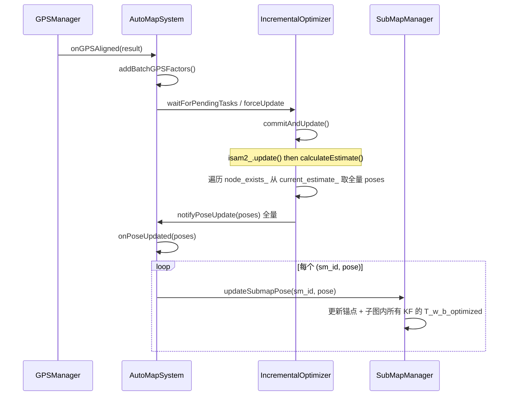

# GPS 对齐后是否刷新所有后端帧位姿 — 逐行分析

## Executive Summary

- **结论**：**会刷新所有后端帧位姿**。后端图以「子图（submap）为节点」，GPS 对齐后通过 `addBatchGPSFactors()` → `forceUpdate()` → `commitAndUpdate()` 触发一次 iSAM2 全量优化；`commitAndUpdate()` 从 **全量** `current_estimate_` 中按 **全部** `node_exists_` 取出位姿，再经 `notifyPoseUpdate(poses)` → `onPoseUpdated(poses)` → 对每个子图调用 `updateSubmapPose(sm_id, pose)`，从而更新所有子图锚点位姿及各自子图内**所有关键帧**的 `T_w_b_optimized`。
- **关键代码路径**：`automap_pro/src/system/automap_system.cpp` `onGPSAligned` → `addBatchGPSFactors` → `automap_pro/src/backend/incremental_optimizer.cpp` `forceUpdate` → `commitAndUpdate` → `notifyPoseUpdate` → `automap_pro/src/system/automap_system.cpp` `onPoseUpdated` → `automap_pro/src/submap/submap_manager.cpp` `updateSubmapPose`。
- **风险/注意**：若 `gps.add_constraints_on_align=false`，则不会走 `addBatchGPSFactors()`，ISAM2 侧不会因 GPS 对齐而刷新位姿（仅 HBA 用 GPS）；此时「后端帧位姿」的刷新依赖后续回环或 HBA 等路径。

---

## 1. 名词与数据流前提

- **后端帧**：在本系统中指 **以子图（submap）为单位的图节点**；每个子图有一个锚点位姿 `pose_w_anchor_optimized`，子图内关键帧的优化位姿为 `T_w_b_optimized`，由锚点 + 相对关系推导（见下）。
- **node_exists_**：在 `automap_pro/src/backend/incremental_optimizer.cpp` 中维护，记录所有已通过 `addSubMapNode` 加入后端的 submap id；与图节点一一对应。
- **current_estimate_**：iSAM2 的 `calculateEstimate()` 返回的**整图**状态，包含图中**所有**变量的当前估计（本代码中即所有子图位姿）。

---

## 2. 调用链概览（GPS 对齐 → 位姿刷新）

---

## 3. 逐段代码分析

### 3.1 入口：onGPSAligned → addBatchGPSFactors

**文件**：`automap_pro/src/system/automap_system.cpp`

- **1716–1762 行**：`onGPSAligned(result)` 在 `result.success` 时置 `gps_aligned_ = true`，发布可视化，然后：
  - **1756**：`addBatchGPSFactors();` — 批量向 ISAM2 添加 GPS 因子并触发后端更新。
  - **1758**：`ensureBackendCompletedAndFlushBeforeHBA();` — 确保后端空闲后再触发 HBA。
  - **1761**：`hba_optimizer_.onGPSAligned(result, all);` — 通知 HBA（与「是否刷新所有后端帧」的 ISAM2 路径独立）。
- **1766–1859 行**：`addBatchGPSFactors()`  
  - 若 `gps.add_constraints_on_align=false` 则直接 return，**不会**给 ISAM2 加因子，也就不会通过本条路径刷新后端位姿。  
  - **1786**：`isam2_optimizer_.waitForPendingTasks();`  
  - **1790–1793**：若存在 pending，先 `forceUpdate()`，把已有 value+prior+odom 提交，避免与 GPS 同批触发 GTSAM 问题。  
  - **1795–1804**：对 `getFrozenSubmaps()` 中有 `has_valid_gps` 的子图逐个 `addGPSFactor(sm->id, pos_map, cov)`，然后 **1804**：`isam2_optimizer_.forceUpdate();` — **这里触发一次带 GPS 因子的全图更新**。  
  - 1810–1850：为历史无 GPS 子图通过 `getHistoricalGPSBindings` 补因子，再次 `forceUpdate()`。

因此，**真正驱动「GPS 对齐后后端位姿刷新」的是 addBatchGPSFactors 里的 forceUpdate()**。

---

### 3.2 forceUpdate → commitAndUpdate（全量位姿来源）

**文件**：`automap_pro/src/backend/incremental_optimizer.cpp`（行号以当前代码为准）

- **430–479 行**：`forceUpdate()` 在持写锁下调用 `commitAndUpdate()`，即把当前 pending 的 graph/values 一次性提交给 iSAM2；异常时返回空 `OptimizationResult{}`。
- **487–783 行**：`commitAndUpdate()`  
  - **首次 update（V5 路径）**：仅注入 values（空 graph），保留 factors 到下次增量 update，`current_estimate_ = values_copy`，避免 GTSAM 首次 linearize/error 的 double free（见 FIX_ISAM2_FIRST_UPDATE_DOUBLE_FREE_20260311.md）。  
  - **常规路径（非首次）**：  
    - `isam2_.update(graph_copy, values_copy);` — 增量更新图。  
    - `current_estimate_ = isam2_.calculateEstimate();` — 取的是 **整图** 的当前估计，包含图中**所有**已存在节点（即所有已加入的 submap）。  
  - 清空 pending：V5 路径仅清空 pending_values_，保留 pending_graph_；常规路径清空 graph+values。  
  - **724–747**：**全量位姿的构造**（先 `exists(key)` 再 `at(key)`，符合 GTSAM 推荐，避免异常控制流）：  
    - `for (const auto& kv : node_exists_)` — 遍历 **所有** 已在图中的子图 id。  
    - 若 `!current_estimate_.exists(SM(id))` 则打日志并 skip，否则 `poses[id] = fromPose3(current_estimate_.at<gtsam::Pose3>(SM(id)));`  
  - **756–760**：健康检查 — 若 `poses.size() != node_exists_.size()` 打 WARN（node_exists_ 与 current_estimate_ 不一致时可见）。  
  - **782**：`notifyPoseUpdate(poses);` — 把 **全量** poses 通知给订阅者。

因此，**每次 commitAndUpdate（包括 GPS 对齐触发的 forceUpdate 后的那次）都会用「全图」的 current_estimate_ 按「全部」node_exists_ 生成 poses 并下发，即刷新的是所有后端子图位姿；若某 id 不在 estimate 中则跳过并打日志，并触发 BACKEND HEALTH 一致性告警。**

---

### 3.3 notifyPoseUpdate → onPoseUpdated（系统层回调）

**文件**：`automap_pro/src/backend/incremental_optimizer.cpp`

- **942–946 行**：`notifyPoseUpdate(poses)` 对 `pose_update_cbs_` 中每个回调调用 `cb(poses)`，其中即包含 `AutoMapSystem::onPoseUpdated`。

**文件**：`automap_pro/src/system/automap_system.cpp`

- **1553–1607 行**：`onPoseUpdated(const std::unordered_map<int, Pose3d>& poses)`  
  - **1557–1565**：对 `poses` 中**每一个** `(sm_id, pose)` 调用 `submap_manager_.updateSubmapPose(sm_id, pose)`，即**每个**在 poses 中的子图都会收到一次位姿更新。  
  - 随后用同一份 poses 更新并发布 `opt_path_`、`publishOptimizedPath`、`publishKeyframePoses`，保证显示与后端一致。

因此，**所有在 commitAndUpdate 中放入 poses 的子图，都会在 onPoseUpdated 中被刷新。**

---

### 3.4 updateSubmapPose：子图锚点 + 该子图内所有关键帧

**文件**：`automap_pro/src/submap/submap_manager.cpp`

- **487–556 行**：`updateSubmapPose(int submap_id, const Pose3d& new_pose)`  
  - **518**：`sm->pose_w_anchor_optimized = new_pose;` — 更新该子图的锚点优化位姿。  
  - **537–540**：  
    - `Pose3d delta = new_pose * old_anchor.inverse();`  
    - `for (auto& kf : sm->keyframes) { kf->T_w_b_optimized = delta * kf->T_w_b; }`  
  - 即：用锚点的变化量 `delta` 一致地更新该子图内**所有关键帧**的 `T_w_b_optimized`，保持子图内相对关系不变。

因此，**一次子图位姿更新会同时刷新该子图下所有关键帧的优化位姿**；结合 3.2，GPS 对齐后会对「所有 node_exists_ 中的子图」做一次这样的更新，等价于刷新了所有后端帧（子图锚点 + 其下所有关键帧）。

---

## 4. 结论汇总

| 问题 | 结论 |
|------|------|
| GPS 对齐后是否刷新**所有**后端帧位姿？ | **是**。刷新范围 = 所有在 `node_exists_` 中的子图（即所有已加入后端的子图）。 |
| 位姿来源？ | `commitAndUpdate()` 中 `current_estimate_ = isam2_.calculateEstimate()` 的**全图**估计，按 **node_exists_** 逐项取 pose，而非仅本批 GPS 涉及的节点。 |
| 关键帧是否一起刷新？ | **是**。每个子图在 `updateSubmapPose` 中用 `delta * T_w_b` 更新该子图内**所有** keyframe 的 `T_w_b_optimized`。 |
| 何时不会刷新？ | 若配置 `gps.add_constraints_on_align=false`，则 `addBatchGPSFactors()` 直接 return，不会通过 ISAM2 路径刷新；位姿刷新依赖回环、HBA 等其他路径。 |

---

## 5. 验证建议

- **日志**：对齐后应看到 `[AutoMapSystem][POSE] updated count=N` 且 N = 当前冻结子图总数（即 node_exists_.size()）；以及 `[ISAM2_DIAG] commitAndUpdate done ... nodes=N` 的 N 与之一致。
- **断点**：在 `commitAndUpdate` 的 `for (const auto& kv : node_exists_)` 处确认 `poses.size() == node_exists_.size()`；在 `onPoseUpdated` 处确认收到的 `poses` 包含所有已冻结子图 id。

---

## 6. 相关文件索引

- 入口与批量 GPS：`automap_pro/src/system/automap_system.cpp`（onGPSAligned 1716，addBatchGPSFactors 1766）
- 后端提交与全量 pose 构造：`automap_pro/src/backend/incremental_optimizer.cpp`（forceUpdate 430–479，commitAndUpdate 487–783，位姿提取 724–747，健康检查 756–760，notifyPoseUpdate 782/985；node_exists_ 维护在 addSubMapNode 168–169）
- 子图与关键帧位姿更新：`automap_pro/src/submap/submap_manager.cpp`（updateSubmapPose 487）
- 数据流说明：`automap_pro/docs/DATA_FLOW_ANALYSIS.md`（2.5、2.6 节）

---

## 7. 变更记录（后端逻辑修复）

| 日期 | 变更 |
|------|------|
| 2026-03-12 | 同步 3.2 节行号至当前 incremental_optimizer.cpp（forceUpdate 430–479，commitAndUpdate 487–783，位姿提取 724–747）；补充 V5 首次路径、exists-before-at 位姿提取、BACKEND HEALTH 一致性检查说明。 |
| 2026-03-12 | 后端代码修复：commitAndUpdate/getAllPoses 位姿提取改为先 `current_estimate_.exists(key)` 再 `at(key)`，避免异常控制流；增加 poses.size() 与 node_exists_.size() 不一致时的 WARN 健康检查。 |
