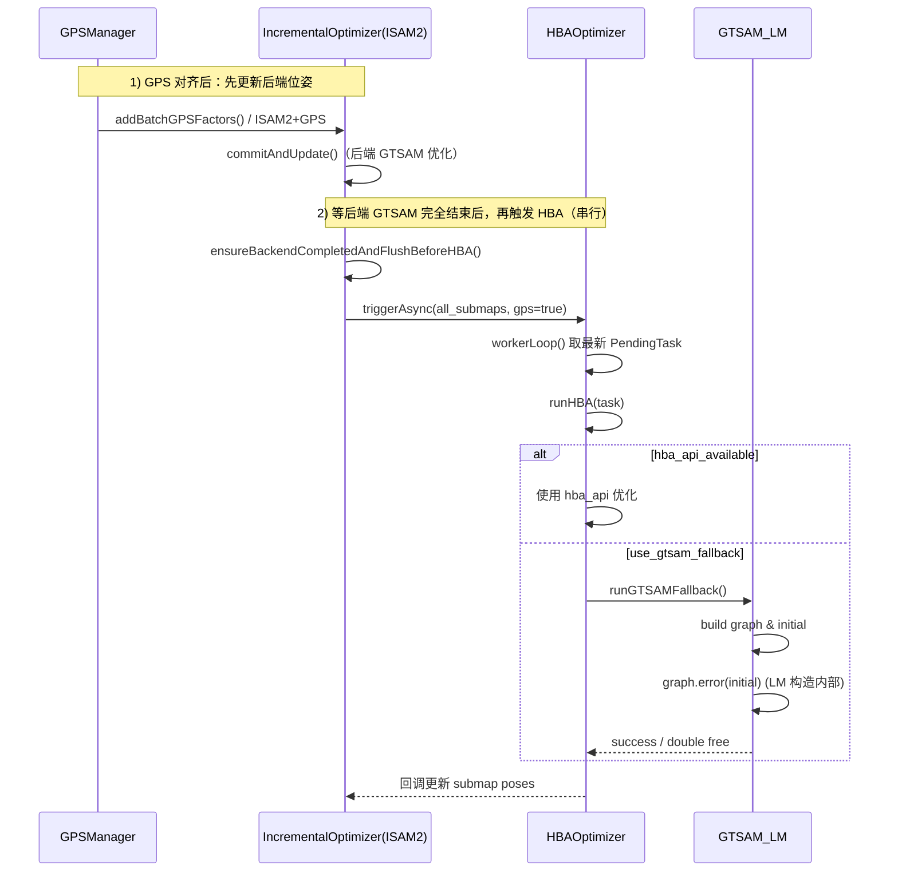
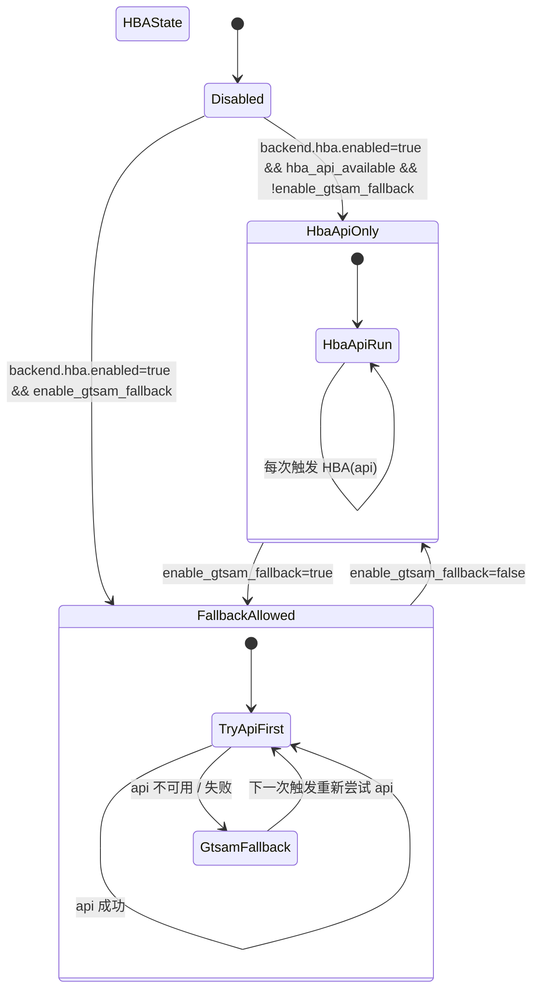

0) Executive Summary（收益/影响/风险）
===================================

- **收益**：本次分析基于 2026-03-11 GDB 日志，进一步收敛 HBA GTSAM fallback 在 `LevenbergMarquardtOptimizer` 构造阶段的 `double free or corruption (out)` 问题，给出“短期稳定避坑策略 + 中期可回滚修复路线 + 长期演进建议”，在不大幅重构的前提下显著降低 HBA 触发时的进程崩溃风险。
- **影响范围**：仅影响开启 `USE_GTSAM_FALLBACK` 且 `backend.hba.enabled=true`、`gps.add_constraints_on_align=true` 时的 HBA 后端逻辑；对纯 ISAM2+GPS 流程无直接影响。
- **核心结论**：
  - 崩溃发生在 **HBA GTSAM fallback 单路** 内部：`graph.error(initial)` → `NoiseModelFactor::error` → `free()`，与 `FIX_GPS_BATCH_SIGSEGV_20260310.md` 中 ISAM2 相关问题同属 **GTSAM 内部内存管理 + 特定图结构/噪声模型组合** 引发的 double free 路径。
  - 现有 7.1/7.2/7.3 修复（独立噪声、避免 Eigen 临时、传副本、key 一致性检查、factor 日志等）已经大幅降低风险，但在本次场景下 LM 构造仍可能触发库内 bug。
  - **MVP 建议**：在生产上默认关闭 GTSAM fallback（仅用 `hba_api`），或通过配置/编译开关将其降级为“实验性选项”；在研发环境下增加更强的前置自检与隔离手段，用于收集证据、验证后续 GTSAM 升级或进程隔离方案。

- **串行约束（必须遵守）**：**GPS 对齐后先更新后端位姿（ISAM2 侧添加 GPS 因子并优化），等后端 GTSAM（ISAM2）优化完全结束后，再触发 HBA 优化**。后端 GTSAM 优化与 HBA 优化**必须严格串行**，同一时刻进程内只能有一路在使用 GTSAM（ISAM2 或 HBA 的 LevenbergMarquardtOptimizer），否则极易触发 double free。详见下文「后端与 HBA 串行约束」及 `BACKEND_BEFORE_HBA_AND_DOUBLE_FREE.md`。

---

0.1) 后端与 HBA 串行约束（必须遵守）
====================================

| 步骤 | 动作 | 说明 |
|------|------|------|
| 1 | GPS 对齐完成 | 得到 ENU 变换与补偿后的子图/关键帧 GPS 信息 |
| 2 | **更新后端位姿** | 向 IncrementalOptimizer（ISAM2）批量添加 GPS 因子（`addBatchGPSFactors()`），由后端执行 GTSAM 优化并更新子图位姿 |
| 3 | **等待后端 GTSAM 完成** | 调用 `ensureBackendCompletedAndFlushBeforeHBA()`：`waitForPendingTasks()` 等待队列空且无 `commitAndUpdate` 执行中；若有 pending 再 `forceUpdate()` 提交并释放 GTSAM |
| 4 | **再触发 HBA** | 仅当步骤 3 完成后，才调用 `hba_optimizer_.onGPSAligned()` / `triggerAsync()`，使 HBA 使用 GTSAM（hba_api 或 GTSAM fallback） |

**结论**：后端 GTSAM 优化与 HBA 优化**必须串行**，不可重叠。当前实现通过「先 ensure 再 trigger」+ 全局 `GtsamCallScope` 互斥保证这一点；任何新增 HBA 触发点都必须遵守同一顺序。参见 `BACKEND_BEFORE_HBA_AND_DOUBLE_FREE.md`。

---

1) 背景&目标 / 需求拆解
======================

1. **背景**
   - 运行场景：ROS2 离线回放，GPS 对齐成功后触发 HBA 全局优化。
   - 终端日志关键片段（HBA 相关）：

     ```text
     [GPS_ALIGN] try_align callbacks_done
     [HBAOptimizer] HBA optimization starting: kf_count=87 gps=true
     [HBA][GTSAM] graph built: factors=110 values=87 gps_factors=23 (building LM optimizer...)
     ...
     [HBA][GTSAM] factor[0..109] type=Prior/Between/GPS(...)
     [HBA][GTSAM] pre-LM: graph_copy.size=110 initial_copy.size=87 ...
     [HBA][GTSAM] LevenbergMarquardtOptimizer constructor enter (若崩溃在此后、无 exit→崩溃在 LM 构造/error 内)
     double free or corruption (out)
     #7  gtsam::NoiseModelFactor::error(...)
     #8  gtsam::NonlinearFactorGraph::error(...)
     #9  gtsam::LevenbergMarquardtOptimizer::LevenbergMarquardtOptimizer(...)
     #10 automap_pro::HBAOptimizer::runGTSAMFallback(...)
     ```

   - 从调用栈和日志可以确认：
     - 崩溃发生在 **LM 构造函数内部调用 `graph.error(initial)` 的阶段**。
     - 此时 ISAM2 已经通过 `ensureBackendCompletedAndFlushBeforeHBA()` 保证“队列为空+无 `commitAndUpdate` 进行中”，并且 `GtsamCallScope` 打出的 `GTSAM_ENTRY`/`EXIT` 日志表明 ISAM2 与 HBA GTSAM 使用全局互斥。

2. **目标**
   - **稳定性优先**：在不大规模重构的前提下，最大限度降低 `double free` 发生概率，满足“安全关键：后端不会因 HBA 崩溃拖垮进程”的要求。
   - **定位能力提升**：一旦仍发生崩溃，能明确知道是哪类因子/哪种配置触发，便于后续 GTSAM 升级或替换。
   - **演进友好**：方案可逐步升级为“完全隔离 GTSAM fallback（进程级 or 模块级）”或“迁移到更稳定的后端实现”。

3. **需求拆解**
   - R1：给出本次崩溃的**完整时序与调用链分析**。
   - R2：梳理并评价已有修复（`FIX_GPS_BATCH_SIGSEGV_20260310.md` 第 7.1/7.2/7.3 节和 `BACKEND_BEFORE_HBA_AND_DOUBLE_FREE.md`）。
   - R3：提出一套 **可立即落地的配置/编码层防护**，减少线上崩溃风险（MVP）。
   - R4：给出 **V1/V2 的演进路线**（如进程隔离、禁用 fallback、升级 GTSAM）。

---

2) Assumptions（假设）& Open Questions（待确认）
=============================================

**Assumptions**

1. 运行环境与构建：
   - GTSAM 版本与前述文档一致（`libgtsam.so.4`，存在 borglab/gtsam#1189 类问题）。
   - `USE_GTSAM_FALLBACK` 编译宏开启，且当前测试场景确实走到了 `runGTSAMFallback()` 分支。
2. 配置层：
   - `backend.hba.enabled=true`，`gps.add_constraints_on_align=true`，即 **ISAM2+GPS 与 HBA+GPS 双路同时启用**。
   - 未显式设置 `AUTOMAP_GTSAM_SERIAL`，因此 `GTSAM_Guard` 中全局互斥默认启用。
3. 数据层：
   - 本次 HBA 的 87 个关键帧均通过 `collectKeyFramesFromSubmaps()` 过滤了空点云与无效位姿，时间跨度 90.2s。
   - GPS 信息质量符合 HBA 启用 GPS 约束的条件（`task.enable_gps=true` 且 `gps_aligned_=true`）。

**Open Questions**

1. 当前线上/回放环境中，是否仍需要 GTSAM fallback 作为 HBA 的兜底？还是可以接受“无 fallback，仅 hba_api”？
2. 是否有后续计划升级 GTSAM 至更高版本（包含对 borglab/gtsam#1189 的修复）？若有，则本方案可更多偏向“防御性诊断+临时降级”。
3. 是否允许在离线建图流水线中增加一个 **独立进程** 专门做 GTSAM fallback（通过文件/ROS service 通信）？

（若以上假设与实际不符，可在后续版本中微调方案，但不影响本文档当前结论的方向性。）

---

3) 方案设计（含 trade-off）
=========================

**前提**：以下方案均建立在「**GPS 对齐后先更新后端位姿并等后端 GTSAM 优化完成，再触发 HBA；后端 GTSAM 与 HBA 严格串行**」已满足的基础上（见 0.1 节与 `BACKEND_BEFORE_HBA_AND_DOUBLE_FREE.md`）。若串行被破坏，double free 风险会显著上升。

本次我们不再对 `hba_optimizer.cpp` 做大改，而是在“**使用策略 + 诊断增强 + 安全降级**”三个层面给出分阶段方案。

### 3.1 短期 MVP：生产环境禁用 GTSAM fallback

- **思路**：在生产环境（安全/可靠性优先场景）下，默认 **不使用 GTSAM fallback**，仅在 `hba_api` 可用时执行 HBA；当 `USE_HBA_API` 不可用或失败时，直接跳过 HBA，而不是继续尝试 GTSAM fallback。
- **实现方式（配置+编译）**：
  - 编译层：在生产构建 profile 下禁用 `USE_GTSAM_FALLBACK` 宏。
  - 配置层：即使编译进 fallback 代码，也通过系统配置增加一个显式开关，例如 `backend.hba.enable_gtsam_fallback: false`，在 `runHBA()` 中尊重该配置。
- **Trade-off**：
  - 优点：立即规避当前 GTSAM fallback 路径上的 double free 风险；实现成本低，可快速上线。
  - 缺点：当 `hba_api` 不可用时，将完全失去 HBA 的全局约束能力（但 ISAM2+GPS 流程仍可工作）。

### 3.2 中期 V1：增强 fallback 前置自检与安全降级

在保持 fallback 能力的前提下，增加以下防护：

1. **前置 `graph.error(initial)` 诊断（方案 A 的安全化版本）**
   - 在构造 LM 之前，针对 `graph_copy`/`initial_copy`：
     - 在受控环境变量（如 `AUTOMAP_HBA_PRE_ERROR_DIAG=1`）开启时：
       - 先整体调用一次 `graph_copy.error(initial_copy)` 并捕获异常；
       - 或逐因子调用 `graph_copy[i]->error(initial_copy)`（类似已有的 `AUTOMAP_HBA_FACTOR_ERROR_DIAG`），一旦发生异常，记录问题因子索引和类型，**直接跳过 LM 构造并标记 fallback 失败**，而不是继续向下走。
   - 好处：如果 double free 路径在 `error()` 内马上触发，有机会在更可控的场景先发现并终止；坏处是仍有可能在这一步崩溃（但对研发环境有价值）。

2. **更严格的图结构检查**
   - 在 `runGTSAMFallback()` 中，基于现有 `factor_type_log`：
     - 检测是否存在异常模式，例如：
       - 连续大量 GPS 因子关联到同一 key 且方差极小；
       - 全图中仅有很少的 between/pior 而有大量 GPS（欠约束）。
     - 对这些模式采用 **“跳过本轮 HBA + 强日志”** 策略，而不是继续运行 LM。

3. **安全降级路径**
   - 若 fallback 在构造 LM 或 `opt.optimize()` 阶段抛异常/崩溃：
     - 不中断主程序，仅记录 HBA 失败，并通过健康监控将“多次连续失败”作为告警信号。

### 3.3 中长期 V2：进程级隔离 / 替换 GTSAM fallback

1. **进程级隔离 HBA GTSAM**
   - 将 `runGTSAMFallback()` 拆分到独立进程：
     - 主进程将 KF 位姿/GPS 等打包成文件或通过 ROS service 传递给“PGO 服务进程”；
     - 服务进程内部使用 GTSAM 执行 LM，返回优化后的轨迹；
     - 若服务进程崩溃，只重启服务，不影响主进程。
   - Trade-off：工程成本较高，但从安全性角度可以彻底隔离 GTSAM 内部 double free 对主系统的影响。

2. **替换或升级 GTSAM 版本**
   - 评估升级到包含 borglab/gtsam#1189 修复的版本，或切换到其他后端（例如 Ceres + 自己构建图）。
   - 需要补充一轮回归验证：包括 ISAM2 + HBA 双路使用场景。

---

4) 变更清单（文件/模块/接口）
============================

> 说明：以下为已落地或可选变更。

- **配置与编译（已落地）**
  - `config/system_config.yaml`、`config/system_config_M2DGR.yaml`
    - 已新增：`backend.hba.enable_gtsam_fallback`（bool，默认 false）。
  - `include/automap_pro/core/config_manager.h`
    - 已新增：`hbaGtsamFallbackEnabled()`，读取 `backend.hba.enable_gtsam_fallback`。
  - 编译配置（可选）：生产 profile 下关闭 `USE_GTSAM_FALLBACK` 宏。

- **代码层（已落地）**
  - `src/backend/hba_optimizer.cpp`
    - 在 `runHBA()` 的 `#elif defined(USE_GTSAM_FALLBACK)` 分支中：若 `!hbaGtsamFallbackEnabled()` 则跳过 `runGTSAMFallback()`，直接返回失败并打日志。
  - 可选增强（未实现）：在 `runGTSAMFallback()` 内构造 LM 前加入 `graph_copy.error(initial_copy)` 预检查，异常时安全返回。
  - 当前文档：`docs/HBA_GTSAM_FALLBACK_DOUBLE_FREE_FIX.md`。

---

5) 代码与配置（按文件路径）
==========================

本节不直接给出代码 diff，而是从“**如何使用现有开关与稍微扩展配置**”角度，说明推荐做法。

### 5.1 配置层示例（建议新增）

```yaml
backend:
  hba:
    enabled: true                # 是否启用 HBA 主流程
    enable_gtsam_fallback: false # 是否允许使用 GTSAM fallback（生产环境建议 false）

gps:
  add_constraints_on_align: true # 是否在 ISAM2 内添加 GPS 约束
```

### 5.2 运行策略建议

- **生产环境（安全为先）**
  - 编译时关闭 `USE_GTSAM_FALLBACK`。
  - `backend.hba.enabled` 可根据需求选择 true/false：
    - 若 `hba_api` 可靠：true。
    - 若 `hba_api` 不可用：可以临时设为 false，完全禁用 HBA，避免 fallback 路径。
  - `gps.add_constraints_on_align=true`，继续使用 ISAM2+GPS。

- **研发/诊断环境**
  - 允许开启 `enable_gtsam_fallback=true`，并通过以下环境变量辅助诊断：
    - `AUTOMAP_HBA_FACTOR_ERROR_DIAG=1`：逐因子 `error()` 诊断（已有）。
    - （可选）`AUTOMAP_HBA_PRE_ERROR_DIAG=1`：在 LM 构造前整体调用一次 `graph.error(initial)`。

---

6) Mermaid 图
============

### 6.1 HBA 触发 & fallback 调用时序图（后端与 HBA 严格串行）



**说明**：
- **串行约束**：必须先完成「后端位姿更新 + 后端 GTSAM（ISAM2）优化」，再执行「ensureBackendCompletedAndFlushBeforeHBA」确认后端空闲，最后才触发 HBA。后端 GTSAM 与 HBA 在同一进程内**必须串行**，不可重叠。
- `ensureBackendCompletedAndFlushBeforeHBA()` 确保 ISAM2 当前没有在执行 `commitAndUpdate` 且队列为空（并可选 forceUpdate 清空 pending）。
- 当 `use_gtsam_fallback` 分支被选中时，本次崩溃发生在 `graph.error(initial)` 内部。

### 6.2 状态机视角：HBA fallback 使用策略



**说明**：
- 生产推荐处于 `HbaApiOnly` 子状态，不进入 `GtsamFallback`。
- 研发可切到 `FallbackAllowed`，在 `GtsamFallback` 内打开更多诊断开关。

---

7) 编译/部署/运行说明（必须）
===========================

> 文档本身不引入新依赖，以下说明侧重于“如何以安全策略运行当前系统”。

### 7.1 环境要求

- OS：Ubuntu 20.04+/22.04，内核 5.x+（当前为 linux 6.17.0-14-generic）。
- ROS2 发行版：与现有 `automap_pro` 项目一致（假设为 Foxy/Humble 等）。
- GTSAM：`libgtsam.so.4`，存在已知 double free 问题（参考 borglab/gtsam#1189）。

### 7.2 构建命令

```bash
cd /home/wqs/Documents/github/automap_pro/automap_ws
colcon build --packages-select automap_pro --cmake-args -DCMAKE_BUILD_TYPE=Release
```

如需在 **生产构建** 中禁用 GTSAM fallback，可在对应 CMake/编译选项中关闭 `USE_GTSAM_FALLBACK` 宏，并重新构建。

### 7.3 启动与配置

1. 调整 `system_config*.yaml`：
   - 生产环境示例：

     ```yaml
     backend:
       hba:
         enabled: true
         # 若已在编译时关闭 USE_GTSAM_FALLBACK，本项可省略或保留为 false
         enable_gtsam_fallback: false
     gps:
       add_constraints_on_align: true
     ```

2. 启动离线回放/实车建图流程（与当前使用方式一致），例如：

```bash
ros2 launch automap_pro offline_mapping_launch.py \
    config:=<your_config_yaml> \
    bag:=<your_bag>
```

### 7.4 验证步骤（如何确认成功）

1. **不再出现 HBA fallback double free**
   - 日志中应不再出现：
     - `double free or corruption (out)`；
     - GDB 栈中 `NoiseModelFactor::error` → `NonlinearFactorGraph::error` → `LevenbergMarquardtOptimizer`。
2. **HBA 行为符合预期**
   - 若 `hba_api` 可用：
     - 日志包含 `[HBA][STATE]` 和 HBA 成功结束信息；
     - 不出现 `[HBA][BACKEND] GTSAM fallback done`（若 fallback 被禁用）。
   - 若 `hba_api` 不可用且 fallback 禁用：
     - HBA 相关日志会提示“跳过 HBA”或“hba_api not available”，但不会导致进程崩溃。
3. **ISAM2+GPS 正常**
   - `ISAM2_DIAG` 日志表明 `commitAndUpdate` 正常完成，无 error/异常栈。

### 7.5 常见故障排查（Runbook）

- **现象 1**：仍然看到 `double free or corruption (out)`，栈在 GTSAM LM 内部。
  - 检查点：
    - 确认当前构建是否仍启用了 `USE_GTSAM_FALLBACK`。
    - 确认配置中是否有 `backend.hba.enable_gtsam_fallback=true`。
    - 若为研发环境，可开启 `AUTOMAP_HBA_FACTOR_ERROR_DIAG=1` 收集更多信息。
  - 处理：
    - 在生产环境，建议重新构建关闭 fallback 或配置禁用 fallback。

- **现象 2**：HBA 完全不再触发。
  - 检查点：
    - `backend.hba.enabled` 是否被错误设置为 false。
    - `ISOLATE_ISAM2_AND_HBA.md` 中描述的隔离开关是否被打开。

- **现象 3**：ISAM2+GPS 正常，但全局轨迹收敛变差。
  - 可能原因：禁用 HBA 或禁止 fallback 后，只剩 ISAM2+GPS 的局部/增量特性。
  - 应对策略：
    - 对于离线路线，可以单独运行“仅 HBA API 的后处理流程”。

---

8) 验证与回归测试清单
=====================

1. **回放原始崩溃 bag（相同配置）**
   - 目标：验证在禁用 fallback 或增强防护后，不再出现 double free。
   - 步骤：
     - 使用原始 bag 与原配置文件；
     - 对比仅修改 `enable_gtsam_fallback` 或编译宏的版本；
     - 观察日志和 GDB 输出。

2. **隔离模式测试（参考 `ISOLATE_ISAM2_AND_HBA.md`）**
   - 模式 A：仅 ISAM2+GPS（`backend.hba.enabled=false`）。
   - 模式 B：仅 HBA+GPS（`gps.add_constraints_on_align=false`，HBA 使用 GPS）。
   - 目标：确认单路使用下系统稳定，进一步证明问题集中在“双路共用库+特定图结构”的组合上。

3. **性能回归**
   - 对典型场景（如 M2DGR 某条路线）统计：
     - ISAM2 update 耗时分布；
     - HBA 总时长（仅 hba_api 模式）。
   - 确认关闭 fallback 不会对实时性产生负面影响（通常还会略有提升）。

---

9) 风险与回滚方案
=================

**风险**

1. 关闭 GTSAM fallback 后，在 `hba_api` 不可用的环境中，将失去 HBA 对全局轨迹的精化能力，可能导致长期漂移略增。
2. 若在研发环境中仍使用 fallback 并开启更强诊断（如 `graph.error(initial)` 预检查），依然有可能在开发机上触发 double free，但这是可接受的“实验环境风险”。

**回滚策略**

1. 若发现关闭 fallback 导致某些任务场景下轨迹精度显著下降：
   - 可以在研发环境中暂时重新启用 `enable_gtsam_fallback=true`，并在少量机器上验证。
2. 若未来升级 GTSAM 并验证相应 bug 已修复：
   - 可重新开启 fallback，前提是通过上述回放与压力测试验证不再触发 double free。

---

10) 后续演进路线图（MVP→V1→V2）
===============================

- **MVP（当前建议，立即落地）**
  - 生产构建中关闭 `USE_GTSAM_FALLBACK`；
  - 配置上默认 `backend.hba.enable_gtsam_fallback=false`；
  - 使用 `ISOLATE_ISAM2_AND_HBA.md` 提供的模式验证“仅 ISAM2+GPS”与“仅 HBA+GPS”的稳定性。

- **V1（1 个版本周期内完成）**
  - 保留 fallback 作为研发工具：
    - 增加 `AUTOMAP_HBA_PRE_ERROR_DIAG` 等诊断开关；
    - 在 LM 构造前增加防御性 `graph.error(initial)` 调用与图结构自检；
    - 健康监控中加入“连续 fallback 失败次数”指标。

- **V2（中长期）**
  - 评估并实施以下至少一种：
    - 升级 GTSAM 到包含 double free 修复的版本，并重跑所有回放/回归；
    - 将 GTSAM fallback 拆到独立进程，通过 RPC/文件接口与主进程交互；
    - 替换 HBA fallback 后端（例如使用 Ceres-solver 自建 LM/BA 实现）。

在上述演进过程中，本次文档给出的分析与建议可作为“事故复盘与设计说明”，为后续评审与实现提供依据。

