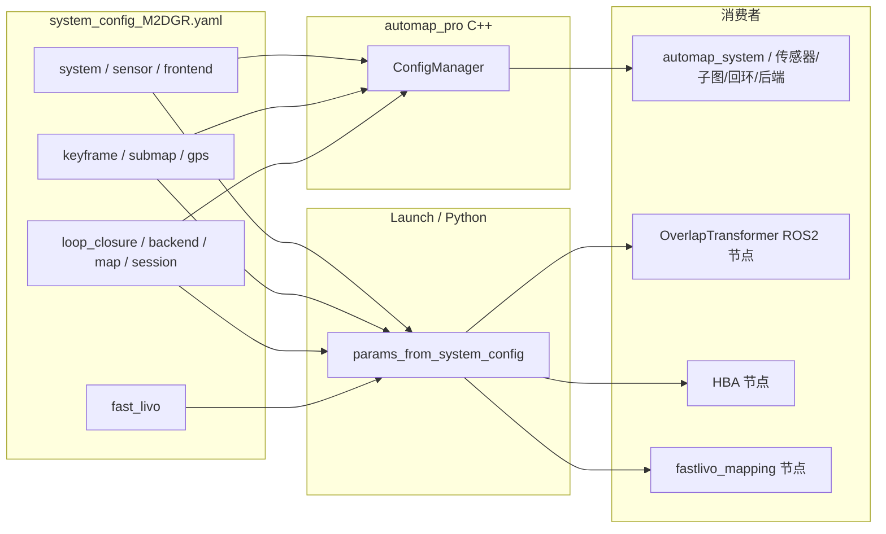

# system_config_M2DGR.yaml 与代码核对报告

**目标**：逐项核对 `config/system_config_M2DGR.yaml` 与各模块读取逻辑，确保每个参数都能被正确读取。

**读者**：研发 / 测试 / 运维  
**结论摘要**：  
- ConfigManager（C++）与 YAML 键已对齐；已补全缺失的 camera / GPS 扩展 / map 统计滤波接口。  
- `params_from_system_config.py` 中 **overlap_transformer** 的 `proj_H`/`proj_W` 已修复：现优先读取顶层 `proj_H`/`proj_W`（与 M2DGR 一致），兼容 `range_image.height/width`。  
- **fast_livo** 参数由 launch 从 `fast_livo` 节生成并传入节点，M2DGR 中该节完整，键与 `_get_fast_livo2_params_impl` 一致。  
- 可选键（如 `sensor.camera`、`gps.chi2_threshold`、`map.statistical_filter_mean_k`）未在 M2DGR 中配置时使用默认值，行为正确。

---

## 1. 配置与读取架构

- **ConfigManager**：单例，`load(yaml_path)` 后通过 `get<T>("dot.path", default)` 读取，键为点分路径（如 `sensor.lidar.topic`）。  
- **params_from_system_config**：`load_system_config(path)` 得到 dict，再经 `get_overlap_transformer_params` / `get_hba_params` / `get_fast_livo2_params` 等生成各节点参数字典；launch 将结果写入临时 params 文件或通过 `parameters=[...]` 传入节点。

---

## 2. 逐节核对表

### 2.1 system

| YAML 键 | 类型 | 读取位置 | 状态 |
|--------|------|----------|------|
| `system.name` | string | ConfigManager::systemName() | ✅ |
| `system.output_dir` | string | ConfigManager::outputDir() | ✅ |
| `system.num_threads` | int | ConfigManager::numThreads() | ✅ |
| `system.log_level` | string | 未在 ConfigManager 中读取；可用于日志初始化 | ⚠️ 可选 |

### 2.2 sensor

| YAML 键 | 类型 | 读取位置 | 状态 |
|--------|------|----------|------|
| `sensor.lidar.topic` | string | ConfigManager::lidarTopic()；get_fast_livo2_params 用 sensor.lidar.topic 覆盖 common.lid_topic | ✅ |
| `sensor.lidar.type` | string | 未在 ConfigManager 中；fast_livo 使用 preprocess.lidar_type | ✅（fast_livo 侧） |
| `sensor.lidar.frame_id` | string | 未在 ConfigManager 中 | ⚠️ 可选 |
| `sensor.imu.topic` | string | ConfigManager::imuTopic()；get_fast_livo2_params 覆盖 common.imu_topic | ✅ |
| `sensor.imu.frame_id` | string | 未在 ConfigManager 中 | ⚠️ 可选 |
| `sensor.imu.frequency` | float | 未在 ConfigManager 中；fast_livo 使用 imu.imu_int_frame 等 | ⚠️ 可选 |
| `sensor.gps.enabled` | bool | ConfigManager::gpsEnabled() | ✅ |
| `sensor.gps.topic` | string | ConfigManager::gpsTopic() | ✅ |
| `sensor.gps.frame_id` | string | 未在 ConfigManager 中 | ⚠️ 可选 |
| `sensor.camera.*` | - | M2DGR 未配置；ConfigManager 已新增 cameraEnabled() / cameraTopic()，缺省为 false / 默认话题 | ✅ |

### 2.3 frontend

| YAML 键 | 类型 | 读取位置 | 状态 |
|--------|------|----------|------|
| `frontend.use_composable_node` | bool | ConfigManager::useComposableNode() | ✅ |
| `frontend.odom_topic` | string | ConfigManager::fastLivoOdomTopic() | ✅ |
| `frontend.cloud_topic` | string | ConfigManager::fastLivoCloudTopic() | ✅ |
| `frontend.kf_info_topic` | string | ConfigManager::fastLivoKFInfoTopic() | ✅ |

### 2.4 keyframe

| YAML 键 | 类型 | 读取位置 | 状态 |
|--------|------|----------|------|
| `keyframe.min_translation` | double | ConfigManager::kfMinTranslation()，keyframe_manager | ✅ |
| `keyframe.min_rotation_deg` | double | ConfigManager::kfMinRotationDeg() | ✅ |
| `keyframe.max_interval` | double | ConfigManager::kfMaxInterval() | ✅ |
| `keyframe.max_esikf_cov_norm` | double | ConfigManager::kfMaxEsikfCovNorm()，keyframe_manager | ✅ |

### 2.5 submap

| YAML 键 | 类型 | 读取位置 | 状态 |
|--------|------|----------|------|
| `submap.max_keyframes` | int | ConfigManager::submapMaxKF()，submap_manager | ✅ |
| `submap.max_spatial_m` | double | ConfigManager::submapMaxSpatial() | ✅ |
| `submap.max_temporal_s` | double | ConfigManager::submapMaxTemporal() | ✅ |
| `submap.match_resolution` | double | ConfigManager::submapMatchRes()，automap_system | ✅ |
| `submap.merge_resolution` | double | ConfigManager::submapMergeRes() | ✅ |

### 2.6 gps（延迟对齐与约束）

| YAML 键 | 类型 | 读取位置 | 状态 |
|--------|------|----------|------|
| `gps.align_min_points` | int | ConfigManager::gpsAlignMinPoints()，gps_manager | ✅ |
| `gps.align_min_distance_m` | double | ConfigManager::gpsAlignMinDist() | ✅ |
| `gps.quality_threshold_hdop` | double | ConfigManager::gpsQualityThreshold() | ✅ |
| `gps.align_rmse_threshold_m` | double | ConfigManager::gpsAlignRmseThresh() | ✅ |
| `gps.good_samples_needed` | int | ConfigManager::gpsGoodSamplesNeeded() | ✅ |
| `gps.add_constraints_on_align` | bool | ConfigManager::gpsAddConstraintsOnAlign() | ✅ |
| `gps.factor_interval_m` | double | ConfigManager::gpsFactorIntervalM()，gps_manager / gps_fusion | ✅ |
| `gps.quality_excellent_hdop` 等 | - | M2DGR 未配置；ConfigManager 已支持，缺省见头文件 | ✅（可选） |

### 2.7 loop_closure

| YAML 键 | 类型 | 读取位置 | 状态 |
|--------|------|----------|------|
| `loop_closure.overlap_threshold` | double | ConfigManager::overlapThreshold()，loop_detector | ✅ |
| `loop_closure.top_k` | int | ConfigManager::loopTopK() | ✅ |
| `loop_closure.min_temporal_gap_s` | double | ConfigManager::loopMinTemporalGap() | ✅ |
| `loop_closure.min_submap_gap` | int | ConfigManager::loopMinSubmapGap() | ✅ |
| `loop_closure.gps_search_radius_m` | double | ConfigManager::gpsSearchRadius() | ✅ |
| `loop_closure.worker_threads` | int | ConfigManager::loopWorkerThreads() | ✅ |
| `loop_closure.overlap_transformer.model_path` | string | ConfigManager::overlapModelPath()；get_overlap_transformer_params | ✅ |
| `loop_closure.overlap_transformer.proj_H` | int | ConfigManager::rangeImageH()；**get_overlap_transformer_params 已修复为优先读此键** | ✅ |
| `loop_closure.overlap_transformer.proj_W` | int | ConfigManager::rangeImageW()；同上 | ✅ |
| `loop_closure.overlap_transformer.fov_up` | float | ConfigManager::fovUp()；get_overlap_transformer_params | ✅ |
| `loop_closure.overlap_transformer.fov_down` | float | ConfigManager::fovDown() | ✅ |
| `loop_closure.overlap_transformer.max_range` | float | ConfigManager::maxRange()；get_overlap_transformer_params | ✅ |
| `loop_closure.overlap_transformer.descriptor_dim` | int | ConfigManager::descriptorDim()；OT 节点可选 | ✅ |
| `loop_closure.teaser.*` | - | ConfigManager::teaserNoiseBound() 等；loop_detector / teaser_matcher | ✅ |

### 2.8 backend

| YAML 键 | 类型 | 读取位置 | 状态 |
|--------|------|----------|------|
| `backend.isam2.relinearize_threshold` | double | ConfigManager::isam2RelinThresh()，incremental_optimizer | ✅ |
| `backend.isam2.relinearize_skip` | int | ConfigManager::isam2RelinSkip() | ✅ |
| `backend.isam2.enable_relinearization` | bool | ConfigManager::isam2EnableRelin() | ✅ |
| `backend.hba.total_layer_num` | int | ConfigManager::hbaTotalLayers()；get_hba_params；HBA 节点 | ✅ |
| `backend.hba.thread_num` | int | ConfigManager::hbaThreadNum()；get_hba_params | ✅ |
| `backend.hba.trigger_every_n_submaps` | int | ConfigManager::hbaTriggerSubmaps()，automap_system / hba_optimizer | ✅ |
| `backend.hba.trigger_on_loop` | bool | ConfigManager::hbaOnLoop() | ✅ |
| `backend.hba.trigger_on_finish` | bool | ConfigManager::hbaOnFinish()，automap_system | ✅ |
| `backend.hba.data_path` | string | ConfigManager::hbaDataPath()；get_hba_params | ✅ |
| `backend.hba.pcd_name_fill_num` / `enable_gps_factor` | - | M2DGR 未配置；get_hba_params 使用默认值 | ✅ |

### 2.9 map

| YAML 键 | 类型 | 读取位置 | 状态 |
|--------|------|----------|------|
| `map.voxel_size` | double | ConfigManager::mapVoxelSize()，map_filter / automap_system | ✅ |
| `map.statistical_filter` | bool | ConfigManager::mapStatisticalFilter()，map_filter | ✅ |
| `map.statistical_filter_mean_k` | int | ConfigManager::mapStatFilterMeanK()（已补全） | ✅ |
| `map.statistical_filter_std_mul` | double | ConfigManager::mapStatFilterStdMul()（已补全） | ✅ |

### 2.10 session

| YAML 键 | 类型 | 读取位置 | 状态 |
|--------|------|----------|------|
| `session.multi_session` | bool | ConfigManager::multiSessionEnabled() | ✅ |
| `session.session_dir` | string | ConfigManager::sessionDir() | ✅ |
| `session.previous_session_dirs` | list<string> | ConfigManager::previousSessionDirs() | ✅ |

### 2.11 fast_livo（整节由 params_from_system_config 生成 ROS2 参数）

| 节 | 说明 | 状态 |
|----|------|------|
| `fast_livo.common` | lid_topic/imu_topic 由 sensor 覆盖；img_topic、img_en、lidar_en、ros_driver_bug_fix 等按键传递 | ✅ |
| `fast_livo.extrin_calib` | extrinsic_T/R、Rcl/Pcl 整体拷贝 | ✅ |
| `fast_livo.camera_calib` | 用于 parameter_blackboard（width/height/fx/fy/cx/cy/k1/k2/p1/p2）；与 M2DGR 键一致 | ✅ |
| `fast_livo.time_offset` | 整体拷贝 | ✅ |
| `fast_livo.preprocess` | lidar_type、scan_line、point_filter_num 等 | ✅ |
| `fast_livo.vio` / `imu` / `lio` / `local_map` / `uav` / `publish` / `evo` / `pcd_save` | 在 `_get_fast_livo2_params_impl` 的 section 列表中，整体拷贝 | ✅ |
| `fast_livo.debug_log` / `fast_livo.debug` | 未列入 section 列表；不写入 params 文件（调试用，可后续按需加入） | ⚠️ 可选 |

---

## 3. 代码变更摘要

| 文件 | 变更 |
|------|------|
| `launch/params_from_system_config.py` | **get_overlap_transformer_params**：优先读取 `overlap_transformer.proj_H` / `proj_W`，若无则用 `range_image.height` / `width`，与 M2DGR 及 ConfigManager 一致。 |
| `include/automap_pro/core/config_manager.h` | 新增：cameraEnabled()、cameraTopic()；gps 扩展（gpsExcellentHDOP、gpsHighHDOP、gpsMediumHDOP、gpsMaxJump、gpsMaxVelocity、gpsChi2Threshold、gpsConsecutiveValid、gpsJumpDetection、gpsConsistencyCheck）；gpsCovExcellent/High/Medium/Low()；mapStatFilterMeanK()、mapStatFilterStdMul()。 |
| `src/core/config_manager.cpp` | 实现 gpsCovExcellent()、gpsCovHigh()、gpsCovMedium()、gpsCovLow()，从 `gps.cov_excellent` 等 3 元序列读取，缺省为合理数值。 |

---

## 4. 验证建议

1. **编译**：`colcon build --packages-select automap_pro`，确认 ConfigManager 与 map_filter、gps_processor、camera_processor、gps_fusion 等链接通过。  
2. **Launch**：使用 `config:=config/system_config_M2DGR.yaml` 启动 offline/online launch，确认无参数缺失或类型错误。  
3. **OverlapTransformer**：启动带外部 descriptor 的 pipeline，确认 proj_H=64、proj_W=900 来自 YAML（日志或节点 param 检查）。  
4. **可选**：在 M2DGR 中增加可选键（如 `sensor.camera.enabled`、`gps.chi2_threshold`、`map.statistical_filter_mean_k`）验证默认值被覆盖。

---

## 5. 风险与回滚

- **风险**：ConfigManager 新增接口若与既有代码默认行为不一致，可能影响其他配置文件（如 nya02）。  
- **回滚**：还原 `config_manager.h` / `config_manager.cpp` / `params_from_system_config.py` 的本次修改即可；YAML 无需改动。

---

## 6. 后续可选

- 在 YAML 中增加注释，标出“仅 fast_livo 使用”或“仅 ConfigManager 使用”的键，便于维护。  
- 将 `system.log_level` 接入日志初始化，使 INFO/DEBUG 等可从配置统一控制。  
- 若需从配置控制 fast_livo 调试行为，可将 `fast_livo.debug_log` / `fast_livo.debug` 加入 `get_fast_livo2_params` 的 section 列表。
