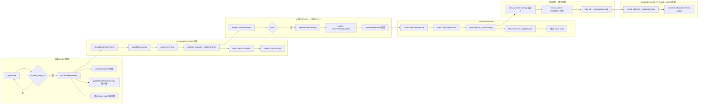

# 后端计算逻辑异步化深入分析

## 0. Executive Summary

| 结论 | 说明 |
|------|------|
| **已异步** | publishGlobalMap（专用线程）、HBA（triggerAsync + 独立 worker）、回环描述子/匹配（LoopDetector desc_workers + match_worker）。 |
| **可异步且对精度影响可接受** | ① 回环时的 **iSAM2 update**（当前在 match_worker 内同步执行，可改为“入队 + 专用优化线程”）；② **publishCurrentCloud**（纯可视化）；③ **publishStatus / publishDataFlowSummary**（轻量，可迁出后端线程）；④ **子图冻结时的 voxel + onSubmapFrozen**（可拆为“先冻结状态 + 异步算 downsampled_cloud 再回调”）。 |
| **不宜异步** | tryCreateKeyFrame 内的 KF 决策/创建、submap_manager_.addKeyFrame、mergeCloudToSubmap、isam2 addSubmapNode/addOdomFactor（保证当前子图/因子图一致）；传感器空闲时的 **最终 HBA wait + 保存**（必须顺序执行）。 |

---

## 1. 后端计算链路总览

---

## 2. 各环节耗时与是否可异步

### 2.1 后端 worker 主循环（关键路径）

| 步骤 | 当前执行位置 | 典型耗时 | 可否异步 | 说明 |
|------|--------------|----------|----------|------|
| tryCreateKeyFrame 整体 | backend worker（持 map_build_mutex_） | &lt;1ms～数十 ms | 否 | KF 决策、子图归属、因子图一致性必须同步 |
| 其中 voxelDownsample(cur_cloud) | 同上 | 数 ms～几十 ms（与点数相关） | 可选 | 若在 feeder 或单独线程预计算 cloud_ds 并随帧传入，可省去 worker 内 voxel；需改帧结构 |
| 其中 publishCurrentCloud | 同上 | 数 ms | **可** | 纯可视化，可投递到 viz 队列由专用线程发布 |
| publishStatus（每 10 帧） | backend worker | 很轻 | **可** | 可迁到“状态发布”线程，仅投递快照 |
| publishDataFlowSummary（每 50 帧） | backend worker | 轻（含多锁读） | **可** | 同上 |
| 地图发布请求（每 100 帧） | 已异步 | 0（仅置位+notify） | 已实现 | - |

### 2.2 addKeyFrame → freeze 链（子图管理器）

| 步骤 | 当前执行位置 | 典型耗时 | 可否异步 | 说明 |
|------|--------------|----------|----------|------|
| mergeCloudToSubmap | addKeyFrame 内（持 submap mutex） | 与 merged 规模相关 | 否 | 合并结果决定后续 isFull/freeze，必须与 addKeyFrame 原子一致 |
| freezeActiveSubmap | addKeyFrame 内（已释放 mutex） | voxel(merged) + 回调链 | **部分可** | 见 2.4 |
| onSubmapFrozen：isam2 addSubmapNode/addOdomFactor | 同上 | 轻 | 否 | 因子图需与当前子图状态一致 |
| loop_detector_.addSubmap | 同上 | 仅入队 | 已异步 | 描述子与匹配在 LoopDetector 线程 |
| hba_optimizer_.triggerAsync | 同上 | 仅入队 | 已异步 | - |

### 2.3 回环检测与 iSAM2 回环更新

| 步骤 | 当前执行位置 | 典型耗时 | 可否异步 | 说明 |
|------|--------------|----------|----------|------|
| Overlap 描述子 | LoopDetector desc_worker | 80～120ms/子图级 | 已异步 | - |
| TEASER++ + ICP | LoopDetector match_worker | 数百 ms/对 | 已异步 | - |
| **onLoopDetected → addLoopFactor** | **match_worker 线程** | **100ms～1s+**（iSAM2 update） | **强烈建议异步** | 当前阻塞 match_worker，延迟下一回环候选处理；位姿更新延迟 1 帧内对精度影响可接受 |

### 2.4 子图冻结“重头”：downsampled_cloud + 回调

| 步骤 | 当前执行位置 | 典型耗时 | 可否异步 | 说明 |
|------|--------------|----------|----------|------|
| voxelDownsample(merged_cloud) → downsampled_cloud | freezeActiveSubmap 内 | 数十～200ms+（大子图） | **可** | 可拆为：先设 state=FROZEN，再异步算 downsampled_cloud，算完后执行 frozen_cbs_（onSubmapFrozen）；回环会稍滞后，精度上可接受 |
| onSubmapFrozen 整链 | 当前在 freeze 内同步 | 见上表 | 若 downsampled 异步则整链后移 | 与上一条一致 |

---

## 3. 推荐异步化项（按收益/实现成本）

### 3.1 高收益：回环时 iSAM2 update 异步化（推荐优先）

- **现状**：`onLoopDetected` 在 **match_worker** 中调用 `isam2_optimizer_.addLoopFactor()` → `commitAndUpdate()`，整段 iSAM2 update 在该线程内同步执行，可能数百 ms～1s+，阻塞下一回环候选处理。
- **建议**：
  - 在 IncrementalOptimizer 或 AutoMapSystem 中增加“回环因子应用队列”和**专用优化线程**。
  - `onLoopDetected` 内只：将 (from, to, rel, info) 入队并 notify，然后 return。
  - 优化线程：取任务 → `addLoopFactor`（或直接 commitAndUpdate）→ `notifyPoseUpdate`，与现有 onPoseUpdated 一致。
- **精度**：回环约束在数十～百 ms 内应用，下一两个子图可能仍用旧位姿，之后即用新位姿；对建图精度影响可接受，且与常见“延迟回环”策略一致。
- **收益**：match_worker 不再被 iSAM2 阻塞，回环吞吐与响应明显提升。

### 3.2 中收益：子图冻结时 downsampled_cloud 异步计算

- **现状**：`freezeActiveSubmap` 内对 `merged_cloud` 做一次 voxel 得到 `downsampled_cloud`，再执行 `frozen_cbs_`（→ onSubmapFrozen → loop_detector_.addSubmap）。大子图时 voxel 可达数十～200ms，全部在 addKeyFrame 返回前完成。
- **建议**：
  - 冻结分两阶段：① 只做 `sm->state = FROZEN`、`publishEvent` 等轻量操作，**不**在这里算 downsampled_cloud，也不调用 frozen_cbs_；② 将 (submap_id 或 SubMap::Ptr) 投递到“冻结后处理”队列。
  - 专用线程：取任务 → voxel(merged_cloud) → 写回 `sm->downsampled_cloud` → 执行 frozen_cbs_（onSubmapFrozen）。
- **约束**：在 downsampled_cloud 就绪并 onSubmapFrozen 执行前，该子图不应被 buildGlobalMap/回环使用；当前 buildGlobalMap 用 keyframes+pose，回环用 downsampled_cloud，只要“加入 loop db”在回调里，顺序可接受。
- **精度**：仅延迟“该子图进入回环库”的时间，不改变因子图或 KF 数据，对建图精度无负面影响。
- **收益**：addKeyFrame（及 tryCreateKeyFrame）在“满子图”那一帧的延迟显著降低，队列堆积与背压减轻。

### 3.3 低～中收益：可视化与状态发布迁出后端线程

- **publishCurrentCloud**：在 tryCreateKeyFrame 内改为“将当前 cloud 指针/拷贝投递到 viz 队列”，由已有或新建的 viz 线程发布；避免每帧数 ms 的发布占用 backend worker。
- **publishStatus / publishDataFlowSummary**：将“取状态快照 + 发布”移到独立线程，backend 每 10/50 帧只写原子或轻量快照（或投递请求），由该线程组包并 publish。进一步降低后端线程抖动。

### 3.4 可选：KF 帧体素降采样前移

- **现状**：backend worker 内对当前帧点云做 `voxelDownsample(cur_cloud, ds_res)` 得到 `cloud_ds`，再传给 `createKeyFrame`。
- **可选方案**：在 feeder 或独立“预处理”线程中，对入队帧提前算好 cloud_ds，在 `FrameToProcess` 中增加 `cloud_ds` 字段；worker 内若已存在则直接用，否则回退到当前逻辑。可节省 worker 内 voxel 时间，代价是帧结构及 feeder/预处理逻辑变更。
- **精度**：不改变 KF 内容，仅计算位置前移，可接受。

---

## 4. 不宜异步或需谨慎的部分

- **tryCreateKeyFrame 的 KF 决策与创建**：shouldCreateKeyFrame、createKeyFrame、submap_manager_.addKeyFrame 必须与“当前帧”严格同步，否则子图归属与一致性无法保证。
- **mergeCloudToSubmap**：决定 active_submap 的 merged_cloud 与 isFull，不能与 addKeyFrame 解耦。
- **isam2 addSubmapNode / addOdomFactor**：在 onSubmapFrozen 内同步执行，保证新子图节点与里程计因子立即进入图，后续 addLoopFactor 才能正确引用节点。
- **传感器空闲结束链**：最终 HBA（wait=true）+ saveMapToFiles 必须顺序执行，且需在 shutdown 前完成，保持当前同步实现即可。

---

## 5. 实现优先级建议（均已实现）

| 优先级 | 项 | 预期收益 | 实现状态 |
|--------|----|----------|----------|
| P0 | 回环时 iSAM2 update 异步化 | 高（match_worker 不再被长时间阻塞） | ✅ 已实现：loop_factor_queue_ + loop_opt_thread_，有界 64+超时 2s 防死锁，满时同步 fallback |
| P1 | 子图冻结 downsampled_cloud 异步 | 中（减少 freeze 峰值延迟） | ✅ 已实现：freeze_post_queue_ + freezePostProcessLoop，两阶段冻结，有界 32+超时 3s 同步 fallback |
| P2 | publishCurrentCloud 异步 | 低～中 | ✅ 已实现：viz_cloud_queue_（max 2）+ viz_thread_，满则丢最旧 |
| P3 | publishStatus / publishDataFlowSummary 迁出 | 低 | ✅ 已实现：status_publish_pending_/data_flow_publish_pending_ + statusPublisherLoop |
| P4 | KF 帧 voxel 前移到 feeder/预处理 | 中（视点云规模） | ✅ 已实现：FrameToProcess.cloud_ds + feederLoop 内预计算，tryCreateKeyFrame 可选 optional_cloud_ds |

---

## 6. 小结

- **已异步**：publishGlobalMap、HBA、回环描述子与几何匹配。
- **建议优先做**：① 回环检测到后的 **iSAM2 update 入队 + 专用优化线程**；② 子图冻结时 **downsampled_cloud 异步计算 + 延迟执行 onSubmapFrozen**。
- **可视与状态**：publishCurrentCloud、publishStatus、publishDataFlowSummary 可迁出后端线程，进一步平滑延迟。
- **保持同步**：KF 创建与归属、mergeCloudToSubmap、isam2 节点/里程计因子添加、以及“传感器空闲 → 最终 HBA + 保存”整条结束链。

以上异步化均在不改变建图语义与一致性的前提下，将“非关键路径”或“可延迟数十～百 ms 应用”的计算移出关键线程，从而显著提高后端与回环的吞吐与实时性。
