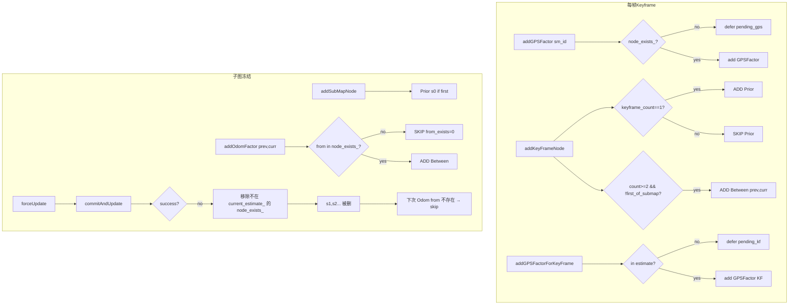

# 后端优化约束添加分析报告（2026-03-17）

## 0. Executive Summary

| 结论 | 说明 |
|------|------|
| **约束类型与添加顺序** | 正常：Keyframe 级 Prior + Between、Submap 级 Prior + Odom + GPS、Keyframe 级 GPS 的添加逻辑与调用顺序符合设计。 |
| **Defer 机制** | 正常：子图节点未入图时 GPS(submap) defer；keyframe 未入 current_estimate_ 时 GPS(keyframe) defer；子图冻结后 flush 并再次 forceUpdate，逻辑正确。 |
| **异常点** | ① 首次 commit（56 节点）成功，第二次 commit（flush 55 个 keyframe GPS）失败，导致 consecutive_failures 递增；② 失败路径中“移除不在 current_estimate_ 的 node_exists_”会删掉本批新加的子图节点，导致后续 addOdomFactor(from, to) 时 from 不存在，子图间 Odom 被 skip，因子图断链。 |
| **回环** | 本 run 日志中无 LOOP_FACTOR / addLoopFactor 记录，未验证回环约束路径。 |

**建议**：保留当前约束添加逻辑；修复“失败后仅移除真正孤立的节点”或“不删除本批刚加入、因 commit 失败而未进入 estimate 的子图节点”，避免子图链断裂。

---

## 1. 约束类型与数据流（代码 + 日志）

### 1.1 约束类型一览

| 约束 | 符号 | 添加位置 | 触发条件 |
|------|------|----------|----------|
| Keyframe Prior | Prior(x_kf) | addKeyFrameNode | keyframe_count==1 或 is_first_kf_of_submap 或 fixed |
| Keyframe Between | Between(x_i, x_{i+1}) | addKeyFrameNode | keyframe_count>=2 且非新子图首帧，last_keyframe_id_>=0 |
| Keyframe GPS | GPS(x_kf) | addGPSFactorForKeyFrame | kf 在 keyframe_node_exists_ 且 current_estimate_.exists(KF(kf))，否则 defer |
| Submap Prior | Prior(s_0) | addSubMapNode | is_first (nodeCount()==0) 或 !has_prior_ |
| Submap Odom | Between(s_i, s_{i+1}) | onSubmapFrozen → addOdomFactor | all_sm.size()>=2，prev 与 current 均非空 |
| Submap GPS | GPS(s_sm) | addGPSFactor | sm_id 在 node_exists_ 且 current_estimate_.exists(SM(sm_id))，否则 defer |
| Loop | Between(s_from, s_to) | addLoopFactor / addLoopFactorDeferred | 回环检测成功，from/to 均在 node_exists_ |

### 1.2 调用顺序（automap_system → incremental_optimizer）

**每帧关键帧（GPS 对齐后）**（`automap_system.cpp` tryCreateKeyFrame → onKeyFrameCreated）：

1. `addGPSFactor(sm_id, pos_map, cov)` → 子图级 GPS（可能 defer）
2. `addKeyFrameNode(kf_id, T_w_b, fixed, is_first_kf_of_submap)` → 节点 + Prior（首帧/新子图首帧）+ Between(prev_kf, curr_kf)
3. `addGPSFactorForKeyFrame(kf_id, pos_map, cov)` → 关键帧级 GPS（可能 defer）

**子图冻结时**（onSubmapFrozen）：

1. `addSubMapNode(sm_id, pose_w_anchor, is_first)` → 子图节点 + Prior(s0)（首子图时）
2. 若 frozen_count>=2：`addOdomFactor(prev->id, submap->id, rel, info)`
3. `forceUpdate()` → 提交当前 pending
4. `flushPendingGPSFactorsForKeyFrames()` → 将 pending_gps_factors_kf_ 加入 pending_graph_
5. 若 flushed_kf>0：再次 `forceUpdate()`
6. `flushPendingGPSFactors()` → 将 pending_gps_factors_（子图级）加入并可能再次 forceUpdate

---

## 2. 日志验证（run_20260317_122530/full.log）

### 2.1 Keyframe 级：Prior + Between

**证据（grep `CONSTRAINT.*prior_kf\|between_kf`）：**

- kf_id=23：`ADDED PriorFactor`，factor_count=1（首帧）。
- kf_id=24：`SKIPPED PriorFactor ... keyframe_count=2 has_prior_=1`，`between_kf from=23 to=24 result=ok factor_count=2`。
- kf_id=25..77：均为 `SKIPPED PriorFactor`，且 `between_kf from=(i-1) to=i result=ok`。

**结论**：Keyframe 链上 Prior 只加一次（kf 23），其余帧仅加 Between，与代码逻辑一致，**添加正常**。

### 2.2 Keyframe 级 GPS：defer → flush

**证据：**

- 每条 keyframe 处理后：`addGPSFactorForKeyFrame_defer kf_id=* reason=not_in_estimate pending_kf=*`（因 current_estimate_ 尚未包含该 KF）。
- 子图 0 冻结后：`flushPendingGPSFactorsForKeyFramesInternal: added 55`，随后 `second forceUpdate success=0`。

**结论**：Keyframe GPS 先 defer，在子图冻结时 flush 55 个，**添加逻辑正常**；第二次 forceUpdate 失败是**提交/优化**问题，不是“约束是否加入 pending”的问题。

### 2.3 子图级 GPS：defer → flush

**证据：**

- 子图 0 未入图前：多次 `gps_submap sm_id=0 result=defer reason=node_not_exists pending=1`。
- 子图 0 冻结且首次 commit 成功后：`gps_submap sm_id=0 result=ok factor_count=112`（子图级 GPS 被 flush 并加入图）。

**结论**：子图级 GPS 在节点不存在时 defer，节点进入图后 flush 并加入，**添加正常**。

### 2.4 子图节点 + Prior(s0) + Odom

**证据：**

- `submap_node_enter sm_id=0 is_first=1` → `addSubMapNode ... prior_added=1`，`odom_enter from=? to=0 result=skip reason=only_one_submap`（仅一个子图，无 Odom，符合预期）。
- `submap_node_enter sm_id=1 is_first=0` → `addSubMapNode`，`odom_enter from=0 to=1`，`addOdomFactor_added from=0 to=1`。
- `submap_node_enter sm_id=2` → `addSubMapNode`，`odom_enter from=1 to=2`，`addOdomFactor_added from=1 to=2`。
- `submap_node_enter sm_id=3` → `addSubMapNode` 时 `node_exists_ size=1`（见下），`addOdomFactor_skip from=2 to=3 reason=node_not_exists`，且日志 `from_exists=0 to_exists=1`。
- `submap_node_enter sm_id=4` → `addOdomFactor_added from=3 to=4`。
- `submap_node_enter sm_id=5` → `addOdomFactor_skip from=4 to=5 reason=node_not_exists`，`from_exists=0 to_exists=1`。

**结论**：子图节点与 Prior(s0)、以及“当 from/to 均存在时”的 Odom 添加逻辑**正确**；sm 3、sm 5 时 Odom 被 skip 是因为 **from 节点已被从 node_exists_ 移除**（见 2.6），不是“该加没加”的笔误。

### 2.5 commit 与 forceUpdate 结果

- 子图 0 冻结：首次 `commitAndUpdate`（56 节点：s0 + x23..x77）→ `commitAndUpdate done ... success=1 nodes=1`（nodes 为 submap 位姿数，与设计一致）。
- 随后 `flushPendingGPSFactorsForKeyFrames` 添加 55 个 keyframe GPS，第二次 `forceUpdate` → `commitAndUpdate done success=0 exception=`。
- 后续子图 1、2 冻结后 commit 均失败（success=0），consecutive_failures 递增。

### 2.6 失败路径导致 node_exists_ 断链（根因）

**日志证据：**

```text
[IncrementalOptimizer][BACKEND][VALIDATION] Removed stale node_exists_ entry: sm_id=2
[IncrementalOptimizer][BACKEND][VALIDATION] Removed stale node_exists_ entry: sm_id=1
```

以及之后：

- 添加 sm_id=3 时：`node_exists_ size=1`（仅剩 s0），`addOdomFactor_skip from=2 to=3 reason=node_not_exists (from_exists=0 to_exists=1)`。
- 添加 sm_id=5 时：同样 `addOdomFactor_skip from=4 to=5 reason=node_not_exists (from_exists=0 to_exists=1)`。

**代码依据**（`incremental_optimizer.cpp` 验证失败分支）：

- 当约束校验失败（或异常后走“移除不在 current_estimate_ 的节点”的逻辑）时，会遍历 `node_exists_`，将**不在 current_estimate_ 中的节点**从 `node_exists_` 中移除。
- 首次 commit 成功后 current_estimate_ 仅有 56 个变量（s0 + 55 个 keyframe）；后续加入的 s1、s2 等子图节点因第二次及以后 commit 失败，**从未进入 current_estimate_**，因此被当作“stale”移除。
- 移除后，`node_exists_` 中只剩 s0（以及之后新加的当前子图节点），导致 addOdomFactor(prev_id, curr_id) 时 **from 不在 node_exists_**，子图间 Odom 被 skip，子图链断裂。

**结论**：约束“该不该加”的判断和“加入 pending / 立即加入图”的流程都是**正常**的；异常在于**失败恢复时对 node_exists_ 的清理过于激进**，把“本批新加、因 commit 失败而未进 estimate 的子图节点”删掉，导致后续 Odom 无法添加，因子图不连通。

---

## 3. 逻辑与代码对应表

| 项目 | 预期行为 | 日志/代码 | 结论 |
|------|----------|------------|------|
| Keyframe Prior | 仅首帧或新子图首帧 | kf 23 ADDED Prior，24..77 SKIPPED | 正常 |
| Keyframe Between | 相邻 KF 间一条 | between_kf from=i to=i+1 result=ok | 正常 |
| Keyframe GPS | 先 defer，flush 时加入 | defer reason=not_in_estimate；flush 55 | 正常 |
| Submap Prior | 首子图 Prior(s0) | sm_id=0 prior_added=1 | 正常 |
| Submap Odom | 相邻子图一条，要求 from/to 存在 | 0→1、1→2、3→4 添加；2→3、4→5 因 from 不存在 skip | 添加逻辑正常；skip 因 node_exists_ 被清理 |
| Submap GPS | 节点不存在则 defer，存在则加 | defer → 后 flush result=ok | 正常 |
| 失败后 node_exists_ | 不应删除“本批新加、未进 estimate 的子图节点” | 当前实现：不在 estimate 即删 → s1,s2 等被删 | 逻辑错误，导致断链 |

---

## 4. 回环约束

本 run 中 grep `LOOP_FACTOR|addLoopFactor|loop_intra|loop from.*to.*result` 无匹配，即未触发回环约束添加路径，无法从本日志验证回环约束是否正常。回环逻辑在 `addLoopFactor` / `addLoopFactorDeferred` 及 optLoop 中处理 LOOP_FACTOR，需在有回环的 bag 或场景下单独验证。

---

## 5. Mermaid：约束添加与失败后断链



---

## 6. 建议修改（针对断链）

- **方案 A（推荐）**：在“移除不在 current_estimate_ 的 node_exists_”时，**只移除“确实没有任何因子约束”的孤立节点**（例如仅出现在 pending 中、且图中无任何 Prior/Between/GPS 指向它的节点），而不是“凡不在 current_estimate_ 就删”。这样本批新加、因 commit 失败而未进 estimate 的子图节点不会立刻被删，后续可重试 commit 或由下次子图冻结带上。
- **方案 B**：失败后**不删除**本批 pending 中对应的**子图节点**（仅保留对 keyframe 的 rollback），仅清空 pending_graph_/pending_values_，避免子图链在单次失败后断掉。
- **方案 C**：在移除前区分“从未成功进入过 estimate 的节点”与“曾进入过、后被优化器剔除的节点”，仅对后者或明确孤立的节点做移除，并打清日志便于排查。

实现时需在 `incremental_optimizer.cpp` 的验证失败/异常分支中，缩小“nodes_to_remove”的判定条件，并加注释说明与 node_exists_/current_estimate_ 一致性的约定。

---

## 7. 验证清单

- [ ] 同 bag 或同配置下，修复 node_exists_ 清理策略后：子图 2→3、4→5 的 Odom 不再被 skip（from_exists=1）。
- [ ] 有回环的 run 中：grep `LOOP_FACTOR|addLoopFactor` 可见添加记录，且 commit 成功时 nodes_updated 包含回环涉及子图。
- [ ] 无失败场景下：所有 Submap Odom 均为 `addOdomFactor_added`，无 `reason=node_not_exists`。

---

*文档基于 `logs/run_20260317_122530/full.log` 与 `incremental_optimizer.cpp`、`automap_system.cpp` 分析。*
