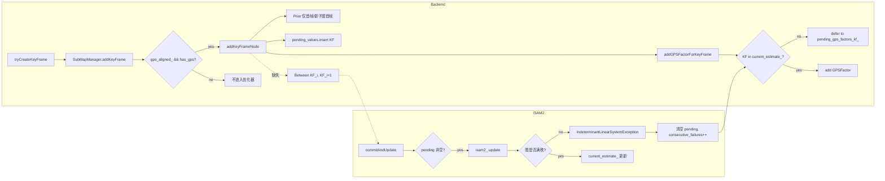

# 后端 ISAM2 日志深度分析报告（2026-03-17）

## 0. Executive Summary

| 项目 | 结论 |
|------|------|
| **子图** | 子图创建/冻结流程正常（sm_id=0,1,2,3…），SubMapManager 与 INTRA_LOOP 触发正常。 |
| **约束添加** | **异常**：Keyframe 级因子图缺少**相邻关键帧之间的里程计约束（BetweenFactor）**，仅靠 Prior(首帧) + GPS 导致系统欠定。 |
| **ISAM2 优化** | **异常**：首次在子图冻结时触发 `IndeterminantLinearSystemException`（变量 x23），之后 `consecutive_failures>=3`，后续所有 commit 被跳过，`current_estimate_` 不再更新。 |
| **根本原因** | Keyframe 节点仅有 Prior（首帧/新子图首帧）与 GPS 因子，**没有 KF(i)→KF(i+1) 的 Between 因子**，线性系统欠定，GTSAM 报错后进入“失败→清空 pending→不再提交”的死循环。 |

**收益**：修复 keyframe 间 Between 因子后，ISAM2 可正常增量更新，轨迹与 GPS 约束可收敛。  
**代价**：需在 `addKeyFrameNode` 中维护上一 keyframe 的 pose 并添加 Between 因子，并保证与现有 Prior/GPS 逻辑兼容。

---

## 1. 背景与目标

- **日志**：`logs/run_20260317_114003/full.log`（约 2 万行，M2DGR street_03 离线回放）。
- **目标**：判断后端各子图是否正常、各环节约束是否正确添加、ISAM2 是否正常，并定位根本原因。

---

## 2. 子图与后端环节概览

### 2.1 子图（SubMapManager）

- 首帧创建 submap：`[SubMapMgr][ADD_KF_STEP] created new submap sm_id=0 (first KF)`。
- 后续 KF 落入当前子图：`sm_id=0` 持续到子图满/触发冻结。
- 子图冻结：`onSubmapFrozen` 被调用，`[PRECISION][SUBMAP] frozen sm_id=0 kf_count=78`，之后出现 `sm_id=1,2,3`。
- **结论**：子图创建、添加关键帧、冻结流程正常；`submap_id`、`kf_idx` 与 INTRA_LOOP 的触发一致。

### 2.2 约束添加环节（按日志与代码）

| 环节 | 预期行为 | 日志/代码现象 | 是否正常 |
|------|----------|----------------|----------|
| Prior | 首帧或新子图首帧添加 PriorFactor | 仅 kf_id=23 时出现 `ADDED PriorFactor`（因 GPS 对齐前未走 addKeyFrameNode） | 逻辑正常，但首 0–22 未进优化器 |
| Keyframe 节点 | 每帧（GPS 对齐后）addKeyFrameNode | `keyframe_node_exists_` 递增，`pending_values` 递增 | 节点添加正常 |
| **Keyframe 间 Between** | 应有 KF(prev)→KF(curr) 的里程计约束 | **代码中无任何 KF 间 Between 的添加** | **异常** |
| GPS（submap） | addGPSFactor(sm_id, …) 或 enqueueOptTask(GPS_FACTOR) | 有 `GPS_FACTOR_ADDED`，部分 defer 因 node 未在 estimate | 部分被 defer 属预期（见下） |
| GPS（keyframe） | addGPSFactorForKeyFrame(kf_id, …) | 大量 `deferred to pending_gps_factors_kf_`（因 current_estimate_ 无该 KF） | 因 ISAM2 失败导致一直未进 estimate |
| 子图 Odom | addOdomFactor(s_i, s_{i+1}) | 在 onSubmapFrozen 中调用，子图间有 Between | 正常 |
| 回环 | addLoopFactor / addLoopFactorDeferred | optLoop 中处理 LOOP_FACTOR，有 SKIP（node 不存在） | 依赖 estimate 先有节点，受 ISAM2 失败影响 |

### 2.3 ISAM2 行为

- **首次 forceUpdate（GPS 对齐时）**：`had_pending=0 pending_factors=0 pending_values=0` → `commitAndUpdate` 直接返回，未做更新（此时 pending 确实为空，因 keyframe 节点在 GPS 对齐之后才开始加入）。
- **子图 0 冻结时**：`onSubmapFrozen` 中第一次有大量 pending（子图节点 + 可能 flush 的 GPS 等），执行 `commitAndUpdate` 时抛出：
  - `Indeterminant linear system detected while working near variable 8646911284551352343 (Symbol: x23)`  
  即 **keyframe 节点 x23 欠约束**。
- **失败后**：`recordOptimizationFailure`，`consecutive_failures=1`，并执行 “Unrecoverable exception detected, clearing pending state”，pending 被清空；后续再达到 3 次失败后，逻辑上会跳过或限制 commit，`current_estimate_` 的 KF 数一直为 0（或停留在失败前状态），所有后续 GPS 因子对 keyframe 的添加均被 defer。
- **结论**：ISAM2 本身调用路径正常，**异常来自因子图结构欠定**，导致 GTSAM 报错，进而触发“清空 pending + 失败计数”的保守策略，形成恶性循环。

---

## 3. 根本原因分析

### 3.1 因子图设计（当前实现）

- **Submap 层**：节点 s0, s1, …；约束包括 Prior(s0)、Between(s_i, s_{i+1})、回环 Between、GPS(s_i)。子图层是约束完整的。
- **Keyframe 层**：节点 x0, x1, …（与 HBA 对齐）；约束仅有：
  - 一个 Prior（全 session 首帧或新子图首帧）；
  - 各 keyframe 上的 GPSFactor(x_i)。
- **缺失**：**任意两个相邻 keyframe 之间没有 BetweenFactor(x_i, x_{i+1})**。即没有用前端里程计或相对位姿把 keyframe 链起来。

### 3.2 为何会 Indeterminant（x23）

- 线性系统未知数为 6N（N 个 keyframe 的 6DoF）。
- 约束数：1 个 Prior(6) + N 个 GPS(3) = 6 + 3N。
- 当 N > 1 时，6 + 3N < 6N，系统欠定；且 GPS 只约束位置不约束姿态，几何上也无法唯一确定所有位姿。
- 报错落在 “variable x23” 上，是因为求解过程中在 x23 处暴露了欠定（具体变量由 GTSAM 内部排序决定）。

### 3.3 为何 addKeyFrameNode 只对 kf_id>=23 可见

- `addKeyFrameNode` 仅在 `gps_aligned_ && has_gps && kf->submap_id >= 0` 时被调用（`automap_system.cpp` 约 1501 行）。
- GPS 在 11:43:31 才对齐，此前创建的 kf_id 0–22 从未进入优化器，因此优化器侧“首帧”是 kf_id=23（带 Prior），之后 24, 25, … 仅带 GPS，无 Between，导致从第二个 keyframe 开始就欠定。

### 3.4 因果链（简要）

```
Keyframe 间无 Between 因子
  → 因子图欠定
  → commitAndUpdate 时 GTSAM 抛出 IndeterminantLinearSystemException (x23)
  → 清空 pending、consecutive_failures 增加
  → 后续 commit 被跳过或不再成功，current_estimate_ 不更新
  → 所有 addGPSFactorForKeyFrame 因“节点不在 current_estimate_”被 defer
  → 子图/回环等依赖 estimate 的逻辑也受影响
```

---

## 4. 约束与数据流（Mermaid）



---

## 5. 修改建议（设计要点）

1. **在 addKeyFrameNode 中增加 keyframe 间 Between 因子**
   - 维护“上一 keyframe”的 id 与 pose（或从 current_estimate_/pending_values_ 取）。
   - 当 `keyframe_count_ > 1` 且非“新子图首帧”时，添加：
     - `BetweenFactor(KF(prev_kf_id), KF(kf_id), rel_pose)`，
     - 其中 `rel_pose = prev_pose^{-1} * init_pose`，噪声模型可用配置的 odom 信息矩阵或固定对角方差。
   - 注意：新子图首帧已有 Prior，可不加 Between（或与子图间 odom 二选一，避免重复约束）。

2. **首 0–22 未进优化器**
   - 若希望轨迹完全一致，可考虑在 GPS 对齐后对“已存在但未进优化器的 keyframe”做一次批量注入或从 SubMapManager 同步位姿；若只保证后续稳定，可仅修复 Between，从 kf_id=23 之后开始形成正确链。

3. **失败恢复与观测**
   - 保留现有 `consecutive_failures` 与清空 pending 的逻辑，避免死循环。
   - 在 `commitAndUpdate` 或 addKeyFrameNode 处增加简单诊断日志（如 keyframe 数、Prior/Between/GPS 因子数），便于再次出现异常时快速确认图结构。

---

## 6. 验证建议

- 修复后回放同一 bag，检查：
  - 不再出现 `IndeterminantLinearSystemException`。
  - `current_estimate_` 的 KF 数量随 keyframe 增加而增加。
  - `pending_gps_factors_kf_` 能被逐步 flush，不再无限增长。
  - 轨迹与 GPS 对齐、子图冻结与 HBA 触发正常。

---

## 7. 风险与回滚

- **风险**：新增 Between 若噪声过紧或 rel_pose 异常，可能影响收敛或稳定性；需用合理信息矩阵或方差。
- **回滚**：若不启用 keyframe 级优化，可配置关闭 keyframe 节点添加或仅保留 Submap 级优化路径。

---

*文档基于 `logs/run_20260317_114003/full.log` 与 `automap_pro/src/backend/incremental_optimizer.cpp`、`automap_system.cpp` 分析。*
