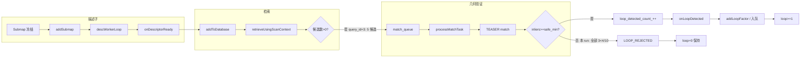

# 后端回环分析报告：run_20260317_150908（日志+代码）

**日志**: `logs/run_20260317_150908/full.log`  
**结论**: 后端回环**流程正常**，但本 run 中**未产生任何被接受的子图间回环约束**（`loop=0`）。根本原因是：**ScanContext 检索到的 5 个候选在 TEASER++ 几何验证阶段全部失败**（inliers=3，低于 min_safe_inliers），因此 `loop_detected_count_` 从未增加，后端 iSAM2 未收到任何回环因子。

---

## 0. Executive Summary

| 项目 | 结论 |
|------|------|
| **后端回环是否正常** | **流程正常**：描述子计算 → 候选检索 → TEASER 入队 → 几何验证 → 拒绝/接受 全链路有日志、无异常。 |
| **loop=0 含义** | 表示 **已接受并加入后端的 inter-submap 回环约束数量**（来自 `loop_detector_.loopDetectedCount()`）。 |
| **根本原因** | 子图 3 冻结时检索到 5 个候选（sm 0,1,2 等），TEASER 对每个候选均得到 **inliers=3、ratio≈0.016、rmse≈3.68m**，全部因 **inliers < min_safe_inliers** 被拒绝，故无约束入图。 |
| **为何 TEASER 全失败** | ScanContext 描述子相似（overlap_score=0.349），但 FPFH+TEASER 几何一致性差：对应点少、内点极少、rmse 大，可能因场景未真正闭环、或点云/参数（体素、FPFH 半径等）导致。 |

---

## 1. 日志与代码对应关系

### 1.1 状态行 `loop=` 的来源

- **代码**: `automap_system.cpp` 第 2486、2514 行：
  - `const int loop_ok = loop_detector_.loopDetectedCount();`
  - 打印 `"[AutoMapSystem][BACKEND] state=... loop=%d ..."` 即 `loop_ok`。
- **LoopDetector**: `loop_detected_count_` 仅在 **inter-submap 回环被接受** 时递增：
  - `loop_detector.cpp` 第 633、773、1341 行：在 `processMatchTask` 中 TEASER 成功并调用 `loop_cbs_` 之前执行 `loop_detected_count_++`。
- **结论**: 本 run 全流程未出现 `[LOOP_ACCEPTED]` / `loop_detected` 回调，故 **loop=0 符合逻辑**。

### 1.2 回环流水线在本 run 中的表现

| 阶段 | 日志关键字 | 本 run 情况 |
|------|------------|-------------|
| 描述子就绪 | `[LOOP_PHASE] stage=descriptor_done submap_id=` | submap 0,1,2,3 均有，正常。 |
| 候选检索 | `stage=candidates_retrieved` | submap 0/1/2 时 db 子图少，未出现多候选；**submap 3** 时出现 **candidate_count=5**。 |
| 入队 TEASER | `stage=match_enqueue` | query_id=3 candidates=5，正常。 |
| 几何验证 | `stage=geom_verify_enter` + `[LOOP_COMPUTE]` | query_id=3 target_id=0 等 5 个候选均进入 TEASER。 |
| TEASER 结果 | `[LOOP_COMPUTE][TEASER] teaser_done` | 所有候选：**inliers=3, ratio=0.016, valid=0**。 |
| 拒绝原因 | `[LOOP_REJECTED]` / `teaser_fail reason=teaser_extremely_few_inliers` | inliers=3 **safe_min=10**（或配置 4），全部拒绝。 |

### 1.3 关键日志片段（子图 3 的 TEASER 全失败）

```
[LOOP_COMPUTE] query_id=3 target_id=0 query_pts=141540 target_pts=127668 overlap_score=0.349
[LOOP_COMPUTE][TEASER] teaser_done inliers=3 corrs=185 ratio=0.016 valid=0
[LOOP_COMPUTE][TEASER] teaser_fail reason=teaser_extremely_few_inliers inliers=3 safe_min=10
[LOOP_REJECTED] query_id=3 target_id=0 reason=teaser_fail_or_inlier_low ... inlier_ratio=0.000 ... rmse=1000000.0
```

- 5 个候选（target_id 0 等）重复上述模式，**无一条出现 `[LOOP_ACCEPTED]` 或 `loop_detected`**。

---

## 2. 根本原因归纳

### 2.1 为何“零回环”

1. **Inter-submap 回环仅在子图冻结后触发**  
   - 子图 0、1、2 冻结时，db 内子图少或 `min_submap_gap` 等过滤后候选为 0 或未入队 TEASER。
2. **第一次出现多候选是在 submap 3 冻结时**  
   - ScanContext 检索到 5 个候选（diff_submap=5），overlap_score=0.349（> overlap_threshold 0.20）。
3. **TEASER 几何验证全部不通过**  
   - FPFH 得到约 185 个对应点，但 TEASER 内点仅 **3** 个，**inlier_ratio≈0.016**，**rmse≈3.68m**，不满足：
     - `inliers >= min_safe_inliers`（配置 4 或默认 10）；
     - 以及 inlier_ratio / rmse 等质量条件。
4. **因此**  
   - 没有任何候选走到 `publishLoopConstraint(lc)` 和 `loop_detected_count_++`，**后端回环数保持为 0**。

### 2.2 为何 TEASER 内点这么少

- **描述子 vs 几何**：ScanContext 认为子图间有重叠（score=0.349），但 FPFH+TEASER 的几何一致性很差：
  - 可能**轨迹并未真正闭环**（street_03 片段未回到同一地点）；
  - 或**视角/遮挡/重复结构**导致描述子相似而几何不一致；
  - 或 **体素/FPFH 参数**（如 voxel_size、max_points、normal_r）使对应点少或错误，进而 inliers 极少。
- 日志中 `[TEASER_DIAG] rmse=3.682m ... p90=6.377m` 也说明配准误差大，几何一致性不足。

---

## 3. 代码路径速查（便于复现与调参）

| 步骤 | 文件与位置 | 说明 |
|------|------------|------|
| loop 计数 | `loop_detector.h:98` `loopDetectedCount()` | 返回 `loop_detected_count_`。 |
| 计数增加 | `loop_detector.cpp:633,773,1341` | 仅在 TEASER 成功并调用 `loop_cbs_` 前 `loop_detected_count_++`。 |
| 拒绝条件 | `teaser_matcher.cpp:412-428` | `inliers < min_safe_inliers_` → 返回失败，不触发回调。 |
| 配置项 | `config_manager.h:323` `teaserMinSafeInliers()` | 默认 10；M2DGR 配置为 4（`system_config_M2DGR.yaml`）。 |
| 状态打印 | `automap_system.cpp:2486,2514` | BACKEND 状态行中的 `loop=%d`。 |

---

## 4. 结论与建议

### 4.1 结论

- **后端回环在“流程”上正常**：描述子 → 检索 → 入队 → TEASER 验证 → 拒绝/接受 全链路运行且日志完整。
- **本 run 零回环的根本原因**：**所有 inter-submap 候选在 TEASER 几何验证阶段均未通过**（inliers 过少、inlier_ratio 过低），因此没有约束加入后端，`loop` 计数保持为 0。

### 4.2 建议（若希望在本数据或类似数据上得到回环）

1. **参数**  
   - 确认实际使用的配置中 `loop_closure.teaser.min_safe_inliers`（当前 M2DGR 为 4；日志出现 safe_min=10 时需确认加载的是哪份配置）。  
   - 可尝试适当放宽 `min_safe_inliers`、`min_inlier_ratio` 或 `max_rmse_m`，并观察误匹配风险。

2. **数据与场景**  
   - 使用**确定有闭环**的 bag 段验证回环链路。  
   - 若 street_03 本段无真实闭环，则“零回环”为预期现象。

3. **几何一致性**  
   - 若希望保留当前严格阈值，可尝试：  
     - 调整 `loop_closure.teaser.voxel_size` / `max_points` 以改善对应点数量与质量；  
     - 或改进 FPFH 半径/正常估计等，提高 TEASER 内点比例。

4. **观测**  
   - 后续 run 可继续用 `grep LOOP_ACCEPTED\|LOOP_REJECTED\|teaser_done` 快速判断是否有回环被接受及 TEASER 拒绝原因。

---

## 5. Mermaid：回环数据流与本 run 结果



本 run 中所有候选均从 **K → L → P**，未经过 M/N/O，故后端回环数始终为 0。

---

## 6. 回环诊断日志说明（grep 精准分析）

为便于**精准分析没有回环的原因**，在回环流水线每一步增加了 `[LOOP_STEP]` 或 `[LOOP_COMPUTE]` 等诊断日志。跑完后用下列 grep 可快速定位卡在哪一阶段。

| 阶段 | grep 关键字 | 含义 |
|------|-------------|------|
| 子图入队 | `[LOOP_STEP] stage=addSubmap` | 子图入描述子队列时的 sm_id、desc_queue、db_size |
| 描述子 worker | `[LOOP_STEP] stage=desc_worker_pop` | 描述子线程弹出任务、use_scancontext |
| 加入 DB | `[LOOP_STEP] stage=addToDatabase` | 加入检索库前后 db_before/db_after |
| 检索参数 | `[LOOP_STEP] stage=retrieve_enter` | 本次检索用的 overlap_threshold、top_k、min_submap_gap |
| 检索结果 | `[LOOP_STEP] stage=retrieve_result` | NO_CAND 或 OK、raw_candidates 数 |
| 无候选 | `[LOOP_STEP] stage=retrieve_result NO_CAND` | 描述子检索无候选（可调 overlap_threshold / ScanContext dist_threshold） |
| 间隔过滤 | `[LOOP_STEP] stage=gap_filter ALL_FILTERED` | 候选全被 min_submap_gap 过滤 |
| 几何预筛 | `[LOOP_STEP] stage=geo_prefilter ALL_FILTERED` | 候选全被 geo_prefilter_max_distance_m 过滤 |
| ScanContext | `[LOOP_STEP] stage=ScanContext_retrieve_enter` | ScanContext 检索参数 dist_threshold、num_candidates、exclude_recent |
| 匹配 worker | `[LOOP_STEP] stage=match_worker_pop` | 匹配线程弹出任务、match_queue_remaining |
| 几何验证阈值 | `[LOOP_STEP] stage=geom_verify_enter` | overlap_threshold、min_inlier_ratio、max_rmse、min_safe_inliers |
| 分数过滤 | `[LOOP_STEP] stage=geom_verify_score_filter` | 经 score 过滤后 valid 数、dropped_low_score |
| TEASER 参数 | `[LOOP_STEP][TEASER] match_enter` | TEASER 使用的 voxel_size、max_points、min_safe_inliers、min_inlier_ratio、max_rmse |
| TEASER 拒绝 | `[LOOP_STEP] stage=TEASER_reject` | reason=teaser_fail_or_inlier_low 或 rmse_too_high |
| 回调入口 | `[LOOP_STEP] stage=onLoopDetected_enter` | 若始终未见，说明没有任何候选通过 TEASER，未触发回调 |
| 同子图/trivial 跳过 | `[LOOP_STEP] stage=onLoopDetected_skip` | reason=same_submap 或 trivial_trans |
| 入队路径 | `[LOOP_STEP] stage=onLoopDetected_enqueue` | path=async_isam2 或 loop_factor_queue |
| 队列满 | `[LOOP_STEP] stage=onLoopDetected_queue_full` | 回环队列满走 sync_fallback |

**建议分析顺序**：先 `grep "LOOP_STEP" full.log` 看完整流水线；若无 `onLoopDetected_enter` 则重点看 `retrieve_result` / `gap_filter` / `geo_prefilter` / `TEASER_reject` 确定卡在检索还是 TEASER。
