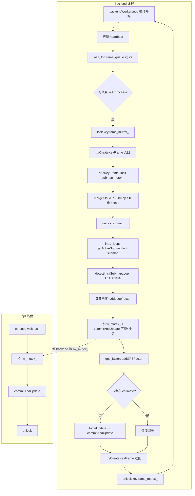

# 后端卡住问题：逐行代码分析

## Executive Summary

- **现象**：HEARTBEAT 报 backend(34s) CRITICAL、frame_queue 堆积、后端长时间无响应。
- **根因**：后端单次 `tryCreateKeyFrame()` 在**持有关键锁**的前提下，可能执行**多次** `commitAndUpdate()`（每次含 `isam2_.update()` + `calculateEstimate()`），以及子图内回环的多次 TEASER 匹配，导致单帧处理时间达数十秒；期间 `keyframe_mutex_` 一直被持有，心跳无法更新、新帧无法处理。
- **最可能卡住位置**（按优先级）：
  1. **intra_loop 阶段**：每检测到一条子图内回环就调用 `addLoopFactor()` → **立即** `commitAndUpdate()`；多条回环 = 多次完整 iSAM2 更新；且 `commitAndUpdate` 成功后会 `flushPendingGPSFactors()` 并可能**再次** `commitAndUpdate()`。
  2. **gps_factor 阶段**：`addGPSFactor()` 若发现节点不在 `current_estimate_` 会调用 `forceUpdate()` → `commitAndUpdate()`，单次即可达 10–30s。
  3. **intra_loop 阶段**：`detectIntraSubmapLoop()` 内对每个候选关键帧做 TEASER++ 配准，子图较大时候选多、单次 TEASER 数百 ms，累加可达数秒至十余秒。
- **建议**：用现有 `BACKEND STEP` / `KF_STEP_TIMING` 日志定位到具体阶段后，对 commit 做“合并/限频”、对子图内回环做“限次数/限时/异步”，并考虑 commit 超时与降级。

---

## 1. 背景与目标

- **目标**：对「后端卡住」做逐行/逐块代码级分析，标出可能阻塞点（持锁、重计算、I/O），并与 HEARTBEAT/STEP 日志对应，给出可落地的缓解与排查建议。
- **范围**：`backendWorkerLoop` → `tryCreateKeyFrame` 整条调用链；重点为 `addKeyFrame`、子图内回环、GPS 因子、图优化 commit。

---

## 2. 调用链总览

### 2.1 后端主循环与持锁关系（Mermaid）



- **关键**：Backend 在 E→S 整段持 `keyframe_mutex_`；在 M、N/P 段持 `rw_mutex_`。若 M 或 P 中 commitAndUpdate 耗时 30s+，则心跳 34s 不更新、frame_queue 只增不减。

### 2.2 文本调用链

```text
backendWorkerLoop()                    [automap_system.cpp 842]
  ├─ backend_heartbeat_ts_ms_.store()  [871]  ← 仅在此更新；若下方阻塞则心跳停
  ├─ runScheduledAlignment()
  ├─ frame_queue_cv_.wait_for(2s) / pop
  └─ will_process 时:
       std::lock_guard keyframe_mutex_ [1069]  ← 持锁直至 tryCreateKeyFrame 返回
       tryCreateKeyFrame(ts, pose, cov, cloud_for_kf, ...)  [1070-1071]
```

**关键**：心跳只在**每次循环开头**更新；一旦进入 `tryCreateKeyFrame`，整个执行期间都**持有 `keyframe_mutex_`**，且不再更新心跳。因此 34s 卡住 = 某次 `tryCreateKeyFrame` 执行了约 34s。

---

## 3. tryCreateKeyFrame 内部分段（与 STEP 对应）

`tryCreateKeyFrame` 在 `automap_system.cpp` 约 1297–1527 行，顺序为：

| 阶段 | 行号（约） | STEP 日志 | 可能阻塞点 |
|------|------------|-----------|------------|
| 体素/降采样 | 1346–1357 | （无独立 STEP） | voxelDownsample 大点云 |
| GPS 查询 | 1369–1397 | （无） | queryByNearestPosition / queryByTimestampEnhanced |
| 创建 KF | 1407–1412 | （无） | createKeyFrame |
| **addKeyFrame** | 1416–1421 | addKeyFrame_enter / addKeyFrame_exit | 见下节 |
| **intra_loop** | 1426–1469 | intra_loop_enter / intra_loop_exit | 见下节 |
| **gps_factor** | 1474–1499 | gps_factor_enter / gps_factor_exit | 见下节 |

下面按「可能卡住」的三大块逐行/逐块分析。

---

## 4. addKeyFrame 阶段（SubMapManager::addKeyFrame）

**文件**：`automap_pro/src/submap/submap_manager.cpp`  
**入口**：75 行 `void SubMapManager::addKeyFrame(const KeyFrame::Ptr& kf)`  
**锁**：109 行 `std::unique_lock<std::mutex> lk(mutex_);`（SubMapManager::mutex_）

### 4.1 逐块说明

- **75–106**：空指针、空点云、位姿非有限检查；失败则 return，不持锁很久。
- **109**：获取 `mutex_`，之后整段在持锁下执行（除 freeze 前主动 unlock）。
- **118–124**：无活跃子图时 `createNewSubmap(kf)`，轻量。
- **141–165**：  
  - 将 KF 加入 `active_submap_->keyframes`，更新 t_end、锚定、GPS 中心。  
  - **163**：`mergeCloudToSubmap(active_submap_, kf)`：  
    - 若 `merged_cloud->size() > kDownsampleThreshold` 会先对整块 `merged_cloud` 做 `utils::voxelDownsample`（447–456），再做位姿变换与点云 push_back（481–489）。  
    - **阻塞风险**：子图点云很大时，单次 voxel + 逐点 merge 可能数百 ms～数秒，一般不会到 30s，但会拉高 addKeyFrame_exit 的 duration_ms。
- **186–211**：子图满时 `isFull(active_submap_)`：  
  - **199**：`lk.unlock()`，然后调用 `freezeActiveSubmap(to_freeze)`（202），再 `lk.lock()`（211）。  
  - **freezeActiveSubmap**（269–334）：  
    - 优先将子图放入 `freeze_post_queue_`，由后台线程做 voxel + 回调；若队列满则 `freeze_post_cv_.wait_until(..., 3s)`（287–293）等待，或超时后走**同步 fallback**（306–318）：当前线程做 voxel + 执行所有 `frozen_cbs_`（含 `onSubmapFrozen`）。  
  - **阻塞风险**：  
    - 队列满时最多阻塞约 **3s**（wait_until 3s 或条件满足）。  
    - 同步 fallback 时，`onSubmapFrozen` 会执行 `isam2_optimizer_.addSubMapNode`、`getFrozenSubmaps()`、`isam2_optimizer_.addOdomFactor`（automap_system.cpp 1552–1572）。这些只加因子/节点，**不**调用 `commitAndUpdate()`，但 getFrozenSubmaps、addSubMapNode、addOdomFactor 会拿 `IncrementalOptimizer::rw_mutex_`，若与 opt 线程争锁会有等待。  
  - 整体上 addKeyFrame 段更可能贡献 **数秒**（merge + 冻结等待/同步），而不是单点 34s。

**结论**：addKeyFrame 可能拉高单帧耗时（尤其 merge + 冻结同步路径），但 34s 级卡住更可能来自后面的 intra_loop 或 gps_factor 中的 **commitAndUpdate**。

---

## 5. intra_loop 阶段（子图内回环）

**文件**：`automap_system.cpp` 1426–1469，`loop_detector.cpp` 859–1173  
**锁**：`getActiveSubmap()` 内 `SubMapManager::mutex_`（submap_manager.cpp 623–625）；回环加因子时 `IncrementalOptimizer::rw_mutex_`。

### 5.1 流程概览

- **1427**：`submap_manager_.getActiveSubmap()` → 持 submap `mutex_` 取 `active_submap_`。
- **1429–1435**：取当前子图最后一帧索引 `query_idx = active_sm->keyframes.size() - 1`，若 ≥0 则调用 `loop_detector_.detectIntraSubmapLoop(active_sm, query_idx)`。
- **1436–1462**：对每个检测到的回环 `lc`，在 **backend 线程** 内：
  - 计算 `node_i` / `node_j`（子图内关键帧编码）；
  - `isam2_optimizer_.addSubMapNode(node_i, ...)`、`addSubMapNode(node_j, ...)`；
  - **isam2_optimizer_.addLoopFactor(node_i, node_j, ...)**。

### 5.2 detectIntraSubmapLoop 可能阻塞点（loop_detector.cpp）

- **916–921**：若描述子数量与 keyframes 不一致，调用 `prepareIntraSubmapDescriptors(submap)`（FPFH/fallback 为子图内所有关键帧算描述子）。**阻塞风险**：子图大时一次准备可能数秒。
- **972–1056**：对每个历史关键帧 `i < query_keyframe_idx`：  
  - 时间/索引/描述子相似度过滤；  
  - 通过则 **1052**：`teaser_matcher_.match(query_cloud, cand_cloud)`。  
  - **阻塞风险**：每个候选一次 TEASER++，单次常为数百 ms；候选多时（例如 20 个）可达数秒到十余秒。
- **1058–1056**：每检测到一条回环就 `results.push_back(lc)`，并 publish/callback；**不在此处**加因子。因子是在 automap_system.cpp 1440–1458 的 for 循环里加的。

### 5.3 关键：每条回环都触发一次 commitAndUpdate（incremental_optimizer.cpp）

- **328–331**：`addLoopFactor` 在持 `rw_mutex_` 下向 `pending_graph_` 加入 BetweenFactor，然后 **348**：`return commitAndUpdate();`  
  → **每调用一次 addLoopFactor，就立即执行一次完整 commitAndUpdate()**。
- **705–1101**：`commitAndUpdate()` 内：  
  - 若 pending 非空且非“单节点延迟”场景，则执行 `isam2_.update(graph_copy, values_copy)`（894/950）、`current_estimate_ = isam2_.calculateEstimate()`（958）。  
  - **1084–1091**：若本次 update 成功且 `res.nodes_updated > 0`，会调用 `flushPendingGPSFactors()`，若有新加 GPS 因子则**再次** `commitAndUpdate()`。  
  → 单次 addLoopFactor 可能触发 **1～2 次** 完整 iSAM2 更新。
- **阻塞风险**：  
  - `isam2_.update()` / `calculateEstimate()` 在图变大、重线性化时可能单次 **10–30s**。  
  - 若单帧检测到 2～3 条子图内回环，就会连续 2～3 次（甚至 6 次）commit，**总时间 30s+ 完全可能**，且全程 backend 持 `keyframe_mutex_`。

**结论**：intra_loop 阶段最可能造成 34s 级卡住的两点：  
1）**多次 addLoopFactor → 多次 commitAndUpdate**（及可能的二次 commit 因 flushPendingGPSFactors）；  
2）**detectIntraSubmapLoop** 内大量 TEASER 匹配（及可能的 prepareIntraSubmapDescriptors）。

---

## 6. gps_factor 阶段

**文件**：`automap_system.cpp` 1474–1499，`incremental_optimizer.cpp` 363–527  

### 6.1 流程

- **1475–1494**：若 `gps_aligned_ && has_gps && kf->submap_id >= 0`：  
  - 计算 `pos_map`、`cov`；  
  - 若 `asyncIsam2Update()` 则 `enqueueOptTask(GPS_FACTOR, ...)`（只入队，不阻塞）；  
  - 否则 **1492**：`isam2_optimizer_.addGPSFactor(kf->submap_id, pos_map, cov)`。

### 6.2 addGPSFactor 可能阻塞点（incremental_optimizer.cpp 363–527）

- **369–374**：获取 `rw_mutex_`；若与 opt 线程或 backend 其他路径争锁，会有等待（已有 LOCK_DIAG 日志 >100ms）。
- **383–389**：若 `node_exists_.find(sm_id) == node_exists_.end()`，仅把因子放入 `pending_gps_factors_` 并 return，**不**调用 commit。
- **396–424**：若节点在 `node_exists_` 但 **不在** `current_estimate_`（例如首节点被 DEFER）：  
  - **402**：`lk.unlock()`；  
  - **403**：`forceUpdate()`；  
  - **413**：`lk.lock()`。  
  - **forceUpdate()**（639–696）：持 `rw_mutex_` 调用 **commitAndUpdate()**（660/667）。  
  - **阻塞风险**：单次 forceUpdate → commitAndUpdate 即可达 **10–30s**，且发生在 backend 线程、在 addGPSFactor 返回前，因此会直接拉高 gps_factor_exit 的 duration_ms。
- **426–518**：若节点已在 current_estimate_，仅向 `pending_graph_` 添加 GPSFactor，**不**在此处 commit；commit 由后续的 opt 线程或某次 commitAndUpdate（如回环触发的）统一做。

**结论**：gps_factor 阶段若走到「节点不在 current_estimate_ 而触发 forceUpdate()」分支，单次就可能造成 10–30s 卡住，与 HEARTBEAT 34s 一致。

---

## 7. 锁与线程关系（避免误判死锁）

- **Backend 线程**：  
  - 持 `keyframe_mutex_` 进入 `tryCreateKeyFrame`；  
  - 在 tryCreateKeyFrame 内会依次：拿 SubMapManager::mutex_（addKeyFrame、getActiveSubmap）、拿 IncrementalOptimizer::rw_mutex_（addSubMapNode、addLoopFactor、addGPSFactor/forceUpdate）。  
  - 同一线程内锁顺序固定：keyframe_mutex_ → submap mutex_ → rw_mutex_，不会自死锁。
- **opt 线程**（optLoop）：  
  - 从队列取任务后持 `rw_mutex_` 执行 LOOP_FACTOR / GPS_FACTOR 等，内部调用 commitAndUpdate。  
  - 若 backend 正在 addLoopFactor（持 rw_mutex_ 且 commitAndUpdate 中），opt 线程会阻塞在 rw_mutex_ 上，不会造成“两处同时 commit”，但 backend 的 commit 会拖很久。
- **freeze post 线程**：  
  - 执行 voxel + onSubmapFrozen；onSubmapFrozen 里会 getFrozenSubmaps、addSubMapNode、addOdomFactor（拿 rw_mutex_）。  
  - 若 backend 在 addKeyFrame 的 freeze 同步路径里执行 onSubmapFrozen，则是在 backend 线程执行，同样不会形成死锁，只可能拉长 addKeyFrame 时间。

**结论**：34s 卡住是**长时间计算/阻塞**导致，不是经典 AB-BA 死锁；心跳停是因为整个 34s 内都未从 tryCreateKeyFrame 返回，从而未回到循环开头更新心跳。

---

## 8. 与 STEP / HEARTBEAT 日志的对应关系

- 若日志出现：  
  - `step=tryCreateKeyFrame_enter` 后长时间无 `tryCreateKeyFrame_exit` → 卡在 tryCreateKeyFrame 内。  
  - 有 `addKeyFrame_enter` 无 `addKeyFrame_exit` → 卡在 addKeyFrame（merge 或 freeze）。  
  - 有 `intra_loop_enter` 无 `intra_loop_exit` → 卡在子图内回环（detectIntraSubmapLoop 或后续 addLoopFactor/commitAndUpdate）。  
  - 有 `gps_factor_enter` 无 `gps_factor_exit` → 卡在 addGPSFactor（含可能的 forceUpdate）。
- 若出现 `intra_loop_exit duration_ms=32000` 等，则 32s 几乎全部在 intra_loop 段（TEASER + 多次 commit）。
- HEARTBEAT 的 34s 表示：自上次循环开头更新心跳以来已过 34s，即上一帧的 tryCreateKeyFrame 总耗时约 34s。

**建议**：复现时用：

```bash
grep -E "BACKEND STEP|KF_STEP_TIMING|HEARTBEAT|ISAM2_DIAG|commitAndUpdate|addLoopFactor" logs/run_xxx/full.log
```

根据最后一条 STEP 与 duration_ms 确定是 addKeyFrame / intra_loop / gps_factor 中哪一段占满 34s。

---

## 9. 结论与缓解建议

### 9.1 最可能卡住位置（按优先级）

1. **intra_loop**：  
   - 每条子图内回环调用 `addLoopFactor()` → 立即 `commitAndUpdate()`，且成功后可能再 `flushPendingGPSFactors()` → 再次 `commitAndUpdate()`。  
   - 多条回环 × 每条约 10s ≈ 30s+，且伴随 `detectIntraSubmapLoop` 中大量 TEASER 与可能的一次 prepareIntraSubmapDescriptors。
2. **gps_factor**：  
   - `addGPSFactor()` 在“节点不在 current_estimate_”时调用 `forceUpdate()` → 单次 `commitAndUpdate()` 即可 10–30s。
3. **addKeyFrame**：  
   - mergeCloudToSubmap（大子图 voxel + merge）、freeze 同步路径（3s 等待或 voxel+回调）可能贡献数秒，一般不是单点 34s。

### 9.2 缓解与排查建议

| 方向 | 措施 | 说明 |
|------|------|------|
| 定位 | 保留/加强 STEP、KF_STEP_TIMING、ISAM2_DIAG 日志 | 用 duration_ms 精确定位到 addKeyFrame / intra_loop / gps_factor。 |
| 合并 commit | 子图内回环：先收集本帧所有 loop 因子，最后**只调用一次** commitAndUpdate | 避免「一条回环一次 commit」；可显著缩短 intra_loop 总时间。 |
| 限频/限次 | 子图内回环：每帧最多添加 N 条回环（如 1），或只取置信度最高的一条 | 降低 commit 次数与 TEASER 候选数。 |
| 异步/限时 | 子图内回环：将 detectIntraSubmapLoop 或「检测+加因子」放入 opt 队列或独立线程，并设超时/上限 | 避免单帧在 backend 线程做大量 TEASER + 多次 commit。 |
| GPS 路径 | 首节点 defer 时避免在 addGPSFactor 内同步 forceUpdate；改为仅 defer，由后续首个子图冻结或定时 flush 时再 commit | 减少在 gps_factor 阶段的长时间阻塞。 |
| 超时与降级 | 对 commitAndUpdate 或 forceUpdate 做 wall-clock 超时（如 15s），超时则跳过本次 update、打日志、可选 ISAM2 reset | 防止单帧无限拉长，配合现有 >60s 重置逻辑。 |
| 锁与队列 | 已避免同锁重入；可考虑将「加因子」与「commit」解耦，commit 仅在 opt 线程或定时执行，backend 只入队 | 需谨慎设计，避免与现有 opt 队列语义冲突。 |

### 9.3 验证

- 回放同一 bag，对比改动前后：  
  - 同一时刻的 `BACKEND STEP … duration_ms`、`KF_STEP_TIMING`；  
  - HEARTBEAT 间隔是否仍出现 30s+。  
- 若实施「子图内回环只 commit 一次」：检查回环约束是否仍正确加入、轨迹/地图是否正常。

---

## 10. 关键代码索引（便于逐行对照）

| 位置 | 文件 | 行号（约） | 说明 |
|------|------|------------|------|
| 循环心跳 | automap_system.cpp | 870-872 | 仅此处更新 backend_heartbeat_ts_ms_ |
| 持 keyframe_mutex_ 调用 tryCreateKeyFrame | automap_system.cpp | 1069-1072 | 整段 tryCreateKeyFrame 持锁 |
| addKeyFrame STEP | automap_system.cpp | 1416-1421 | addKeyFrame_enter/exit |
| intra_loop STEP | automap_system.cpp | 1426-1469 | intra_loop_enter/exit，内层 addLoopFactor |
| gps_factor STEP | automap_system.cpp | 1474-1499 | gps_factor_enter/exit |
| addKeyFrame 实现 | submap_manager.cpp | 75-241 | mutex_、mergeCloudToSubmap、freeze 分支 |
| freezeActiveSubmap | submap_manager.cpp | 269-334 | 队列满 3s 等待、同步 voxel+回调 |
| getActiveSubmap | submap_manager.cpp | 623-626 | 持 mutex_ 返回 active_submap_ |
| detectIntraSubmapLoop | loop_detector.cpp | 859-1173 | prepareIntraSubmapDescriptors、TEASER 循环 |
| addLoopFactor → commitAndUpdate | incremental_optimizer.cpp | 275-348, 705-1101 | 每回环一次 commit；成功后 flushPending 可能再 commit |
| addGPSFactor、forceUpdate | incremental_optimizer.cpp | 363-527, 639-696 | 节点不在 estimate 时 forceUpdate |
| flushPendingGPSFactors 后再 commit | incremental_optimizer.cpp | 1084-1091 | 第二次 commitAndUpdate |

以上为后端卡住的逐行/逐块分析与结论，可直接用于复现定位与改动设计。
