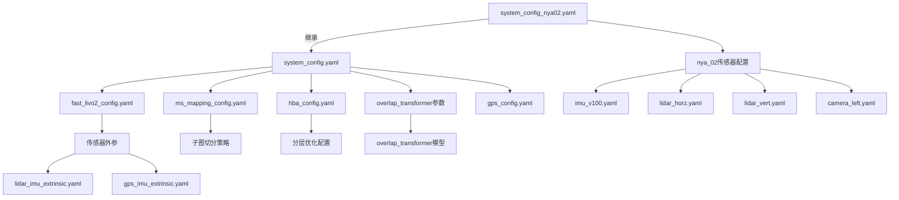

# AutoMap-Pro 工程配置文件汇总

> 生成时间: 2026-03-01 | 更新: 2026-03-03（重构后路径说明）
> 路径均以**仓库根目录**为基准；modular 子模块位于 `automap_pro/src/modular/`（如 HBA-main、fast-livo2-humble、overlap_transformer_ros2）。
> 推荐入口：**automap_start.sh**，唯一主配置：**automap_pro/config/system_config.yaml**。
> 配置文件总数: 85个（含第三方依赖、构建产物）

---

## 0. Executive Summary

### 结论与收益
- **当前状态**: 工程包含85个配置文件，分布在多个子项目中，部分为构建产物和第三方依赖配置
- **核心配置**: 17个核心业务配置文件，涵盖系统、传感器、算法模块等关键参数
- **单一配置源**: **overlap_transformer_ros2、HBA-main、fast-livo2-humble** 的全部参数已统一从 `system_config.yaml` 读取，参数唯一不重复
- **配置与数据一致**: `system_config.yaml` 中传感器话题与内外参与建图数据 `data/automap_input/nya_02_slam_imu_to_lidar` 一致，建图启动直接使用
- **收益**: 通过汇总配置，便于快速理解系统架构、参数调优、故障排查和新手快速上手
- **风险**: 部分配置存在硬编码路径（如 `/home/jhua`），部署时需注意替换

### 0.1 全工程只读一次配置、同一源

- **约定**: 全工程唯一配置文件（如 `system_config_M2DGR.yaml`）由 launch 指定；**前端 fast-livo 与后端 automap_system 均从该同一源获取参数**，无第二份配置来源。
- **前端 fast-livo**: Launch 在启动时读一次 `config` 指向的 YAML，用 `params_from_system_config.load_system_config(config_path)` 与 `get_fast_livo2_params(system_config)` 生成 fast_livo 节点所需参数字典，并写入临时 YAML 供 `fastlivo_mapping` 加载。lid_topic / imu_topic 等来自 `sensor.*`，其余来自 `frontend.fast_livo2` 或顶层 `fast_livo`。**不单独维护 fast_livo 配置文件**，与后端同源。
- **C++ 进程内（后端/回环等）**: 每个进程内配置**只加载一次**，由入口调用 `ConfigManager::instance().load(config_file)`；前端适配（LivoBridge）、后端、回环等**不再单独读 YAML**，统一通过 `ConfigManager::instance()` 取参。
- **单源守卫**: `ConfigManager` 在首次成功 `load()` 后记录路径；若再次 `load(另一路径)` 会抛异常。同路径重复调用视为幂等。
- **入口**:
  - **单体节点（automap_system）**: `AutoMapSystem::loadConfigAndInit()` 从 ROS 参数 `config_file` 取路径并调用 `ConfigManager::instance().load(config_path)`，仅此一处加载；launch 传入的 `config_file` 与 `config` 为同一路径。
  - **独立节点（map_builder_node / optimizer_node 等）**: 各节点在 `main()` 中根据参数 `config` 调用 `ConfigManager::instance().loadFromFile(config_path)`，同一配置文件路径由 launch 统一传入。
- **查询**: `ConfigManager::isLoaded()`、`ConfigManager::configFilePath()` 可判断/获取当前唯一配置源。

---

## 1. 配置文件分类清单

### 1.1 核心业务配置（17个）

| 序号 | 配置文件 | 用途 | 优先级 |
|------|----------|------|--------|
| 1 | `automap_pro/config/system_config.yaml` | 系统主配置（默认在线模式） | P0 |
| 2 | `automap_pro/config/system_config_nya02.yaml` | nya_02数据集专用配置（离线模式） | P0 |
| 3 | `automap_pro/config/logging.yaml` | 日志系统配置 | P0 |
| 4 | `automap_pro/config/gps_config.yaml` | GPS融合配置 | P1 |
| 5 | `automap_pro/config/ms_mapping_config.yaml` | 多会话建图配置 | P1 |
| 6 | `automap_pro/config/hba_config.yaml` | 分层BA后端配置 | P1 |
| 7 | `automap_pro/config/fast_livo2_config.yaml` | 前端里程计配置 | P0 |
| 8 | `automap_pro/config/sensor_config/gps_imu_extrinsic.yaml` | GPS-IMU外参 | P1 |
| 9 | `automap_pro/config/sensor_config/lidar_imu_extrinsic.yaml` | LiDAR-IMU外参 | P1 |
| 10 | `automap_pro/src/modular/overlap_transformer_ros2/config/descriptor_params.yaml` | 回环检测描述子参数 | P1 |
| 11 | `automap_pro/src/modular/HBA-main/HBA_ROS2/config/hba.yaml` | HBA优化器主配置 | P1 |
| 12 | `automap_pro/src/modular/HBA-main/HBA_ROS2/config/cal_MME.yaml` | HBA数据预处理配置 | P2 |
| 13 | `automap_pro/src/modular/HBA-main/HBA_ROS2/config/visualize.yaml` | HBA可视化配置 | P2 |
| 14 | `automap_pro/src/modular/fast-livo2-humble/config/avia.yaml` | Livox Avia雷达配置 | P0 |
| 15 | `automap_pro/src/modular/fast-livo2-humble/config/MARS_LVIG.yaml` | MARS数据集配置（含相机） | P2 |
| 16 | `automap_ws/src/livox_ros_driver2/config/MID360_config.json` | Livox MID360雷达网络配置（若存在） | P1 |
| 17 | `automap_pro/docker/docker-compose.yml` 或 `docker/` 下配置 | Docker 相关配置 | P1 |

### 1.2 数据集配置（nya_02专用，7个）

| 序号 | 配置文件 | 传感器类型 | 关键参数 |
|------|----------|-----------|----------|
| 1 | `data/automap_input/nya_02_slam_imu_to_lidar/imu_v100.yaml` | IMU (V100) | `accel_std: 0.0365`, `gyro_std: 0.00367` |
| 2 | `data/automap_input/nya_02_slam_imu_to_lidar/lidar_horz.yaml` | 水平LiDAR (Ouster) | `T: [-0.05, 0.0, 0.055]`, `16x1024` |
| 3 | `data/automap_input/nya_02_slam_imu_to_lidar/lidar_vert.yaml` | 垂直LiDAR (Ouster) | `T: [-0.55, 0.03, 0.05]`, `16x1024` |
| 4 | `data/automap_input/nya_02_slam_imu_to_lidar/camera_left.yaml` | 左相机 (752x480) | `fx: 425.0`, `fy: 426.8`, `k1: -0.288` |
| 5 | `data/automap_input/nya_02_slam_imu_to_lidar/camera_right.yaml` | 右相机 (752x480) | `fx: 431.3`, `fy: 432.8`, `k1: -0.300` |
| 6 | `data/automap_input/nya_02_slam_imu_to_lidar/leica_prism.yaml` | Leica棱镜 | `T: [-0.294, -0.012, -0.273]` |
| 7 | `data/automap_input/nya_02_slam_imu_to_lidar/uwb_nodes.yaml` | UWB节点 | 节点200/201，双天线配置 |

**nya_02数据集配置详解**:

#### IMU配置 (imu_v100.yaml)
```yaml
accel_std: 0.0365432018302    # 加速度计噪声标准差 (m/s²)
accel_rw:  0.000433           # 加速度计随机游走 (m/s³/√Hz)
gyro_std: 0.00367396706572    # 陀螺仪噪声标准差 (rad/s)
gyro_rw:  2.66e-05            # 陀螺仪随机游走 (rad/s²/√Hz)
```

#### 相机配置
- **左相机**: `fx: 425.026`, `fy: 426.798`, `k1: -0.288`, `t_shift: -0.020s`
- **右相机**: `fx: 431.336`, `fy: 432.753`, `k1: -0.300`, `t_shift: -0.020s`
- **标定工具**: Kalibr (https://github.com/ethz-asl/kalibr)

#### LiDAR配置
- **水平雷达**: Ouster OS1-16，话题 `/os1_cloud_node1/points`
- **垂直雷达**: Ouster OS1-16，话题 `/os1_cloud_node2/points`
- **分辨率**: 16线 × 1024点/线

#### UWB配置
- **节点200**: 双天线，偏移 `[0.0, -0.45, 0.0]` 和 `[0.0, 0.45, 0.0]`
- **节点201**: 双天线，偏移 `[-0.6, 0.45, 0.0]` 和 `[-0.6, -0.45, 0.0]`
- **测距偏差**: -0.75m（由于延长线缆）

#### Leica棱镜配置
- **话题**: `/leica/pose/relative`
- **外参**: T_Body_Prism = `[-0.294, -0.012, -0.273]`

### 1.3 第三方依赖配置（61个）

| 类别 | 数量 | 说明 |
|------|------|------|
| GitHub Actions/CI | 40+ | `.github/workflows/*.yml`, `.travis.yml` |
| 文档配置 | 5+ | `.readthedocs.yml`, `mkdocs.yml` |
| 预提交配置 | 2 | `.pre-commit-config.yaml` |
| Conda配方 | 2 | `conda-recipes/**/*.yaml` |
| 其他构建配置 | 12 | `docker/deps/`, `thrid_party/` 下配置 |

### 1.4 构建产物配置（7个）

- `automap_ws/install/*/share/*/config/*.yaml` - 安装后的配置副本（可忽略）

---

## 2. 核心配置详细说明

### 2.1 系统主配置

#### 2.1.1 `system_config.yaml`（默认在线模式）

```yaml
system:
  name: "AutoMap-Pro"
  mode: "online"              # 运行模式: online/offline/incremental
  log_level: "info"
  output_dir: "/data/automap_output"
  num_threads: 8
  use_gpu: true
  gpu_device_id: 0
```

**关键配置项**:
- **mode**: 
  - `online`: 实时处理传感器数据
  - `offline`: 离线回放bag文件
  - `incremental`: 增量式建图（多次运行累加）

**建图启动必须使用 system_config.yaml（所有模块统一配置源）**:
- **automap_system_node**、**fastlivo_mapping**、**overlap_transformer descriptor_server**、**HBA** 等模块的参数均应由 launch 从 `system_config.yaml` 注入，保证话题、内外参与数据一致。
- 若启动时发现 `fastlivo_mapping` 的进程命令里仅有 `--params-file .../fast_livo/.../camera_pinhole.yaml`（没有从 system_config 生成的参数），说明当前使用的是 **install 目录下的旧版 launch**，未从 system_config 读取。
- **处理步骤**：在 `automap_ws` 下执行 `colcon build --packages-select automap_pro`，然后重新 launch，并建议显式传入配置路径，例如：
  ```bash
  ros2 launch automap_pro automap_online.launch.py config:=/path/to/automap_pro/config/system_config.yaml
  ```
- 使用 Docker/脚本启动时，请确保传入的 `config` 指向正确的 `system_config.yaml`（如 `config:=/workspace/automap_ws/src/automap_pro/config/system_config.yaml`）。

#### 2.1.2 `system_config_nya02.yaml`（nya_02数据集专用）

```yaml
system:
  mode: "offline"             # 离线模式
  output_dir: "/data/automap_output/nya_02"

sensor:
  lidar:
    topic: "/os1_cloud_node1/points"    # nya_02专用话题
  imu:
    topic: "/imu/imu"                  # nya_02专用话题
  gps:
    enabled: false                      # nya_02无GPS
  camera:
    enabled: false                      # nya_02不使用相机
```

**与默认配置差异**:
- 离线模式
- 禁用GPS和相机
- 使用nya_02数据集的ROS1话题名称

#### 2.1.3 配置键与读取代码对应（避免匹配不上报错）

| 配置段（YAML 路径） | 读取位置 | 说明 |
|---------------------|----------|------|
| `system.*` | C++ `ConfigManager`（`config_manager.cpp`） | 点号路径如 `system.name`、`system.output_dir`，缺省时用默认值 |
| `sensor.lidar.*` / `sensor.imu.*` | C++ ConfigManager + Python `get_fast_livo2_params` | lid_topic/imu_topic 来自 sensor，供 fast_livo |
| `frontend.fast_livo2.*` | Python `params_from_system_config.get_fast_livo2_params` | common/extrin_calib/time_offset/preprocess/vio/imu/lio/local_map/uav/publish/evo/pcd_save/image_save |
| `loop_closure.overlap_transformer.*` | Python `get_overlap_transformer_params` + C++ ConfigManager | model_path, range_image.height/width, fov_up/down, max_range |
| `loop_closure.teaser.*` | C++ ConfigManager | voxel_size, fpfh.*, solver.*, validation.*, icp_refine.* |
| `backend.hba.*` | Python `get_hba_params` + C++ ConfigManager | data_path, total_layer_num, thread_num, enable_gps_factor；trigger_policy/optimization 仅 C++ 读 |
| `backend.hba_cal_mme.*` | Python `get_hba_cal_mme_params` | file_path, thr_num |
| `backend.hba_visualize.*` | Python `get_hba_visualize_params` | file_path, downsample_size, pcd_name_fill_num, marker_size |

**防护约定**（`automap_pro/launch/params_from_system_config.py`）:
- `load_system_config(path)`：文件不存在或 YAML 非法时返回 `{}`，不抛错。
- `get_*_params(config)`：使用 `_safe_int` / `_safe_float` / `_safe_bool` 与 `.get()` 默认值，缺键或类型不符时回退默认，避免匹配不上报错。
- 新增或重命名 YAML 键时，需同步修改上述 Python 或 C++ 的读取路径（见本表与 `config_manager.h`）。

---

### 2.2 传感器配置

#### 2.2.1 GPS融合配置 (`gps_config.yaml`)

```yaml
quality_thresholds:
  excellent_hdop: 1.0
  high_hdop: 2.0
  medium_hdop: 5.0

covariance:
  excellent: [0.05, 0.05, 0.10]  # 高质量GPS
  high:      [0.10, 0.10, 0.20]
  medium:    [1.00, 1.00, 2.00]
  low:       [10.0, 10.0, 20.0]

jump_detection:
  enabled: true
  max_jump_meters: 5.0
  max_velocity_mps: 30.0
```

**参数说明**:
- HDOP（水平精度因子）< 1.0 时为优秀质量
- covariance表示位置协方差（米^2），用于图优化
- jump_detection检测GPS跳变，防止单点错误

#### 2.2.2 外参配置

**GPS-IMU外参** (`sensor_config/gps_imu_extrinsic.yaml`):
```yaml
T_gps_imu:
  translation: [0.0, 0.0, 0.1]  # GPS天线在IMU坐标系上方10cm
  rotation_quat: [1.0, 0.0, 0.0, 0.0]  # 无旋转
```

**LiDAR-IMU外参** (`sensor_config/lidar_imu_extrinsic.yaml`):
```yaml
T_lidar_imu:
  translation: [0.0, 0.0, 0.0]  # 默认为单位阵（需标定）
  rotation_quat: [1.0, 0.0, 0.0, 0.0]
```

**标定建议**: 使用 `LI-Init` 或 `FAST-LIVO2` 进行在线标定

---

### 2.3 前端里程计配置

#### 2.3.1 ESIKF配置 (`fast_livo2_config.yaml`)

```yaml
esikf:
  max_iterations: 5
  tolerance: 1.0e-6
  point_to_plane:
    min_neighbors: 5
    planarity_threshold: 0.1

imu_noise:
  gyro_noise:       1.0e-3    # rad/s/sqrt(Hz)
  accel_noise:      1.0e-2    # m/s^2/sqrt(Hz)
  gyro_bias_noise:  1.0e-5
  accel_bias_noise: 1.0e-4

local_map:
  voxel_size: 0.2
  max_points_per_voxel: 20
  max_voxels: 200000
```

**参数调优指南**:
- `imu_noise` 降低可提高精度但计算量增加
- `voxel_size` 增大可减少计算量但降低精度
- 建议：GPU充足时 voxel_size=0.2，CPU受限时 voxel_size=0.5

#### 2.3.2 Livox Avia配置 (`avia.yaml`)

```yaml
preprocess:
  lidar_type: 1           # Livox Avia
  scan_line: 6
  blind: 0.8              # 盲区范围（米）
  filter_size_surf: 0.1   # 平面点过滤

imu:
  imu_en: true
  imu_int_frame: 30       # IMU积分帧数
  acc_cov: 0.5
  gyr_cov: 0.3
  b_acc_cov: 0.0001
  b_gyr_cov: 0.0001

lio:
  max_iterations: 5
  dept_err: 0.02          # 深度误差
  beam_err: 0.05          # 光束误差
  voxel_size: 0.5         # 局部地图体素大小
  max_layer: 2
```

**关键理解**:
- `imu_int_frame=30`: 每30个IMU帧进行一次状态估计
- `acc_cov/gyr_cov`: 加速度计/陀螺仪噪声协方差
- `voxel_size=0.5`: 比ESIKF配置大，因为前端追求速度

---

### 2.4 回环检测配置

#### 2.4.1 OverlapTransformer配置

在 `system_config.yaml` 中:

```yaml
loop_closure:
  overlap_transformer:
    mode: "internal"                        # internal / external_service
    model_path: "models/overlap_transformer/pretrained.pth"
    range_image:
      height: 64
      width: 900
    descriptor_dim: 256
    top_k: 5                                 # 返回最相似的5个候选
    overlap_threshold: 0.3                  # 重叠度阈值
    min_temporal_gap: 30.0                  # 最小时间间隔（秒）
    min_submap_gap: 3                       # 最小子图间隔
    gps_search_radius: 200.0                # GPS辅助搜索半径
```

**工作模式**:
- `internal`: 使用LibTorch在进程内推理（推荐，性能好）
- `external_service`: 使用ROS2服务调用（便于分布式部署）

#### 2.4.2 TEASER配准配置

```yaml
loop_closure:
  teaser:
    voxel_size: 0.5
    fpfh:
      normal_radius: 1.0
      feature_radius: 2.5
      max_nn_normal: 30
      max_nn_feature: 100
    solver:
      noise_bound: 0.1                      # 噪声上界
      cbar2: 1.0
      rotation_gnc_factor: 1.4
      rotation_max_iterations: 100
    validation:
      min_inlier_ratio: 0.30                # 最小内点率
      max_rmse: 0.3
      min_fitness: 0.5
    icp_refine:
      enabled: true
      max_iterations: 30
      max_correspondence_distance: 1.0
```

**参数说明**:
- `noise_bound=0.1`: 用于TEASER鲁棒估计的噪声假设（米）
- `min_inlier_ratio=0.30`: 内点率<30%时拒绝配准结果
- `min_safe_inliers=10`: TEASER 内点个数低于此值拒绝（防崩溃/误匹配）；弱重叠场景可放宽至 6，需关注误匹配（日志 `teaser_extremely_few_inliers`）

---

### 2.5 后端优化配置

#### 2.5.1 HBA配置 (`hba_config.yaml`)

```yaml
optimization:
  solver: "gtsam"                           # gtsam / ceres / gauss_newton
  max_iterations: 100
  convergence_threshold: 1.0e-4
  use_robust_kernel: true
  robust_kernel_type: "huber"
  robust_kernel_delta: 1.0

levels:
  level2:                                    # 子图级优化
    enabled: true
    fix_first: true
  level1:                                    # 关键帧级优化
    enabled: true
    fix_anchors: true
  level0:                                    # 点云BA（离线专用）
    enabled: false

gps_weights:
  excellent: 400.0   # 1/sigma^2 = 1/0.05^2
  high:      100.0
  medium:    1.0
  low:       0.01
```

**分层优化**:
- **Level 2**: 子图位姿图优化（快速，在线运行）
- **Level 1**: 关键帧位姿优化（中等速度，定期运行）
- **Level 0**: 点云BA（慢，离线优化）

#### 2.5.2 后端与回环行为说明（GPS / HBA fallback / iSAM2 / 最后一子图）

- **GPS 依赖**：要使轨迹带 GPS 约束与对齐，需在 `system_config*.yaml` 中设 `sensor.gps.enabled: true`，且 bag 能发布 GPS 话题（如 `/ublox/fix`）。若使用 ublox，需安装 `ublox_msgs`，否则 rosbag2 会忽略该话题，GPS 窗口始终为空、不会触发对齐与约束。轨迹 CSV 的 GPS 列仅在 `sensor.gps.enabled=true` 且有数据时填充。
- **HBA GTSAM fallback**：`backend.hba.enable_gtsam_fallback` 控制“无 HBA 外接服务时是否用 GTSAM 做建图结束时的全局优化”。设为 `true` 时，finish_mapping 会执行 GTSAM 优化；设为 `false` 时日志会出现 `HBA: GTSAM fallback disabled by config, skip`，属配置预期。**离线 + 无 HBA API 且 enable_gtsam_fallback=false 时，HBA 永不执行，仅依赖 ISAM2 增量优化**；若需本 run 做 HBA 可设为 true 并验证无双 GTSAM 并发（见 FIX_GTSAM_LAGO_STATIC_INIT_DOUBLE_FREE.md）。
- **iSAM2 首次 update 时机**：若无回环因子、无 GPS 因子入队，后端仅在 **finish_mapping** 的 `ensureBackendCompletedAndFlushBeforeHBA()` 中调用 `forceUpdate()`，即 iSAM2 的首次 update 发生在建图结束时。有 LOOP/GPS 任务时，optLoop 会在运行中多次 `commitAndUpdate()`。
- **最后一子图入图**：finish_mapping 会先调用 **强制冻结当前活跃子图**（`forceFreezeActiveSubmapForFinish()`），再执行 ensureBackend 与 forceUpdate，保证“子图数量与因子图节点数一致”，最后一子图位姿参与优化并被写入保存结果。
- **回环阈值**：子图内/间回环依赖 TEASER 几何验证；若日志中始终无 `[INTRA_LOOP][ADD_FACTOR]` 或 inter 的 addLoopFactor，可查 `LOOP_COMPUTE`/`TEASER` 日志（如 `teaser_fail reason=teaser_extremely_few_inliers`）。可适当放宽 `loop_closure.teaser.validation.min_inlier_ratio` 或代码中的 `safe_min`（弱重叠场景），并关注误匹配。

---

### 2.6 子图管理配置

```yaml
submap:
  split_policy:
    max_keyframes: 100                        # 每子图最多关键帧数
    max_spatial_extent: 100.0                 # 每子图最大空间范围（米）
    max_temporal_extent: 60.0                # 每子图最大时间范围（秒）
  cloud_for_matching_resolution: 0.5        # 匹配用点云分辨率
```

**子图切分策略**:
- 任一条件满足即切分子图
- 空间切分保证局部一致性
- 时间切分防止长期漂移

---

### 2.7 日志配置 (`logging.yaml`)

```yaml
log_level: INFO
log_file: "/tmp/automap_pro/automap_pro.log"

rotation:
  max_size_mb: 100
  max_files: 10
  max_age_days: 30

sampling_rates:
  "imu_callback": 0.01       # 1% 采样（高频回调）
  "lidar_callback": 0.05     # 5% 采样
  "gps_callback": 0.1        # 10% 采样

performance:
  enable: true
  report_interval_sec: 10.0
  log_slow_threshold_ms: 100.0              # 慢操作阈值
  track_memory: true
  track_cpu: false
```

**日志采样策略**: 避免高频日志导致磁盘I/O瓶颈

---

### 2.8 Docker配置 (`docker-compose.yml`)

```yaml
services:
  automap:
    runtime: nvidia                           # GPU支持
    environment:
      - NVIDIA_VISIBLE_DEVICES=all
      - DISPLAY=${DISPLAY:-:0}
    volumes:
      - /data/automap:/data/automap_output   # 输出目录挂载
      - /data/bags:/data/bags:ro              # 输入bag只读挂载
    network_mode: host                        # 共享主机网络
    command: >
      bash -c "roscore &&
               roslaunch automap_pro automap_online.launch
                 config:=/automap_ws/src/automap_pro/config/system_config.yaml"
```

**注意事项**:
- 需要安装 `nvidia-container-toolkit`
- 主机需预装 `roscore` 或在容器内启动
- 建议使用 `docker compose up -d` 后台运行

---

## 3. 配置依赖关系图



**配置加载优先级**:
1. 命令行参数 > 2. `system_config_nya02.yaml` > 3. `system_config.yaml` > 4. 默认值

---

## 4. 配置参数调优指南

### 4.1 性能优化（优先级从高到低）

| 参数 | 当前值 | 调优建议 | 影响范围 |
|------|--------|----------|----------|
| `fast_livo2_config.local_map.voxel_size` | 0.2 | CPU受限时改为0.5 | 前端速度 ↑, 精度 ↓ |
| `fast_livo2_config.esikf.max_iterations` | 5 | GPU充足时改为10 | 前端精度 ↑, 速度 ↓ |
| `submap.cloud_for_matching_resolution` | 0.5 | 内存充足时改为0.3 | 回环质量 ↑, 内存 ↑ |
| `submap.split_policy.max_keyframes` | 100 | 大场景改为200 | 子图数量 ↓, 优化速度 ↓ |
| `loop_closure.overlap_transformer.top_k` | 5 | 改为3 | 回环速度 ↑, 召回率 ↓ |

### 4.2 精度优化

| 参数 | 当前值 | 调优建议 | 场景 |
|------|--------|----------|------|
| `imu_noise.accel_noise` | 1.0e-2 | 高质量IMU改为5.0e-3 | 结构化场景 |
| `imu_noise.gyro_noise` | 1.0e-3 | 高质量IMU改为5.0e-4 | 结构化场景 |
| `gps_config.covariance.excellent` | [0.05, 0.05, 0.10] | RTK改为[0.02, 0.02, 0.05] | 高精度GPS |
| `hba_config.gps_weights.excellent` | 400.0 | 开阔区域改为1000.0 | GPS信号好 |

### 4.3 稳定性优化

| 参数 | 当前值 | 调优建议 | 目的 |
|------|--------|----------|------|
| `jump_detection.max_jump_meters` | 5.0 | 动态场景改为3.0 | 减少错误跳变 |
| `teaser.validation.min_inlier_ratio` | 0.30 | 复杂场景改为0.20 | 提高回环召回率 |
| `hba_config.robust_kernel_delta` | 1.0 | 离群点多时改为2.0 | 增强鲁棒性 |

---

## 5. 配置文件使用场景

### 5.1 在线实时建图

```bash
# 使用默认配置
ros2 launch automap_pro automap_online.launch \
  config:=/automap_ws/src/automap_pro/config/system_config.yaml
```

**适用场景**:
- 实车在线建图
- 实时SLAM
- 需要RViz可视化

### 5.2 离线数据集处理（nya_02）

```bash
# 使用nya_02专用配置
ros2 launch automap_pro automap_offline.launch \
  config:=/automap_ws/src/automap_pro/config/system_config_nya02.yaml \
  rosbag:=/path/to/nya_02.bag
```

**适用场景**:
- 算法验证
- 数据集评测
- 参数调优

### 5.3 Docker容器运行

```bash
cd automap_pro/docker
docker compose up -d automap
docker compose logs -f automap
```

**适用场景**:
- 生产环境部署
- 多车并行测试
- 环境隔离

---

## 6. 常见配置问题排查

### 6.1 问题：回环检测未触发

**可能原因**:
1. `overlap_threshold=0.3` 过高 → 改为0.2
2. `min_temporal_gap=30.0` 过大 → 改为10.0
3. `top_k=5` 过小 → 改为10
4. GPS搜索半径不够（有GPS时） → `gps_search_radius` 改为500.0

**验证方法**:
```bash
# 检查描述子服务是否正常
ros2 topic echo /automap/descriptor_result
```

### 6.2 问题：前端里程计漂移严重

**可能原因**:
1. IMU噪声参数不匹配 → 使用 `kalibr` 重新标定
2. `local_map.voxel_size` 过大 → 改为0.2
3. 外参标定不准确 → 运行在线标定

**验证方法**:
```bash
# 检查前端输出
ros2 topic hz /aft_mapped_to_init
ros2 topic echo /aft_mapped_to_init | head -n 50
```

### 6.3 问题：HBA优化失败

**可能原因**:
1. GPS权重过大 → `gps_weights` 改为[100, 50, 1, 0.01]
2. 子图数量过多 → `max_keyframes` 改为200
3. 缺少回环约束 → 检查回环检测日志

**验证方法**:
```bash
# 检查优化图
ros2 topic echo /automap/pose_graph
```

### 6.4 问题：GPS 无数据 / HBA 被跳过 / 回环无 ADD_FACTOR

- **GPS 无对齐、轨迹无 GPS 列**：确认 `sensor.gps.enabled: true`；若 bag 含 `/ublox/fix`，需安装 `ublox_msgs` 否则 rosbag2 会忽略该话题。日志中 `[LivoBridge][GPS] GPS disabled` 或 `window_size=0` 表示无 GPS 数据。
- **HBA 被跳过**：日志出现 `HBA: GTSAM fallback disabled by config, skip` 时，在配置中设 `backend.hba.enable_gtsam_fallback: true` 即可在无 HBA 外接服务时仍做建图结束 GTSAM 优化。
- **回环始终无 ADD_FACTOR**：查日志 `LOOP_COMPUTE`/`TEASER`（如 `teaser_fail reason=teaser_extremely_few_inliers`）。可适当放宽 `loop_closure.teaser.validation.min_inlier_ratio` 或代码中 TEASER 的 `safe_min`（弱重叠场景），并注意误匹配。

---

## 7. 配置文件维护规范

### 7.1 命名规范

| 类型 | 命名格式 | 示例 |
|------|----------|------|
| 系统配置 | `system_config[_<variant>].yaml` | `system_config_nya02.yaml` |
| 算法模块 | `<module>_config.yaml` | `hba_config.yaml` |
| 传感器配置 | `<sensor>_<type>_extrinsic.yaml` | `lidar_imu_extrinsic.yaml` |
| 数据集配置 | `<dataset_name>/<sensor>_<id>.yaml` | `nya_02/imu_v100.yaml` |

### 7.2 配置修改流程

1. **备份原配置**: `cp config.yaml config.yaml.bak`
2. **修改配置**: 编辑对应参数
3. **验证语法**: `python3 -c "import yaml; yaml.safe_load(open('config.yaml'))"`
4. **测试运行**: 使用小数据集验证
5. **提交记录**: Git commit注明修改原因

### 7.3 配置版本管理

```bash
# 推荐的Git配置忽略策略
cat > .gitignore << EOF
# 忽略构建产物配置
automap_ws/install/*/share/*/config/

# 忽略包含硬编码路径的配置
**/config/*_local.yaml
**/config/*_dev.yaml

# 但保留核心配置
!automap_pro/config/*.yaml
!automap_pro/config/sensor_config/*.yaml
EOF
```

### 7.4 汇总完整性验证

在工程根目录执行以下命令，可快速校验核心配置文件是否存在：

```bash
# 从工程根目录执行
cd /home/wqs/Documents/github/automap_pro

# 核心业务配置（17 个）
for f in \
  automap_pro/config/system_config.yaml \
  automap_pro/config/system_config_nya02.yaml \
  automap_pro/config/logging.yaml \
  automap_pro/config/gps_config.yaml \
  automap_pro/config/ms_mapping_config.yaml \
  automap_pro/config/hba_config.yaml \
  automap_pro/config/fast_livo2_config.yaml \
  automap_pro/config/sensor_config/gps_imu_extrinsic.yaml \
  automap_pro/config/sensor_config/lidar_imu_extrinsic.yaml \
  overlap_transformer_ros2/config/descriptor_params.yaml \
  HBA-main/HBA_ROS2/config/hba.yaml \
  HBA-main/HBA_ROS2/config/cal_MME.yaml \
  HBA-main/HBA_ROS2/config/visualize.yaml \
  fast-livo2-humble/config/avia.yaml \
  fast-livo2-humble/config/MARS_LVIG.yaml \
  automap_ws/src/livox_ros_driver2/config/MID360_config.json \
  automap_pro/docker/docker-compose.yml; do
  test -f "$f" && echo "OK $f" || echo "MISSING $f"
done

# nya_02 数据集配置（7 个）
for f in data/automap_input/nya_02_slam_imu_to_lidar/*.yaml; do
  test -f "$f" && echo "OK $f" || echo "MISSING $f"
done
```

全部输出为 `OK` 即表示汇总中列出的核心/数据集配置均存在。

---

## 8. 待替换项清单

以下配置包含硬编码路径或用户特定信息，部署时需替换：

| 配置文件 | 参数路径 | 当前值 | 替换说明 |
|----------|----------|--------|----------|
| `HBA_ROS2/config/hba.yaml` | `data_path` | `/home/jhua/datas/Vge_datas/hba_datas/need_to_handle/` | 替换为实际数据路径 |
| `HBA_ROS2/config/cal_MME.yaml` | `file_path` | `/home/jhua/hba_data/avia1/` | 替换为实际路径 |
| `HBA_ROS2/config/visualize.yaml` | `file_path` | `/home/jhua/datas/Vge_datas/hba_datas/need_to_handle/` | 替换为实际路径 |
| `OverlapTransformer-master/config/config.yml` | `data_root_folder` | `/home/mjy/datasets/overlapnet_datasets/...` | 训练数据路径 |
| `system_config.yaml` | `output_dir` | `/data/automap_output` | 根据实际部署环境修改 |
| `system_config_nya02.yaml` | `output_dir` | `/data/automap_output/nya_02` | 根据实际部署环境修改 |
| `logging.yaml` | `log_file` | `/tmp/automap_pro/automap_pro.log` | 根据实际环境修改 |

---

## 9. 后续演进路线

### MVP（当前版本）
- ✅ 统一配置文件汇总文档
- ✅ 配置参数说明
- ✅ 依赖关系梳理

### V1（1-2周）
- ⏳ 自动配置验证脚本（`scripts/validate_config.py`）
- ⏳ 配置差异对比工具（`scripts/diff_configs.sh`）
- ⏳ 配置模板生成器（`scripts/gen_config_template.py`）

### V2（1-2月）
- ⏳ 配置热重载机制（通过ROS2参数服务）
- ⏳ 配置版本管理（支持回滚）
- ⏳ 可视化配置编辑器（Web UI）

---

## 10. 附录：配置文件完整路径列表

### 核心业务配置

```
automap_pro/config/
├── system_config.yaml
├── system_config_nya02.yaml
├── logging.yaml
├── gps_config.yaml
├── ms_mapping_config.yaml
├── hba_config.yaml
├── fast_livo2_config.yaml
└── sensor_config/
    ├── gps_imu_extrinsic.yaml
    └── lidar_imu_extrinsic.yaml

overlap_transformer_ros2/config/
└── descriptor_params.yaml

HBA-main/HBA_ROS2/config/
├── hba.yaml
├── cal_MME.yaml
└── visualize.yaml

fast-livo2-humble/config/
├── avia.yaml
└── MARS_LVIG.yaml

automap_ws/src/livox_ros_driver2/config/
├── MID360_config.json
├── HAP_config.json
└── mixed_HAP_MID360_config.json

automap_pro/docker/
└── docker-compose.yml
```

### 数据集配置（nya_02）

```
data/automap_input/nya_02_slam_imu_to_lidar/
├── imu_v100.yaml
├── lidar_horz.yaml
├── lidar_vert.yaml
├── camera_left.yaml
├── camera_right.yaml
├── leica_prism.yaml
└── uwb_nodes.yaml
```

---

## 建图流程环节日志（精准定位与排障）

建图各环节均输出带统一前缀的日志，便于 **grep 精准定位** 分析问题：

| 前缀 | 环节 | 内容示例 |
|------|------|----------|
| `LINK_1_SCRIPT` | 宿主机脚本 `run_full_mapping_docker.sh` | 入口 config/bag、路径解析、传入容器的 CONFIG/BAG_FILE/OUTPUT_DIR、container_cmd |
| `LINK_2_CONTAINER` | 容器内脚本 `run_full_mapping_enhanced.sh` | entry、step=1/4、config_abs/bag_ros2、launch_invoke、launch_exit code= |
| `LINK_3_LAUNCH` | Launch `automap_offline.launch.py` | PATHS（config、fast_livo_params 路径）、CMD（fastlivo_mapping 命令）、DIAG |
| `LINK_4_PARAMS` | 参数生成 `params_from_system_config.py` | CONFIG/PATHS、PRE-WRITE/FLATTEN/KEYS、CRITICAL_PARAMS、WRITE、POST-WRITE、SUMMARY |

**排障命令示例**（主日志或终端输出）：

```bash
# 只看各层关键链路
grep -E "LINK_1_SCRIPT|LINK_2_CONTAINER|LINK_3_LAUNCH|LINK_4_PARAMS" /path/to/full_mapping_*.log

# 只看 launch 层路径与命令
grep "LINK_3_LAUNCH" /path/to/full_mapping_*.log

# 只看参数生成与写入结果
grep "LINK_4_PARAMS" /path/to/full_mapping_*.log
```

建图结束后的摘要中也会提示：`环节追踪: grep -E "LINK_1_SCRIPT|LINK_2_CONTAINER|LINK_3_LAUNCH|LINK_4_PARAMS" <LOG_FILE> 可精准定位各层`。

---

**文档维护**: 建议每次重大配置变更后更新本文档
**联系方式**: 如有配置相关问题，请查阅 `README.md` 或提交 Issue
