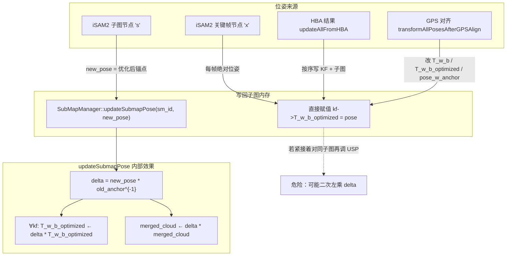

# 子图位姿更新：`updateSubmapPose` 语义与调用契约

本文档基于 `automap_pro/src/submap/submap_manager.cpp` 中 `SubMapManager::updateSubmapPose` 的**实际实现**，说明其数学语义、数据流，以及**在何种系统状态下允许/禁止与谁组合调用**，用于避免「绝对位姿写回 + 锚点增量传播」叠加导致的**双重坐标变换**等严重问题。

**相关代码位置**：`submap_manager.cpp` 约 L683–L854。  
**相关修复**：`loop_optimization.cpp` 中 `onPoseUpdated` 在「本轮已有关键帧级 iSAM2 写回」时跳过对 active 子图的强制 `updateSubmapPose`（见下文「禁止组合」）。

---

## 一、`updateSubmapPose` 做了什么（实现语义）

### 1.1 输入与前置条件

| 项目 | 说明 |
|------|------|
| `submap_id` | 目标子图 ID |
| `new_pose` | 调用方给出的**新子图锚点位姿**（世界系下的 `Pose3d`，与 `pose_w_anchor_optimized` 同语义坐标系） |
| 子图状态 | 仅当 `state ∈ { ACTIVE, FROZEN, OPTIMIZED }` 时执行更新；否则打 WARN 并跳过 |

### 1.2 对子图与关键帧的修改（核心公式）

实现顺序概要：

1. 读取 **旧锚点**（优化域）：`old_anchor = sm->pose_w_anchor_optimized`
2. 写入 **新锚点**：`sm->pose_w_anchor_optimized = new_pose`，`sm->state = OPTIMIZED`
3. 计算 **左乘增量**（世界系下锚点变化）：
   ```text
   delta = new_pose * old_anchor.inverse()
   ```
4. 对子图内 **每个关键帧** 的**已优化位姿**做左乘更新：
   ```text
   kf->T_w_b_optimized = delta * kf->T_w_b_optimized
   ```
   注释明确：必须基于**当前已优化位姿**，而非原始里程计 `T_w_b`（避免 HBA / ISAM2 写回后被扯回里程计系导致重影）。
5. 若存在 `merged_cloud`，用同一 `delta` 变换点云，使合并地图与轨迹一致。

**注意**：本函数**只更新** `pose_w_anchor_optimized`，**不**在本路径中修改 `pose_w_anchor`（里程计/前端锚点可能仍与优化锚点不同步，需在其他流程中理解）。

### 1.3 语义归纳（一句话）

> **`updateSubmapPose` 表达的是：「子图锚点在**同一世界坐标系**下从 `old_anchor` 变到 `new_pose`」，并把这一变化**左乘**到该子图内所有 `T_w_b_optimized` 及 `merged_cloud` 上。**

因此它本质是 **对已有世界系位姿的一次批量刚体修正**，而不是「单独设置某个关键帧的绝对位姿」。

---

## 二、数据流图（从后端到子图内存）

下列流程强调：**谁产出 `new_pose`、谁已写过关键帧**，决定能否再调 `updateSubmapPose`。



---

## 三、允许调用的状态表（契约）

约定：

- **子图级写回**：仅 `res.submap_poses` 含该 `sm_id`，且本批**未**对该子图内关键帧做「绝对位姿直接赋值」。
- **关键帧级写回**：`res.keyframe_poses` 已按 node_id 写入对应 `kf->T_w_b_optimized`（iSAM2 返回的为**世界系绝对位姿**时的典型路径）。

| # | 系统阶段 / 调用上下文 | `updateSubmapPose(sm_id, new_pose)` | 说明 |
|---|------------------------|-------------------------------------|------|
| 1 | **仅子图节点**优化结果写回（有 `submap_poses`，无对应子图的 KF 绝对更新） | **允许** | `new_pose` 与旧锚点一致语义，`delta` 正确传播到 KF 与点云。 |
| 2 | **仅关键帧节点**优化结果写回（已对 KF 做绝对赋值） | **禁止再对同子图调用** | 再调会用锚点差再左乘一遍 KF → **双重变换**。 |
| 3 | **同一次回调内**：先 KF 绝对写回，再对 **active** 子图 `updateSubmapPose(anchor_kf->T_w_b_optimized)` | **禁止**（已用条件跳过修复） | 锚点与首帧「看似一致」仍会算出一个非平凡 `delta`（旧锚点与首帧优化位姿不一致时尤其严重）。 |
| 4 | **GPS 对齐** `transformAllPosesAfterGPSAlign` 已改全体 `T_w_b` / `T_w_b_optimized` | **禁止**紧接着再对同一批数据用另一路径用「局部锚点」调 USP | 坐标系已整体切换，需单一写入口。 |
| 5 | **HBA** `updateAllFromHBA` 已写回 | **不要**在同一轮再对该子图 USP | HBA 已直接写 KF/子图；再 USP 需明确是否重复。 |
| 6 | 子图状态非 ACTIVE/FROZEN/OPTIMIZED | **实现上会跳过** | 打 WARN，无有效更新。 |

### 3.1 与 `onPoseUpdated` 的推荐策略（当前实现）

| 条件 | 行为 |
|------|------|
| `res.keyframe_poses` 非空且包含 **active 子图**的 node | **跳过** `updateSubmapPose(active_sm, anchor_kf->T_w_b_optimized)` |
| 否则（本轮未对该子图做 KF 级写回） | **可**用首关键帧优化位姿强制同步锚点，以更新 `merged_cloud`、减轻显示滞后 |

---

## 四、架构原则（避免再犯）

1. **单一写路径**：同一轮优化结果，对同一子图要么「只走子图锚点 + USP 传播」，要么「只走 per-KF 绝对写回」，**不要两种混用**。
2. **坐标系显式化**：`new_pose` 与 `T_w_b_optimized` 必须同属一个世界系（对齐前 / 对齐后 ENU 需在文档与状态机中一致）。
3. **API 层标注**：在头文件或注释中标明 `updateSubmapPose` 为 **增量左乘模型**，与 `setKeyframePoseAbsolute(...)` 类 API **互斥**（同轮次）。
4. **回归检查**：日志中若出现 `[POSE_JUMP][SUBMAP]` 且同周期存在 `[POSE_UPDATE][KF]`，应怀疑双重写回；可 grep `POSE_UPDATE][ACTIVE_SM]` 是否 skip。

---

## 五、快速对照：实现中的关键代码锚点

| 行为 | 文件与位置 |
|------|------------|
| `delta` 与 KF 左乘 | `submap_manager.cpp` L785–L809 |
| `merged_cloud` 变换 | `submap_manager.cpp` L821–L828 |
| 状态门控 | `submap_manager.cpp` L709–L726 |
| `onPoseUpdated` 与 USP 组合策略 | `loop_optimization.cpp`（`onPoseUpdated` 内 `POSE_UPDATE][ACTIVE_SM]`） |

---

## 六、修订记录

| 日期 | 说明 |
|------|------|
| 2026-03-20 | 初稿：基于 `updateSubmapPose` 实现与 GPS/回环写回问题整理数据流与状态表。 |
