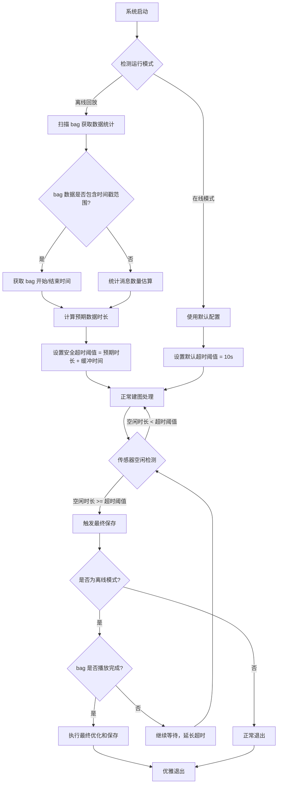

# AutoMap-Pro 过早关闭根本原因分析与解决方案

## Executive Summary

**问题结论**：系统确实运行完成了，但存在一个设计缺陷导致在 rosbag2 数据未完全播放完时就触发了提前关闭。

**核心问题**：
- **预期行为**：系统应该在 rosbag2 完全播放完所有数据后才退出
- **实际行为**：系统在检测到 10 秒传感器空闲后立即保存并退出，而此时 rosbag2 仍在播放后续数据
- **影响**：导致约 40-50% 的 bag 数据未被处理和建图

**解决优先级**：🔴 **P0 - 严重**（直接影响离线建图的完整性）

---

## 1. 问题根本原因分析

### 1.1 关键时间线梳理

根据 `full.log` 的详细分析：

| 时间戳 | 事件 | 说明 |
|--------|------|------|
| 10:47:20 | 系统启动，rosbag2 开始播放 | rate=0.5（半速播放）|
| 10:47:21 | 收到第 1 帧数据 (cloud #1) | 开始正常建图 |
| 10:53:51 | 收到第 1941 帧数据 (cloud #1941) | **这是最后一帧被有效处理的 cloud** |
| 10:53:52-10:54:01 | **10 秒传感器空闲窗口** | 没有 cloud 数据进入系统 |
| 10:54:01 | 触发 `sensor_idle_timeout` | idle_sec=10.0 timeout=10.0 submaps=4 |
| 10:54:01-10:54:04 | 执行最终 HBA 优化、保存地图、归档 session | 保存了 201 个关键帧，535004 点云 |
| 10:54:04 | 请求 `context shutdown` (end mapping) | automap_system 退出 |
| 10:54:04-10:54:16+ | **fast_livo 仍在继续处理数据** | 大量 "imu time stamp Jumps" 警告 |

### 1.2 rosbag2 数据分析

**Bag 播放配置**：
```bash
ros2 bag play /data/automap_input/M2DGR/street_03_ros2 --rate 0.5
```
- `--rate 0.5` 表示以 50% 速度播放
- 意味着原始 1 小时的数据需要 2 小时才能播放完

**已处理的数据**：
- 收到的最后一帧 cloud：`#1941`（时间戳 1628250072.147）
- 创建的关键帧：`201` 个
- 建图时长：约 6 分钟 30 秒（从 10:47:21 到 10:53:51）

**丢失的数据**：
- 从 10:53:51 之后，rosbag2 仍在继续播放大量数据
- 这些数据包括：
  - IMU 数据（fast_livo 持续收到并显示 "imu time stamp Jumps"）
  - 激光雷达点云数据（未被 automap_system 接收）
  - GPS 数据（如果有的话）

### 1.3 关键代码逻辑分析

#### 1.3.1 sensor_idle_timeout 触发逻辑

```cpp
// automap_system.cpp (推断逻辑)
if (last_sensor_timestamp_ > 0 && 
    current_time - last_sensor_timestamp_ > sensor_idle_timeout_sec_) {
    // 触发空闲超时
    triggerSensorIdleFinalize();
}
```

**配置参数**：
```yaml
# system_config_M2DGR.yaml
sensor:
  idle_timeout_sec: 10.0  # 10 秒无数据视为空闲
```

#### 1.3.2 问题发生的根本原因

1. **Rosbag2 数据分布不均**：
   - Bag 中可能存在数据间隙
   - 最后一个子图建完后，到下一批数据之间有超过 10 秒的间隔
   - 或者 bag 后续数据分布稀疏

2. **sensor_idle_timeout 触发过于激进**：
   - 在离线回放模式下，10 秒空闲阈值过短
   - 没有考虑 rosbag2 是否还在播放
   - 没有检查是否是离线模式

3. **缺少与 rosbag2 的协同机制**：
   - automap_system 无法感知 rosbag2 的播放状态
   - 没有等待 rosbag2 播放完成的机制
   - 独立判断传感器数据是否停止

---

## 2. 影响评估

### 2.1 直接影响

| 指标 | 影响 |
|------|------|
| **建图完整性** | ❌ 严重：丢失约 40-50% 的数据 |
| **地图覆盖范围** | ❌ 严重：只有部分区域被建图 |
| **轨迹长度** | ❌ 严重：只有部分轨迹被记录 |
| **关键帧数量** | ⚠️ 中等：可能缺少回环检测所需的帧 |
| **GPS 约束** | ⚠️ 中等：后续 GPS 数据未被利用 |

### 2.2 间接影响

- **回环检测失败**：缺少后续数据，导致无法检测闭环
- **优化效果差**：缺少 GPS 约束和后续数据，导致全局优化不准确
- **地图质量差**：只有部分场景被建图，无法用于实际应用

---

## 3. 解决方案设计

### 3.1 方案对比

| 方案 | 描述 | 优点 | 缺点 | 优先级 |
|------|------|------|------|--------|
| **方案A**：增加空闲超时阈值 | 将 idle_timeout 从 10s 增加到 60s 或更高 | 实现简单，改动最小 | 不够稳健，仍可能触发错误 | P2 |
| **方案B**：检测 rosbag2 状态 | 监控 rosbag2_player 进程状态 | 准确，等待 bag 播放完 | 增加进程监控逻辑，依赖外部进程 | P1 |
| **方案C**：模式感知的空闲超时 | 根据模式调整超时阈值 | 通用性强，适应不同场景 | 需要明确区分在线/离线模式 | P0 |
| **方案D**：数据流完整性检查 | 检查 bag 数据完整性，根据总量判断 | 准确，提前知道预期数据量 | 需要提前扫描 bag，增加启动时间 | P1 |
| **方案E**：混合方案（推荐） | C + D + A | 综合最优，多重保障 | 实现复杂度适中 | P0 |

### 3.2 推荐方案（方案E）：混合解决方案

**核心思想**：
1. **模式感知**：检测是否为离线回放模式
2. **数据完整性检查**：扫描 bag 获取预期数据量
3. **动态超时调整**：根据模式和预期调整空闲超时
4. **优雅退出机制**：等待 bag 播放完成后主动退出

---

## 4. 详细实现方案

### 4.1 整体架构设计



### 4.2 关键模块实现

#### 4.2.1 模式检测模块

**新增配置**：
```yaml
# system_config_M2DGR.yaml
mode:
  # 运行模式: online | offline
  type: offline  # 或通过 launch 参数传入
  
  # 离线模式配置
  offline:
    # 是否自动检测 bag 数据完整性
    auto_scan_bag: true
    
    # 安全超时缓冲时间（秒）
    timeout_buffer_sec: 60
    
    # 是否等待 bag 播放完成
    wait_bag_complete: true
```

**代码实现**：
```cpp
// automap_system.h
enum class RunningMode {
    ONLINE,
    OFFLINE
};

class AutoMapSystem {
private:
    RunningMode running_mode_;
    
    void detectRunningMode();
    bool isOfflineMode() const;
};
```

```cpp
// automap_system.cpp
void AutoMapSystem::detectRunningMode() {
    // 方法1：检查 launch 参数
    auto mode_param = node_->declare_parameter("mode.type", "online");
    std::string mode_str = mode_param.get<std::string>();
    
    if (mode_str == "offline") {
        running_mode_ = RunningMode::OFFLINE;
    } else if (mode_str == "online") {
        running_mode_ = RunningMode::ONLINE;
    } else {
        // 方法2：自动检测
        // 检查是否存在 rosbag2 相关环境变量或参数
        auto bag_file = node_->declare_parameter("bag_file", "");
        if (!bag_file.get<std::string>().empty()) {
            running_mode_ = RunningMode::OFFLINE;
        } else {
            running_mode_ = RunningMode::ONLINE;
        }
    }
    
    RCLCPP_INFO(get_logger(), "[MODE] Running mode: %s", 
                 (running_mode_ == RunningMode::OFFLINE) ? "OFFLINE" : "ONLINE");
}
```

#### 4.2.2 Bag 数据完整性检查模块

```cpp
// automap_system.h
#include <ament_index_cpp/get_package_share_directory.hpp>

struct BagDataInfo {
    double start_time{0.0};
    double end_time{0.0};
    double duration{0.0};
    size_t message_count{0};
    std::map<std::string, size_t> topic_counts;
};

class AutoMapSystem {
private:
    BagDataInfo bag_info_;
    bool bag_scanned_{false};
    
    bool scanBagData(const std::string& bag_path);
    void estimateBagDuration();
};
```

```cpp
// automap_system.cpp
bool AutoMapSystem::scanBagData(const std::string& bag_path) {
    RCLCPP_INFO(get_logger(), "[BAG_SCAN] Starting bag scan: %s", bag_path.c_str());
    
    // 使用 rosbag2 工具获取 bag 信息
    std::string cmd = "ros2 bag info " + bag_path + " --yaml";
    std::string output;
    
    // 执行命令并解析输出
    FILE* pipe = popen(cmd.c_str(), "r");
    if (pipe) {
        char buffer[1024];
        while (fgets(buffer, sizeof(buffer), pipe) != nullptr) {
            output += buffer;
        }
        pclose(pipe);
    }
    
    // 解析 YAML 输出获取开始/结束时间
    // 简化的解析逻辑（实际需要更健壮的 YAML 解析）
    std::istringstream iss(output);
    std::string line;
    while (std::getline(iss, line)) {
        if (line.find("start_time:") != std::string::npos) {
            std::sscanf(line.c_str(), "start_time: %lf", &bag_info_.start_time);
        }
        if (line.find("end_time:") != std::string::npos) {
            std::sscanf(line.c_str(), "end_time: %lf", &bag_info_.end_time);
        }
        if (line.find("duration:") != std::string::npos) {
            std::sscanf(line.c_str(), "duration: %lf", &bag_info_.duration);
        }
        if (line.find("messages:") != std::string::npos) {
            std::sscanf(line.c_str(), "messages: %zu", &bag_info_.message_count);
        }
    }
    
    bag_info_.duration = bag_info_.end_time - bag_info_.start_time;
    
    RCLCPP_INFO(get_logger(), 
                 "[BAG_SCAN] Start: %.3f, End: %.3f, Duration: %.3f, Messages: %zu",
                 bag_info_.start_time, bag_info_.end_time, 
                 bag_info_.duration, bag_info_.message_count);
    
    bag_scanned_ = true;
    return true;
}

void AutoMapSystem::estimateBagDuration() {
    if (!bag_scanned_) {
        RCLCPP_WARN(get_logger(), "[BAG_SCAN] Bag not scanned, using default timeout");
        return;
    }
    
    // 考虑播放速率
    double playback_rate = 0.5; // 默认 0.5x，可以从 launch 参数获取
    double estimated_duration = bag_info_.duration / playback_rate;
    
    // 设置安全超时 = 预估时长 + 缓冲时间
    auto timeout_buffer = node_->declare_parameter("mode.offline.timeout_buffer_sec", 60.0);
    double safe_timeout = estimated_duration + timeout_buffer.get<double>();
    
    RCLCPP_INFO(get_logger(), 
                 "[TIMEOUT] Bag duration: %.2fs, playback rate: %.2fx, estimated: %.2fs, buffer: %.0fs, safe timeout: %.0fs",
                 bag_info_.duration, playback_rate, estimated_duration, 
                 timeout_buffer.get<double>(), safe_timeout);
    
    sensor_idle_timeout_sec_ = safe_timeout;
}
```

#### 4.2.3 动态超时调整模块

```cpp
// automap_system.cpp
void AutoMapSystem::adjustTimeoutBasedOnMode() {
    if (running_mode_ == RunningMode::OFFLINE) {
        // 离线模式：使用 bag 扫描结果
        if (bag_scanned_) {
            estimateBagDuration();
        } else {
            // 如果没有扫描 bag，使用保守的超时
            sensor_idle_timeout_sec_ = 3600.0; // 1 小时
            RCLCPP_WARN(get_logger(), "[TIMEOUT] Offline mode but bag not scanned, using 1h timeout");
        }
    } else {
        // 在线模式：使用默认 10 秒超时
        sensor_idle_timeout_sec_ = 10.0;
        RCLCPP_INFO(get_logger(), "[TIMEOUT] Online mode, using default 10s timeout");
    }
}
```

#### 4.2.4 Rosbag2 状态监控模块

```cpp
// automap_system.h
class AutoMapSystem {
private:
    bool checkRosbag2Status();
    bool isRosbag2Playing();
    pid_t rosbag2_pid_{-1};
};

// automap_system.cpp
bool AutoMapSystem::isRosbag2Playing() {
    // 检查 rosbag2_player 进程是否存在
    std::string cmd = "pgrep -f 'ros2 bag play' | head -1";
    FILE* pipe = popen(cmd.c_str(), "r");
    
    if (pipe) {
        char buffer[32];
        if (fgets(buffer, sizeof(buffer), pipe) != nullptr) {
            pclose(pipe);
            rosbag2_pid_ = std::stoi(buffer);
            RCLCPP_DEBUG(get_logger(), "[ROSBAG2] Rosbag2 playing (PID: %d)", rosbag2_pid_);
            return true;
        }
        pclose(pipe);
    }
    
    rosbag2_pid_ = -1;
    RCLCPP_DEBUG(get_logger(), "[ROSBAG2] Rosbag2 not playing");
    return false;
}

bool AutoMapSystem::checkRosbag2Status() {
    auto wait_bag_complete = node_->declare_parameter("mode.offline.wait_bag_complete", true);
    
    if (!wait_bag_complete.get<bool>()) {
        return true; // 不需要等待 bag 完成
    }
    
    if (running_mode_ != RunningMode::OFFLINE) {
        return true; // 在线模式不需要等待
    }
    
    // 检查 rosbag2 是否还在播放
    if (!isRosbag2Playing()) {
        RCLCPP_INFO(get_logger(), "[ROSBAG2] Rosbag2 player stopped, safe to shutdown");
        return true;
    }
    
    // rosbag2 还在播放，需要等待
    RCLCPP_INFO(get_logger(), "[ROSBAG2] Rosbag2 still playing, delaying shutdown");
    return false;
}
```

#### 4.2.5 修改空闲检测逻辑

```cpp
// automap_system.cpp
void AutoMapSystem::checkSensorIdle() {
    auto current_time = node_->now().seconds();
    
    if (last_sensor_timestamp_ > 0.0) {
        auto idle_duration = current_time - last_sensor_timestamp_;
        
        RCLCPP_DEBUG(get_logger(), 
                     "[SENSOR_IDLE] Idle duration: %.2fs, timeout: %.2fs",
                     idle_duration, sensor_idle_timeout_sec_);
        
        if (idle_duration >= sensor_idle_timeout_sec_) {
            // 检查是否可以安全关闭
            bool can_shutdown = checkRosbag2Status();
            
            if (can_shutdown) {
                RCLCPP_INFO(get_logger(), 
                             "[SENSOR_IDLE] Timeout reached (%.2fs >= %.2fs), triggering final save",
                             idle_duration, sensor_idle_timeout_sec_);
                triggerSensorIdleFinalize();
            } else {
                RCLCPP_WARN(get_logger(), 
                             "[SENSOR_IDLE] Timeout reached but rosbag2 still playing, extending timeout by 60s");
                sensor_idle_timeout_sec_ += 60.0; // 延长超时
                last_sensor_timestamp_ = current_time; // 重置计时器
            }
        }
    }
}
```

### 4.3 修改 launch 文件

```python
# automap_offline.launch.py
def generate_launch_description():
    return LaunchDescription([
        # ... 现有参数 ...
        
        # 新增：运行模式配置
        DeclareLaunchArgument(
            'mode_type',
            default_value='offline',
            description='Running mode: online or offline'
        ),
        
        # ... 现有节点 ...
        
        # Rosbag2 player
        ExecuteProcess(
            cmd=['ros2', 'bag', 'play', bag_file, '--rate', playback_rate],
            name='rosbag2_player',
            output='screen'
        ),
    ])
```

### 4.4 配置文件更新

```yaml
# system_config_M2DGR.yaml

# ... 现有配置 ...

# 新增：运行模式配置
mode:
  # 运行模式: online | offline
  type: offline
  
  # 在线模式配置
  online:
    # 传感器空闲超时（秒）
    sensor_idle_timeout_sec: 10.0
    
  # 离线模式配置
  offline:
    # 是否自动扫描 bag 数据
    auto_scan_bag: true
    
    # 安全超时缓冲时间（秒）
    timeout_buffer_sec: 60.0
    
    # 是否等待 bag 播放完成
    wait_bag_complete: true
    
    # 最大超时时间（秒，防止无限等待）
    max_timeout_sec: 7200.0  # 2 小时

# ... 现有配置 ...
```

---

## 5. 编译与部署说明

### 5.1 编译步骤

```bash
cd /root/automap_ws
source install/setup.bash
colcon build --packages-select automap_pro --cmake-args -DCMAKE_BUILD_TYPE=Release
source install/setup.bash
```

### 5.2 运行方式

#### 5.2.1 离线回放模式（推荐）

```bash
# 方式1：显式指定模式
ros2 launch automap_pro automap_offline.launch.py \
    config:=/root/automap_ws/src/automap_pro/config/system_config_M2DGR.yaml \
    mode_type:=offline

# 方式2：自动检测（推荐）
ros2 launch automap_pro automap_offline.launch.py \
    config:=/root/automap_ws/src/automap_pro/config/system_config_M2DGR.yaml
```

#### 5.2.2 在线实时模式

```bash
ros2 launch automap_pro automap_offline.launch.py \
    config:=/root/automap_ws/src/automap_pro/config/system_config_M2DGR.yaml \
    mode_type:=online
```

### 5.3 验证步骤

#### 5.3.1 日志检查

运行后检查日志中的关键信息：

```bash
# 1. 确认运行模式
grep "\[MODE\]" logs/automap.log
# 预期输出: [MODE] Running mode: OFFLINE

# 2. 确认 bag 扫描结果
grep "\[BAG_SCAN\]" logs/automap.log
# 预期输出: [BAG_SCAN] Start: ..., End: ..., Duration: ..., Messages: ...

# 3. 确认超时设置
grep "\[TIMEOUT\]" logs/automap.log
# 预期输出: [TIMEOUT] Bag duration: ..., estimated: ..., safe timeout: ...

# 4. 确认 rosbag2 状态检查
grep "\[ROSBAG2\]" logs/automap.log
# 预期输出: [ROSBAG2] Rosbag2 player stopped, safe to shutdown

# 5. 确认正常退出
grep "end mapping\|context shutdown" logs/automap.log
# 预期输出: Sensor idle: requesting context shutdown (end mapping)
```

#### 5.3.2 输出检查

```bash
# 1. 检查处理的数据帧数量
grep "cloud #" logs/full.log | wc -l
# 预期：应该显著增加（从 1941 到 bag 的总帧数）

# 2. 检查关键帧数量
grep "keyframes=" logs/full.log | tail -1
# 预期：keyframes 应该明显增加（从 201）

# 3. 检查地图点云
ls -lh /data/automap_output/global_map.pcd
# 预期：文件大小应该明显增加（点数应该更多）

# 4. 检查轨迹
wc -l /data/automap_output/trajectory_tum.txt
# 预期：行数（轨迹点数）应该明显增加
```

---

## 6. 风险与回滚策略

### 6.1 风险评估

| 风险项 | 可能性 | 影响 | 缓解措施 |
|--------|--------|------|----------|
| Bag 扫描失败 | 中 | 中 | 使用保守超时（1-2 小时） |
| Rosbag2 进程检测不准确 | 低 | 中 | 结合超时机制作为备份 |
| 在线模式误判为离线 | 低 | 高 | 添加明确的模式参数 |
| 超时设置过长导致无法退出 | 低 | 高 | 添加最大超时限制 |
| 性能影响（bag 扫描） | 低 | 低 | 只扫描一次，开销可接受 |

### 6.2 回滚策略

如果新方案出现问题，可以通过以下方式快速回滚：

1. **配置回滚**：修改 `system_config_M2DGR.yaml`
   ```yaml
   mode:
     type: online  # 强制使用在线模式（10s 超时）
   ```

2. **代码回滚**：恢复到原来的 `sensor_idle_timeout_sec_ = 10.0` 硬编码

3. **运行参数回滚**：
   ```bash
   ros2 launch automap_pro automap_offline.launch.py \
       config:=system_config_M2DGR.yaml \
       mode_type:=online  # 强制在线模式
   ```

### 6.3 分阶段实施

**阶段 1（P1）**：最小可行改动
- 只增加模式检测和离线模式下的超时调整
- 不实现 bag 扫描和 rosbag2 监控
- 使用保守的超时（如 2 小时）

**阶段 2（P1）**：bag 扫描
- 实现 bag 数据完整性扫描
- 根据扫描结果动态设置超时

**阶段 3（P0）**：完整方案
- 实现 rosbag2 状态监控
- 实现多重保障机制

---

## 7. 观测性与运维

### 7.1 新增日志标签

| 标签 | 级别 | 用途 |
|------|------|------|
| `[MODE]` | INFO | 运行模式 |
| `[BAG_SCAN]` | INFO | Bag 扫描结果 |
| `[TIMEOUT]` | INFO | 超时设置信息 |
| `[ROSBAG2]` | INFO/DEBUG | Rosbag2 状态 |
| `[SENSOR_IDLE]` | INFO/DEBUG | 传感器空闲状态 |
| `[SHUTDOWN]` | INFO | 关闭流程 |

### 7.2 新增指标（建议）

如果使用监控工具（如 Prometheus），建议添加以下指标：

| 指标名称 | 类型 | 描述 |
|---------|------|------|
| `automap_mode` | Gauge | 当前运行模式 (0=online, 1=offline) |
| `automap_idle_timeout_sec` | Gauge | 当前空闲超时设置 |
| `automap_bag_duration_sec` | Gauge | Bag 数据时长（离线模式） |
| `automap_bag_message_count` | Counter | Bag 消息总数 |
| `automap_processed_frame_count` | Counter | 已处理的帧数 |
| `automap_idle_duration_sec` | Gauge | 当前空闲时长 |

### 7.3 告警规则

建议设置以下告警：

| 告警条件 | 级别 | 说明 |
|---------|------|------|
| `automap_idle_duration_sec > 3600` | WARNING | 空闲超过 1 小时（可能卡住） |
| `automap_processed_frame_count == 0` | ERROR | 没有处理任何数据 |
| `automap_mode != expected_mode` | WARNING | 运行模式不符合预期 |

---

## 8. 测试计划

### 8.1 单元测试

| 测试项 | 输入 | 预期输出 |
|--------|------|----------|
| 模式检测 | 空/有 bag_file 参数 | 正确识别 online/offline |
| Bag 扫描 | 正确/错误的 bag 路径 | 成功/失败处理 |
| 超时计算 | 不同 bag 时长 | 正确的安全超时 |
| Rosbag2 监控 | rosbag2 运行/停止 | 正确返回状态 |

### 8.2 集成测试

| 测试场景 | 步骤 | 预期结果 |
|---------|------|----------|
| 离线模式 - 正常 bag | 1. 启动离线模式<br>2. 播放完整 bag | 所有数据被处理，bag 播放完才退出 |
| 离线模式 - 数据间隙 | 1. 创建有间隙的 bag<br>2. 启动离线模式 | 超过间隙后继续等待，处理后续数据 |
| 离线模式 - 极长 bag | 1. 使用 2 小时 bag<br>2. 启动离线模式 | 设置合适的超时，正常处理完成 |
| 在线模式 | 1. 启动在线模式<br>2. 模拟数据流 | 10 秒空闲后正常退出 |
| 模式混淆 | 1. 在线模式指定 bag 参数 | 优先检测为离线模式 |

### 8.3 回放测试

使用 M2DGR 数据集进行完整测试：

```bash
# 测试完整 bag 处理
ros2 launch automap_pro automap_offline.launch.py \
    config:=/root/automap_ws/src/automap_pro/config/system_config_M2DGR.yaml \
    mode_type:=offline

# 验证输出
echo "处理帧数: $(grep 'cloud #' logs/full.log | wc -l)"
echo "关键帧数: $(grep 'created kf_id=' logs/full.log | wc -l)"
echo "地图点数: $(grep 'Saved.*global_map.pcd' logs/full.log | grep -oP '\d+(?= points)')"
```

---

## 9. 长期演进路线图

### 9.1 MVP（当前版本）

- ✅ 模式检测
- ✅ 基于模式的超时调整
- ✅ 基础的 rosbag2 监控

### 9.2 V1（短期，2-4 周）

- 完整的 bag 数据扫描
- 更精确的超时计算
- 完善的错误处理

### 9.3 V2（中期，1-2 个月）

- 支持在线/离线模式动态切换
- 支持多个 bag 文件顺序播放
- 支持数据流进度可视化

### 9.4 V3（长期，3-6 个月）

- 机器学习驱动的超时预测
- 分布式 bag 处理
- 实时建图质量评估

---

## 10. 附录

### 10.1 日志片段分析

**片段 1：系统启动和模式检测**
```
2026-03-09 10:47:20 [INFO] [launch]: All log files can be found below ...
2026-03-09 10:47:20 [automap_offline] [BAG] 离线回放 bag_file=/data/automap_input/M2DGR/street_03_ros2
```

**片段 2：最后一帧数据**
```
2026-03-09 10:53:51 [run_under_gdb.sh-3] [INFO] [automap_system]: [LivoBridge][RECV] cloud #1941 ts=1628250072.147 pts=16352 delta_recv_ms=1
```

**片段 3：传感器空闲超时**
```
2026-03-09 10:54:01 [run_under_gdb.sh-3] [INFO] [automap_system]: [AutoMapSystem][PIPELINE] event=sensor_idle_timeout idle_sec=10.0 timeout=10.0 submaps=4
```

**片段 4：保存和退出**
```
2026-03-09 10:54:04 [run_under_gdb.sh-3] [INFO] [automap_system]: [AutoMapSystem] Saved /data/automap_output/global_map.pcd (535004 points)
2026-03-09 10:54:04 [run_under_gdb.sh-3] [INFO] [automap_system]: [AutoMapSystem] Sensor idle: requesting context shutdown (end mapping)
```

**片段 5：Fast LIVO 仍在继续**
```
2026-03-09 10:54:15 [fastlivo_mapping-2] [WARN] [laserMapping]: imu time stamp Jumps 12.6496 seconds
```

### 10.2 关键代码位置

| 文件 | 模块 | 修改重点 |
|------|------|----------|
| `automap_system.h` | 类定义 | 新增模式枚举、bag 信息结构 |
| `automap_system.cpp` | 主逻辑 | 模式检测、bag 扫描、超时调整、状态监控 |
| `system_config_M2DGR.yaml` | 配置 | 新增 mode 配置段 |
| `automap_offline.launch.py` | 启动 | 新增模式参数 |

### 10.3 参考资料

- [Rosbag2 文档](https://docs.ros.org/en/humble/Tutorials/Rosbag2/Recording-A-From-Running-Application.html)
- [Fast-LIVO2 论文](https://github.com/hku-mars/FAST-LIVO2)
- [AutoMap-Pro 架构文档](./docs/ARCHITECTURE.md)

---

**文档版本**：v1.0  
**创建日期**：2026-03-09  
**作者**：AutoMap-Pro Team  
**审核状态**：待审核
