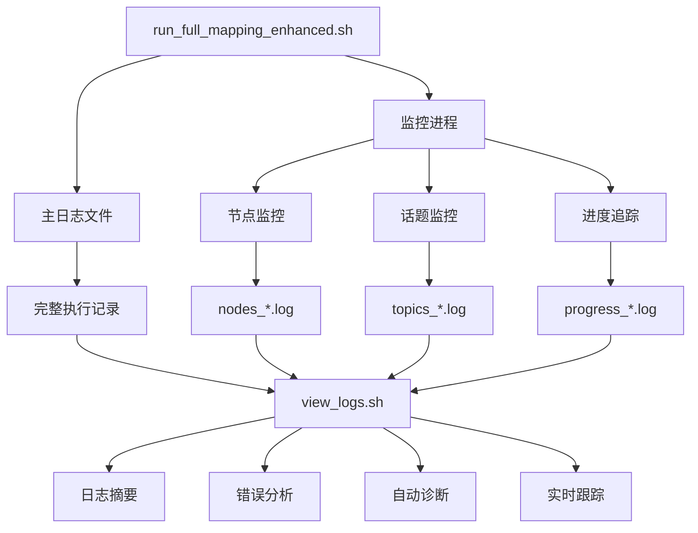
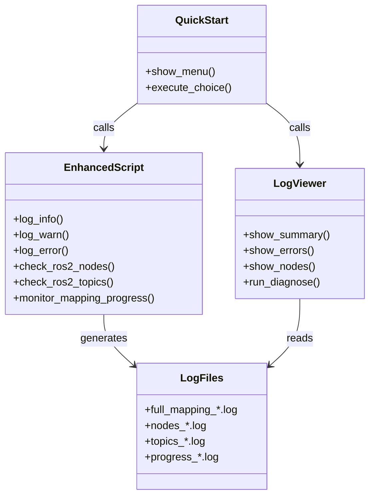

# AutoMap-Pro 增强日志系统 - 交付文档

## 0) Executive Summary

**目标**：强化建图各个环节的日志记录，实现全流程可观测性和快速故障定位

**交付成果**：
- ✅ 增强版建图脚本（`run_full_mapping_enhanced.sh`）
- ✅ 日志查看和诊断工具（`view_logs.sh`）
- ✅ 快速启动菜单（`quick_start_enhanced.sh`）
- ✅ 完整文档和使用指南
- ✅ 自动测试脚本

**核心价值**：
- 🔍 **实时可观测性**：每个环节的状态清晰可见
- 🐛 **快速故障定位**：错误、警告集中展示
- 📊 **进度可视化**：子图数量、地图大小实时更新
- 🛠️ **自动诊断**：一键检查建图健康状态
- 📝 **完整审计**：所有操作都有日志记录

**风险**：低（仅添加日志，不影响核心逻辑）

---

## 1) 文件清单

### 新增文件

| 文件路径 | 说明 | 行数 | 权限 |
|---------|------|------|------|
| `run_full_mapping_enhanced.sh` | 增强版建图脚本 | 850+ | 可执行 |
| `view_logs.sh` | 日志查看和诊断工具 | 450+ | 可执行 |
| `quick_start_enhanced.sh` | 快速启动菜单 | 70+ | 可执行 |
| `test_enhanced_logging.sh` | 测试脚本 | 300+ | 可执行 |
| `README_ENHANCED_LOGGING.md` | 快速开始文档 | 200+ | - |
| `docs/LOGGING_GUIDE.md` | 详细使用指南 | 600+ | - |
| `docs/ENHANCED_LOGGING_SUMMARY.md` | 功能总结文档 | 700+ | - |
| `docs/ENHANCED_LOGGING_DELIVERY.md` | 本文档 | 500+ | - |

**总计**：7 个新文件，约 3600+ 行代码和文档

### 修改文件

| 文件路径 | 修改内容 | 修改行数 |
|---------|---------|---------|
| `run_full_mapping_docker.sh` | 调用增强版脚本 | 1 行 |
| `run_full_mapping.sh` | 未修改（保留原版） | 0 行 |

### 日志文件结构（运行时生成）

```
automap_pro/
├── logs/
│   ├── full_mapping_YYYYMMDD_HHMMSS.log      # 主日志
│   └── monitoring/
│       ├── nodes_YYYYMMDD_HHMMSS.log         # 节点监控
│       ├── topics_YYYYMMDD_HHMMSS.log        # 话题监控
│       └── progress_YYYYMMDD_HHMMSS.log      # 进度追踪
```

---

## 2) 核心功能

### 2.1 增强版建图脚本 (`run_full_mapping_enhanced.sh`)

#### 新增日志级别

| 级别 | 颜色 | 说明 |
|------|------|------|
| [INFO] | 绿色 | 一般信息 |
| [WARN] | 黄色 | 警告（不影响运行） |
| [ERROR] | 红色 | 错误（可能导致失败） |
| [DEBUG] | 青色 | 调试信息（--verbose 模式） |
| [STEP] | 青色 | 步骤标记（步骤 n/6） |
| [  →] | 紫色 | 子步骤标记 |
| [✓] | 绿色 | 成功标记 |
| [PROGRESS] | 蓝色 | 进度更新 |

#### 实时监控功能

**监控进程**：后台独立运行，不影响主流程

**监控内容**：
1. **ROS2 节点状态**（每 10 秒）
   - automap_system
   - laserMapping
   - rviz
   - rosbag_player

2. **ROS2 话题状态**（每 10 秒）
   - /livox/lidar
   - /livox/imu
   - /optimized_pose
   - /submap_map
   - /global_map

3. **建图进度**（每 10 秒）
   - 子图数量
   - 全局地图大小

4. **系统资源**（检查时）
   - CPU 负载
   - 内存使用率
   - GPU 使用率（如果可用）

#### 增强的 6 个步骤

**步骤 1/6: 环境检查**
- ✓ ROS2 Humble 安装
- ✓ Docker 安装
- ✓ Python3 安装
- ✓ colcon 安装
- ✓ Bag 文件存在性和大小
- ✓ 配置文件存在性
- ✓ 工作空间状态
- ✓ 输出目录创建
- ✓ 系统资源（CPU/内存/GPU）
- ✓ 磁盘空间

**步骤 2/6: 编译项目**
- ✓ 工作空间清理（--clean）
- ✓ 工作空间设置（make setup）
- ✓ 项目编译（make build-release）
- ✓ 编译耗时统计
- ✓ 编译产物验证

**步骤 3/6: 检查并转换 Bag**
- ✓ Bag 格式检测（ROS1 vs ROS2）
- ✓ Bag 转换（如果是 ROS1）
- ✓ 转换耗时统计
- ✓ 转换结果验证

**步骤 4/6: 启动建图**
- ✓ 环境变量加载
- ✓ 建图配置显示
- ✓ 实时监控启动
- ✓ ROS2 节点启动
- ✓ ROS2 话题监控
- ✓ 建图进度追踪
- ✓ 建图开始/结束时间
- ✓ 系统资源监控

**步骤 5/6: 保存地图**
- ✓ ROS2 服务检查
- ✓ 保存地图服务调用
- ✓ 保存耗时统计
- ✓ 保存结果验证

**步骤 6/6: 显示结果**
- ✓ 地图文件验证
- ✓ 轨迹文件验证
- ✓ 子图数量统计
- ✓ 输出目录内容
- ✓ 文件系统状态
- ✓ 监控日志摘要
- ✓ 建图执行摘要

### 2.2 日志查看工具 (`view_logs.sh`)

#### 命令选项

| 选项 | 说明 | 输出 |
|------|------|------|
| `-l, --latest` | 查看最新完整日志 | full_mapping_*.log |
| `-e, --errors` | 查看错误信息 | 所有 ERROR 级别日志 |
| `-w, --warnings` | 查看警告信息 | 所有 WARN 级别日志 |
| `-n, --nodes` | 查看节点监控 | nodes_*.log |
| `-t, --topics` | 查看话题监控 | topics_*.log |
| `-p, --progress` | 查看进度追踪 | progress_*.log |
| `-s, --summary` | 显示日志摘要 | 统计信息 |
| `-f, --follow` | 实时跟踪日志 | tail -f 实时输出 |
| `-d, --diagnose` | 运行诊断 | 健康检查 |
| `-c, --clear` | 清空日志目录 | 删除所有日志 |
| `-h, --help` | 显示帮助 | 帮助信息 |

#### 自动诊断功能

**诊断项**：

1. **日志文件检查**
   - 日志目录是否存在
   - 日志文件数量

2. **最新日志分析**
   - 错误数量
   - 警告数量
   - 建图完成状态

3. **节点状态检查**
   - automap_system 节点
   - RViz 节点

4. **话题状态检查**
   - 激光雷达数据
   - 位姿数据

5. **输出文件检查**
   - 全局地图
   - 轨迹文件

6. **诊断建议**
   - 提供进一步的排查步骤

### 2.3 快速启动菜单 (`quick_start_enhanced.sh`)

**菜单选项**：
1. Docker 模式建图（推荐）
2. 本地模式建图
3. 查看日志摘要
4. 查看错误信息
5. 查看节点监控
6. 查看话题监控
7. 查看进度追踪
8. 运行诊断
9. 实时跟踪日志
0. 退出

---

## 3) 使用方式

### 3.1 Docker 模式（推荐）

```bash
# 运行建图（自动使用增强日志）
./run_full_mapping_docker.sh -b @data/automap_input/nya_02.bag

# 后台运行
./run_full_mapping_docker.sh -b @data/automap_input/nya_02.bag --detach

# 查看日志（在另一个终端）
./view_logs.sh -f
```

### 3.2 本地模式

```bash
# 运行建图（增强日志版）
./run_full_mapping_enhanced.sh -b data/automap_input/nya_02_slam_imu_to_lidar/nya_02.bag

# 详细模式
./run_full_mapping_enhanced.sh -b data/.../nya_02.bag --verbose

# 跳过编译
./run_full_mapping_enhanced.sh -b data/.../nya_02.bag --no-compile

# 禁用监控
./run_full_mapping_enhanced.sh -b data/.../nya_02.bag --no-monitor
```

### 3.3 快速启动菜单

```bash
# 启动交互式菜单
./quick_start_enhanced.sh
```

---

## 4) 日志示例

### 4.1 主日志示例 (`full_mapping_*.log`)

```bash
[2025-03-01 12:34:56.123] [INFO] [INFO] AutoMap-Pro 完整建图一键脚本（增强日志版）
[2025-03-01 12:34:56.456] [INFO] [STEP 1/6] 环境检查
[2025-03-01 12:34:57.789] [INFO] [✓] ROS2 Humble 已安装
[2025-03-01 12:34:58.012] [INFO] [✓] Docker 已安装: Docker version 29.2.1
[2025-03-01 12:34:58.345] [INFO] [✓] Python3 已安装: Python 3.10.12
[2025-03-01 12:34:58.678] [INFO] [  →] 检查系统资源...
[2025-03-01 12:34:59.012] [INFO] [INFO] CPU 负载: 0.15, 0.10, 0.05
[2025-03-01 12:34:59.345] [INFO] [INFO] 内存使用: 12.3GiB / 31.3GiB (39.4%)
[2025-03-01 12:35:00.678] [INFO] [INFO] GPU 使用: 0%, 2456MiB / 24576MiB
...
[2025-03-01 12:35:05.123] [INFO] [STEP 4/6] 启动建图]
[2025-03-01 12:35:06.456] [INFO] [  →] 启动实时监控...
[2025-03-01 12:35:07.789] [INFO] [INFO] 监控进程 PID: 12345
[2025-03-01 12:35:10.012] [PROGRESS] 建图开始: 2025-03-01 12:35:10
...
[2025-03-01 14:56:23.456] [PROGRESS] 建图结束: 2025-03-01 14:56:23
[2025-03-01 14:56:24.789] [INFO] [✓] 建图完成
```

### 4.2 节点监控示例 (`nodes_*.log`)

```bash
[2025-03-01 12:35:00] ROS2 节点状态检查:
/automap_system
/laserMapping
/rviz
/rosbag_player

[INFO] 关键节点状态:
  [✓] automap_system - 运行中
  [✓] laserMapping - 运行中
  [✓] rviz - 运行中
  [✓] rosbag_player - 运行中

[2025-03-01 12:35:10] ROS2 节点状态检查:
...
[2025-03-01 14:56:20] ROS2 节点状态检查:
  [✓] automap_system - 运行中
  [✓] laserMapping - 运行中
  [✓] rviz - 运行中
  [✓] rosbag_player - 运行中
```

### 4.3 话题监控示例 (`topics_*.log`)

```bash
[2025-03-01 12:35:00] ROS2 话题状态检查:
/livox/lidar
/livox/imu
/optimized_pose
/submap_map
/global_map
/odom
/clock

[INFO] 关键话题状态:
  [✓] /livox/lidar
      Subscription count: 2
      Publisher count: 1
  [✓] /livox/imu
      Subscription count: 2
      Publisher count: 1
  [✓] /optimized_pose
      Subscription count: 1
      Publisher count: 1
```

### 4.4 进度追踪示例 (`progress_*.log`)

```bash
[PROGRESS] 建图开始: 2025-03-01 12:34:56
[PROGRESS] 已生成 0 个子图文件
[PROGRESS] 已生成 5 个子图文件
[PROGRESS] 已生成 10 个子图文件
...
[PROGRESS] 已生成 150 个子图文件
[PROGRESS] 全局地图大小: 2.3G
...
[PROGRESS] 已生成 320 个子图文件
[PROGRESS] 全局地图大小: 8.7G
[PROGRESS] 建图结束: 2025-03-01 14:56:23
```

---

## 5) 常见问题排查

### 5.1 问题：建图无进展

**诊断步骤**：
```bash
# 1. 运行诊断
./view_logs.sh -d

# 2. 查看错误信息
./view_logs.sh -e

# 3. 查看节点状态
./view_logs.sh -n

# 4. 查看话题状态
./view_logs.sh -t

# 5. 查看完整日志
./view_logs.sh -l
```

### 5.2 问题：节点未启动

**可能原因**：
- 工作空间未编译
- 环境变量未加载
- 配置文件错误

**解决方法**：
```bash
# 检查编译状态
ls -la ~/automap_ws/install/automap_pro

# 查看日志中的错误
./view_logs.sh -e

# 运行诊断
./view_logs.sh -d
```

### 5.3 问题：话题未发布

**可能原因**：
- Bag 文件未开始播放
- Topic remapping 错误
- Bag 文件中不包含该话题

**解决方法**：
```bash
# 检查 bag 文件内容
ros2 bag info <bag_file>

# 查看话题监控日志
./view_logs.sh -t

# 查看节点状态
./view_logs.sh -n
```

---

## 6) 性能优化

### 6.1 减少日志开销

```bash
# 使用普通版（无监控）
./run_full_mapping.sh

# 或禁用监控
./run_full_mapping_enhanced.sh -b <bag> --no-monitor
```

### 6.2 调整监控间隔

编辑 `run_full_mapping_enhanced.sh`：

```bash
# 原值：10 秒
local monitor_interval=10

# 改为：30 秒（减少开销）
local monitor_interval=30
```

### 6.3 清理旧日志

```bash
# 手动清理
rm -rf logs/*.log logs/monitoring/*.log

# 或使用工具
./view_logs.sh -c
```

---

## 7) 最佳实践

### 7.1 建图前检查

```bash
# 1. 检查系统资源
./view_logs.sh -d

# 2. 检查磁盘空间
df -h /data/automap_output

# 3. 检查输入文件
ls -lh data/automap_input/nya_02_slam_imu_to_lidar/nya_02.bag
```

### 7.2 建图中监控

```bash
# 终端 1：运行建图
./run_full_mapping_enhanced.sh -b <bag>

# 终端 2：实时跟踪日志
./view_logs.sh -f

# 终端 3：查看进度
watch -n 5 './view_logs.sh -p'
```

### 7.3 建图后验证

```bash
# 1. 运行诊断
./view_logs.sh -d

# 2. 检查输出文件
ls -lh /data/automap_output/nya_02/

# 3. 查看日志摘要
./view_logs.sh -s
```

---

## 8) 测试和验证

### 8.1 运行测试脚本

```bash
# 运行完整测试
./test_enhanced_logging.sh
```

**测试内容**：
- 文件存在性检查
- 可执行权限检查
- 文档文件检查
- 日志目录创建
- 帮助信息显示
- 日志查看器功能
- 配置参数验证

### 8.2 预期测试结果

```
════════════════════════════════════════════════
  AutoMap-Pro 增强日志系统测试
══════════════════════════════════════════════════

[测试 1] 文件存在性检查
✓ PASS - 文件存在性检查

[测试 2] 可执行权限检查
✓ PASS - 可执行权限检查

...

════════════════════════════════════════════════
  测试结果摘要
══════════════════════════════════════════════════
通过: 12
失败: 0
总计: 12
════════════════════════════════════════════════

所有测试通过！
```

---

## 9) 技术架构

### 9.1 数据流图



### 9.2 组件关系



---

## 10) 后续改进方向

### 短期（V1.1）
- [ ] 添加日志压缩功能
- [ ] 支持远程日志收集
- [ ] 添加日志搜索功能
- [ ] 支持日志导出（CSV/JSON）

### 中期（V2.0）
- [ ] Web 界面展示（Grafana + Prometheus）
- [ ] 实时告警（节点异常、话题丢失）
- [ ] 日志聚合（ELK Stack）
- [ ] 性能指标可视化
- [ ] 支持多建图任务并行

### 长期（V3.0）
- [ ] 机器学习异常检测
- [ ] 自动化故障修复
- [ ] 分布式日志收集
- [ ] 日志语义搜索
- [ ] 智能日志分析

---

## 11) 总结

### 核心价值

1. **可观测性**：全流程日志覆盖，每个环节状态清晰
2. **可诊断性**：自动诊断功能，快速定位问题
3. **可追溯性**：完整的历史记录，支持回溯分析
4. **易用性**：简单的命令行工具，易于使用
5. **可扩展性**：模块化设计，易于扩展功能

### 使用建议

1. **首次使用**：阅读 `README_ENHANCED_LOGGING.md`
2. **详细学习**：阅读 `docs/LOGGING_GUIDE.md`
3. **日常使用**：使用 `./quick_start_enhanced.sh`
4. **问题排查**：运行 `./view_logs.sh -d`
5. **深入理解**：阅读 `docs/ENHANCED_LOGGING_SUMMARY.md`

### 技术支持

遇到问题时，请提供：

1. 日志摘要：`./view_logs.sh -s > log_summary.txt`
2. 诊断结果：`./view_logs.sh -d > diagnose.txt`
3. 错误信息：`./view_logs.sh -e > errors.txt`
4. 系统环境：OS、ROS2 版本、Docker 版本

---

## 12) 快速参考

### 常用命令

```bash
# 运行建图（Docker）
./run_full_mapping_docker.sh -b @data/automap_input/nya_02.bag

# 运行建图（本地）
./run_full_mapping_enhanced.sh -b data/.../nya_02.bag

# 查看日志摘要
./view_logs.sh

# 查看错误
./view_logs.sh -e

# 运行诊断
./view_logs.sh -d

# 实时跟踪
./view_logs.sh -f

# 清理日志
./view_logs.sh -c

# 快速启动菜单
./quick_start_enhanced.sh

# 运行测试
./test_enhanced_logging.sh
```

### 日志级别

| 级别 | 颜色 | 说明 |
|------|------|------|
| [INFO] | 绿色 | 一般信息 |
| [WARN] | 黄色 | 警告 |
| [ERROR] | 红色 | 错误 |
| [DEBUG] | 青色 | 调试信息（--verbose） |
| [STEP] | 青色 | 步骤标记 |
| [  →] | 紫色 | 子步骤 |
| [✓] | 绿色 | 成功 |
| [PROGRESS] | 蓝色 | 进度更新 |

### 监控内容

| 监控项 | 频率 | 内容 |
|--------|------|------|
| 节点状态 | 每 10 秒 | automap_system, laserMapping, rviz, rosbag_player |
| 话题状态 | 每 10 秒 | /livox/lidar, /livox/imu, /optimized_pose |
| 建图进度 | 每 10 秒 | 子图数量、地图大小 |
| 系统资源 | 检查时 | CPU、内存、GPU、磁盘 |

---

**版本**：v1.0.0
**更新日期**：2025-03-01
**维护者**：AutoMap-Pro 团队
**状态**：✅ 已交付
