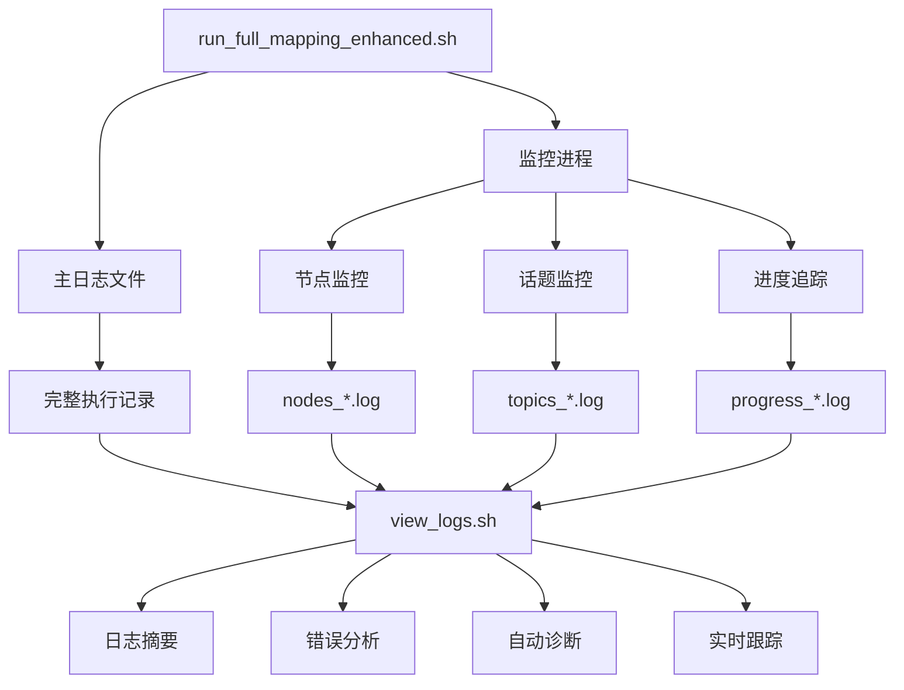

# AutoMap-Pro 增强日志系统总结

## 0) Executive Summary

**目标**：强化建图各个环节的日志记录，实现全流程可观测性

**核心改进**：
- ✅ 创建增强版建图脚本 `run_full_mapping_enhanced.sh`
- ✅ 实时监控 ROS2 节点和话题状态
- ✅ 详细的建图进度追踪
- ✅ 系统资源监控（CPU/内存/GPU）
- ✅ 专门的日志查看工具 `view_logs.sh`
- ✅ 自动诊断功能
- ✅ 完整的日志文档和使用指南

**收益**：
- 🔍 **实时可观测性**：每个环节的状态清晰可见
- 🐛 **快速故障定位**：错误、警告集中展示
- 📊 **进度可视化**：子图数量、地图大小实时更新
- 🛠️ **自动诊断**：一键检查建图健康状态
- 📝 **完整审计**：所有操作都有日志记录

**风险**：低（仅添加日志，不影响核心逻辑）

---

## 1) 文件清单

### 新增文件

| 文件路径 | 说明 | 权限 |
|---------|------|------|
| `run_full_mapping_enhanced.sh` | 增强版建图脚本 | 可执行 |
| `view_logs.sh` | 日志查看和诊断工具 | 可执行 |
| `quick_start_enhanced.sh` | 快速启动菜单脚本 | 可执行 |
| `docs/LOGGING_GUIDE.md` | 详细使用指南 | - |
| `docs/ENHANCED_LOGGING_SUMMARY.md` | 本文档 | - |

### 修改文件

| 文件路径 | 修改内容 |
|---------|---------|
| `run_full_mapping_docker.sh` | 调用增强版脚本 `run_full_mapping_enhanced.sh` |
| `run_full_mapping.sh` | 未修改（保留原版） |

### 日志文件结构

```
automap_pro/
├── logs/
│   ├── full_mapping_YYYYMMDD_HHMMSS.log      # 主日志
│   └── monitoring/
│       ├── nodes_YYYYMMDD_HHMMSS.log         # 节点监控
│       ├── topics_YYYYMMDD_HHMMSS.log        # 话题监控
│       └── progress_YYYYMMDD_HHMMSS.log      # 进度追踪
```

---

## 2) 功能详解

### 2.1 增强版建图脚本 (`run_full_mapping_enhanced.sh`)

#### 新增功能

1. **多层次日志系统**
   - `[INFO]` - 一般信息（绿色）
   - `[WARN]` - 警告信息（黄色）
   - `[ERROR]` - 错误信息（红色）
   - `[DEBUG]` - 调试信息（青色，仅在 --verbose 模式）
   - `[STEP n/6]` - 步骤标记（青色）
   - `[  →]` - 子步骤标记（紫色）
   - `[✓]` - 成功标记（绿色）
   - `[PROGRESS]` - 进度更新（蓝色）

2. **实时监控（后台进程）**
   - 每 10 秒检查 ROS2 节点状态
   - 每 10 秒检查 ROS2 话题状态
   - 每 10 秒更新建图进度（子图数量、地图大小）
   - 监控进程独立运行，不影响主流程

3. **系统资源检查**
   - CPU 负载
   - 内存使用率
   - GPU 使用率（如果可用）
   - 磁盘空间

4. **文件系统状态**
   - 输出目录大小
   - 磁盘使用率
   - 文件完整性检查

#### 增强的 6 个步骤

##### 步骤 1/6: 环境检查（增强版）

**新增检查项**：
- Bag 文件类型检测（ROS1 vs ROS2）
- 系统资源状态
- 磁盘空间检查

**输出示例**：
```
[STEP 1/6] 环境检查
══════════════════════════════════════════════════
  检查 ROS2 环境
══════════════════════════════════════════════════
[✓] ROS2 Humble 已安装
[✓] Docker 已安装: Docker version 29.2.1
[✓] Python3 已安装: Python 3.10.12
[✓] colcon 已安装

══════════════════════════════════════════════════
  检查输入文件
══════════════════════════════════════════════════
[✓] Bag 文件存在: data/.../nya_02.bag (9.4G)
  [DEBUG]   文件类型: SQLite 3.x database
[✓] 配置文件存在

[  →] 检查系统资源...
[INFO] CPU 负载: 0.15, 0.10, 0.05
[INFO] 内存使用: 12.3GiB / 31.3GiB (39.4%)
[INFO] GPU 使用: 0%, 2456MiB / 24576MiB

══════════════════════════════════════════════════
环境检查完成
[INFO] 耗时: 2秒
```

##### 步骤 2/6: 编译项目（增强版）

**新增功能**：
- 编译耗时统计
- 编译产物验证

**输出示例**：
```
[STEP 2/6] 编译项目

[  →] 设置工作空间...
[INFO] 执行: make setup
...
[✓] 工作空间设置完成

[  →] 编译项目（Release 模式）...
[INFO] 执行: make build-release
...
[✓] 项目编译完成 (耗时: 125秒)

[✓] 安装目录已创建: /home/wqs/automap_ws/install/automap_pro

[INFO] 步骤2 总耗时: 127秒
```

##### 步骤 3/6: 检查并转换 Bag（增强版）

**新增功能**：
- 转换耗时统计
- 转换后大小检查

##### 步骤 4/6: 启动建图（增强版）

**新增功能**：
- 实时监控启动
- 建图开始/结束时间记录
- 节点和话题状态检查（建图前后）
- 进度追踪

**输出示例**：
```
[STEP 4/6: 启动建图]

[  →] Source ROS2 和工作空间...
[✓] 环境变量已加载

══════════════════════════════════════════════════
  建图配置
══════════════════════════════════════════════════
[INFO] Bag 文件: /workspace/data/nya_02.bag
[INFO] 配置文件: ...
[INFO] 输出目录: /workspace/output

[  →] 启动建图流程...
[INFO] 执行: ros2 launch automap_pro automap_offline.launch.py
  [DEBUG]   参数: ...

[  →] 启动实时监控...
[INFO] 监控进程 PID: 12345

[PROGRESS] 建图开始: 2025-03-01 12:34:56

... 节点和话题监控日志 ...

══════════════════════════════════════════════════
  建图进行中（按 Ctrl+C 停止）
══════════════════════════════════════════════════

... 建图输出 ...

[PROGRESS] 建图结束: 2025-03-01 14:56:23

[  →] 停止监控进程...

[  →] 检查文件系统状态...
[INFO] 磁盘空间使用率: 67%
[INFO] 输出目录大小: 12G

[INFO] 步骤4 总耗时: 8687秒
[✓] 建图完成
```

##### 步骤 5/6: 保存地图（增强版）

**新增功能**：
- ROS2 服务检查
- 保存耗时统计
- 保存结果验证

##### 步骤 6/6: 显示结果（增强版）

**新增功能**：
- 监控日志摘要
- 文件系统状态
- 完整的结果统计

### 2.2 日志查看工具 (`view_logs.sh`)

#### 功能列表

| 选项 | 说明 | 输出 |
|------|------|------|
| `-l, --latest` | 查看最新完整日志 | full_mapping_*.log |
| `-e, --errors` | 查看错误信息 | 所有 ERROR 级别日志 |
| `-w, --warnings` | 查看警告信息 | 所有 WARN 级别日志 |
| `-n, --nodes` | 查看节点监控 | nodes_*.log |
| `-t, --topics` | 查看话题监控 | topics_*.log |
| `-p, --progress` | 查看进度追踪 | progress_*.log |
| `-s, --summary` | 显示日志摘要 | 统计信息 |
| `-f, --follow` | 实时跟踪日志 | tail -f 实时输出 |
| `-d, --diagnose` | 运行诊断 | 健康检查 |
| `-c, --clear` | 清空日志目录 | 删除所有日志 |
| `-h, --help` | 显示帮助 | 帮助信息 |

#### 使用示例

```bash
# 查看日志摘要
./view_logs.sh -s

# 查看错误信息
./view_logs.sh -e

# 查看节点监控
./view_logs.sh -n

# 运行诊断
./view_logs.sh -d

# 实时跟踪
./view_logs.sh -f
```

### 2.3 自动诊断功能 (`view_logs.sh -d`)

**诊断项**：

1. **日志文件检查**
   - 日志目录是否存在
   - 日志文件数量

2. **最新日志分析**
   - 错误数量
   - 警告数量
   - 建图完成状态

3. **节点状态检查**
   - automap_system 节点
   - RViz 节点

4. **话题状态检查**
   - 激光雷达数据
   - 位姿数据

5. **输出文件检查**
   - 全局地图
   - 轨迹文件

6. **诊断建议**
   - 提供进一步的排查步骤

**输出示例**：
```
══════════════════════════════════════════════════
  建图诊断
══════════════════════════════════════════════════

[1] 检查日志文件
  ✓ 日志目录存在: logs/
  ✓ 发现 5 个日志文件

[2] 分析最新日志
  ✓ 未发现错误或警告
  ✓ 建图已成功完成

[3] 检查节点状态
  ✓ automap_system 节点已运行
  ⚠ RViz 节点未运行

[4] 检查话题状态
  ✓ 激光雷达数据已发布
  ✓ 位姿数据已发布

[5] 检查输出文件
  ✓ 输出目录存在: /data/automap_output/nya_02
  ✓ 全局地图: 8.7G
  ✓ 轨迹文件: 12453 行

[6] 诊断建议
  → 使用 './view_logs.sh -n' 查看节点状态
  → 使用 './view_logs.sh -t' 查看话题状态
```

---

## 3) 使用方式

### 3.1 Docker 模式（推荐）

```bash
# 运行建图（自动使用增强日志）
./run_full_mapping_docker.sh -b @data/automap_input/nya_02.bag

# 后台运行
./run_full_mapping_docker.sh -b @data/automap_input/nya_02.bag --detach

# 查看日志（在另一个终端）
./view_logs.sh -f
```

### 3.2 本地模式

```bash
# 运行建图（增强日志版）
./run_full_mapping_enhanced.sh -b data/automap_input/nya_02_slam_imu_to_lidar/nya_02.bag

# 详细模式
./run_full_mapping_enhanced.sh -b data/.../nya_02.bag --verbose

# 跳过编译
./run_full_mapping_enhanced.sh -b data/.../nya_02.bag --no-compile
```

### 3.3 快速启动菜单

```bash
# 启动交互式菜单
./quick_start_enhanced.sh
```

---

## 4) 日志级别和含义

| 级别 | 颜色 | 说明 | 示例 |
|------|------|------|------|
| [INFO] | 绿色 | 一般信息 | ✓ ROS2 Humble 已安装 |
| [WARN] | 黄色 | 警告（不影响运行） | ⚠ 磁盘空间使用率过高: 95% |
| [ERROR] | 红色 | 错误（可能导致失败） | ✗ Bag 文件不存在 |
| [DEBUG] | 青色 | 调试信息（--verbose 模式） | 文件类型: SQLite 3.x database |
| [STEP] | 青色 | 步骤标记 | 步骤 4/6: 启动建图 |
| [  →] | 紫色 | 子步骤标记 | 检查系统资源... |
| [✓] | 绿色 | 成功标记 | ✓ 项目编译完成 |
| [PROGRESS] | 蓝色 | 进度更新 | 已生成 150 个子图文件 |

---

## 5) 监控内容详解

### 5.1 节点监控 (`nodes_*.log`)

**监控的节点**：
- `automap_system` - 主建图节点
- `laserMapping` - Fast-LIVO 前端节点
- `rviz` - 可视化节点
- `rosbag_player` - Bag 播放节点

**检查频率**：每 10 秒

**示例输出**：
```
[2025-03-01 12:35:00] ROS2 节点状态检查:
/automap_system
/laserMapping
/rviz
/rosbag_player

[INFO] 关键节点状态:
  [✓] automap_system - 运行中
  [✓] laserMapping - 运行中
  [✓] rviz - 运行中
  [✓] rosbag_player - 运行中
```

### 5.2 话题监控 (`topics_*.log`)

**监控的话题**：
- `/livox/lidar` - 激光雷达点云
- `/livox/imu` - IMU 数据
- `/optimized_pose` - 优化后位姿
- `/submap_map` - 子地图
- `/global_map` - 全局地图

**检查频率**：每 10 秒

**示例输出**：
```
[2025-03-01 12:35:00] ROS2 话题状态检查:
/livox/lidar
/livox/imu
/optimized_pose
/submap_map
/global_map
/odom
/clock

[INFO] 关键话题状态:
  [✓] /livox/lidar
      Subscription count: 2
      Publisher count: 1
  [✓] /livox/imu
      Subscription count: 2
      Publisher count: 1
  [✓] /optimized_pose
      Subscription count: 1
      Publisher count: 1
```

### 5.3 进度追踪 (`progress_*.log`)

**追踪内容**：
- 建图开始/结束时间
- 子图数量（每 10 秒）
- 全局地图大小（如果生成）

**检查频率**：每 10 秒

**示例输出**：
```
[PROGRESS] 建图开始: 2025-03-01 12:34:56
[PROGRESS] 已生成 0 个子图文件
[PROGRESS] 已生成 5 个子图文件
[PROGRESS] 已生成 10 个子图文件
...
[PROGRESS] 已生成 150 个子图文件
[PROGRESS] 全局地图大小: 2.3G
...
[PROGRESS] 已生成 320 个子图文件
[PROGRESS] 全局地图大小: 8.7G
[PROGRESS] 建图结束: 2025-03-01 14:56:23
```

---

## 6) 常见问题排查

### 问题 1: 建图无进展

**诊断步骤**：
```bash
# 1. 运行诊断
./view_logs.sh -d

# 2. 查看错误信息
./view_logs.sh -e

# 3. 查看节点状态
./view_logs.sh -n

# 4. 查看话题状态
./view_logs.sh -t

# 5. 查看完整日志
./view_logs.sh -l
```

### 问题 2: 节点未启动

**可能原因**：
- 工作空间未编译
- 环境变量未加载
- 配置文件错误

**解决方法**：
```bash
# 检查编译状态
ls -la ~/automap_ws/install/automap_pro

# 查看日志中的错误
./view_logs.sh -e
```

### 问题 3: 话题未发布

**可能原因**：
- Bag 文件未开始播放
- Topic remapping 错误
- Bag 文件中不包含该话题

**解决方法**：
```bash
# 检查 bag 文件内容
ros2 bag info <bag_file>

# 查看话题监控日志
./view_logs.sh -t
```

---

## 7) 性能优化

### 减少日志开销

```bash
# 使用普通版（无监控）
./run_full_mapping.sh

# 或禁用监控
./run_full_mapping_enhanced.sh -b <bag> --no-monitor
```

### 调整监控间隔

编辑 `run_full_mapping_enhanced.sh`：

```bash
# 原值：10 秒
local monitor_interval=10

# 改为：30 秒（减少开销）
local monitor_interval=30
```

### 清理旧日志

```bash
# 手动清理
rm -rf logs/*.log logs/monitoring/*.log

# 或使用工具
./view_logs.sh -c
```

---

## 8) 最佳实践

### 8.1 建图前检查

```bash
# 1. 检查系统资源
./view_logs.sh -d

# 2. 检查磁盘空间
df -h /data/automap_output

# 3. 检查输入文件
ls -lh data/automap_input/nya_02_slam_imu_to_lidar/nya_02.bag
```

### 8.2 建图中监控

```bash
# 终端 1：运行建图
./run_full_mapping_enhanced.sh -b <bag>

# 终端 2：实时跟踪日志
./view_logs.sh -f

# 终端 3：查看进度
watch -n 5 './view_logs.sh -p'
```

### 8.3 建图后验证

```bash
# 1. 运行诊断
./view_logs.sh -d

# 2. 检查输出文件
ls -lh /data/automap_output/nya_02/

# 3. 查看日志摘要
./view_logs.sh -s
```

---

## 9) 技术架构

### 数据流图



### 日志文件结构

```
logs/
├── full_mapping_20250301_123456.log          # 主日志
│   ├── [INFO] 环境检查...
│   ├── [STEP 1/6] 环境检查
│   ├── [✓] ROS2 Humble 已安装
│   ├── [STEP 2/6] 编译项目
│   ├── ...
│   └── [INFO] 所有步骤已完成！
│
└── monitoring/
    ├── nodes_20250301_123456.log           # 节点监控
    │   ├── [2025-03-01 12:35:00] 节点状态检查
    │   ├── [✓] automap_system - 运行中
    │   └── ...
    │
    ├── topics_20250301_123456.log          # 话题监控
    │   ├── [2025-03-01 12:35:00] 话题状态检查
    │   ├── [✓] /livox/lidar - 发布
    │   └── ...
    │
    └── progress_20250301_123456.log        # 进度追踪
        ├── [PROGRESS] 建图开始: 2025-03-01 12:34:56
        ├── [PROGRESS] 已生成 5 个子图文件
        └── ...
```

---

## 10) 后续改进方向

### 短期（MVP）
- ✅ 基础日志系统
- ✅ 节点/话题监控
- ✅ 进度追踪
- ✅ 日志查看工具

### 中期（V1）
- [ ] Web 界面展示（Grafana + Prometheus）
- [ ] 实时告警（节点异常、话题丢失）
- [ ] 日志聚合（ELK Stack）
- [ ] 性能指标可视化

### 长期（V2）
- [ ] 机器学习异常检测
- [ ] 自动化故障修复
- [ ] 分布式日志收集
- [ ] 日志语义搜索

---

## 11) 总结

### 核心价值

1. **可观测性**：全流程日志覆盖，每个环节状态清晰
2. **可诊断性**：自动诊断功能，快速定位问题
3. **可追溯性**：完整的历史记录，支持回溯分析
4. **易用性**：简单的命令行工具，易于使用

### 使用建议

1. **首次使用**：阅读 `docs/LOGGING_GUIDE.md`
2. **日常使用**：使用 `./quick_start_enhanced.sh`
3. **问题排查**：运行 `./view_logs.sh -d`
4. **日志分析**：使用 `./view_logs.sh` 各选项

### 技术支持

遇到问题时，请提供：
1. 日志摘要：`./view_logs.sh -s > log_summary.txt`
2. 诊断结果：`./view_logs.sh -d > diagnose.txt`
3. 错误信息：`./view_logs.sh -e > errors.txt`
4. 系统环境：OS、ROS2 版本、Docker 版本

---

## 12) 快速参考

```bash
# 运行建图（Docker）
./run_full_mapping_docker.sh -b @data/automap_input/nya_02.bag

# 运行建图（本地）
./run_full_mapping_enhanced.sh -b data/.../nya_02.bag

# 查看日志摘要
./view_logs.sh

# 查看错误
./view_logs.sh -e

# 运行诊断
./view_logs.sh -d

# 实时跟踪
./view_logs.sh -f

# 清理日志
./view_logs.sh -c

# 快速启动菜单
./quick_start_enhanced.sh
```

---

**版本**：v1.0.0
**更新日期**：2025-03-01
**维护者**：AutoMap-Pro 团队
