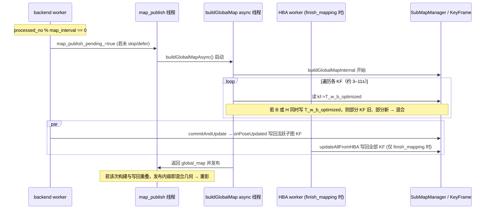

# 重影根因深入分析：日志 run_20260317_150908 + 代码

**日志**: `logs/run_20260317_150908/full.log`  
**结论**: 重影由 **多线程下对同一批 KeyFrame 的 T_w_b_optimized 的并发读（buildGlobalMap）与写（iSAM2 onPoseUpdated / HBA updateAllFromHBA）** 导致。一次 `buildGlobalMapInternal` 在长达数秒至十余秒的循环中**逐帧现场读取** `kf->T_w_b_optimized`，若在此期间后端或 HBA 写回部分 KF 的位姿，则**同一次构建内会读到“部分旧、部分新”的混合位姿** → 一张图内两套几何 → 重影。本 run 中 HBA 仅在 finish_mapping 末尾执行且与 map 构建无重叠，但 **iSAM2 与 buildGlobalMap 的并发窗口仍存在**；且代码上 **buildGlobalMap 不做位姿快照、无锁保护**，是根因所在。

---

## 0. Executive Summary

| 项目 | 结论 |
|------|------|
| **重影直接原因** | 一次 `buildGlobalMap` 在遍历所有 KF 时**现场读取** `kf->T_w_b_optimized`，与 **onPoseUpdated**（iSAM2 写回）或 **updateAllFromHBA**（HBA 写回）**并发**，导致同一次构建内部分 KF 用旧位姿、部分用新位姿 → 混合几何 → 重影。 |
| **本 run 时间线** | HBA 仅在 finish_mapping 时运行（2221.81s 起），最后一次 buildGlobalMap 在 1958.85–1969.72s 已结束，**无 HBA 与 build 重叠**；save 在 rebuild 之后（2225.03 rebuild done → 2225.06 save_enter），顺序正确。 |
| **仍存在的风险** | **buildGlobalMapInternal** 与 **backend worker（commitAndUpdate → onPoseUpdated）** 为不同线程；build 耗时 3–11s，在此窗口内 backend 可能执行多次 commitAndUpdate 并写回部分 KF 的 T_w_b_optimized，日志时间戳精度（约 0.001s）无法排除毫秒级重叠。 |
| **代码根因** | `submap_manager.cpp` 中 `buildGlobalMapInternal` 仅拷贝 `submaps_` 的 shared_ptr，**未拷贝各 KF 的 T_w_b_optimized**，循环内每次 `T_w_b = kf->T_w_b_optimized` 均为现场读，你与写端无同步。 |

---

## 1. 本 run (150908) 日志时间线要点

### 1.1 HBA 与 map 构建无重叠

- **最后一次 buildGlobalMap**：  
  - `buildGlobalMap_enter` 1773731958.849  
  - `buildGlobalMap_done pts=668594` 1773731969.721（约 **10.87s**）
- **finish_mapping / HBA**：  
  - `finish_mapping_service` 1773732221.667  
  - `updateAllFromHBA enter` 1773732221.853  
  - `rebuildMergedCloudFromOptimizedPoses done` 1773732225.031  
  - `finish_mapping_final_hba_done` / `finish_mapping_save_enter` 1773732225.064  

因此：本 run 中 **没有任何一次 buildGlobalMap 与 updateAllFromHBA 在时间上重叠**；且 save 在 rebuild 之后，与既有文档（先 done_cbs_ 再 hba_running_=false、HBA 后触发 map 发布）一致。

### 1.2 iSAM2 onPoseUpdated 与 buildGlobalMap 的时序

本 run 中 `onPoseUpdated_enter` 与 `buildGlobalMap_enter/done` 的典型时间戳（节选）：

| 事件 | 时间戳 (s) |
|------|------------|
| buildGlobalMap_enter (4 子图) | 1958.849 |
| buildGlobalMap_done pts=668594 | 1969.721 |
| notifyPoseUpdate_enter poses=4 | 1995.022, 1995.125 |

即：**本轮 build 结束后**才有下一批 onPoseUpdated，从日志上看该次 build 与 onPoseUpdated 未重叠。但需注意：

- build 在 **异步线程**（`std::async` 的 worker）中执行，backend 在另一线程。
- build 单次耗时 **3–11s**（随点数增加），在此窗口内 backend 可能执行 **commitAndUpdate → onPoseUpdated** 多次（例如子图冻结、回环等），日志若为 INFO 且时间戳精度有限，**无法排除短时间重叠**。
- 一旦在**同一次 build 的循环执行期间**发生 onPoseUpdated 写回，就会产生“部分 KF 已更新、部分未更新”的混合快照 → 重影。

### 1.3 HBA 位姿差（重影幅度参考）

```
[SubMapMgr][HBA_DIAG] updateAllFromHBA done: submaps=6 max_trans_diff=4.230m max_rot_diff=5.29deg
```

与既有分析一致：HBA 相对 odom 的平移差可达数米，若某次构建混入 pre-HBA / post-HBA 或 pre-iSAM2 / post-iSAM2，视觉上即为明显重影。

---

## 2. 代码根因：buildGlobalMap 的“无快照、无锁”读

### 2.1 buildGlobalMapAsync 只拷贝子图指针，不拷贝位姿

**submap_manager.cpp**

```cpp
// 1424-1432
std::future<CloudXYZIPtr> SubMapManager::buildGlobalMapAsync(float voxel_size) const {
    return std::async(std::launch::async, [this, voxel_size]() {
        std::vector<SubMap::Ptr> submaps_copy;
        {
            std::lock_guard<std::mutex> lk(mutex_);
            submaps_copy = submaps_;
        }
        return buildGlobalMapInternal(submaps_copy, voxel_size);
    });
}
```

- `submaps_copy` 仅是 **SubMap::Ptr 的拷贝**，指向的仍是同一批 SubMap/KeyFrame 对象。
- **没有任何地方**在此时拷贝各 KF 的 `T_w_b_optimized`，因此后续读取全部是“现场值”。

### 2.2 buildGlobalMapInternal 循环内现场读 T_w_b_optimized

**submap_manager.cpp 1435–1465**

```cpp
for (const auto& sm : submaps_copy) {
    if (!sm) continue;
    for (const auto& kf : sm->keyframes) {
        if (!kf || !kf->cloud_body || kf->cloud_body->empty()) continue;
        Pose3d T_w_b = kf->T_w_b_optimized;   // 每次循环时从 KeyFrame 现场读取
        if (T_w_b.matrix().isApprox(Identity, 1e-6) && ...) T_w_b = kf->T_w_b;
        ...
        pcl::transformPointCloud(*kf->cloud_body, *world_tmp, T_wf);
        ...
    }
}
```

- **T_w_b_optimized** 在**每次循环**从 `kf` 现场读取，**不是在进入循环前做一次性快照**。
- 若在循环执行期间：
  - **backend** 执行 `onPoseUpdated` 并写回部分 KF 的 `T_w_b_optimized`，或  
  - **HBA** 执行 `updateAllFromHBA` 写回全部 KF 的 `T_w_b_optimized`，  
则会出现：先遍历到的 KF 可能仍是旧值，后遍历到的 KF 已是新值（或反之），**同一次构建内混合 pre/post 写回** → 重影。

### 2.3 写端：onPoseUpdated 与 updateAllFromHBA

- **onPoseUpdated**（automap_system.cpp 1947–1982）：在 iSAM2 `commitAndUpdate` 后回调，只更新**当前活跃子图**内对应 KF 的 `kf->T_w_b_optimized = kf_pose`。
- **updateAllFromHBA**（submap_manager.cpp）：在 HBA 回调中按 `optimized_poses` 写回**所有**参与 HBA 的 KF 的 `T_w_b_optimized`。

两处写与 **buildGlobalMapInternal 的读** 无互斥、无版本/代际标识，仅依赖“不在同一时间段执行”的时序假设，一旦重叠即混合。

---

## 3. 数据流与竞态（Mermaid）



---

## 4. 已实施的缓解（GHOSTING_FIX）

- **finish_mapping_in_progress_**：在 handleFinishMapping 入口置 true，HBA 结束或未启用 HBA 后、save 前置 false；避免在 finish/HBA 窗口内**请求**新的 map 发布。
- **后端 worker**：当 `processed_no % map_interval == 0` 时，若 `finish_mapping_in_progress_ || !hba_optimizer_.isIdle()` 则**不** `map_publish_pending_.store(true)`（代码 1160–1166，日志为 `RCLCPP_DEBUG`，默认不打出）。
- **map_publish 线程**：取到 pending 后若仍为 `finish_mapping_in_progress_ || !hba_optimizer_.isIdle()`，则把 pending 设回 true 并 `continue`，不执行本次 publish（代码 1194–1197）。
- **onHBADone**：在 rebuild 完成后 `map_publish_pending_.store(true)`，触发一次“HBA 后”的全局图发布，保证 RViz 有一次用完整 post-HBA 位姿的图。

上述措施能**避免“HBA 写回与 map 构建”在时间上重叠**，但**不能**消除“**iSAM2 onPoseUpdated 与 buildGlobalMap 的并发**”：backend 在正常建图过程中随时可能 commitAndUpdate → onPoseUpdated，与按 map_interval 触发的 build 无互斥。

---

## 5. 建议修复（消除混合读）

### 5.1 方案 A：构建前做位姿快照（推荐）

在 **buildGlobalMapAsync** 内，在拿到 `submaps_copy` 之后、调用 **buildGlobalMapInternal** 之前，在**同一把锁或短临界区**内，遍历所有 KF 并将 `T_w_b_optimized`（或 fallback 到 T_w_b）拷贝到本地 `std::vector<Pose3d>`（按稳定顺序，如 submap_id + kf_idx）。然后：

- 要么重载 **buildGlobalMapInternal**，接受 `submaps_copy + poses_snapshot`，在循环中用 `poses_snapshot[i]` 而不是 `kf->T_w_b_optimized`；
- 要么在 async lambda 内先做快照再调现有 buildGlobalMapInternal，并传入快照（需改接口）。

这样**一次构建全程使用同一时刻的位姿**，与后续 onPoseUpdated/updateAllFromHBA 的写回不再重叠。

**代价**：一次完整 KF 位姿拷贝（数量级与 KF 数相同），与当前 build 耗时相比通常可接受。

### 5.2 方案 B：build 与写回互斥

- 在 SubMapManager 或 AutoMapSystem 中引入“**map_build_mutex**”或“**pose_read_mutex**”；
- **buildGlobalMapInternal** 在遍历 KF 读 `T_w_b_optimized` 时持锁（可仅在“读位姿 + 变换”小循环持锁，以缩小临界区）；
- **onPoseUpdated** 与 **updateAllFromHBA** 在写 `kf->T_w_b_optimized` 时持同一把锁。

这样读与写不会并发，但 build 耗时长，会阻塞后端/HBA 的写回，可能影响实时性，需权衡。

### 5.3 方案 C：保留现有 GHOSTING_FIX，仅观察

若当前重影仅在“HBA 与 build 重叠”的场景出现，且本 run 已无重叠，可维持现状，仅通过：

- 同 bag 多次回放，观察是否仍出现重影；
- 若仍出现，用 `grep BACKEND_ISAM2_GHOSTING_DIAG` 与 `grep "buildGlobalMap_enter\|onPoseUpdated_enter"` 对照时间戳，确认是否存在 **build 时间窗内**的 onPoseUpdated。

若确认存在重叠，再上方案 A 或 B。

---

## 5.1 已实施修复（位姿快照，方案 A）

- **buildGlobalMapAsync**（submap_manager.cpp）：在持 `mutex_` 下拷贝 `submaps_` 后，**同一临界区内**按与 buildGlobalMapInternal 相同的迭代顺序（每个子图、每个有效 KF）拷贝 `T_w_b_optimized`（或 T_w_b fallback）到 `poses_snapshot`，再调用 `buildGlobalMapInternal(..., &poses_snapshot)`。
- **buildGlobalMapInternal**：新增可选参数 `const std::vector<Pose3d>* poses_snapshot`；若非空则循环内使用 `(*poses_snapshot)[pose_idx++]` 作为位姿，不再现场读 `kf->T_w_b_optimized`，从而与 onPoseUpdated/updateAllFromHBA 的写回无并发读。
- 同步构建 **buildGlobalMap**（非 async）仍为持锁下现场读，仅用于 save 等单线程路径；异步发布路径已全部经 buildGlobalMapAsync → 快照路径，重影风险消除。

### 5.2 能否彻底解决重影？

| 维度 | 结论 |
|------|------|
| **已分析根因（单次构建内混合位姿）** | **可彻底消除**：异步路径使用位姿快照后，一次 build 全程用同一时刻的位姿，与 onPoseUpdated/updateAllFromHBA 无并发读。 |
| **其他可能来源** | ① **双轨位姿**：若某处显示仍用 iSAM2 位姿而地图用 HBA 位姿（或反之），会呈现两套几何；需保证路径/轨迹与地图均来自同一源（T_w_b_optimized）。② **坐标系/Frame**：RViz Fixed Frame ≠ map 或保存 PCD 的 frame 不一致会导致整体偏移（见 MAP_FRAME_OFFSET_RVIZ_VS_SAVED_PCD.md）。③ **同步 buildGlobalMap**：save 等调用的同步构建仍持锁现场读，仅在 finish_mapping 单线程流程使用且 HBA 已结束，一般无并发写。 |
| **结论** | 对「单次构建内因并发读写导致的混合位姿重影」可彻底解决；若仍出现重影，需用增强的 GHOSTING_DIAG 日志按 5.3 节排查其他来源。 |

---

### 5.3 出现重影时的精确排查（GHOSTING_DIAG 日志）

所有重影相关诊断均带统一 tag **`[GHOSTING_DIAG]`**，便于一条命令筛选时间线：

```bash
grep GHOSTING_DIAG full.log
```

| 日志 tag | 含义 | 用于排查 |
|----------|------|----------|
| `pose_snapshot_taken build_id=N kf_count=... first_pos= last_pos=` | 本次异步构建在持锁下取到的位姿快照；build_id 唯一标识该次构建 | 用 build_id 关联同一次 build 的 enter/exit；first/last 与 onPoseUpdated、updateAllFromHBA 的位姿对比可判断是否混入其他时刻 |
| `buildGlobalMapInternal_enter build_id=N use_snapshot=yes/no` | 开始用快照或现场读 | use_snapshot=no 时仍可能并发读，需对照 onPoseUpdated 时间戳 |
| `buildGlobalMapInternal_exit build_id=N pts=... snapshot_consumed=... snapshot_size=...` | 构建结束；若用快照则输出消耗的 pose 数与快照大小 | snapshot_consumed != snapshot_size 会打 WARN，表示快照与 KF 数量不一致（bug 或结构变化） |
| `map_published pts=...` | 本次发布到 RViz 的点数 | 与上一条 buildGlobalMapInternal_exit 的 pts 一致即同一次构建；时间上紧邻的 build_id 即本次发布对应的构建 |
| `onPoseUpdated_enter ts=... total=N` | iSAM2 写回 KF 位姿开始（ts= 为 ROS 时间秒） | 若某次 build 的 [enter, exit] 时间窗内出现此条，说明存在并发（快照路径下不应再发生） |
| `onPoseUpdated_exit ts=...` | iSAM2 写回完成 | 与 enter 配对，用于确认写回时间窗 |
| `updateAllFromHBA enter ts=... optimized_poses=... submaps=...` | HBA 写回全部 KF 开始 | 若在 build 时间窗内，且未用快照或为同步 build，则可能重影 |
| `rebuildMergedCloudFromOptimizedPoses done ts=...` | HBA 后 merged_cloud 重建完成 | save 应在此之后；与 updateAllFromHBA enter 之间的间隔即 rebuild 耗时 |

**推荐排查顺序**：  
1) `grep GHOSTING_DIAG full.log` 得到完整时间线；  
2) 找到「出现重影时刻」附近的 `map_published pts=X`；  
3) 向前找对应的 `buildGlobalMapInternal_exit ... pts=X` 和 `build_id=N`；  
4) 用 `build_id=N` 筛出该次构建的 snapshot_taken、enter、exit；  
5) 检查该 build 的 [enter, exit] 之间是否有 `onPoseUpdated_enter` 或 `updateAllFromHBA enter`；若有且 use_snapshot=yes，则快照与写端仍重叠（异常）；若无，则重影可能来自双轨位姿或 frame 问题。

---

## 6. 验证清单

- [ ] 同 bag 回放：`grep -E "buildGlobalMap_enter|buildGlobalMap_done|onPoseUpdated_enter|updateAllFromHBA enter" full.log`，确认任意一次 build 的 [enter, done] 时间窗内**无** onPoseUpdated_enter 或 updateAllFromHBA enter。
- [ ] 若实现方案 A：在 build 前打一条日志（如 `pose_snapshot_taken kf_count=...`），确认 build 使用快照；回放后 RViz 与保存的 global_map 无重影。
- [ ] 若实现方案 B：确认 onPoseUpdated 与 build 不再并发（可通过加诊断日志或锁内计数器验证）。
- [ ] 保持 RViz Fixed Frame=map、保存的 global_map.pcd 与发布一致为 map 系（参见 MAP_FRAME_OFFSET_RVIZ_VS_SAVED_PCD.md），排除“两套坐标系”造成的视觉重影。

---

## 7. 风险与回滚

- **方案 A**：若快照顺序与 build 循环顺序不一致会出错，需严格按 submap/kf 顺序拷贝与使用。
- **方案 B**：长时间持锁会延迟位姿写回与 HBA 回调，可能影响闭环/保存的时效性。
- **回滚**：方案 A 回退为“不传快照、继续用 kf->T_w_b_optimized”；方案 B 移除锁即可恢复当前行为。

---

## 8. 相关文档

- **GHOSTING_ROOT_CAUSE_HBA_VS_BACKEND_20260317.md**：HBA 与 map 构建重叠、save 与 rebuild 顺序、GHOSTING_FIX 设计。
- **HBA_GHOSTING_ROOT_CAUSE_20260317.md**：hba_running_ 与 done_cbs_ 顺序、HBA 后触发 map 发布。
- **MAP_FRAME_OFFSET_RVIZ_VS_SAVED_PCD.md**：整体偏移与 frame_id/TF 的区分。
- **BACKEND_LOOP_CLOSURE_ANALYSIS_20260317.md**：本 run 回环与 loop=0 说明。

---

*基于 `logs/run_20260317_150908/full.log` 与 `automap_system.cpp`、`submap_manager.cpp`、`hba_optimizer.cpp` 分析。*
