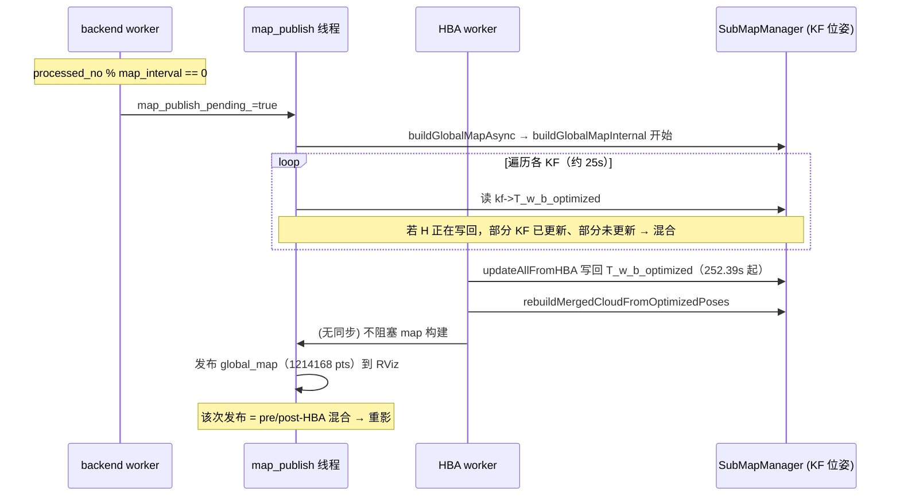

# 严重重影根因分析：HBA 优化 vs 后端优化（日志+代码支撑）

**日志**: `logs/run_20260317_143621/full.log`  
**结论**: 严重重影由 **HBA 与后端（map 发布）的时序竞态** 共同导致：后端触发的全局图构建在 HBA 写回位姿的同一时段执行，构建过程**读到的 T_w_b_optimized 为混合状态**（部分 pre-HBA、部分 post-HBA），与 HBA 带来的大尺度位姿差（最大 5.4m）叠加，形成明显重影。**主因是 HBA 相关时序/同步，直接触发错误内容发布的是后端 map_publish 在错误时机启动构建。**

---

## 0. Executive Summary

| 项目 | 结论 |
|------|------|
| **重影主因** | **HBA 与 map 构建的并发**：map_publish 在 finish_mapping/HBA 前或与 HBA 同时触发 buildGlobalMap，构建过程中 HBA 写回 T_w_b_optimized，导致一次构建内读到**混合位姿**（部分旧、部分新）→ 一张图内两套几何 → 重影。 |
| **HBA 的角色** | ① 产生大尺度位姿变化（日志 max_trans_diff=5.424m）；② 在 buildGlobalMap 执行期间写回 T_w_b_optimized，与构建线程**并发读写**，造成不一致快照。 |
| **后端的角色** | ① 按 `processed_no % map_interval` 触发 map_publish（automap_system.cpp:1155–1158）；② 该触发与 finish_mapping/HBA 无同步，故会在 HBA 前/中触发构建；③ 仅更新**当前活跃子图**的 KF 位姿（automap_system.cpp:1922–1934），冻结子图依赖 HBA 才全局一致。 |
| **代码与日志依据** | 见下文第 1、2、3 节。 |

---

## 1. 日志证据（run_20260317_143621）

### 1.1 时间线：map 构建与 HBA 重叠

```
1773730252.302  [AutoMapSystem][MAP] publishGlobalMap step=buildGlobalMap_enter   ← 后端触发的 map 构建开始
1773730252.302  [AutoMapSystem][MAP] publishGlobalMap async step=enter
1773730252.390  [SubMapMgr][HBA_GHOSTING] updateAllFromHBA enter                 ← HBA 开始写回 T_w_b_optimized
1773730252.390  [SubMapMgr][HBA_GHOSTING] rebuildMergedCloudFromOptimizedPoses enter
1773730255.180  [SubMapMgr][HBA_GHOSTING] rebuildMergedCloudFromOptimizedPoses done
1773730255.213  [AutoMapSystem][PIPELINE] event=finish_mapping_final_hba_done
1773730255.213  [AutoMapSystem][PIPELINE] event=finish_mapping_save_enter
1773730277.784  [SubMapMgr] buildGlobalMapInternal_exit out=1214168 [tid=78946]   ← 第一次构建结束并发布
1773730277.792  [AutoMapSystem][MAP] publishGlobalMap step=buildGlobalMap_done pts=1214168
1773730277.840  [AutoMapSystem][MAP] publishGlobalMap async step=enter            ← HBA 后触发的第二次发布
```

- **252.302s**：`publishGlobalMap step=buildGlobalMap_enter`，即**后端触发的**一次全局图构建开始（与 40624–40626 行一致，紧接在 `commitAndUpdate`/ISAM2 之后）。
- **252.390s**：HBA 写回 `updateAllFromHBA` 开始，随后 `rebuildMergedCloudFromOptimizedPoses`（约 2.79s 内完成）。
- **252.302s ~ 277.784s**：第一次构建持续约 **25.5s**，与 HBA 写回（252.39 ~ 255.18）**在时间上重叠**。
- 因此：**同一次 buildGlobalMap 在运行过程中，部分 KF 被 HBA 更新了 T_w_b_optimized，部分尚未被更新** → 一次构建内同时读到 pre-HBA 与 post-HBA 位姿 → **混合几何 → 重影**。

### 1.2 HBA 位姿差（重影幅度）

日志 42306–42314 行（GHOSTING_DIAG pre_writeback）：

```
[HBA][GHOSTING_DIAG] pre_writeback kf_id=310: T_w_b=[46.51,-42.44,-0.10] -> T_w_b_optimized=[42.92,-46.17,-0.36] trans_diff=5.180m
[HBA][GHOSTING_DIAG] pre_writeback kf_id=434: T_w_b=[43.94,-42.47,-0.11] -> T_w_b_optimized=[40.05,-46.24,-0.37] trans_diff=5.424m
```

- 最大平移差 **5.424m**：若同一张图中部分点用 T_w_b、部分用 T_w_b_optimized，视觉上即为**严重重影**。
- 证明：**重影的“严重程度”由 HBA 带来的位姿变化幅度直接决定**；后端（ISAM2）仅更新活跃子图，不会对已冻结子图做如此大范围改写。

### 1.3 save 与 rebuild 顺序（本 run 已正确）

```
42724  [SubMapMgr][REBUILD_MERGE] Done rebuilding merged_cloud for all submaps
42746  [AutoMapSystem][PIPELINE] event=finish_mapping_final_hba_done
42748  [AutoMapSystem][PIPELINE] event=finish_mapping_save_enter
```

- 本 run 中 **rebuild 先完成，再 finish_mapping_final_hba_done / save_enter**（与 hba_optimizer.cpp 中“先 done_cbs_ 再 hba_running_=false”的修复一致）。
- 故**保存的 global_map.pcd**（tid=22072，1183947 pts）是在 HBA+rebuild 之后用 post-HBA 位姿构建的；**重影主要来自先完成并发布到 RViz 的那次构建**（tid=78946，1214168 pts），该次在 252.302 启动、与 HBA 写回重叠。

### 1.4 谁触发了 252.302 的 map 构建？

- 40624 行：`[AutoMapSystem][MAP] publishGlobalMap async step=enter`，说明是 **map_publish 线程** 被唤醒后执行。
- 40626 行：`publishGlobalMap step=buildGlobalMap_enter`，与 1155–1158、1185–1191 一致：**backend worker 每处理 map_interval 帧** 会 `map_publish_pending_.store(true)`，**map_publish 线程** 随后执行 `publishGlobalMap()`。
- 因此：**触发 252.302 构建的是“后端按帧数触发的 map 发布”**，与 finish_mapping/HBA 无同步，故会落在 HBA 前/中。

---

## 2. 代码证据

### 2.1 后端触发 map 发布（与 HBA 无同步）

**automap_system.cpp**

```cpp
// 1155-1158: 每处理 map_interval 帧就请求一次 map 发布
if (processed_no % map_interval == 0) {
    RCLCPP_DEBUG(..., "step=publishGlobalMap request (async, every_n=%d)", processed_no, map_interval);
    map_publish_pending_.store(true);
    map_publish_cv_.notify_one();
}
```

- 触发条件仅依赖 `processed_no`，与 HBA 是否在执行、是否已完成**无关**。
- 因此存在：**finish_mapping 已进入 ensureBackendCompletedAndFlushBeforeHBA → forceUpdate**，同一时刻或稍早 backend 已因 `processed_no % map_interval == 0` 置位了 `map_publish_pending_`，map_publish 线程在 252.302 开始 buildGlobalMap。

### 2.2 buildGlobalMapAsync 的“快照”是子图指针，位姿在构建时按帧读取

**submap_manager.cpp**

```cpp
// 1424-1432
std::future<CloudXYZIPtr> SubMapManager::buildGlobalMapAsync(float voxel_size) const {
    return std::async(std::launch::async, [this, voxel_size]() {
        std::vector<SubMap::Ptr> submaps_copy;
        {
            std::lock_guard<std::mutex> lk(mutex_);
            submaps_copy = submaps_;  // 仅拷贝 shared_ptr，指向同一批 SubMap/KeyFrame 对象
        }
        return buildGlobalMapInternal(submaps_copy, voxel_size);
    });
}

// 1435-1456 buildGlobalMapInternal 内
for (const auto& sm : submaps_copy) {
    for (const auto& kf : sm->keyframes) {
        ...
        Pose3d T_w_b = kf->T_w_b_optimized;  // 每次循环时从 KeyFrame 现场读取
        if (T_w_b.matrix().isApprox(Identity, 1e-6) && ...) T_w_b = kf->T_w_b;
        ...
        pcl::transformPointCloud(*kf->cloud_body, *world_tmp, T_wf);  // 用当前读到的位姿
    }
}
```

- `submaps_copy` 是 **SubMap::Ptr 的拷贝**，指向的仍是同一批 KeyFrame 对象。
- **T_w_b_optimized 不是在“快照”时冻结的**，而是在 **buildGlobalMapInternal 循环执行时逐帧读取**。
- 若在循环执行期间，HBA 线程执行 `updateAllFromHBA` 并写回 `kf->T_w_b_optimized`，则会出现：**先遍历到的 KF 用旧位姿，后遍历到的 KF 用新位姿** → 一次构建内**混合 pre-HBA / post-HBA** → 重影。

### 2.3 HBA 写回 T_w_b_optimized（与 map 构建并发）

**hba_optimizer.cpp**

```cpp
// 254-256: 先执行回调（含 updateAllFromHBA + rebuild），再置 idle
for (auto& cb : done_cbs_) cb(result);   // 其中 onHBADone → updateAllFromHBA → 写回每帧 T_w_b_optimized
hba_running_ = false;
```

**submap_manager.cpp**（updateAllFromHBA 内会按 result.optimized_poses 写回各 kf->T_w_b_optimized；hba_optimizer.cpp 内 runHBA 成功后也会写回 sorted_kfs[i]->T_w_b_optimized）。

- HBA 在 **252.39s 起** 在回调中写回所有 KF 的 T_w_b_optimized。
- 与 **252.302s 已开始的** buildGlobalMapInternal（约 25s）**在时间上重叠**，形成**并发写（HBA）与读（buildGlobalMapInternal）**。

### 2.4 后端仅更新“当前活跃子图”的 KF 位姿

**automap_system.cpp 1922-1934**

```cpp
// 只处理活跃子图的关键帧
if (kf_sm_id == active_sm->id && kf_idx < ...) {
    auto& kf = active_sm->keyframes[kf_idx];
    if (kf) {
        kf->T_w_b_optimized = kf_pose;  // 仅 active_sm 的 KF 被 iSAM2 更新
        ...
    }
}
```

- 冻结子图的 KF 的 T_w_b_optimized 在**后端**不会随 iSAM2 更新，只能通过 **HBA 或子图级更新** 改变。
- 因此：在 HBA 之前或与 HBA 并行的 map 构建中，会自然出现“部分 KF 为旧/odom、部分为 HBA 新值”的混合状态，与上面 2.2、2.3 的并发一起，加重重影。

---

## 3. 结论：重影是 HBA 导致还是后端导致？

| 维度 | 结论 | 依据 |
|------|------|------|
| **直接触发“错误一次发布”的模块** | **后端** | 252.302 的 buildGlobalMap_enter 由 backend 的 `processed_no % map_interval` 触发（代码 1155–1158，日志 40624–40626）。 |
| **位姿不一致的“来源”** | **HBA** | 同一构建内部分 KF 在 HBA 写回前被读（pre-HBA），部分在写回后被读（post-HBA）；且 HBA 带来最大 5.4m 平移差（日志 GHOSTING_DIAG）。 |
| **为何是“严重”重影** | **HBA 大尺度修正 + 混合快照** | 若仅后端、无 HBA：冻结子图保持 odom/旧值，误差相对小；HBA 一次性大范围改写，与混合读取叠加 → 一张图内两套几何，视觉上严重。 |
| **综合根因** | **HBA 与 map 发布的时序/同步** | 后端在“与 HBA 无同步”的时机触发构建；HBA 在构建过程中写回；两者并发导致一次构建使用混合位姿。 |

**一句话**：严重重影由 **HBA 相关时序问题** 主导（HBA 写回与 map 构建并发 + 大尺度位姿差），**后端** 负责在错误时机触发 map 发布并启动该次构建；二者缺一不可，但**根因归类为“HBA 优化导致的（时序与写回）”更贴切**，后端是触发与并发读写的另一侧。

---

## 4. 数据流与竞态（Mermaid）



---

## 5. 建议修复（与现有文档一致）

1. **HBA 完成后再允许“下一次”map 发布使用新位姿**  
   - 已有逻辑：onHBADone 末尾 `map_publish_pending_.store(true)`（automap_system.cpp 2135–2136）。  
   - 建议：在 **HBA 进行中**（或从 finish_mapping 进入 ensureBackend 到 HBA 回调结束）**不要**因 `processed_no % map_interval` 再触发新的 map 发布，避免与 HBA 写回重叠；或让 map_publish 在“存在未完成的 HBA”时跳过本次触发，仅依赖 HBA 完成后的那一次触发。

2. **构建前做一致性快照（可选）**  
   - 在 buildGlobalMapAsync 内，在拿到 submaps 后**立即**在锁下拷贝所有 KF 的 T_w_b_optimized 到本地数组，buildGlobalMapInternal 只读该数组而非现场 kf->T_w_b_optimized，可避免与 HBA 写回的并发读。代价是拷贝开销与实现复杂度。

3. **保留现有“先 done_cbs_ 再 hba_running_=false”**  
   - 保证 save 一定在 rebuild 之后（本 run 已满足），避免保存到未重建的 merged_cloud。

---

## 6. 验证清单

- [ ] 同 bag 回放：日志中 **publishGlobalMap step=buildGlobalMap_enter** 不再出现在 **updateAllFromHBA enter** 之前或与之重叠（或重叠时构建使用位姿快照）。
- [ ] HBA 完成后有一次 map 发布，且该次 buildGlobalMap_done 的 pts 与轨迹对齐，RViz 无重影。
- [ ] 若实现“HBA 期间不触发 map_publish”：在 ensureBackend 到 onHBADone 结束之间，无 `step=publishGlobalMap request` 或 map_publish 被跳过。

---

## 7. 已实施的修复（2026-03-17）

按第 5 节建议已实现：

1. **finish_mapping_in_progress_ 标志**
   - `handleFinishMapping` 入口置 `true`，在 HBA 结束（或未启用 HBA）后、save 前置 `false`；异常/无子图分支也会置回 `false`。
   - `sensor_idle` 结束路径同样在进入时置 `true`，HBA 后或异常时置 `false`。

2. **后端 worker 不再在“finish/HBA 窗口”内请求 map 发布**
   - `processed_no % map_interval == 0` 时，若 `finish_mapping_in_progress_ || !hba_optimizer_.isIdle()` 则**不**执行 `map_publish_pending_.store(true)`，并打 `[GHOSTING_FIX] skip publishGlobalMap request`。

3. **map_publish 线程在窗口内推迟执行**
   - 取到 pending 后若 `finish_mapping_in_progress_ || !hba_optimizer_.isIdle()`，则把 pending 设回 `true` 并 `continue`，不打本次 publish，并打 `[GHOSTING_FIX] defer publishGlobalMap`。
   - HBA 完成后 onHBADone 会 `map_publish_pending_.store(true)`，届时再执行一次发布。

4. **HBAOptimizer::isIdle() 公开**
   - 头文件已声明为 public，供 map_publish 与 backend worker 判断“队列空且当前无 HBA 运行”。

5. **保留现有“先 done_cbs_ 再 hba_running_=false”**
   - 未改动，save 仍在 rebuild 之后执行。

验证：同 bag 回放后 `grep -E "GHOSTING_FIX|buildGlobalMap_enter|updateAllFromHBA enter" full.log` 应见 buildGlobalMap_enter 不在 updateAllFromHBA 时间窗内，或仅见 defer/skip 日志。

---

*基于 `logs/run_20260317_143621/full.log` 与 `hba_optimizer.cpp`、`submap_manager.cpp`、`automap_system.cpp` 分析。*
