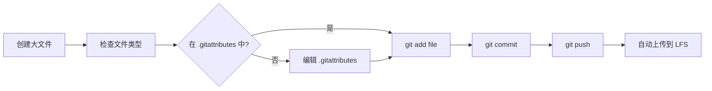

# Git LFS 使用指南

## 目录

1. [概述](#概述)
2. [安装与初始化](#安装与初始化)
3. [文件管理](#文件管理)
4. [常用命令](#常用命令)
5. [最佳实践](#最佳实践)
6. [故障排查](#故障排查)
7. [团队协作](#团队协作)

---

## 概述

### 什么是 Git LFS？

Git Large File Storage (LFS) 是 Git 的扩展，用于管理大型文件。它用文本指针替换大文件，并将实际内容存储在远程 LFS 服务器上。

### 为什么使用 Git LFS？

| 特性 | 普通 Git | Git LFS |
|------|----------|---------|
| 仓库大小 | 包含所有文件历史 | 只包含指针（~1KB） |
| 克隆速度 | 慢（需要下载所有大文件） | 快（先下载代码，按需下载大文件） |
| 推送速度 | 慢（上传所有大文件） | 快（只上传新的/修改的大文件） |
| 带宽消耗 | 高 | 低 |
| 版本历史 | 支持 | 支持 |

### 当前配置

我们已配置 LFS 追踪以下文件类型：

- **ROS bag 文件**: `*.bag`, `*.db3`
- **模型权重**: `*.pth`, `*.pth.tar`, `*.pt`, `*.onnx`
- **点云数据**: `*.ply`, `*.pcd`, `*.las`, `*.laz`
- **文档**: `*.pdf`
- **媒体文件**: `*.gif`, `*.mp4`, `*.avi`, `*.mov`
- **二进制数据**: `*.bin`, `data/**/*.bin`
- **其他**: `*.tar.gz`, `*.zip`, `*.pkl`, `*.h5`, etc.

配置文件: `.gitattributes`

---

## 安装与初始化

### 安装 Git LFS

**Ubuntu/Debian**:
```bash
sudo apt update
sudo apt install git-lfs
```

**macOS**:
```bash
brew install git-lfs
```

**Windows**:
下载并安装: https://git-lfs.github.com/

### 验证安装

```bash
git lfs version
# 预期输出: git-lfs/2.x.x (GitHub)
```

### 初始化仓库

```bash
# 克隆仓库后
git lfs install

# 验证
git lfs env
```

---

## 文件管理

### 添加新的大文件

```bash
# 1. 正常添加文件（.gitattributes 会自动处理）
git add large_file.bag
git commit -m "add large file"
git push

# 2. 验证文件已由 LFS 追踪
git lfs ls-files | grep large_file.bag
```

### 检查 LFS 文件状态

```bash
# 显示所有 LFS 文件
git lfs ls-files

# 显示 LFS 文件大小
git lfs ls-files -l

# 显示 LFS 锁定状态（如果使用锁定功能）
git lfs locks
```

### 下载 LFS 文件

```bash
# 下载所有 LFS 文件
git lfs pull

# 下载特定文件
git lfs pull --include="data/*.bag"

# 下载特定分支的所有文件
git lfs pull origin main
```

### 上传 LFS 文件

```bash
# 上传所有 LFS 文件
git lfs push --all origin main

# 上传特定文件
git lfs push origin main --include="large_file.bag"
```

---

## 常用命令

### 管理 LFS 追踪规则

```bash
# 查看当前追踪规则
git lfs track

# 添加新的追踪规则
git lfs track "*.xyz"

# 移除追踪规则（不会删除现有文件）
git lfs untrack "*.xyz"

# 显示所有未追踪的大文件
./git-lfs-manager.sh status
```

### LFS 状态检查

```bash
# 显示 LFS 环境信息
git lfs env

# 显示 LFS 存储使用情况
./git-lfs-manager.sh info

# 查看本地 LFS 文件状态
git lfs status
```

### 文件锁定（可选）

```bash
# 锁定文件（防止冲突）
git lfs lock large_file.bag

# 解锁文件
git lfs unlock large_file.bag

# 查看所有锁定
git lfs locks
```

---

## 最佳实践

### 1. 文件大小策略

| 文件大小 | 处理方式 |
|----------|----------|
| < 1MB | 普通 Git |
| 1MB - 10MB | 普通 Git（考虑使用 LFS） |
| > 10MB | **必须使用 LFS** |
| > 100MB | **必须使用 LFS + 压缩** |
| > 1GB | 考虑外部存储（S3、NFS） |

### 2. 工作流程



### 3. 提交前检查

创建 pre-commit hook 自动检查：

```bash
# .git/hooks/pre-commit
#!/bin/bash
MAX_SIZE=$((10 * 1024 * 1024))  # 10MB

while read -r file; do
    if [ -f "$file" ]; then
        size=$(stat -c%s "$file" 2>/dev/null || echo 0)
        if [ "$size" -gt "$MAX_SIZE" ]; then
            # 检查是否由 LFS 追踪
            if ! git lfs track "$file" | grep -q "is tracked"; then
                echo "错误: $file 大小超过 10MB 且未由 LFS 追踪"
                echo "请先配置 .gitattributes: git lfs track \"$(basename $file)\""
                exit 1
            fi
        fi
    fi
done < <(git diff --cached --name-only --diff-filter=ACM)
```

### 4. 定期维护

```bash
# 每月检查一次 LFS 使用情况
./git-lfs-manager.sh info

# 清理未使用的 LFS 文件（谨慎！）
git lfs prune

# 验证 LFS 文件完整性
git lfs fsck
```

### 5. 团队协作

**推送前**:
```bash
# 确保所有 LFS 文件已上传
git lfs push --all origin main

# 然后推送代码
git push origin main
```

**拉取后**:
```bash
# 确保下载所有 LFS 文件
git lfs pull

# 验证
git lfs ls-files
```

---

## 故障排查

### 问题 1: LFS 文件显示为指针文件（文本）

**现象**:
```bash
cat large_file.bag
# 显示: version https://git-lfs.github.com/spec/v1 ...
```

**原因**: LFS 文件未下载

**解决**:
```bash
git lfs pull
# 或
git lfs pull --include="large_file.bag"
```

### 问题 2: 推送失败 - LFS 配额不足

**现象**:
```
error: LFS: quota exceeded (403)
```

**原因**: GitHub LFS 存储或带宽超限

**解决**:
1. 检查配额: https://github.com/settings/billing
2. 清理不需要的 LFS 文件
3. 升级 GitHub 计划

### 问题 3: 克隆仓库后 LFS 文件缺失

**现象**:
```bash
git clone git@github.com:user/repo.git
cd repo
ls -la large_file.bag
# 文件大小显示为 1KB（指针文件）
```

**解决**:
```bash
# 方法1: 克隆时自动下载 LFS 文件
GIT_LFS_SKIP_SMUDGE=1 git clone git@github.com:user/repo.git
cd repo
git lfs pull

# 方法2: 克隆后手动下载
git lfs install
git lfs pull
```

### 问题 4: LFS 文件上传失败

**现象**:
```
Error: batch response: Post https://github.com/...: EOF
```

**原因**: 网络问题或文件过大

**解决**:
```bash
# 检查网络连接
ping github.com

# 检查 LFS 配置
git config --global lfs.https://github.com/.info/lfs.access basic
git config --global lfs.https://github.com/.../info/lfs.access basic

# 重试上传
git lfs push --all origin main
```

### 问题 5: .gitattributes 不生效

**现象**: 添加的文件没有由 LFS 追踪

**原因**: .gitattributes 规则顺序或语法错误

**解决**:
```bash
# 验证 .gitattributes
cat .gitattributes

# 确保格式正确（注意空格和tab）
*.bag filter=lfs diff=lfs merge=lfs -text

# 检查文件是否匹配
git check-attr -a path/to/file.bag

# 重新扫描并添加文件
git add --renormalize .
```

---

## 团队协作

### 新成员入职流程

1. **克隆仓库**:
   ```bash
   git clone git@github.com:xinruozhishui201314/automap_pro.git
   cd automap_pro
   ```

2. **初始化 LFS**:
   ```bash
   git lfs install
   git lfs pull
   ```

3. **验证**:
   ```bash
   git lfs ls-files
   git lfs env
   ```

### 提交规范

**添加新的大文件**:
```bash
# 1. 确保文件类型在 .gitattributes 中
git lfs track

# 2. 添加文件
git add new_large_file.bag

# 3. 检查是否由 LFS 追踪
git lfs ls-files | grep new_large_file.bag

# 4. 提交并推送
git commit -m "feat: add new data file"
git lfs push --all origin main
git push origin main
```

### 代码审查

检查 PR 时注意：
- [ ] 新增的大文件是否由 LFS 追踪
- [ ] .gitattributes 是否包含正确的文件类型
- [ ] 是否有误提交的临时文件或构建产物

### 备份策略

**定期备份 LFS 文件**:
```bash
# 备份到本地
git lfs fetch --all
git lfs export --all --output=/path/to/backup/

# 备份到 S3（可选）
aws s3 sync --exclude="*" --include="*.bag" . s3://bucket/path/
```

---

## Git LFS 配额管理

### GitHub LFS 限制

| 计划 | 存储 | 带宽/月 | 价格 |
|------|------|---------|------|
| Free | 1 GB | 1 GB | 免费 |
| Pro | 2 GB | 10 GB | $4/月 |
| Team | 2 GB | 50 GB | $4/用户/月 |
| Enterprise | 50 GB | 100 GB | 定制 |

### 监控使用情况

```bash
# 查看本地 LFS 文件统计
git lfs ls-files | awk '{print $3}' | xargs du -ch | tail -1

# 查看远程配额（GitHub）
# 访问: https://github.com/organizations/<org>/settings/billing
```

### 优化存储使用

1. **清理不需要的 LFS 文件**:
   ```bash
   # 删除文件
   git rm --cached large_file.bag
   git commit -m "remove large file"

   # 清理 LFS 存储
   git lfs prune
   ```

2. **压缩文件**:
   ```bash
   # 压缩 bag 文件
   rosbag compress input.bag -O output.bag

   # 压缩点云数据
   pcl_zip_tool input.ply -o output.ply.zip
   ```

3. **使用更高效的格式**:
   - ROS bag2 (`.mcap`) 替代 bag1 (`.bag`)
   - LASzip (`.laz`) 替代 LAS (`.las`)

---

## 自动化管理脚本

我们提供了一个管理脚本 `git-lfs-manager.sh`：

```bash
# 显示帮助
./git-lfs-manager.sh help

# 初始化 LFS
./git-lfs-manager.sh init

# 显示状态
./git-lfs-manager.sh status

# 显示使用情况
./git-lfs-manager.sh info

# 拉取所有 LFS 文件
./git-lfs-manager.sh pull

# 推送所有 LFS 文件
./git-lfs-manager.sh push
```

---

## 参考资源

- [Git LFS 官方文档](https://git-lfs.github.com/)
- [GitHub LFS 指南](https://docs.github.com/en/repositories/working-with-files/managing-large-files/about-git-large-file-storage)
- [ROSbag 文档](http://wiki.ros.org/rosbag)
- [点云格式参考](https://www.danielgm.net/cc/docs/pcd_format/)

---

## 更新日志

| 日期 | 版本 | 变更 |
|------|------|------|
| 2026-03-01 | 1.0 | 初始版本，配置 Git LFS |

---

**维护者**: Automap Pro Team
**最后更新**: 2026-03-01
