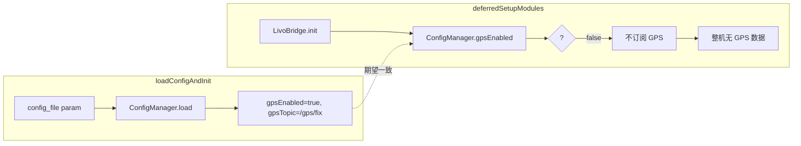

# 轨迹无 GPS 记录根因分析（full.log）

## 0. Executive Summary

| 项目 | 结论 |
|------|------|
| **现象** | 轨迹 CSV 与关键帧 `has_gps=0`，日志中持续出现 `TRAJ_LOG no GPS`、`gps_window_size=0`。 |
| **根因 1** | **LivoBridge 侧认为 GPS 被关闭**：配置中 `sensor.gps.enabled=true`，但 LivoBridge 初始化时读到 `false`，未订阅 GPS 话题，导致整机无 GPS 数据。 |
| **根因 2** | **Bag 回放未发布 GPS 话题**：rosbag2 因缺少 `ublox_msgs` 忽略所有 `/ublox/*` 话题，且配置中 topic 为 `/gps/fix`，与 bag 中实际话题不一致。 |
| **修复** | ① 由 AutoMapSystem 在 `loadConfigAndInit()` 中读取 GPS 配置并**显式传入** LivoBridge，避免 LivoBridge 再次读 ConfigManager 时不一致。② 配置与 bag 对齐：topic 用 bag 中存在的 NavSatFix 话题（如 `/ublox/fix`），并安装/提供 `ublox_msgs` 或使用标准 `sensor_msgs/NavSatFix` 的 topic。 |

---

## 1. 日志证据摘要

### 1.1 配置加载阶段（GPS 应为开启）

```text
[AutoMapSystem][CONFIG] config_file param=/root/automap_ws/src/automap_pro/config/system_config_M2DGR.yaml
[ConfigManager][load] Successfully loaded config from: ...
[AutoMapSystem][CONFIG] sensor.gps.enabled=true sensor.gps.topic=/gps/fix
```

说明：**loadConfigAndInit()** 执行时，ConfigManager 已成功加载 YAML，且 **sensor.gps.enabled=true**、**sensor.gps.topic=/gps/fix**。

### 1.2 LivoBridge 初始化阶段（GPS 被当作关闭）

```text
[AutoMapSystem][DEFERRED] Step 8a: init LivoBridge
[LivoBridge][GPS] GPS disabled (sensor.gps.enabled=false). Trajectory CSV will have no GPS columns filled.
[LivoBridge][TOPIC] subscribe: ... gps=disabled
```

说明：同一进程、同一 ConfigManager 单例下，**LivoBridge::init()** 内调用 **ConfigManager::instance().gpsEnabled()** 得到 **false**，因此未创建 GPS 订阅，整条链路无 GPS 数据。

### 1.3 轨迹与关键帧无 GPS

```text
[AutoMapSystem][TRAJ_LOG] no GPS for odom ts=... gps_window_size=0 (reason: no GPS data received). Check [LivoBridge][GPS] and GPS_DIAG in logs.
[AutoMapSystem][KF] created kf_id=... has_gps=0 ...
[AutoMapSystem][PIPELINE] event=heartbeat ... gps=0
```

说明：因 LivoBridge 未订阅 GPS，GPSManager/轨迹日志永远收不到 GPS，`gps_window_size=0`，CSV 中 GPS 列为空，关键帧 `has_gps=0`。

### 1.4 Bag 回放未发布 ublox/GPS 话题

```text
[rosbag2_player]: Ignoring a topic '/ublox/rxmraw', reason: package 'ublox_msgs' not found
[rosbag2_player]: Ignoring a topic '/ublox/navpvt', ...
[rosbag2_player]: Ignoring a topic '/ublox/fix', ...
[rosbag2_player]: Ignoring a topic '/ublox/navsat', ...
```

说明：Bag 中 GPS 相关话题为 **/ublox/***（依赖 `ublox_msgs`），回放时因未安装该包被**全部忽略**，即使 LivoBridge 订阅了 GPS 话题也收不到数据。且当前配置里 **sensor.gps.topic=/gps/fix**，与 bag 中的 **/ublox/fix** 不一致。

---

## 2. 根因分析

### 2.1 根因 1：LivoBridge 与 loadConfigAndInit 读到的 enabled 不一致

- **现象**：loadConfigAndInit() 中 `gpsEnabled()==true`，LivoBridge::init() 中 `gpsEnabled()==false`。
- **可能原因**（在未改代码前）：
  - 初始化顺序/时序：deferredSetupModules 与 loadConfigAndInit 之间若有其他逻辑或线程再次调用 `ConfigManager::instance().load(...)` 或覆盖配置，可能导致 LivoBridge 读时已变。
  - 运行环境差异：容器/宿主机使用的 YAML 副本不同（如容器内为旧版或不同路径），或参数覆盖导致行为不一致。
- **设计问题**：LivoBridge 在 init 时**再次**从 ConfigManager 读 `gpsEnabled()`，与“已在 loadConfigAndInit 中加载并打印”的配置**未强制一致**，存在依赖单例状态与时序的脆弱性。

**结论**：应避免 LivoBridge 在 init 时单独依赖 ConfigManager 的 GPS 开关；改为由 AutoMapSystem 在 loadConfigAndInit 中**一次性读取** GPS 使能与话题，并**显式传入** LivoBridge::init()。

### 2.2 根因 2：Bag 未发布 GPS 话题 + 配置 topic 与 bag 不一致

- Bag 中 GPS 相关话题为 **/ublox/fix**、/ublox/navpvt 等，类型依赖 **ublox_msgs**。
- rosbag2_player 在未找到 **ublox_msgs** 时会**忽略**这些话题，回放时**不发布**任何 /ublox/*。
- 配置中 **sensor.gps.topic=/gps/fix**，与 bag 内实际话题 **/ublox/fix** 不一致；即便一致，当前回放也不会发布 /ublox/*。

**结论**：  
- 若使用当前 bag：需在环境中**安装 ublox_msgs**（或提供兼容的类型定义），使回放能发布 /ublox/fix 等；并将 **sensor.gps.topic** 设为 bag 中实际使用的 NavSatFix 话题（如 **/ublox/fix**）。  
- 若无法安装 ublox_msgs：需使用已用 **sensor_msgs/NavSatFix** 录制的 bag，并配置 **sensor.gps.topic** 为该 bag 中的话题。

---

## 3. 数据流与配置传递（修复前）



问题：C 与 E 之间无强制一致，E 可能得到 false，导致 G→H。

---

## 4. 修复方案与变更清单

### 4.1 代码修复（消除 enabled 不一致）

| 文件 | 变更 |
|------|------|
| `automap_pro/include/automap_pro/frontend/livo_bridge.h` | 增加 `init(node, gps_enabled, gps_topic)` 重载（可选参数，空则回退 ConfigManager）。 |
| `automap_pro/src/frontend/livo_bridge.cpp` | 实现新 init 重载：用传入的 `gps_enabled`/`gps_topic` 决定是否订阅及订阅哪个话题。 |
| `automap_pro/src/system/automap_system.cpp` | 在 loadConfigAndInit 中保存 `gps_enabled_`、`gps_topic_`；在 deferredSetupModules 中调用 `livo_bridge_.init(node, gps_enabled_, gps_topic_)`。 |

这样 LivoBridge 的 GPS 开关与话题**完全由 loadConfigAndInit 的读取结果**决定，不再在 init 时依赖 ConfigManager 的当前状态。

### 4.2 配置与运行环境

| 项 | 建议 |
|----|------|
| **sensor.gps.topic** | 与 bag 一致：若 bag 为 /ublox/fix，则配置为 **/ublox/fix**；若为 /gps/fix，则配置为 **/gps/fix**。 |
| **回放 M2DGR 等含 ublox 的 bag** | 安装 **ublox_msgs**（或提供兼容类型），确保 rosbag2 能发布 /ublox/fix 等。 |
| **验证** | 回放后 `ros2 topic echo /ublox/fix`（或所配 topic）有数据；日志中无 `[LivoBridge][GPS] GPS disabled`，且出现 `Subscription created: topic=...`。 |

---

## 5. 验证与回滚

- **验证**：  
  - 使用 **sensor.gps.enabled=true** 且 **sensor.gps.topic** 与 bag 一致；  
  - 回放能发布对应 GPS 话题；  
  - 日志中 LivoBridge 显示 GPS 已订阅，TRAJ_LOG 出现 GPS 匹配，CSV 中 GPS 列有值，关键帧 `has_gps` 可大于 0。  
- **回滚**：保留原 `init(node)` 重载，若调用处不传 gps 参数则行为与当前一致（仍从 ConfigManager 读）。

---

## 6. GPS 可选与间歇性设计（时有时无）

- **接收**：只要配置中 `sensor.gps.enabled=true`，LivoBridge 会一直订阅 GPS 话题；有消息就收，无消息也不影响建图。
- **质量门控**：仅 `NavSatFix.status.status >= 0` 的报文会进入 GPSManager；下游按 HDOP/质量仅使用 **HIGH/EXCELLENT** 做对齐与因子，轨迹日志中 **MEDIUM** 及以上记为有效。
- **建图**：建图与关键帧不依赖 GPS；无 GPS 或质量差时仅不添加 GPS 约束，其余功能正常。GPS 恢复后自动重新启用约束（DEGRADED → ALIGNED）。
- **日志**：间歇性无匹配时（有 GPS 窗口但当前 odom 行未匹配）打 DEBUG，避免把“时有时无”当成错误刷 WARN。

---

## 7. 术语与参考

| 术语 | 说明 |
|------|------|
| LivoBridge | 订阅前端 odom/cloud/kfinfo/GPS，将数据交给 AutoMapSystem 的桥接模块。 |
| TRAJ_LOG | 轨迹 CSV 写盘逻辑，按 odom 时间戳在时间窗内匹配 GPS。 |
| gps_window_size | 当前缓存的 GPS 样本数，为 0 表示未收到任何 GPS。 |
| GPS 可选 | 有质量好的 GPS 就使用，没有或质量差则不用；建图不依赖 GPS，时有时无均正常。 |

- 轨迹与 GPS 逻辑见：`automap_pro/docs/TRAJECTORY_LOG_AND_PLOT.md`、`docs/TRAJECTORY_GPS_ZERO_ANALYSIS.md`。
