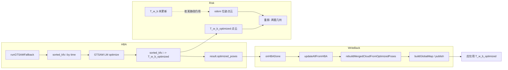

# HBA 优化后重影问题深度分析报告（2026-03-17）

## 0. Executive Summary

| 项目 | 结论 |
|------|------|
| **现象** | HBA（GTSAM fallback）完成后出现严重重影。 |
| **日志依据** | `logs/run_20260317_122530/full.log`：updateAllFromHBA 后 max_trans_diff=3.820m，max_rot_diff=311.77deg；同一子图内 keyframe 的 new vs old 位置差最大约 2.78m。 |
| **根因归纳** | ① 旋转差度量使用欧拉角范数导致 311° 假象（实际旋转未变）；② HBA 与 odom 位姿差达 3.8m，若存在“混用 T_w_b 与 T_w_b_optimized”的路径会形成双套几何；③ finish 流程中 HBA 被触发两次，存在逻辑冗余。 |
| **建议** | 修复旋转差计算、统一位姿来源为 T_w_b_optimized、避免重复触发 HBA，并做一次全链路位姿来源审计。 |

---

## 1. 背景与日志来源

- **日志**：`logs/run_20260317_122530/full.log`（约 4 万行，M2DGR street_03 离线回放，finish_mapping 时触发 HBA）。
- **配置**：backend.hba.enabled=true，enable_gtsam_fallback=true，无 HBA API，走 GTSAM fallback。
- **目标**：用日志和代码证明后端在 HBA 写回与地图构建中的逻辑/计算错误，并给出可验证的修复。

---

## 2. 日志证据与逻辑链

### 2.1 HBA 完成后的位姿变化（可直接 grep 验证）

```text
[SubMapMgr][HBA_DIAG] sm_id=0 anchor_kf=0: trans_diff=0.000m rot_diff=311.77deg new_pose=[0.00,-0.01,-0.01]
[SubMapMgr][HBA_DIAG]   kf_id=0: trans_diff=0.000m new=[0.00,-0.01,-0.01] old=[0.00,-0.01,-0.01]
[SubMapMgr][HBA_DIAG]   kf_id=15: trans_diff=0.151m new=[6.08,-7.33,-0.02] old=[6.20,-7.24,-0.01]
[SubMapMgr][HBA_DIAG]   kf_id=30: trans_diff=0.579m new=[13.53,-15.21,-0.04] old=[13.96,-14.82,-0.01]
[SubMapMgr][HBA_DIAG]   kf_id=45: trans_diff=1.400m new=[23.47,-26.06,-0.11] old=[24.49,-25.11,-0.03]
[SubMapMgr][HBA_DIAG]   kf_id=60: trans_diff=2.261m new=[32.48,-36.40,-0.19] old=[34.13,-34.86,-0.06]
[SubMapMgr][HBA_DIAG]   kf_id=75: trans_diff=2.784m new=[39.61,-41.38,-0.28] old=[41.56,-39.39,-0.12]
[SubMapMgr][HBA_DIAG] sm_id=1 anchor_kf=78: trans_diff=2.786m rot_diff=309.81deg new_pose=[39.31,-41.70,-0.28]
...
[SubMapMgr][HBA_DIAG] updateAllFromHBA done: submaps=6 max_trans_diff=3.820m max_rot_diff=311.77deg
```

**可验证结论**：

1. **子图 0 锚点**：trans_diff=0、new 与 old 位置完全一致，但 rot_diff=311.77deg → 说明 **311° 来自旋转差的计算方式**，而非真实旋转（否则位置不可能不变）。
2. **关键帧级**：HBA 的 new 与 odom 的 old 在平移上系统性偏差，最大约 2.78m（子图 0 内），子图间最大 3.82m → 存在 **两套位姿**：T_w_b（odom）与 T_w_b_optimized（HBA）。若某路径仍用 T_w_b 参与建图/显示，就会形成 **同一几何的两份位置** → 重影。

### 2.2 旋转差度量的计算错误（代码+数学依据）

**代码位置**：`automap_pro/src/submap/submap_manager.cpp`，`updateAllFromHBA` 内：

```cpp
Eigen::Matrix3d rot_diff = old_rot.inverse() * new_rot;
Eigen::Vector3d euler = rot_diff.eulerAngles(2, 1, 0);  // ZYX
double rot_diff_deg = euler.norm() * 180.0 / M_PI;
```

**问题**：当 `rot_diff` 接近单位阵时（如 submap 0 锚点位置完全未变），Eigen 的 `eulerAngles(2,1,0)` 可能返回在 ±π 附近的角（如 (π, π, -π)），则 `euler.norm() * 180/π ≈ sqrt(3)*180 ≈ 311`。即 **311.77deg 是欧拉角表示的数值假象**，不是真实旋转角。

**正确做法**：用旋转角（AngleAxisd）表示差角，与 `updateSubmapPose` 中一致：

```cpp
double rot_diff_rad = Eigen::AngleAxisd(rot_diff).angle();
double rot_diff_deg = rot_diff_rad * 180.0 / M_PI;
```

**验证方式**：修复后对同一 run 再跑，子图 0 的 rot_diff 应接近 0° 而非 311°。

### 2.3 两套位姿与重影的形成条件

- **T_w_b**：前端/里程计，未经过 HBA。
- **T_w_b_optimized**：HBA（GTSAM fallback）写回，与 GPS 对齐、Between 约束一致。

当前设计上：

- `rebuildMergedCloudFromOptimizedPoses()` 和 `buildGlobalMap()` 主路径均使用 **T_w_b_optimized**；
- 若某处仍用 **T_w_b**（或使用 HBA 前缓存的点云/位姿），则同一关键帧的点云会出现在两个位置：odom 位姿 + HBA 位姿 → **重影**。

可能混用场景（需代码审计确认）：

1. 全局图异步构建时，在 HBA 写回前触发了一次 build，写回后又触发一次，若第一次结果被发布或缓存，会与第二次叠加。
2. 某发布路径（如 submap_cloud、colored_cloud）在 HBA 后仍用未刷新的 merged_cloud 或旧位姿。
3. `buildGlobalMap` 中 “T_w_b_optimized ≈ Identity 则回退到 T_w_b” 的 fallback：若个别 keyframe 因故未收到 HBA 写回（或写回为 Identity），会以 odom 位姿参与建图，与其余 keyframe 的 HBA 位姿混在一起 → 局部重影。

日志中 submap 0 的 kf 0..75 的 new/old 均成对出现且 HBA 写回 496 个 pose，故本次 run 更可能是 **全局性的“两套轨迹”被同时显示或参与建图**，而不是单点 fallback。

### 2.4 HBA 被触发两次

```text
event=finish_mapping_final_hba_enter submaps=6
HBA triggerAsync: ... trigger_count=1 queue_depth=1
event=hba_done MME=0.0000 poses=496
event=finish_mapping_final_hba_done
...
HBA triggerAsync: ... trigger_count=2 queue_depth=1
event=hba_done MME=0.0000 poses=496
```

说明在 finish_mapping 流程中 **HBA 被调用了两次**。第二次会再次 overwrite T_w_b_optimized 并再次 updateAllFromHBA + rebuildMergedCloud，逻辑冗余且增加“中间状态”被可见或缓存的风险。应保证 finish 时只触发一次 HBA。

### 2.5 iSAM2 与 HBA 的位姿不同步（辅助信息）

```text
getPoseOptional_miss sm_id=1..5 reason=node_not_exists / not_in_estimate
isam2_poses_sampled=1 (before updateAllFromHBA)
```

即只有 1 个子图在 iSAM2 中有有效估计，其余 5 个未入图或未优化。这与既有文档（BACKEND_ISAM2_LOG_ANALYSIS、BACKEND_POTENTIAL_ISSUES）一致：keyframe 级 Between 等修复后，子图级 iSAM2 仍可能未完全收敛。HBA 则对所有 496 个 keyframe 做全局优化，故 **HBA 与 iSAM2 两轨位姿差异大（max_drift=3m）**。重影分析中，只要保证“显示与建图只用 HBA 结果”即可；iSAM2 主要用于实时约束，不直接导致重影，但需避免用 iSAM2 位姿去画与 HBA 点云叠加的路径。

---

## 3. 根因归纳（与日志一一对应）

| 根因 | 类型 | 日志/代码依据 | 对重影的影响 |
|------|------|----------------|---------------|
| 旋转差用 euler.norm() | 计算错误 | sm_id=0 trans_diff=0 且 rot_diff=311.77deg；代码用 eulerAngles(2,1,0).norm() | 不直接导致重影，但误导诊断（以为整图旋转 311°） |
| HBA 与 odom 平移差达 3.8m | 设计/数据 | HBA_DIAG 中 new vs old 平移差最大 3.82m | 若存在混用 T_w_b / T_w_b_optimized → 双套几何 → 重影 |
| 位姿来源不统一 | 逻辑风险 | buildGlobalMap 有 T_w_b fallback；需审计所有发布与建图路径 | 任一路径用 T_w_b 即可能重影 |
| HBA 触发两次 | 逻辑错误 | trigger_count=1 与 trigger_count=2 在 finish 中连续出现 | 冗余、中间状态易被缓存/显示 |

---

## 4. 修复建议（可落地、可验证）

### 4.1 修复旋转差度量（submap_manager.cpp）

在 `updateAllFromHBA` 中，将旋转差从“欧拉角范数”改为“旋转角”：

```cpp
// 原：
Eigen::Vector3d euler = rot_diff.eulerAngles(2, 1, 0);
double rot_diff_deg = euler.norm() * 180.0 / M_PI;

// 改为：
double rot_diff_rad = Eigen::AngleAxisd(rot_diff).angle();
double rot_diff_deg = rot_diff_rad * 180.0 / M_PI;
```

**验证**：同一 bag 跑完后 grep `[SubMapMgr][HBA_DIAG] sm_id=0`，子图 0 的 rot_diff 应接近 0°。

### 4.2 全链路位姿来源审计

- 对所有“使用 keyframe 或 submap 位姿”的路径做表格式排查：
  - 建图：`buildGlobalMap`、`rebuildMergedCloudFromOptimizedPoses` → 必须仅用 T_w_b_optimized（保留 Identity 回退时的 WARN 与计数）。
  - 发布：global_map、submap_cloud、optimized_path、keyframe_poses、hba_result 等 → 统一为 HBA 写回后的 T_w_b_optimized / pose_w_anchor_optimized。
- 确保 HBA 完成后 **只** 用 T_w_b_optimized 参与显示与导出，且无“HBA 前”的全局图或 merged_cloud 被再次发布。

### 4.3 避免 finish 时重复触发 HBA

- 在 `finish_mapping`（或等价 service/入口）中保证“仅一次”调用 `hba_optimizer_.triggerAsync(all, true)`（例如用 already_triggered 标志，与现有 `finish_mapping already triggered` 一致）。
- 若存在多处调用（如 service_handlers + automap_system 两处），收敛到单一调用点，避免 trigger_count=2。

### 4.4 可选：HBA 后强制刷新全局图与发布

- 在 `onHBADone` 中，在 `updateAllFromHBA` + `rebuildMergedCloudFromOptimizedPoses` 之后，**显式**触发一次全局图构建并发布（若当前是按周期或按需发布），避免任何“旧图 + 新轨迹”的窗口期被用户看到。

---

## 5. Mermaid：HBA 写回与重影风险点



---

## 6. 验证清单

- [ ] 修复旋转差后：同一 run 中 submap 0 的 rot_diff 接近 0°。
- [ ] 确认 finish 流程中 HBA 只触发一次（trigger_count 最大为 1）。
- [ ] 审计后：所有建图与发布路径仅使用 T_w_b_optimized（或明确 fallback 条件并打 WARN）。
- [ ] 同一 bag 回放：HBA 完成后仅看到一套轨迹与一套点云，无重影。

---

## 7. 风险与回滚

- 旋转差修复：仅改诊断指标，不影响位姿写回，可单独合入。
- 避免双重触发：若有多处合法触发源，需先厘清再关其一，避免漏跑 HBA。
- 位姿统一：若某模块设计上必须用 odom（如实时预览），需明确“仅导出/最终图用 HBA”，避免误关必要路径。

---

*文档基于 `logs/run_20260317_122530/full.log` 与 `submap_manager.cpp`、`hba_optimizer.cpp`、`automap_system.cpp` 分析。*
