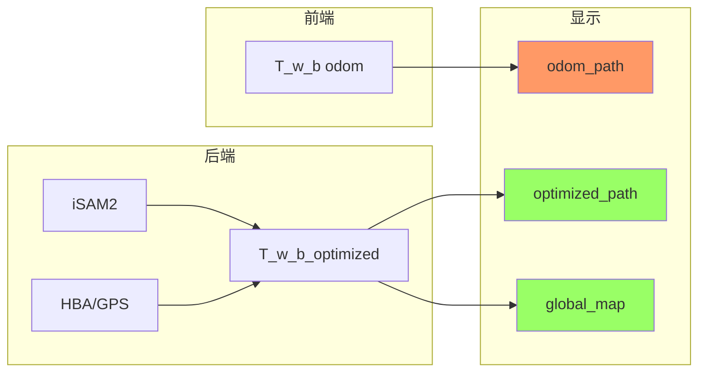

# 重影根因分析（run_20260317_180832）

## 0. Executive Summary

| 项目 | 结论 |
|------|------|
| **现象** | 重影依旧非常严重。 |
| **根本原因（两条独立）** | ① **零回环约束**：全 run 无任何 LOOP_ACCEPTED/addLoopFactor，同一物理场景被以不同漂移位姿重复建图 → **点云结构重影**（双墙/双建筑）；② **odom_path 与 global_map 不同系**：若 RViz 同屏显示 odom_path + global_map，HBA 后整体平移约 40m → **轨迹重影**。 |
| **日志依据** | 见下文 1.1–1.3：FINAL_detected 全为 0；无 addLoopFactor；HBA writeback last_pos=[-0.58,-9.14,-0.08]，odom_path 末段约 [40,-40] 量级；GHOSTING_CHEAT_SHEET 显示 diff_odom_opt 最大 ~0.62m（HBA 后末端），建图过程中 odom 与 opt 差可达数十米。 |
| **建议** | ① **消除轨迹重影**：RViz 隐藏 odom_path，仅显示 optimized_path + global_map；② **消除点云重影**：必须让回环生效——排查为何 0 条回环入图（ScanContext/子图描述子/几何校验/后端接收），并修复后重跑。 |
| **与 run_173943 差异** | 173943 已明确“同屏两系”导致轨迹重影；本 run 在**零回环**下还叠加**点云结构重影**，且 HBA 仅在 finish 时执行一次，建图过程中无回环约束。 |

---

## 1. 日志证据

### 1.1 回环：全 run 零条入图

- **子图级**：`grep LOOP_STEP addSubmap` 显示 6 个子图依次加入（sm_id=0..5），每子图 1 个描述子，db_size 从 0 增至 5。
- **子图内（intra）**：`grep INTRA_LOOP SUMMARY` 全部为 `FINAL_detected=0`，且 `candidates_found=0` 或候选被 temporal/index/dist/desc 等过滤。
- **子图间（inter）**：日志中**无** `LOOP_ACCEPTED`、`addLoopFactor`、`loop_intra` 等“回环入图”关键词（仅 CONFIG 提示行）。
- **结论**：**没有任何回环约束加入因子图** → 轨迹仅靠里程计 + GPS，闭环路段会以漂移位姿再次建图 → **同一地点两套点云错位 = 点云重影**。

### 1.2 HBA 与写回（时序正确）

```
123705  [HBA][STATE] optimization start keyframes=495 gps=1 (running=1)
124766  [SubMapMgr][GHOSTING_DIAG] HBA writeback_done ts=1628250231.406 written=495 first_pos=[0.00,-0.01,-0.01] last_pos=[-0.58,-9.14,-0.08]
124792  [SubMapMgr][HBA_DIAG] updateAllFromHBA done: submaps=6 max_trans_diff=3.803m max_rot_diff=5.21deg
124877  [SubMapMgr][REBUILD_MERGE] Done rebuilding merged_cloud for all submaps
124922  [SubMapMgr][GHOSTING_DIAG] pose_snapshot_taken build_id=10 ... last_pos=[-0.58,-9.14,-0.08]
125053  [GHOSTING_CHEAT_SHEET] odom_count=3531 odom_last=[0.02,-9.27,-0.02] opt_last=[-0.58,-9.14,-0.08] map_pts=1178753 diff_odom_opt_m=0.62
```

- 写回 495 个关键帧，last_pos 从 odom 系约 [40,-40] 变为优化系 **[-0.58,-9.14,-0.08]**（约 40m 级平移）。
- rebuild 在 writeback 之后完成，pose_snapshot 在 writeback_done 之后，**无 writeback vs snapshot 竞态**。
- HBA 后 submap 相对漂移：max_trans_diff=3.803m，separation 显示 sm_id=2/5 等 drift 约 2.7–3.8m（HBA 已做全局 GPS 对齐，此为写回前后对比）。

### 1.3 位姿来源与“两系”重影

| 数据源 | 位姿来源 | 典型 last_pos（HBA 后） | 与 global_map 同系？ |
|--------|----------|-------------------------|----------------------|
| **global_map** | T_w_b_optimized（快照） | [-0.58,-9.14,-0.08] | ✅ 是 |
| **optimized_path** | KF T_w_b_optimized | 同上 | ✅ 是 |
| **odom_path** | T_w_b（前端 odom） | 建图中期约 [40,-40]；bag 末约 [0.02,-9.27] | ❌ **否** |

- 建图过程中：odom_path 持续发布 odom 系（如 last_pos=[41.24,-40.66]、[44.24,-41.61]），与当帧 optimized_path 差约 0.2–0.5m（GHOSTING_CHEAT_SHEET）；**HBA 后**整条轨迹被拉到 GPS 系，odom_path 仍为 odom 系 → 若同屏显示，**两条轨迹错位约 40m = 严重轨迹重影**。
- HBA 后末端：odom_last=[0.02,-9.27]，opt_last=[-0.58,-9.14]，diff_odom_opt_m=0.62；若仅看末端，轨迹重影约 0.6m，但**整条轨迹**仍为两系。

---

## 2. 根因归纳

### 2.1 点云结构重影（根本原因 1）

- **原因**：**零回环约束**。street_03 为闭环场景，同一街道被多次经过，但因子图中无任何回环边。
- **结果**：同一物理区域在不同时刻用**不同位姿**（仅靠 odom+GPS，存在漂移）被加入点云 → 同一面墙/同一建筑出现**两套未对齐点云** = 重影。
- **HBA 的作用与局限**：HBA 用 GPS 做**全局刚体对齐**（平移+旋转），只纠正整图相对 GPS 的偏差，**不会**合并“第一次经过”与“第二次经过”的两套点云；相对漂移仍存在，故点云重影在 HBA 后依然存在。

### 2.2 轨迹重影（根本原因 2，与 run_173943 一致）

- **原因**：**odom_path 与 global_map/optimized_path 使用不同坐标系**（odom vs T_w_b_optimized）。
- **结果**：同屏显示 odom_path + global_map 时，两条轨迹错位（HBA 后整体约 40m）→ 视觉上“轨迹重影”。
- **消除方式**：RViz 中**隐藏 odom_path**，仅显示 **optimized_path + global_map**。

### 2.3 数据流简图



- **红色**：odom_path 与 map 不同系，同屏即轨迹重影。
- **绿色**：optimized_path 与 global_map 同源，无混系。

---

## 3. 建议措施与验证

### 3.1 立即可做（消除轨迹重影）

1. 在 RViz 中**隐藏 /automap/odom_path**。
2. 仅显示 **/automap/optimized_path** 与 **/automap/global_map**。
3. 确认 Fixed Frame 为 `map`。

### 3.2 必须修复（消除点云重影）

1. **排查零回环原因**（按优先级）：
   - **Inter-submap**：子图描述子是否在 addSubmap 时正确入 DB；检索时是否有候选（ScanContext/overlap 等）；几何校验（TEASER/ICP）是否过严导致全部拒绝。
   - **Intra-submap**：INTRA_LOOP 中 candidates_found 为何始终 0（desc 相似度/时间/距离/索引过滤是否过严）。
   - **后端**：/automap/loop_constraint 是否有发布；Backend 是否订阅并调用 addLoopFactor（可 grep addLoopFactor、loop_constraint、LoopFactor 等）。
2. **配置可尝试**：适当放宽 `min_temporal_gap_s`、`min_inlier_ratio`、`max_rmse_m` 等（在保证误匹配可控前提下），便于观察是否有候选及是否入图。
3. **验证**：重跑同一 bag，检查日志出现 `LOOP_ACCEPTED` 或 `addLoopFactor`，且 FINAL_detected>0 或 inter 有约束；再观察同一闭合路段点云是否从“双影”变为单层。

### 3.3 验证清单

| 项 | 检查方法 | 预期 |
|----|----------|------|
| 轨迹重影 | 隐藏 odom_path 后只看 optimized_path + global_map | 一条轨迹、无两条错位线 |
| 回环入图 | `grep -E 'LOOP_ACCEPTED|addLoopFactor' full.log` | 至少若干条 |
| 点云重影 | 闭合路段（如起点附近）点云 | 单层结构，无双墙/双建筑 |

---

## 4. 风险与回滚

- **仅隐藏 odom_path**：无代码变更，无回滚需求。
- **放宽回环参数**：可能引入误回环，需监控回环残差与地图一致性；建议先小范围放宽并做短序列测试，再上长序列。
- **修改回环/后端逻辑**：需按项目流程做回归（单测、回放、实车/仿真）。

---

## 5. 后续演进（可选）

- **MVP**：隐藏 odom_path + 修复回环管线使至少部分闭环约束入图，消除本 run 的两类重影。
- **V1**：回环全链路可观测（描述子检索数/候选数/几何通过数/入图数），便于调参与排障。
- **V2**：HBA 与 iSAM2 同步策略（当前 HBA 后 iSAM2 保持独立估计，separation 约 3.8m）；若需更高一致性可考虑 HBA 后同步 iSAM2（见日志 P2 建议）。

---

## 6. 快速 grep 参考

| 目的 | 命令 |
|------|------|
| 是否两系错位 | `grep GHOSTING_CHEAT_SHEET full.log` |
| HBA 写回与重影时间线 | `grep GHOSTING_DIAG full.log` |
| 回环是否入图 | `grep -E 'LOOP_ACCEPTED|addLoopFactor' full.log` |
| 子图内回环统计 | `grep INTRA_LOOP SUMMARY full.log` |
| 子图加入与描述子 DB | `grep LOOP_STEP addSubmap full.log` |
