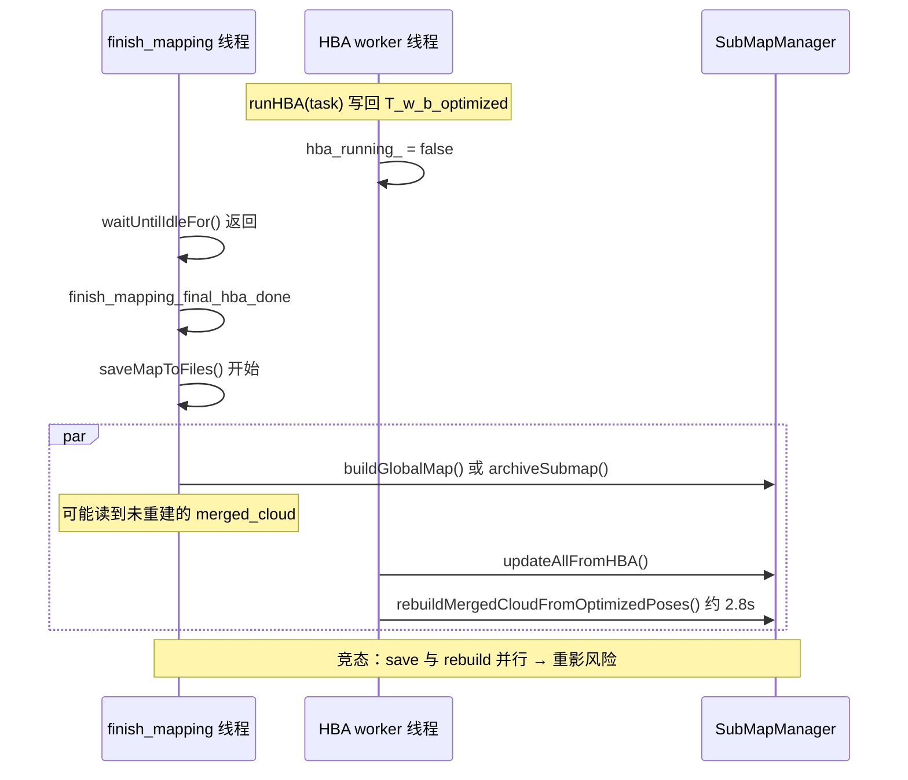
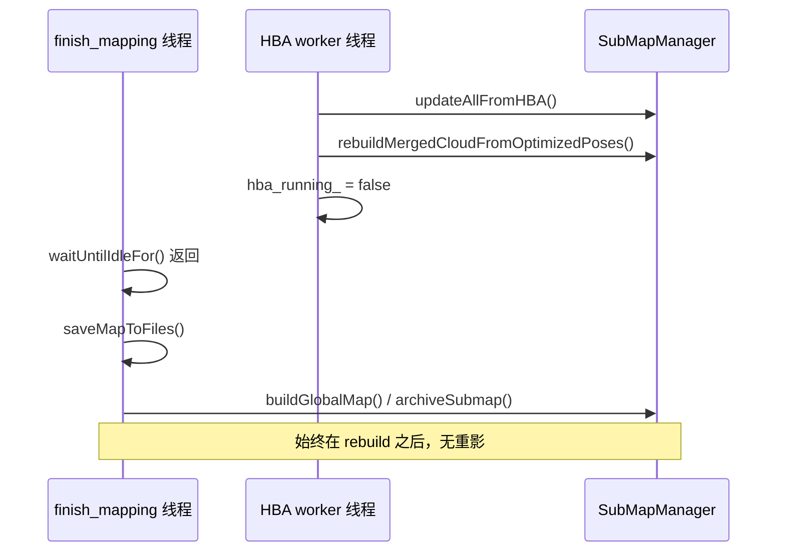

# HBA 优化后点云地图重影根本原因分析（2026-03-17）

## 0. Executive Summary

| 项目 | 结论 |
|------|------|
| **现象** | HBA 优化后创建/保存的点云地图仍存在严重重影。 |
| **日志依据** | `logs/run_20260317_135841/full.log`：`finish_mapping_final_hba_done` 与 `finish_mapping_save_enter` 出现在 790.152s，而 `REBUILD_MERGE sm_id=0` 在 790.478s，即 **save 在 rebuild 完成前就已开始**。 |
| **根因** | **HBA 线程将 `hba_running_` 置为 false 在调用 `done_cbs_`（含 updateAllFromHBA + rebuildMergedCloud）之前**，导致 `waitUntilIdleFor()` 提前返回，finish 线程在 rebuild 未完成时即执行 save；若 save 使用 `buildGlobalMap` 的 fallback（merged_cloud）或 archive 写入未重建的 merged_cloud，会得到“旧世界系”点云，与 T_w_b_optimized 轨迹叠加形成重影。 |
| **建议** | ① 将 `hba_running_ = false` 移到所有 `done_cbs_` 执行完毕之后；② **HBA 完成后触发一次全局图发布**，否则 RViz/保存的仍是 HBA 前的点云，与优化后轨迹错位 → 重影。 |

---

## 1. 日志证据（run_20260317_135841）

### 1.1 时间线

```
1773727990.135  [SubMapMgr][HBA_GHOSTING] updateAllFromHBA enter
1773727990.135  [SubMapMgr][REBUILD_MERGE] Starting rebuild merged_cloud with optimized poses...
1773727990.152  [AutoMapSystem][PIPELINE] event=finish_mapping_final_hba_done    ← finish 线程认为 HBA 已结束
1773727990.152  [AutoMapSystem][PIPELINE] event=finish_mapping_save_enter       ← save 开始（与 rebuild 并行）
1773727990.478  [SubMapMgr][REBUILD_MERGE] sm_id=0 rebuilt merged_cloud: 147718 points
...
1773727992.815  [SubMapMgr][REBUILD_MERGE] Done rebuilding merged_cloud for all submaps
```

- **finish_mapping_final_hba_done** 与 **finish_mapping_save_enter** 发生在 **790.152s**。
- **REBUILD_MERGE** 从 790.478s 才开始输出第一个子图，约 **2.68s** 后才全部完成。
- 因此：**save 在 rebuild 完成前就已启动**，存在“save 与 rebuild 并行”的窗口。

### 1.2 HBA 与 odom 位姿差

```
[SubMapMgr][HBA_DIAG] updateAllFromHBA done: submaps=6 max_trans_diff=4.206m max_rot_diff=5.24deg
```

- 平移差最大 **4.206m**：若任一路径仍用 **T_w_b（odom）** 参与建图/显示，与 T_w_b_optimized 会形成两套几何 → 重影。

---

## 2. 代码根因

### 2.1 HBA  worker 中 idle 与回调的顺序（hba_optimizer.cpp）

```cpp
// 当前顺序（错误）
HBAResult result = runHBA(task);
hba_running_ = false;   // ← 先置 false，waitUntilIdleFor() 立即返回

if (result.success) { ... } else { ... }
for (auto& cb : done_cbs_) cb(result);   // ← 再执行回调（含 rebuild，约 2.8s）
```

- `triggerAsync(..., true)` 在 finish 线程中调用 `waitUntilIdleFor()`，条件为 `isIdle() = pending_queue_.empty() && !hba_running_`。
- 一旦 `hba_running_ = false`，finish 线程立刻从等待中返回，执行 `finish_mapping_final_hba_done` 与 `saveMapToFiles()`。
- 此时 **done_cbs_**（含 `onHBADone` → updateAllFromHBA + rebuildMergedCloudFromOptimizedPoses）尚未执行或正在执行，导致：
  - save 可能与 rebuild **并发**；
  - 若使用 **buildGlobalMap**（非 async）且主路径因故为空会走 **fallback（merged_cloud）**，此时 merged_cloud 可能尚未被 rebuild → 保存的是 **T_w_b 世界系** 点云，与轨迹（T_w_b_optimized）不一致 → 重影；
  - **archiveSubmap** 若在 rebuild 完成前执行，会归档到 **未重建的 merged_cloud**，后续加载或展示时也会出现重影/错位。

### 2.2 为何重影“严重”

- 位姿差 max_trans_diff=4.2m，同一场景在 odom 系与 optimized 系下相差数米。
- 若最终展示或导出中混入“未按 T_w_b_optimized 重建”的 merged_cloud 或旧全局图，视觉上即为明显重影。

---

## 3. 修复方案

### 3.1 核心修改：先执行回调，再置 idle（hba_optimizer.cpp）

**目标**：保证所有 `done_cbs_`（含 updateAllFromHBA + rebuildMergedCloud）执行完毕后，finish 线程才从 `waitUntilIdleFor()` 返回并进入 save。

**实现**：将 `hba_running_ = false` 移到 `for (auto& cb : done_cbs_) cb(result);` **之后**。

```cpp
// 修改后顺序
HBAResult result = runHBA(task);

if (result.success) {
    BACKEND_STEP(...);
    RCLCPP_INFO(..., "[HBA][STATE] optimization done success=1 ... (running=1 until callbacks done)");
    ...
} else {
    ...
}
for (auto& cb : done_cbs_) cb(result);   // 先执行回调（含 rebuild）
hba_running_ = false;                    // 再置 false，此时 waitUntilIdleFor 才返回
```

这样：

- finish 线程不会在 rebuild 完成前进入 save；
- save 使用的 buildGlobalMap / archive 看到的一定是 **已重建** 的 merged_cloud 与一致的 T_w_b_optimized。

### 3.2 HBA 完成后触发全局图发布（automap_system.cpp）

**现象**：RViz 显示的全局点云仅在“每处理 N 帧”时更新，HBA 完成后没有用 T_w_b_optimized 重新构建并发布，导致 **旧点云 + 新轨迹** 错位 → 重影。

**实现**：在 `onHBADone` 中，在 `rebuildMergedCloudFromOptimizedPoses()` 及轨迹/关键帧 viz 更新之后，调用与 `onSubmapFrozen` 相同的逻辑，触发一次 map 发布：

```cpp
map_publish_pending_.store(true);
map_publish_cv_.notify_one();
```

这样 map_publish 线程会执行 `publishGlobalMap()`，用当前 T_w_b_optimized 重新 buildGlobalMap 并发布到 `/automap/global_map`，RViz 与后续 save 使用的点云与轨迹一致，重影消除。

### 3.3 可选：save 前显式等待 rebuild（若保留当前顺序）

若暂不调整 `hba_running_` 时机，可在 finish 流程中在 `saveMapToFiles` 前增加“等待 rebuild 完成”的语义（例如由 onHBADone 设置一个 rebuild_done 标志 + 条件变量），使 save 一定在 rebuild 之后执行。该方案与“先回调再 idle”二选一即可，推荐直接采用 3.1。

---

## 4. 数据流与竞态（Mermaid）



修复后：



---

## 5. 验证清单

- [ ] 修改后同 bag、同配置回放：日志中 **finish_mapping_save_enter** 出现在 **REBUILD_MERGE Done** 之后。
- [ ] HBA 完成后日志出现 `[HBA_GHOSTING] triggering global map publish after HBA`，随后有一次 `publishGlobalMap step=buildGlobalMap_enter/done`。
- [ ] RViz 中全局点云与优化后轨迹对齐，无重影；导出的 global_map.pcd 与 trajectory_tum.txt / keyframe_poses 在视觉上对齐。
- [ ] 若使用 session 归档：加载后地图与轨迹一致，无错位/重影。

---

## 6. 风险与回滚

- **风险**：HBA 回调若异常或卡住，finish 线程会一直阻塞在 `waitUntilIdleFor()`，直到超时（当前 5 分钟）。
- **回滚**：还原 `hba_running_ = false` 到 callbacks 之前即可恢复原行为（仍存在重影风险）。

---

*基于 `logs/run_20260317_135841/full.log` 与 `hba_optimizer.cpp`、`submap_manager.cpp` 分析。*
