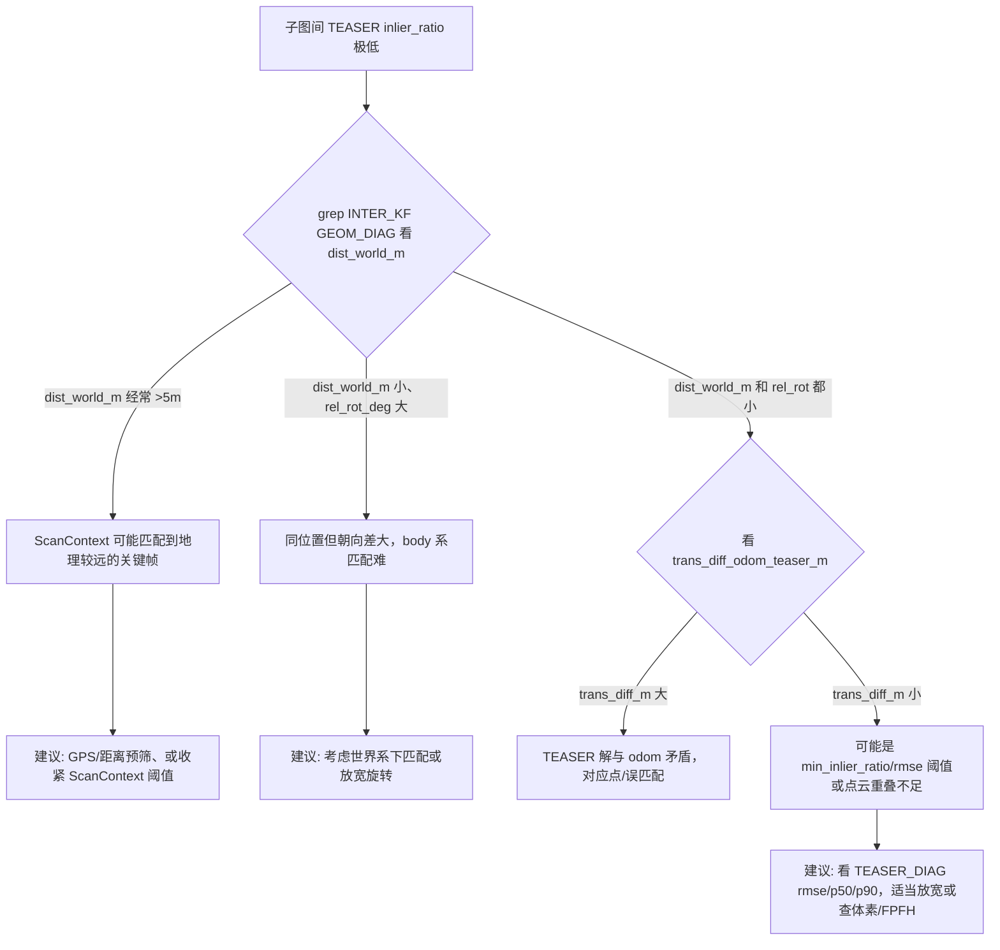

# 子图间几何一致性极差原因分析与强化日志说明

## 0. Executive Summary

| 结论 | 说明 |
|------|------|
| **根因方向** | 子图间匹配使用**各自 body 系下的关键帧点云**，未统一到世界系；若两关键帧**在世界系下距离大**或**相对旋转大**，FPFH 对应点会大量错误，导致 TEASER inlier ratio 极低。 |
| **场景“同场景、轨迹接得近”仍失败的可能原因** | ① **ScanContext 匹配到的关键帧对并非地理最近**（外观相似≠位置最近）；② **里程计漂移**导致 T_w_b 与真实位姿偏差大，世界距离/相对位姿不可信；③ **体素/FPFH 在不同 body 系下采样不一致**，重叠区域对应点少。 |
| **已加日志** | `[INTER_KF][GEOM_DIAG]`（匹配前：dist_world_m / rel_trans_m / rel_rot_deg；匹配后：odom vs TEASER 位姿 + trans_diff_m）、`[TEASER_DIAG] estimated_pose`。用这些可精准判断是“关键帧对错误”还是“同位置仍几何差”。 |

---

## 1. 子图间匹配的数据流与坐标系

### 1.1 点云来源与坐标系

- **Query**：`task.query_cloud` = 当前冻结子图（query submap）的**某关键帧**的 `keyframe_clouds_ds[qkf]`。
- **Target**：目标子图的**某关键帧**的 `keyframe_clouds_ds[kfc.keyframe_idx]`。
- `keyframe_clouds_ds` 来自 `kf->cloud_body` 体素下采样，**均在各自关键帧的 body 系下**（未变换到世界系）。

因此：
- **Query 点云**：子图 J 中关键帧 `kf_j` 的 body 系点云。
- **Target 点云**：子图 I 中关键帧 `kf_i` 的 body 系点云。
- TEASER 求的是 **T_tgt_src**（target 系到 source 系），即两 body 系之间的相对位姿，理论上等于 **T_bodyT_bodyQ = T_w_bodyT^{-1} * T_w_bodyQ**（若里程计一致）。

### 1.2 为何“同场景、轨迹接得近”仍可能几何极差

1. **ScanContext 选出的关键帧对未必是“地理最近”**  
   ScanContext 按**外观相似度**选 top-k 关键帧。若场景重复（如相似街道、对称结构），可能匹配到**外观像但位置远**的关键帧，此时 `dist_world_m` 会很大，几何必然差。

2. **里程计漂移**  
   `T_w_b` 来自前端/后端位姿，若漂移大，则：
   - 算出的 `dist_world_m`、`rel_trans_m`、`rel_rot_deg` 与真实几何不一致；
   - 两帧若真实很接近，但 odom 显示很远，只能说明位姿不准，不能说明“匹配错了关键帧”。

3. **Body 系下匹配的固有难度**  
   两片点云在不同 body 系下，重叠区域在各自系里坐标不同。FPFH 在各自系下算特征再做对应，若：
   - 相对旋转大 → 局部几何在另一系下变形，对应点易错；
   - 体素下采样在各自系下网格不同 → 同一物理点可能落在不同体素，对应点少。

4. **同一位置、姿态差异大**  
   “轨迹接得近”可能只是**位置接近、朝向差很多**（如掉头、绕圈）。相对旋转大时，FPFH 仍可能给出大量错误对应，导致 inlier ratio 低。

---

## 2. 新增日志与用法

### 2.1 匹配前：`[INTER_KF][GEOM_DIAG]`（第一次出现）

每条子图间关键帧对在**调用 TEASER 前**打一条，用于判断“这对关键帧在 odom 下是否真的接近”。

| 字段 | 含义 | 如何看 |
|------|------|--------|
| `sm_j`, `kf_j` | Query 子图 id、关键帧下标 | 当前冻结子图及其采样关键帧 |
| `sm_i`, `kf_i` | Target 子图 id、关键帧下标 | 被 ScanContext 选中的目标子图关键帧 |
| **dist_world_m** | 两关键帧在世界系下的位置差（m） | **同场景、轨迹接得近时应较小**（如 <5m）；若经常 >10m，说明很可能匹配到了“外观像但位置远”的帧 |
| **rel_trans_m** | Odom 下 target→query 相对平移范数（m） | 与 dist_world_m 同数量级；过大说明两帧在 odom 下相距远 |
| **rel_rot_deg** | Odom 下 target→query 相对旋转（度） | 若很大（如 >30°），即使位置近，body 系点云差异大，FPFH 易错 |
| query_pts, tgt_pts | 两点云点数 | 用于确认非空、规模合理 |

**用法**：  
- 若 **dist_world_m 经常很大** → 优先怀疑 **ScanContext 关键帧配对错误**（外观相似但地理远）；可考虑加 GPS/距离预筛、或收紧 ScanContext 阈值。  
- 若 **dist_world_m 小、rel_rot_deg 大** → 说明同位置但朝向差多，可考虑：放宽旋转、或尝试将点云统一到世界系再匹配（需后续实现）。  
- 若 **dist_world_m 和 rel_rot_deg 都小** 但 inlier ratio 仍低 → 怀疑体素/FPFH 参数、或点云质量/重叠不足。

### 2.2 匹配后：`[INTER_KF][GEOM_DIAG] after TEASER`

在同一条关键帧对、**TEASER 返回后**再打一条，对比 odom 与 TEASER 的估计。

| 字段 | 含义 |
|------|------|
| odom: rel_trans, rel_rot | 与上面一致，来自 T_w_b 的相对位姿 |
| teaser: trans, rot | TEASER 估计的 T_tgt_src 的平移范数、旋转角度 |
| **trans_diff_odom_teaser_m** | TEASER 平移与 odom 相对平移的向量差范数（m） | 若**很大**（如 >1m）且 inlier_ratio 低，说明要么匹配错了关键帧，要么 FPFH 对应点系统性错误 |
| inlier_ratio, valid | TEASER 内点比、是否通过阈值 |

**用法**：  
- **trans_diff_m 大 + inlier_ratio 低** → 几何不一致，TEASER 解与 odom 矛盾，多为误匹配或错误对应；  
- **trans_diff_m 小 + inlier_ratio 低** → 可能是阈值过严（如 min_inlier_ratio）或 RMSE 略超，可结合 `[TEASER_DIAG]` 的 rmse/p50/p90 再看。

### 2.3 TEASER 内部：`[TEASER_DIAG] estimated_pose T_tgt_src`

在 `teaser_matcher.cpp` 中，TEASER 求解后立即打印估计位姿的 **trans_norm_m** 与 **rot_deg**，便于与 `[INTER_KF][GEOM_DIAG]` 中的 odom rel_trans/rel_rot 对比。

---

## 3. 日志检索命令（精准定位）

在 full.log 中建议顺序执行：

```bash
# 1) 子图间关键帧对几何（匹配前）
grep "INTER_KF\]\[GEOM_DIAG\]" full.log | grep -v "after TEASER"

# 2) 同一对在 TEASER 后的对比
grep "INTER_KF\]\[GEOM_DIAG\] after TEASER" full.log

# 3) TEASER 估计位姿（与上两条同序出现）
grep "TEASER_DIAG\] estimated_pose" full.log

# 4) 只看世界距离 >5m 的（可能误匹配）
grep "INTER_KF\]\[GEOM_DIAG\]" full.log | grep -v "after" | awk -F'dist_world_m=' '{print $2}' | awk '{if($1>5) print}'
```

---

## 4. 根因排查流程（Mermaid）



---

## 5. 后续可选改进（简要）

1. **世界系下再匹配**：将 query/target 关键帧点云用各自 T_w_b 变换到世界系，再在**同一世界系**下做 FPFH+TEASER，可消除“不同 body 系”带来的几何差异（需改 pipeline）。  
2. **距离/朝向预筛**：在 INTER_KEYFRAME 候选上，根据 T_w_b 过滤掉 `dist_world_m > D` 或 `rel_rot_deg > R` 的候选，减少无效 TEASER 调用。  
3. **ScanContext 与几何一致**：若仅用 ScanContext 选关键帧对，可增加“几何一致性”反馈（例如用 odom 相对位姿做轻量几何检查），过滤明显不合理的对。

---

## 6. 变更清单（本此强化日志）

| 文件 | 变更 |
|------|------|
| `automap_pro/src/loop_closure/loop_detector.cpp` | 在 `processMatchTask` 的 INTER_KEYFRAME 分支中，对每个候选关键帧对：① 取 query/target 的 T_w_b，计算 dist_world_m、rel_trans_m、rel_rot_deg；② 打 `[INTER_KF][GEOM_DIAG]`（匹配前）；③ TEASER 后打 `[INTER_KF][GEOM_DIAG] after TEASER`（含 odom vs TEASER、trans_diff_m、inlier_ratio、valid）。 |
| `automap_pro/src/loop_closure/teaser_matcher.cpp` | 在 TEASER 求解成功后、内点检查前，打 `[TEASER_DIAG] estimated_pose T_tgt_src: trans_norm_m=... rot_deg=...`。 |

重新编译、跑同一条 bag 后，用上述 grep 即可精准判断是“关键帧对选错”还是“同位置仍几何差”，并据此决定是调 ScanContext/预筛还是改匹配策略/坐标系。
