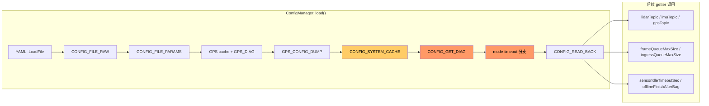

# 配置参数读取分析：run_20260313_152851

## 0. Executive Summary

| 结论 | 说明 |
|------|------|
| **配置文件加载** | 成功：单文件 `system_config_M2DGR.yaml` 被 YAML 解析，CONFIG_FILE_RAW / CONFIG_FILE_PARAMS 显示 219 个参数、内容与预期一致。 |
| **参数实际生效** | **存在严重不一致**：大量 getter / `get()` 读回值为**默认值**，与文件中配置不符；sensor 话题、system 队列与超时、mode、backend、loop_closure 等均未按文件生效。 |
| **根因方向** | 1）`get()` 的 dot-path 解析在**当前运行环境**下对同一 `cfg_` 树访问失败（或 `getSensor*TopicRaw()` 返回空）；2）mode 段判定为“无 mode section”，导致超时等走默认；3）system 节缓存未生效（`system_queue_cached_=false`）。 |
| **风险与影响** | 队列变小(500/16)、超时 10s、sensor 话题默认等会导致背压、提前结束、订阅错误；当前 run 有 M2DGR 的 GPS 话题兜底和 HBA fallback 的显式打印，部分行为被补救，但**配置不可信**，需修 path 解析或统一改为“先 Raw 再 get”的兜底策略。 |

---

## 1. 分析范围与数据来源

- **日志**：`logs/run_20260313_152851/full.log`
- **配置**：`automap_pro/config/system_config_M2DGR.yaml`（与 CONFIG_FILE_RAW 一致）
- **代码**：`ConfigManager::load()`、`get<T>()`、`getSensor*TopicRaw()`、各 getter（config_manager.cpp / config_manager.h）

---

## 2. 配置加载与“文件侧”表现（正常）

### 2.1 加载结果

- 全工程唯一配置：`/root/automap_ws/src/automap_pro/config/system_config_M2DGR.yaml`（realpath 为宿主机 `.../automap_pro/config/system_config_M2DGR.yaml`）。
- 日志：`Successfully loaded config from: ...`，无 YAML::BadFile / ParserException。
- `sensor.gps` 从文件直接读并缓存：`sensor.IsMap=1 sensor.gps.defined=1 ... cached_enabled=true`；GPS_DIAG 显示 `sensor.gps.topic='/ublox/fix'`、`sensor.gps.enabled=true`。

### 2.2 CONFIG_FILE_RAW / CONFIG_FILE_PARAMS

- 各 section（system, mode, sensor, frontend, keyframe, gps, submap, loop_closure, backend, map, session）均被 dump，与 YAML 结构一致。
- `CONFIG_FILE_PARAMS` 共 **219** 个 key=value，与文件一致，例如：
  - `sensor.lidar.topic=/velodyne_points`，`sensor.imu.topic=/handsfree/imu`，`sensor.gps.topic=/ublox/fix`
  - `system.frame_queue_max_size=5000`，`system.ingress_queue_max_size=2000`，`system.offline_finish_after_bag=true`
  - `mode.type=offline`，`mode.offline.sensor_idle_timeout_sec=7200.0`
  - `backend.process_every_n_frames=10`，`backend.hba.enable_gtsam_fallback=true`，`loop_closure.overlap_threshold=0.25` 等

结论：**从“文件内容”和 flatten 结果看，配置读取到 `cfg_` 且内容正确。**

---

## 3. 问题 1：get() / Raw 路径解析失败（sensor 话题等）

### 3.1 CONFIG_GET_DIAG 日志

```text
[ConfigManager][CONFIG_GET_DIAG] sensor.lidar.topic get=/os1_cloud_node1/points raw= match=default
[ConfigManager][CONFIG_GET_DIAG] sensor.imu.topic get=/imu/imu raw= match=default
```

- `get("sensor.lidar.topic", default)` 得到的是**默认值** `/os1_cloud_node1/points`，而不是文件中的 `/velodyne_points`。
- `getSensorLidarTopicRaw()` / `getSensorImuTopicRaw()` 返回 **空**（`raw=`），因此 match=default。

即：**同一 `cfg_` 下，dot-path 的 `get()` 与直接访问 `cfg_["sensor"]["lidar"]["topic"]` 的 Raw 均未得到文件中的值**（get 回退默认，Raw 为空）。

### 3.2 CONFIG_READ_BACK 与文件对比（节选）

| 参数 | 文件中 (CONFIG_FILE_PARAMS) | CONFIG_READ_BACK 实际生效 | 说明 |
|------|-----------------------------|---------------------------|------|
| sensor.lidar.topic | /velodyne_points | /os1_cloud_node1/points | get+Raw 均失败，用默认 |
| sensor.imu.topic | /handsfree/imu | /imu/imu | 同上 |
| sensor.gps.topic | /ublox/fix | /gps/fix | get 默认；下游有 M2DGR 兜底→最终 /ublox/fix |
| system.log_level | DEBUG | INFO | get 默认 |
| system.sensor_idle_timeout_sec | (mode 应 7200) | 10.0 | 见下节 |
| system.frame_queue_max_size | 5000 | 500 | 缓存未用，get 默认 |
| system.ingress_queue_max_size | 2000 | 16 | 同上 |
| system.offline_finish_after_bag | true | false | 同上 |
| submap.match_resolution | 0.35 | 0.40 | get 默认 |
| loop_closure.overlap_threshold | 0.25 | 0.30 | get 默认 |
| loop_closure.top_k | 8 | 5 | get 默认 |
| loop_closure.min_submap_gap | 1 | 2 | get 默认 |
| backend.process_every_n_frames | 10 | 5 | get 默认 |
| backend.publish_global_map_every_n_processed | 300 | 100 | get 默认 |
| backend.hba.enable_gtsam_fallback | true | false | get 默认 |
| backend.isam2.relinearize_threshold | 0.1 | 0.01 | get 默认 |
| backend.isam2.relinearize_skip | 20 | 1 | get 默认 |

说明：**凡依赖 `get()` 且无“从 cfg_ 直接读并缓存”的路径，多数都落回默认值，与文件不符。**

---

## 4. 问题 2：mode 段未被识别 → 超时与“无 mode”提示

### 4.1 日志

```text
[CONFIG] no mode section, sensor_idle_timeout = 10.0s (from system.sensor_idle_timeout_sec)
```

而同一份 load 里 CONFIG_FILE_RAW 已打印：

```text
-------- mode --------
  type: offline
  online:
    sensor_idle_timeout_sec: 10.0
  offline:
    sensor_idle_timeout_sec: 7200.0
```

即：**同一 `cfg_` 中 mode 段存在且内容正确，但 `if (cfg_["mode"] && cfg_["mode"].IsMap() && cfg_["mode"]["type"])` 被判为假**，导致走 `else`，使用 `get<double>("system.sensor_idle_timeout_sec", 10.0)`，得到 10.0，离线本应为 7200。

可能原因（待验证）：  
- 运行环境实际加载的 YAML 与当前仓库不一致（如容器内 `/root/automap_ws/...` 为旧版）；或  
- yaml-cpp 对 `cfg_["mode"]["type"]` 的 IsDefined/truth 判断异常（如键名/缩进/编码问题）。

---

## 5. 问题 3：system 节缓存未生效

- CONFIG_READ_BACK 中 `frame_queue_max_size=500`、`ingress_queue_max_size=16`、`offline_finish_after_bag=false`，与 getter 默认一致。
- getter 逻辑：若 `system_queue_cached_` 为 true 则用缓存值（5000/2000/true），否则走 `get<int>(..., default)`。
- 日志中**未出现** `[ConfigManager][CONFIG_SYSTEM_CACHE] frame_queue_max_size=...`，可推断 **`system_queue_cached_` 未被置 true**。
- 原因推断：`sys["frame_queue_max_size"].IsDefined()` 等在本次 load 中为 false（与 CONFIG_FILE_PARAMS 能 flatten 出 system.* 矛盾，需在同一运行环境下对 `cfg_["system"]` 做逐键诊断）。

影响：队列与“播完再结束”未按配置生效，背压与结束策略与预期不符。

---

## 6. 问题 4：loop_closure.model_path 含未展开的 CMake 变量

- CONFIG_FILE_RAW / CONFIG_FILE_PARAMS 中：
  - `loop_closure.overlap_transformer.model_path=${CMAKE_CURRENT_SOURCE_DIR}/models/pretrained_overlap_transformer.pth.tar`
- 该值为**字面量**，运行时不会做 CMake 替换，若 loop_detector 直接用作文件路径会找不到文件。
- 日志中有：`[LoopDetector] Initialized (workers=2, OT=fallback, TEASER=enabled)`，说明 Overlap Transformer 可能因路径无效走 fallback，与未展开变量一致。

建议：在加载后对 model_path 做一次替换（例如用安装路径或运行时可解析的占位符），或构建时生成已展开路径的 config。

---

## 7. 其他 WARN（非配置读取逻辑，但与运行相关）

- rosbag2_player：Ignoring topic（如 `/ublox/navpvt`）reason: package 'ublox_msgs' not found —— 与 config 读取无关，属 bag 与依赖。
- fast_livo：frame skipped (no points) —— 与 lid_topic/预处理有关；config 中 lid_topic 已正确写入临时 fast_livo 参数文件，若仍无点需查 bag 与驱动。
- 后端/心跳：`[HEARTBEAT] CRITICAL: threads stuck: backend(34s)` —— 行为现象，可能与队列/超时等配置间接相关。

---

## 8. 数据流与诊断位置小结



- **红色**：CONFIG_GET_DIAG（get vs Raw 双失败）、mode 分支（误判为无 mode）。
- **黄**：CONFIG_SYSTEM_CACHE 未生效，导致队列/offline_finish 用默认值。

---

## 9. 已实施的修复（2025-03）

以下修复已合入 `ConfigManager`，解决 CONFIG_READ_BACK 与文件不一致及 mode/model_path 问题：

1. **flat_params_cache_**：在 load() 的 CONFIG_FILE_PARAMS 阶段用 `flattenYamlParams` 结果填充 `flat_params_cache_`（key=dot path, value=标量字符串）。**get()** 在按 node 路径解析失败时，会回退到 `flat_params_cache_[key]` 并做 `parseFlatValue<T>` 解析后返回，从而与 CONFIG_FILE_PARAMS 一致。
2. **sensor 话题缓存**：从 flat 中读取 `sensor.lidar.topic` / `sensor.imu.topic` 写入 `sensor_lidar_topic_value_` / `sensor_imu_topic_value_` 并置 `sensor_*_topic_cached_`。**lidarTopic() / imuTopic()** 优先返回上述缓存，再走 get()/Raw，保证与文件一致。
3. **system 缓存**：对 `frame_queue_max_size` / `ingress_queue_max_size` / `offline_finish_after_bag` 先按 YAML 直接读，未定义时从 flat 回退，并始终置 `system_queue_cached_ = true`，保证 CONFIG_SYSTEM_CACHE 与 CONFIG_READ_BACK 一致。
4. **mode 段**：用 **IsDefined() / !IsNull()** 显式判断 `cfg_["mode"]`、`cfg_["mode"]["type"]` 等；若仍无 type，则从 flat 读 `mode.type`、`mode.offline.sensor_idle_timeout_sec`、`mode.online.sensor_idle_timeout_sec` 并设置 `sensor_idle_timeout_sec_`，避免误判“无 mode section”。
5. **overlap_transformer.model_path**：在 load() 中从 flat 取到 path 后，将 **${CMAKE_CURRENT_SOURCE_DIR}** 替换为配置所在包根目录（对 yaml_path 做两次 dirname），写入 `overlap_model_path_expanded_`。**overlapModelPath()** 优先返回该缓存，未加载时再 get() 并做同规则展开。

验证：重新跑同 bag + 同 config，对比 CONFIG_READ_BACK 与 CONFIG_FILE_PARAMS 是否一致，并确认 CONFIG_SYSTEM_CACHE、`[CONFIG] offline mode, sensor_idle_timeout = 7200.0s`、sensor 话题及 OT model 路径正常。

---

## 10. 建议措施（优先级，部分已做）

| 优先级 | 措施 | 说明 |
|--------|------|------|
| P0 | 定位 get()/Raw 为何对同一 cfg_ 失败 | 在 load() 内 CONFIG_GET_DIAG 前加：`cfg_["sensor"].IsMap()`、`cfg_["sensor"]["lidar"].IsDefined()`、`cfg_["sensor"]["lidar"]["topic"].as<std::string>()` 等日志；确认运行环境实际加载的文件与仓库一致（路径、mount、版本）。 |
| P0 | 统一 sensor 话题来源 | 与 GPS 一致：**优先用 getSensorLidarTopicRaw()/getSensorImuTopicRaw()**，仅当 Raw 为空时再 fallback 到 get()，并在 load 时做一次“从 cfg_ 直接读”的缓存，保证 CONFIG_READ_BACK 与文件一致。 |
| P0 | 修正 mode 判定与超时 | 检查 `cfg_["mode"]`、`cfg_["mode"]["type"]` 在运行时的 IsMap/IsDefined；必要时用与 CONFIG_FILE_RAW 相同的 section 遍历方式读 mode，并设置 `sensor_idle_timeout_sec_`。 |
| P1 | 保证 system 缓存生效 | 若 direct read 成功，必须 set `system_queue_cached_=true` 并打 CONFIG_SYSTEM_CACHE 日志；若 IsDefined() 仍为 false，需查 YAML 键名/缩进与 yaml-cpp 行为。 |
| P1 | model_path 展开 | 在读取 `loop_closure.overlap_transformer.model_path` 后，将 `${CMAKE_CURRENT_SOURCE_DIR}` 替换为实际安装/运行路径，或通过 build 生成已展开的 config。 |
| P2 | 回归验证 | 修改后重新跑同 bag、同 config，对比 CONFIG_READ_BACK 与 CONFIG_FILE_PARAMS 逐项一致；检查 frame_queue/ingress_queue、sensor_idle_timeout、sensor 话题、backend/loop 参数。 |

---

## 11. 风险与回滚

- **风险**：当前“文件已正确加载但 get()/部分缓存未生效”会导致队列小、超时短、话题错，在无 M2DGR 等兜底时易出现订阅错误、提前结束、背压丢帧。
- **回滚**：若改动 getter/缓存逻辑，保留原 get() 路径为 fallback，通过 feature flag 或配置开关切回旧行为；验证通过后再移除默认值分支。

---

## 12. 附录：关键日志行号（便于 grep）

| 标签 | 约行号 | 用途 |
|------|--------|------|
| CONFIG 全工程唯一配置文件 | 7 | 确认使用的 yaml 路径 |
| Successfully loaded config | 154 | 加载成功 |
| CONFIG_PARAM_FROM_FILE sensor.gps | 155 | GPS 从文件缓存 |
| CONFIG_FILE_RAW | 156–312 | 原始 section 内容 |
| CONFIG_FILE_PARAMS total=219 | 329–341 | 扁平化 key=value |
| GPS_DIAG sensor.gps.topic | 342–343 | GPS topic/enabled 从 YAML |
| GPS_CONFIG_DUMP | 344–359 | GPS 缓存值 |
| CONFIG_GET_DIAG lidar/imu | 360–361 | get vs Raw，raw 为空 |
| no mode section | 362 | 超时走默认 10s |
| CONFIG_READ_BACK | 363–377 | 所有 getter 读回值 |
| M2DGR config detected but sensor.gps.topic was default | 380 | GPS 兜底生效 |
| backend.hba.enable_gtsam_fallback=false | 383 | 与文件 true 不一致 |
| frame_queue_max_size=500 ingress_queue_max_size=16 | 386 | 与文件 5000/2000 不一致 |

以上为对 `full.log` 的配置参数读取分析与结论；修复建议以 P0 为主，再在回归中覆盖 P1/P2。
