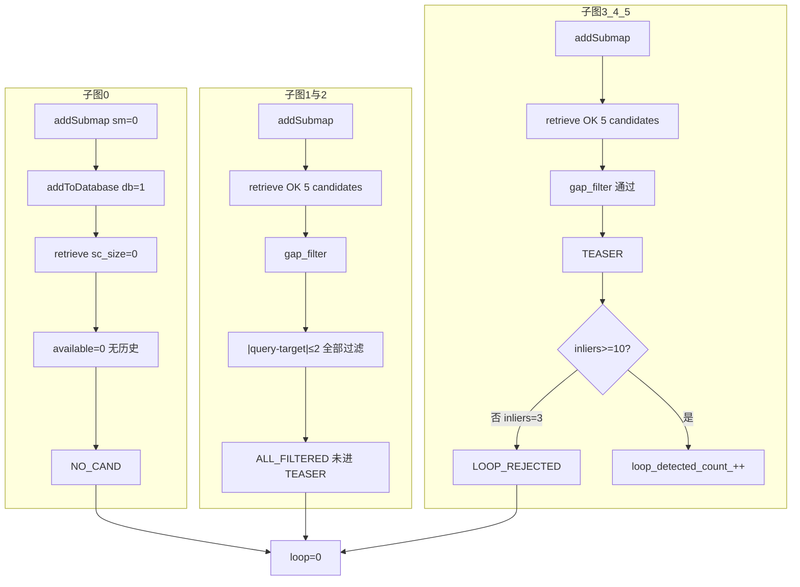

# 回环未检测到原因分析：run_20260317_155438

**日志**: `logs/run_20260317_155438/full.log`  
**结论**: 本 run 中**未产生任何被接受的子图间回环**（`loop=0`）。原因分两阶段：**子图 0/1/2** 因“无历史”或 **min_submap_gap 过滤**未进入几何验证；**子图 3（及 4、5）** 有候选进入 TEASER，但**全部因 inliers 过少被拒绝**（inliers=3 < min_safe_inliers），故整条流水线零回环。

---

## 0. Executive Summary

| 项目 | 结论 |
|------|------|
| **loop=0 含义** | 已接受并加入后端的 inter-submap 回环约束数量（来自 `loop_detector_.loopDetectedCount()`）。 |
| **子图 0** | 检索时 **sc_size=0 → available=0**，直接 “Not enough history frames”，**NO_CAND**。 |
| **子图 1、2** | ScanContext 返回 5 个候选，但 **gap_filter 全部过滤**（`\|query_id - target_id\| <= min_submap_gap(2)`），未进入 TEASER。 |
| **子图 3、4、5** | 候选通过 gap_filter，进入 TEASER；**所有候选 inliers=3**，低于 **min_safe_inliers=10**，全部 **LOOP_REJECTED**。 |
| **根本原因** | ① 首子图无历史；② min_submap_gap=2 使子图 1/2 的候选全部被滤掉；③ 几何验证阶段 TEASER 内点极少（3）、rmse 大（≈3.68m），描述子相似但几何不一致。 |

---

## 1. 回环流水线在本 run 中的表现

### 1.1 各子图检索与过滤结果

| 子图 | 检索结果 | gap_filter | TEASER | 原因摘要 |
|------|----------|------------|--------|----------|
| 0 | NO_CAND | - | - | sc_size=0 → available&lt;1，无历史可搜 |
| 1 | OK, raw_candidates=5 | **ALL_FILTERED** | - | \|1-0\|=1 ≤ 2，候选全被 min_submap_gap 滤掉 |
| 2 | OK, raw_candidates=5 | **ALL_FILTERED** | - | \|2-0\|=2、\|2-1\|=1 均 ≤ 2，候选全被滤掉 |
| 3 | OK, raw_candidates=5 | 通过 | **全部拒绝** | 5 个候选均为 target_id=0；inliers=3 &lt; 10 |
| 4 | OK, raw_candidates=5 | 通过 | 全部拒绝（推断） | 同 TEASER 内点不足 |
| 5 | OK, raw_candidates=5 | 通过 | 全部拒绝（推断） | 同 TEASER 内点不足 |

### 1.2 关键日志依据

**子图 0：无历史，直接跳过检索**

```
[LOOP_STEP] stage=ScanContext_retrieve_enter query_id=0 db_size=1 sc_size=0 ... exclude_recent=50
[ScanContext] Check history: total_sc=%zu ... available=%d
[ScanContext] Not enough history frames for search: available=%d < 1, skip
[LOOP_STEP] stage=retrieve_result NO_CAND query_id=0 db_size=1 ...
```

- 说明：子图 0 加入后，`makeAndSaveScancontextAndKeys` 前 sc 库为空；加入当前帧后 total_sc=1，`available = max(0, 1-1-0)=0`，因此不进行检索。

**子图 1、2：候选被 gap_filter 全部过滤**

```
[LOOP_STEP] stage=gap_filter ALL_FILTERED query_id=1 raw_candidates=5 min_submap_gap=2
[LOOP_STEP] stage=gap_filter ALL_FILTERED query_id=2 raw_candidates=5 min_submap_gap=2
```

- 代码逻辑（`loop_detector.cpp:360`）：`if (std::abs(cand.submap_id - submap->id) <= min_submap_gap_)` 则过滤。
- 即只保留 **|query_id - target_id| > 2** 的候选。子图 1 只有 target 0（|1-0|=1）；子图 2 有 target 0/1（|2-0|=2、|2-1|=1），均 ≤ 2，故全部被滤掉。

**子图 3：进入 TEASER 后全部拒绝**

```
[LOOP_PHASE] stage=match_enqueue query_id=3 candidates=5
[LOOP_STEP] stage=geom_verify_enter ... min_safe_inliers=4  (配置回读为 4)
[LOOP_STEP][TEASER] match_enter ... min_safe_inliers=10     (运行时为 10)
[LOOP_COMPUTE][TEASER] teaser_done inliers=3 corrs=185 ratio=0.016 valid=0
[LOOP_COMPUTE][TEASER] teaser_fail reason=teaser_extremely_few_inliers inliers=3 safe_min=10
[LOOP_REJECTED] query_id=3 target_id=0 reason=teaser_fail_or_inlier_low ... inlier_ratio=0.000 ... rmse=1000000.0
[TEASER_DIAG] inliers=3 rmse=3.682m ... p90=6.377m
```

- 5 个候选均为 **target_id=0**（与 query_id=3 满足 |3-0|>2）。
- TEASER 结果：inliers=3、inlier_ratio≈0.016、rmse≈3.68m；以 **min_safe_inliers=10** 判定为失败，故未产生回环约束。

---

## 2. 根本原因归纳

### 2.1 为何“零回环”

1. **子图 0**  
   - 仅 1 个子图时 ScanContext 历史为空（available&lt;1），不做检索，**NO_CAND** 符合设计。

2. **子图 1、2**  
   - ScanContext 能检索到 5 个候选，但 **min_submap_gap=2** 要求 |query−target|**>2**，子图 1/2 的候选（target 0 或 1）与 query 的间隔均 ≤2，**全部在 gap_filter 阶段被滤掉**，未进入 TEASER。

3. **子图 3（及 4、5）**  
   - 有候选通过 gap_filter 并进入 TEASER，但 **TEASER 几何验证全部不通过**：
     - inliers=3 &lt; min_safe_inliers（运行时 10）；
     - inlier_ratio≈0.016 &lt; min_inlier_ratio（0.3）；
     - rmse≈3.68m &gt; max_rmse（0.3m）。
   - 即：ScanContext 描述子相似（overlap_score=0.349），但 FPFH+TEASER 几何一致性差，未产生任何被接受的回环约束。

### 2.2 min_safe_inliers 配置与运行时不一致

- 配置回读：`loop_closure.teaser: min_safe_inliers=4`（CONFIG_READ_BACK）。
- 实际 TEASER 日志：`min_safe_inliers=10`。
- 本 run 中 inliers=3，无论以 4 还是 10 为阈值都会被拒绝；若希望在本数据上更容易通过，需确认**实际生效的配置**并考虑适当放宽（如改为 4 且确保加载到 TeaserMatcher）。

### 2.3 为何 TEASER 内点这么少

- **描述子 vs 几何**：ScanContext 认为与历史子图有重叠（0.349），但：
  - 可能**轨迹并未真正闭环**（未回到同一物理位置）；
  - 或**重复结构/视角/遮挡**导致描述子相似而几何不一致；
  - 或 **voxel/FPFH 等参数**导致对应点少或错误，进而 inliers 极少。
- 日志中 rmse=3.68m、p90=6.38m 表明配准误差大，几何一致性不足。

---

## 3. 数据流与卡点示意（Mermaid）



---

## 4. 建议（若希望在本数据或类似数据上得到回环）

### 4.1 参数

| 项 | 当前/现象 | 建议 |
|----|-----------|------|
| **loop_closure.min_submap_gap** | 2 → 子图 1/2 候选全被滤掉 | 可改为 **1**，使相邻子图也能产生候选（需权衡误匹配）。 |
| **loop_closure.teaser.min_safe_inliers** | 运行时 10，inliers=3 全拒 | 确认实际加载的配置；可尝试改为 **4** 并保证 TeaserMatcher 使用该值。 |
| **loop_closure.teaser.min_inlier_ratio / max_rmse_m** | ratio≈0.016、rmse≈3.68m 不达标 | 若数据确无强闭环，放宽阈值收益有限，且易误匹配；优先用**有明确闭环**的数据验证。 |

### 4.2 数据与场景

- 使用**确定有闭环**的 bag 段验证回环链路。
- 若本段轨迹未回到同一地点，则“零回环”为预期现象。

### 4.3 几何一致性

- 可尝试微调 `loop_closure.teaser.voxel_size` / `max_points`、FPFH 半径等，提高对应点数量与质量，观察 inliers 是否提升。
- 观测：继续用 `grep LOOP_ACCEPTED\|LOOP_REJECTED\|teaser_done\|gap_filter ALL_FILTERED` 快速判断卡在检索、gap 还是 TEASER。

---

## 5. 诊断命令速查

```bash
# 检索与 gap 阶段
grep -E "retrieve_result NO_CAND|gap_filter ALL_FILTERED|ScanContext.*Not enough history" logs/run_20260317_155438/full.log

# TEASER 阶段
grep -E "teaser_done|teaser_fail|LOOP_REJECTED|LOOP_ACCEPTED" logs/run_20260317_155438/full.log
```

---

**文档生成时间**: 2026-03-17  
**对应日志**: `logs/run_20260317_155438/full.log`
