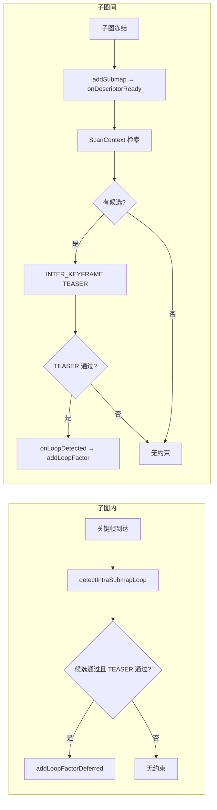

# 回环检测深度分析报告（run_20260317_173943 / full.log）

## 0. Executive Summary

| 结论 | 说明 |
|------|------|
| **子图内回环** | **未产生任何有效约束**：仅有 `[INTRA_LOOP][TRIGGER]`，无 `[INTRA_LOOP][RESULT]` / `addLoopFactorDeferred` / `loop_intra`；子图内详细日志走 ALOG，未出现在 full.log，可观测性不足。 |
| **子图间回环** | **检索有候选、几何验证全部失败**：子图 1/2/3 对 0 的 ScanContext 候选存在，TEASER 全部 `teaser_fail reason=teaser_extremely_few_inliers inliers=5 safe_min=10`，**0 条约束入图**。 |
| **严重问题** | ① **TeaserMatcher 使用了默认参数 10/0.3 而非配置 4/0.12**（构造早于 ConfigManager.load，导致 YAML 中 min_safe_inliers=4 未生效）；② 全程 **loop=0**，回环模块对本 run 无贡献。 |
| **潜在问题** | 子图内 SUMMARY/DETECTED 仅 ALOG 输出、子图间 inlier 极少（5/873）可能表示轨迹无真闭环或 FPFH/体素参数不适配、以及 init 顺序导致的配置未生效。 |

---

## 1. 日志与代码对应关系

### 1.1 本 run 回环相关统计（从 full.log）

- **BACKEND 状态**：全程 `loop=0`（无回环约束入图）。
- **子图内**：仅见 `[INTRA_LOOP][TRIGGER] submap_id=0 kf_idx=*`，**从未出现**：
  - `[INTRA_LOOP][RESULT] detected=*`
  - `[CONSTRAINT] step=loop_intra`
  - `addLoopFactorDeferred` / `loop_intra`
- **子图间**：
  - 子图 0 冻结：`retrieve_result NO_CAND`（db_size=1，正常）。
  - 子图 1 冻结：`retrieve_result OK raw_candidates=5`，全部为 `(tgt0=0.405)`（对子图 0 的 5 个关键帧级候选）；进入 INTER_KEYFRAME TEASER 后**全部** `teaser_fail reason=teaser_extremely_few_inliers inliers=5 safe_min=10`。
- **CONFIG_READ_BACK**：`min_inlier_ratio=0.12 min_safe_inliers=4`（YAML 已正确加载）。
- **TEASER 运行时日志**：`min_safe_inliers=10 min_inlier_ratio=0.300`（与配置不一致）。

### 1.2 设计要点（代码与文档）

- **子图内**：关键帧级，`detectIntraSubmapLoop(active_submap, query_kf_idx)` → 通过则 `addLoopFactorDeferred(node_i, node_j, ...)`。
- **子图间**：inter_keyframe_level=true 时，子图间为关键帧↔关键帧检索 + TEASER，通过则 `onLoopDetected` → `addLoopFactor`（或入队）；同子图约束在 `onLoopDetected` 中显式跳过（`sm_i==sm_j` 不加入）。

---

## 2. 严重问题

### 2.1 TeaserMatcher 未使用 YAML 中的 TEASER 参数（P0）

**现象**：  
- 配置：`loop_closure.teaser.min_safe_inliers=4`、`min_inlier_ratio=0.12`（CONFIG_READ_BACK 与 CONFIG_FILE_RAW 一致）。  
- 运行时：TeaserMatcher 打印 `min_safe_inliers=10 min_inlier_ratio=0.300`。

**原因**：  
- `TeaserMatcher` 仅在**构造函数**中从 `ConfigManager::instance()` 读取参数（`teaser_matcher.cpp` 第 32–40 行）。  
- `LoopDetector` 为 `AutoMapSystem` 的成员，在 `AutoMapSystem` 构造函数中先于**成员初始化列表/成员构造**完成时，`loop_detector_`（及其内部的 `teaser_matcher_`）已被构造。  
- `loadConfigAndInit()`（内部调用 `ConfigManager::instance().load(config_path)`）在构造函数**函数体**中才执行（`automap_system.cpp` 第 65、173、188 行）。  
- 因此 **TeaserMatcher 构造时 ConfigManager 尚未 load YAML**，`get<int>("loop_closure.teaser.min_safe_inliers", 10)` 使用默认值 10，同理 `min_inlier_ratio` 为 0.30。

**影响**：  
- 本 run 中 TEASER 结果均为 inliers=5；若使用配置的 min_safe_inliers=4，至少“内点数”条件可通过，但 inlier_ratio=0.006 仍远低于 0.12，单改此项仍不会通过。  
- 严重性在于：**所有使用“先构造 LoopDetector/TeaserMatcher、后 load 配置”的启动路径，回环 TEASER 参数都与 YAML 不一致**，属于设计/初始化顺序错误。

**建议修复**（任选其一或组合）：  
1. **推荐**：将 `LoopDetector`（或至少依赖配置的组件）改为在 `loadConfigAndInit()` 或 `deferredSetupModules()` 中**在 load 之后**再构造（例如 `std::unique_ptr<LoopDetector>` + 延迟 `new`）。  
2. 或在 `LoopDetector::init()` 中再次从 ConfigManager 读取 TEASER 相关参数，并更新到 TeaserMatcher（需为 TeaserMatcher 提供 setter 或 reinit 接口）。  
3. 或在每次 `match()` 时从 ConfigManager 读取阈值（可接受一定性能开销时）。

---

### 2.2 子图间 TEASER 全部失败，回环约束数为 0

**现象**：  
- 子图 1 vs 0：多对 (query_kf, target_kf) 进入 TEASER，结果均为 `inliers=5 corrs=873 ratio=0.006 valid=0`，`teaser_fail reason=teaser_extremely_few_inliers inliers=5 safe_min=10`。  
- 子图 2、3 与 0 的匹配同理，无 `LOOP_ACCEPTED` / `addLoopFactor` 成功。

**原因归纳**：  
1. **阈值**：如上，运行时使用 safe_min=10、min_inlier_ratio=0.3，5 个 inliers 和 0.006 的 ratio 必然被拒。  
2. **几何一致性差**：873 个 FPFH 对应点中仅 5 个被 TEASER 判为内点，说明要么两帧**并未真正重叠**（轨迹无闭环或重复结构误匹配），要么 voxel/FPFH/场景导致正确对应极少。

**影响**：  
- 本 run 子图间回环**完全未闭合**，与“子图 0 与 1/2/3 应有闭环”的预期不符时，需从数据与参数双方面排查。

**建议**：  
- 修复 2.1 后，用同一 bag 再跑，确认 4/0.12 下是否仍全部失败。  
- 若仍失败：检查轨迹是否真有回到子图 0 的闭环；适当放宽 voxel_size、max_rmse、min_inlier_ratio（在可接受误匹配前提下）；或增加 TEASER 前的几何/距离预筛，减少明显不重叠的候选对。

---

### 2.3 子图内回环未观察到任何约束或详细日志

**现象**：  
- 仅有 `[INTRA_LOOP][TRIGGER] submap_id=0 kf_idx=*`，无 `[INTRA_LOOP][RESULT] detected=*`，无 `addLoopFactorDeferred` / `CONSTRAINT step=loop_intra`。  
- 文档/代码中的 `[INTRA_LOOP][DEBUG]`、`[INTRA_LOOP][FILTER]`、`[INTRA_LOOP][SUMMARY]`、`[INTRA_LOOP][DETECTED]` 等均未在 full.log 中出现。

**原因归纳**：  
1. **日志输出路径**：子图内分支使用 `ALOG_INFO(MOD, ...)`，未同时打 `RCLCPP_INFO(node_->get_logger(), ...)`；若 ALOG 未转发到当前 full.log 所用通道，则这些行不会出现在本 log。  
2. **约束未产生**：`detectIntraSubmapLoop` 可能因以下原因返回空：  
   - 历史关键帧不足（例如 index_gap < intra_submap_min_keyframe_gap=10）；  
   - 时间/距离/描述子过滤掉所有候选；  
   - ScanContext/描述子未就绪（`keyframe_scancontexts_.size() != kf_count` 时直接 return）；  
   - 或 TEASER 全部失败（且子图内同样受 TeaserMatcher 默认 10/0.3 影响）。

**影响**：  
- 无法从本 log 判断子图内是“从未有候选”还是“有候选但 TEASER/阈值全拒”，也无法做过滤统计（temporal/index/dist/desc/teaser_invoked 等）。

**建议**：  
1. 子图内关键路径（至少 SUMMARY、DETECTED、FILTER 汇总）增加 RCLCPP 或与 full.log 一致的 ALOG 输出，便于线上/离线统一分析。  
2. 确认 ALOG 与 ROS log 的映射（是否写入同一文件、日志级别过滤）。  
3. 修复 TeaserMatcher 初始化顺序后，再观察子图内是否出现 DETECTED/loop_intra。

---

## 3. 潜在问题

### 3.1 子图间候选均为同一子图、同一 score 的打印

- 日志：`raw_targets_and_scores=[(tgt0=0.405) (tgt0=0.405) (tgt0=0.405) (tgt0=0.405) (tgt0=0.405)]`。  
- 在 inter_keyframe_level 下，候选为 (submap_id, keyframe_id) 列表，5 个均为子图 0 的 5 个不同关键帧、score 相同为 0.405 是可能的（例如子图 0 仅 1 个子图级描述子，关键帧级检索时得到多份相同或相近分数）。  
- **建议**：日志中增加 keyframe_id 或 (submap_id, kf_idx)，便于区分是 5 个不同关键帧还是重复条目。

### 3.2 子图内描述子就绪时机

- 子图内依赖 `keyframe_scancontexts_` / `keyframe_clouds_ds`，由 `ensureIntraSubmapDescriptorsUpTo(submap, last_idx)` 在 `detectIntraSubmapLoop` 内按需计算；活跃子图在未冻结时也会调用，逻辑上可就绪。  
- 若某次 run 中 `prepareIntraSubmapDescriptors` 仅在冻结时调用，而活跃子图在首次调用 `detectIntraSubmapLoop` 时尚未 prepare，则可能因“描述子未就绪”提前 return；当前代码在 init 后通过 `ensureIntraSubmapDescriptorsUpTo` 补全，需确保与 prepare 的时序一致，避免漏算。

### 3.3 overlap_threshold / retrieve 参数与 ScanContext 不一致

- 日志中 `retrieve_enter` 显示 `overlap_threshold=0.300`、`top_k=5`，而 YAML 为 `overlap_threshold: 0.20`、`top_k: 10`。  
- ScanContext 检索使用 `dist_threshold=0.130`，配置为 `scancontext.dist_threshold=0.18`。  
- 说明**部分回环参数**在 LoopDetector 初始化时可能仍从默认或别处读取，与 YAML 不一致；建议统一核对 ConfigManager 的 key 与 init 时机，确保 overlap_threshold、top_k、scancontext.dist_threshold 等与配置文件一致。

### 3.4 同子图回环在 onLoopDetected 中被跳过

- 代码显式：`if (lc->submap_i == lc->submap_j) { ... skip ... }`。  
- 子图内回环走的是 `addLoopFactorDeferred` 路径（在 tryCreateKeyFrame / onSubmapFrozen 中），**不会**走 `onLoopDetected`，因此不会误入“同子图 skip”逻辑。  
- 设计正确；仅需注意：若未来将子图内约束也经 `onLoopDetected` 回调，需避免被 same_submap 分支误拒（例如用 is_intra 标志区分）。

---

## 4. 数据流与状态小结（Mermaid）



本 run：子图内未观察到 A4；子图间有 B5 但全部 B6 为否，故无 B7。

---

## 5. 修复状态与运行验证（已落地）

### 5.1 已修复项

| 问题 | 修复方式 | 代码位置 |
|------|----------|----------|
| TeaserMatcher 未使用 YAML 参数 | `TeaserMatcher::applyConfig()` 从 ConfigManager 读参；构造函数与 `LoopDetector::init()` 均调用；init 在 load 之后执行，故运行时为 YAML 值 | `teaser_matcher.h/cpp`，`loop_detector.cpp::init()` |
| 回环/retrieve 参数构造时未生效 | `LoopDetector::init()` 内重新读取 overlap_threshold_、top_k_、ScanContext 等全部回环参数 | `loop_detector.cpp::init()` |
| 子图内日志不可见 | 子图内 WARN/SUMMARY/DETECTED 同时打 RCLCPP，便于 full.log 观测 | `loop_detector.cpp::detectIntraSubmapLoop()` |

### 5.2 运行后验证命令（在 full.log 上执行）

```bash
# 1) TEASER 参数是否来自 YAML（应为 4 / 0.12 / 0.40，不是 10 / 0.30）
grep 'CONFIG.*TEASER applied' full.log
grep 'VERIFY.*first match params' full.log

# 2) retrieve 参数是否来自 YAML（overlap_threshold=0.20 top_k=10）
grep 'CONFIG.*retrieve params' full.log
grep 'retrieve_enter' full.log | head -5

# 3) 子图内是否执行、汇总与是否检测到
grep 'INTRA_LOOP' full.log

# 4) 是否有回环约束入图
grep -E 'LOOP_ACCEPTED|addLoopFactor.*added|loop_intra.*result=ok' full.log
```

预期（M2DGR 配置）：`TEASER applied` 与 `VERIFY first match params` 均显示 `min_safe_inliers=4 min_inlier_ratio=0.12`；`retrieve params` 显示 `overlap_threshold=0.20 top_k=10`。

---

## 6. 验证与修复清单

| 序号 | 项 | 说明 |
|------|----|------|
| 1 | 修复 TeaserMatcher 初始化顺序 | 保证在 ConfigManager.load() 之后构造或 init 时重新读取 TEASER 参数并写入 TeaserMatcher。 |
| 2 | 核对 overlap/top_k/scancontext 参数 | 确认 retrieve 与 ScanContext 使用的 threshold/num_candidates 与 YAML 一致，并在 CONFIG_READ_BACK 或 init 日志中打印。 |
| 3 | 子图内日志可观测性 | 至少将 INTRA_LOOP 的 SUMMARY/DETECTED 及主要 FILTER 统计打到与 full.log 同一输出（RCLCPP 或 ALOG 统一配置）。 |
| 4 | 同 bag 回归 | 修复 1 后重跑同一 bag，grep `min_safe_inliers`、`LOOP_ACCEPTED`、`addLoopFactor`、`loop_intra` 验证回环是否出现。 |
| 5 | 轨迹与场景 | 若修复后仍无子图间回环，确认轨迹是否真有闭环、以及 voxel/FPFH/重叠度是否适合当前场景。 |

---

## 7. 小结

- **子图内**：逻辑存在且会触发，但本 run 未产生任何约束，且详细过程未出现在 full.log，需补日志并确认描述子与阈值。  
- **子图间**：检索与 INTER_KEYFRAME 流程正常，但 TEASER 全部因 inliers=5 & safe_min=10 被拒；根因之一是 **TeaserMatcher 使用了默认 10/0.3 而非配置 4/0.12**（构造早于 config load）。  
- 修复 TeaserMatcher 参数生效问题并增强子图内日志后，再结合同 bag 与真闭环场景做回归，可系统验证子图内/子图间回环是否正常。
