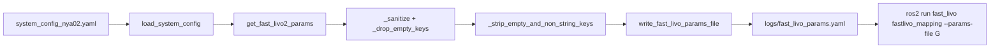

# 建图流水线架构与 fast_livo parameter '' 问题修复

## 0. Executive Summary

| 项目 | 说明 |
|------|------|
| **现象** | 运行 `./run_full_mapping_docker.sh -b data/automap_input/nya_02_slam_imu_to_lidar/nya_02_ros2` 时，`fastlivo_mapping` 进程崩溃：`parameter '' has invalid type: expected [string] got [not set]` |
| **根因** | fast_livo 使用 `automatically_declare_parameters_from_overrides(true)` 时，rclcpp 会为 YAML 中**每一个 key** 自动声明参数；若 C++ 端解析/合并产生空名 override，会触发 `parameter '' has invalid type: expected [string] got [not set]`。 |
| **修复（推荐）** | 在 **fast-livo2-humble/src/main.cpp** 中设置 `automatically_declare_parameters_from_overrides(false)`，仅声明代码中显式 declare 的参数；参数文件中的 overrides 仍会在 `declare_parameter()` 时被应用。修改后需 **重新编译 fast_livo 包**（如 `colcon build fast_livo`）。 |
| **辅助** | `params_from_system_config.py` 中已做扁平化写入、空键过滤与详细 [PATHS]/[KEYS]/[SUMMARY] 日志，便于排查。 |
| **验证** | 重新编译 fast_livo 后运行上述 Docker 建图命令，确认 `ros2-2` (fastlivo_mapping) 不再退出。 |

---

## 1. 建图流水线整体架构

### 1.1 入口与调用链

```
run_full_mapping_docker.sh (-b <bag>)
  └─> 容器内: cd /workspace/automap_pro && ./run_full_mapping_enhanced.sh --verbose --no-convert --no-ui
        └─> 步骤 4: ros2 launch automap_pro/launch/automap_offline.launch.py
              config:=<CONFIG_ABS>
              bag_file:=<BAG>
              use_external_frontend:=true
```

- **CONFIG** 默认：`automap_pro/config/system_config_nya02.yaml`（Docker 内为 `/workspace/automap_pro/automap_pro/config/system_config_nya02.yaml`）。
- 建图所用参数（overlap_transformer、HBA、**fast_livo2**）均从该 **system_config** 生成，不依赖各子包内散落的 yaml。

### 1.2 离线建图 Launch 内进程组成

| 进程 | 包/可执行文件 | 作用 | 参数来源 |
|------|----------------|------|----------|
| ros2-1 | ros2 bag play | 回放 bag，发布 /clock | 命令行 bag_file, rate |
| **ros2-2** | **fast_livo / fastlivo_mapping** | **LiDAR-IMU 前端里程计** | **--params-file 指向的 fast_livo_params.yaml（由 system_config 生成）** |
| automap_system_node-3 | automap_pro | 子图、回环、HBA、保存地图 | parameters: config:=system_config, use_sim_time |
| static_transform_publisher-4 | tf2_ros | world→map 静态 TF | arguments |

失败发生在 **ros2-2**：`fastlivo_mapping` 启动时加载 `--params-file` 的 YAML，若其中存在名为空字符串的键，就会触发 `parameter '' has invalid type: expected [string] got [not set]`。

### 1.3 参数生成与写入流程



- **get_fast_livo2_params**：从 `sensor.*` 与 `frontend.fast_livo2.*` 拼出 common（lid_topic/imu_topic/img_topic）、extrin_calib、evo、vio、lio 等。
- ** _sanitize / _drop_empty_keys**：去 None、空键、空字符串值，保证 lid_topic/imu_topic/img_topic/seq_name 等必填 string 非空。
- ** _strip_empty_and_non_string_keys**（本次新增）：写入前再递归去掉「非 str」或「str 且 strip 后为空」的键，避免 ROS2 解析出 parameter `''`。

### 1.4 项目内与建图相关的关键路径

| 角色 | 路径/说明 |
|------|------------|
| 建图入口 | `run_full_mapping_docker.sh` → `run_full_mapping_enhanced.sh` |
| 离线 Launch | `automap_pro/launch/automap_offline.launch.py`（OpaqueFunction 内写 fast_livo_params 并启动 fastlivo_mapping） |
| 参数生成 | `automap_pro/launch/params_from_system_config.py`（get_fast_livo2_params, write_fast_livo_params_file） |
| 默认 system_config | `automap_pro/config/system_config_nya02.yaml` |
| 生成 params 文件 | `automap_pro/logs/fast_livo_params.yaml`（容器内：/workspace/automap_pro/automap_pro/logs/） |
| 前端节点 | `fast-livo2-humble` → 可执行文件 `fastlivo_mapping`，参数通过 `automatically_declare_parameters_from_overrides(true)` 从 override 声明 |

---

## 2. 为何「一直解决不了」：根因说明

1. **错误含义**  
   `parameter ''` 表示**参数名**为空字符串；`expected [string] got [not set]` 表示该参数被声明/期望为 string，但实际未设置或类型不对。合在一起即：存在一个「名为空」的 override，类型不符合 string 声明。

2. **fast_livo 的加载方式**  
   - 原 `main.cpp` 使用 `options.automatically_declare_parameters_from_overrides(true)`。  
   - 即：**参数文件中出现的每个键**都会作为该节点的 parameter override 被声明。  
   - rclcpp/YAML 解析在部分环境下会产生空名 override（即便我们写的 YAML 无空键），从而触发 `parameter ''` 异常。

3. **最终修复（C++ 侧）**  
   - 将 **fast-livo2-humble/src/main.cpp** 中改为 `automatically_declare_parameters_from_overrides(false)`。  
   - 节点仅声明 LIVMapper/loadVoxelConfig 中显式 declare 的参数；文件中的 overrides 在 declare 时仍会生效。  
   - 修改后需 **colcon build fast_livo** 并重新运行建图。

4. **可能的空键来源**  
   - 配置或代码中某处把键设为 `""` 或仅空白。  
   - 某次写入/合并时引入 `null` 键或非字符串键（如整数），YAML 或 ROS2 解析后变成空名。  
   - 即便 YAML 无空键，rclcpp 解析/合并 overrides 时在部分环境下仍可能产生空名。

5. **Python 侧辅助**  
   - 在**写入 YAML 前**对参数树做递归过滤、扁平化写入，并输出 [PATHS]/[KEYS]/[SUMMARY] 等日志便于排查。

---

## 3. 变更清单与代码位置

| 文件 | 变更 |
|------|------|
| **fast-livo2-humble/src/main.cpp** | `automatically_declare_parameters_from_overrides(true)` → `false`，避免从 overrides 自动声明空名参数；修改后需 **colcon build fast_livo**。 |
| `automap_pro/launch/params_from_system_config.py` | 扁平化写入、`_strip_empty_and_non_string_keys`、[PATHS]/[KEYS]/[CRITICAL_PARAMS]/[SUMMARY] 等诊断日志。 |
| `automap_pro/launch/automap_offline.launch.py` | 路径与 CMD 日志；`--params-file` 使用绝对路径。 |

---

## 4. 编译/部署/运行说明

- **必须重新编译 fast_livo**：因修改了 `main.cpp`，需在 workspace 中执行 `colcon build fast_livo`（或 `colcon build --packages-select fast_livo`），再运行建图。
- **Docker 建图**（与之前相同）：
  ```bash
  ./run_full_mapping_docker.sh -b data/automap_input/nya_02_slam_imu_to_lidar/nya_02_ros2
  ```
- 若使用 `-c` 指定配置，请确保该 YAML 中 `frontend.fast_livo2` 与 `sensor` 结构正确，否则 `get_fast_livo2_params` 可能得到不完整或异常结构，过滤会尽量兜底，但建议以 `system_config_nya02.yaml` 为参考。

---

## 5. 验证与排查

1. **成功标志**：建图步骤 4 中不再出现 `[ros2-2]: process has died`，且无 `parameter '' has invalid type`。  
2. **若仍报错**：  
   - 在容器内查看实际使用的 params 文件：  
     `cat /workspace/automap_pro/automap_pro/logs/fast_livo_params.yaml`  
   - 检查是否有键名为空或仅空格的行（如 `: value` 或 `'': ...`）。  
   - 确认 launch 使用的 config 路径与预期一致（日志中 `[ConfigManager] Loaded config: ...`）。  
3. **日志位置**：  
   - 主日志：`logs/full_mapping_YYYYMMDD_HHMMSS.log`  
   - Launch 日志目录：`logs/launch_YYYYMMDD_HHMMSS.d/`  

---

## 6. 风险与回滚

- **风险**：若某处**有意**使用空键或非字符串键（当前工程中未见），过滤会将其移除，可能改变语义。  
- **回滚**：从 `params_from_system_config.py` 中删除 `_strip_empty_and_non_string_keys` 的调用及函数定义，恢复仅使用 `get_fast_livo2_params` + 原有 sanitize/drop_empty_keys 的版本即可。

---

## 7. 后续建议

- 若希望从根上避免 YAML 空键，可在 `get_fast_livo2_params` 里对从 `config` 取出的嵌套 dict 做「只拷贝已知 section、且键为合法字符串」的约束，与当前写入前过滤形成双重保障。  
- 可增加一个最小单元测试：对 `get_fast_livo2_params(system_config_nya02)` 与 `write_fast_livo_params_file` 写出的 YAML 做一次解析，断言不存在任何空键。
