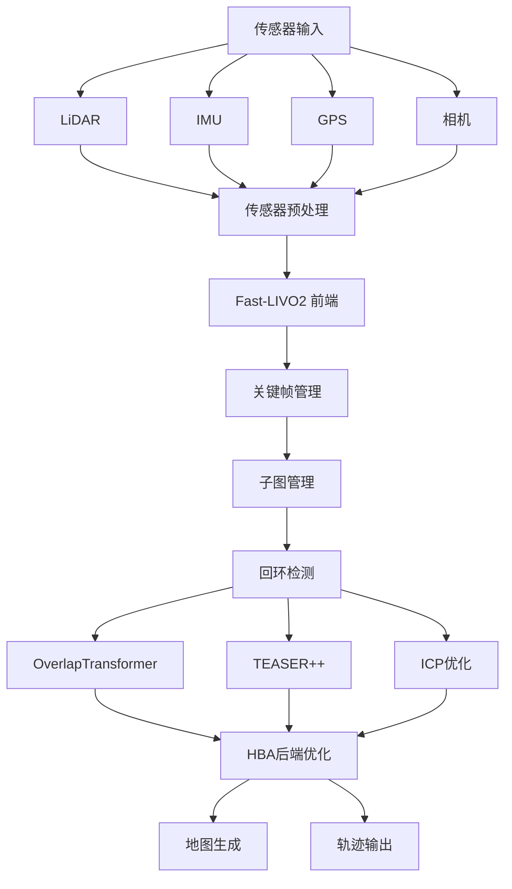
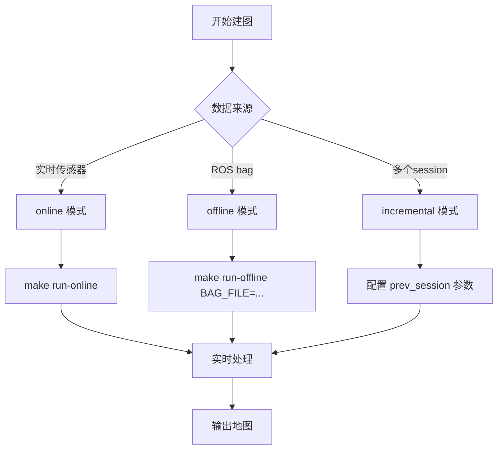

# AutoMap-Pro 建图流程指南

## 目录

1. [概述](#概述)
2. [数据准备](#数据准备)
3. [环境配置](#环境配置)
4. [建图模式](#建图模式)
5. [离线建图流程](#离线建图流程)
6. [在线建图流程](#在线建图流程)
7. [增量式建图流程](#增量式建图流程)
8. [结果输出](#结果输出)
9. [常见问题](#常见问题)

---

## 概述

### AutoMap-Pro 建图系统

AutoMap-Pro 是一个端到端的自动化3D点云建图系统，适用于城市道路、校园、隧道和矿山环境。

**核心特性**：
- 全局精度 < 0.3%（相对于轨迹长度）
- 前端 ≥ 10 Hz 实时 LiDAR-IMU-(Visual) 状态估计
- 增量式多会话建图，支持跨会话回环检测
- 对间歇性GPS、隧道和退化场景具有鲁棒性

### 系统架构



---

## 数据准备

### 数据集结构

`data/automap_input/nya_02_slam_imu_to_lidar/`

```
nya_02_slam_imu_to_lidar/
├── nya_02.bag                 # ROS bag 文件 (9.4GB)
├── imu_v100.yaml             # IMU 配置
├── lidar_horz.yaml          # 水平 LiDAR 配置
├── lidar_vert.yaml          # 垂直 LiDAR 配置
├── camera_left.yaml         # 左相机配置
├── camera_right.yaml        # 右相机配置
├── uwb_nodes.yaml          # UWB 节点配置
└── leica_prism.yaml        # Leica 棱镜配置
```

### 数据要求

| 传感器 | 话题 | 频率 | 必需 |
|--------|------|------|------|
| LiDAR | `/livox/lidar` | 10 Hz | ✅ |
| IMU | `/livox/imu` | 200 Hz | ✅ |
| GPS | `/gps/fix` | 10 Hz | ⚠️ |
| 相机 | `/camera/image_raw` | 20 Hz | ❌ |

### 传感器配置文件说明

#### IMU 配置 (`imu_v100.yaml`)

```yaml
imu_topic: "/imu/imu"
T_Body_Imu:              # 机体到IMU的变换矩阵
accel_std: 0.0365       # 加速度噪声标准差
accel_rw: 0.000433       # 加速度随机游走
gyro_std: 0.003674       # 陀螺仪噪声标准差
gyro_rw: 2.66e-05        # 陀螺仪随机游走
```

#### LiDAR 配置 (`lidar_horz.yaml`)

```yaml
pointcloud_topic: "/os1_cloud_node1/points"
VERT_RES: 16              # 垂直分辨率（通道数）
HORZ_RES: 1024            # 水平分辨率
T_Body_Lidar:             # 机体到LiDAR的变换矩阵
```

### 数据验证

```bash
# 检查 bag 文件信息
ros2 bag info data/automap_input/nya_02_slam_imu_to_lidar/nya_02.bag

# 检查话题列表
ros2 bag info data/automap_input/nya_02_slam_imu_to_lidar/nya_02.bag | grep -A 50 "Topic information"

# 验证话题是否存在
ros2 bag play data/automap_input/nya_02_slam_imu_to_lidar/nya_02.bag --topics /livox/lidar /livox/imu /gps/fix
```

---

## 环境配置

### 前置条件

- Ubuntu 22.04
- ROS2 Humble
- CUDA ≥ 11.3（用于GPU特性）
- GTSAM ≥ 4.1, PCL ≥ 1.10, OpenCV ≥ 4.2, Eigen ≥ 3.3

### 编译（重构后推荐）

```bash
# 在仓库根目录：使用 automap_start.sh 在 Docker 内编译
bash automap_start.sh --build
```

或宿主机本地：

```bash
cd automap_ws
source /opt/ros/humble/setup.bash
colcon build --packages-select automap_pro fast_livo hba hba_api --cmake-args -DCMAKE_BUILD_TYPE=Release
source install/setup.bash
```

### 验证编译

```bash
# 检查可执行文件（automap_ws 在仓库根下）
ls automap_ws/install/automap_pro/lib/automap_pro/

# 检查配置文件
ls automap_ws/install/automap_pro/share/automap_pro/config/

# 检查 launch 文件
ls automap_ws/install/automap_pro/share/automap_pro/launch/
```

---

## 建图模式

AutoMap-Pro 支持三种建图模式：

| 模式 | 描述 | 适用场景 | Launch 文件 |
|------|------|----------|-------------|
| **composable**（推荐） | 容器内建图，零拷贝 | 一键 `automap_start.sh` 默认 | `automap_composable.launch.py` |
| **online** | 在线建图 | 实时传感器数据输入 | `automap_online.launch.py` |
| **offline** | 离线建图 | ROS bag 回放 | `automap_offline.launch.py` |
| **incremental** | 增量式建图 | 多会话合并 | `automap_incremental.launch.py` |

默认 bag 路径（automap_start.sh）：`data/automap_input/nya_02_slam_imu_to_lidar/nya_02_ros2/nya_02_ros2.db3`。

### 模式选择



---

## 离线建图流程

### 第一步：准备配置文件

#### 更新 `system_config.yaml`

根据数据集特性调整配置：

```yaml
system:
  mode: "offline"          # 设置为 offline 模式
  output_dir: "/data/automap_output"

sensor:
  lidar:
    topic: "/livox/lidar"    # 确认话题名称
    frequency: 10
  imu:
    topic: "/livox/imu"       # 确认话题名称
    frequency: 200
  gps:
    enabled: true              # 如果有GPS数据
    topic: "/gps/fix"

frontend:
  mode: "external_fast_livo"  # 使用 fast-livo2 前端
  fast_livo2:
    keyframe_policy:
      min_translation: 1.0     # 最小平移距离（米）
      min_rotation: 10.0      # 最小旋转角度（度）
      max_interval: 2.0        # 最大时间间隔（秒）
```

### 第二步：启动离线建图

```bash
# 方法1：使用 Makefile（推荐）
cd /home/wqs/Documents/github/automap_pro
make run-offline BAG_FILE=data/automap_input/nya_02_slam_imu_to_lidar/nya_02.bag

# 方法2：直接使用 ros2 launch
source ~/automap_ws/install/setup.bash
ros2 launch automap_pro automap_offline.launch.py \
    config:=automap_pro/config/system_config.yaml \
    bag_file:=data/automap_input/nya_02_slam_imu_to_lidar/nya_02.bag \
    rate:=1.0 \
    use_rviz:=true
```

### 第三步：监控建图过程

#### 查看 RViz 可视化

启动后会自动打开 RViz，显示：
- LiDAR 点云（彩色）
- 轨迹（绿色）
- GPS 轨迹（蓝色，如果有）
- 子图边界（红色框）
- 回环检测（黄色线）

#### 查看日志输出

```bash
# 新开终端查看日志
ros2 topic echo /rosout

# 或查看特定节点的日志
ros2 topic echo /automap_system/odom
```

#### 检查系统状态

```bash
# 查看系统状态
ros2 service call /automap/get_status automap_pro/srv/GetStatus "{}"
```

### 第四步：触发优化（可选）

```bash
# 触发全局优化
make trigger-opt

# 或使用 ros2 service call
ros2 service call /automap/trigger_optimize automap_pro/srv/TriggerOptimize \
    "{full_optimization: true, max_iterations: 100}"
```

### 第五步：保存地图

```bash
# 保存地图（默认路径：/data/automap_output）
make save-map OUTPUT_DIR=/data/automap_output

# 或指定自定义路径
ros2 service call /automap/save_map automap_pro/srv/SaveMap \
    "{output_dir: '/path/to/output', save_pcd: true, save_ply: true, save_las: false, save_trajectory: true}"
```

---

## 在线建图流程

### 第一步：连接传感器

```bash
# 启动传感器驱动（根据您的硬件）
ros2 launch livox_ros_driver2 msg_HAP_launch.py
# 或
ros2 launch livox_ros_driver2 msg_MID360_launch.py
```

### 第二步：启动在线建图

```bash
# 方法1：使用 Makefile
make run-online

# 方法2：直接使用 ros2 launch
source ~/automap_ws/install/setup.bash
ros2 launch automap_pro automap_online.launch.py \
    config:=automap_pro/config/system_config.yaml \
    output_dir:=/data/automap_output \
    use_rviz:=true
```

### 第三步：实时监控

```bash
# 查看 RViz 可视化
# 查看 TF 树
ros2 run tf2_tools view_frames

# 查看话题列表
ros2 topic list

# 查看传感器数据频率
ros2 topic hz /livox/lidar
ros2 topic hz /livox/imu
ros2 topic hz /gps/fix
```

### 第四步：保存地图

同离线建图流程的"第五步"。

---

## 增量式建图流程

### 适用场景

- 多次采集同一区域
- 需要合并多个session
- 支持跨session回环检测

### 流程

```bash
# 第一次建图（session 1）
make run-offline BAG_FILE=data/session1.bag
make save-map OUTPUT_DIR=/data/automap_output/session1

# 第二次建图（session 2，基于session1）
ros2 launch automap_pro automap_incremental.launch.py \
    config:=automap_pro/config/system_config.yaml \
    session_id:=2 \
    prev_session:=/data/automap_output/session1 \
    output_dir:=/data/automap_output/session2

# 合并多个session
ros2 run automap_pro merge_sessions \
    --session_dirs /data/automap_output/session1 /data/automap_output/session2 \
    --output_dir /data/automap_output/merged
```

---

## 结果输出

### 输出目录结构

```
/data/automap_output/
├── trajectory/
│   ├── optimized_trajectory_tum.txt      # 优化后的轨迹（TUM格式）
│   ├── optimized_trajectory_kitti.txt    # 优化后的轨迹（KITTI格式）
│   └── keyframe_poses.json            # 关键帧位姿
├── map/
│   ├── global_map.pcd                 # 全局点云地图（PCD格式）
│   ├── global_map.ply                 # 全局点云地图（PLY格式）
│   └── tiles/                         # 分块地图
│       ├── tile_0_0.pcd
│       ├── tile_0_1.pcd
│       └── ...
├── submaps/
│   ├── submap_0001/
│   ├── submap_0002/
│   └── ...
├── loop_closures/
│   └── loop_report.json              # 回环检测报告
├── pose_graph/
│   └── pose_graph.g2o                # 位姿图
└── descriptor_db.json                # 描述符数据库
```

### 结果可视化

```bash
# 可视化轨迹和地图
python3 automap_pro/scripts/visualize_results.py --output_dir /data/automap_output

# 或使用 RViz
rviz2 -d automap_pro/config/automap.rviz
```

### 结果评估

```bash
# 轨迹评估（需要真值）
python3 automap_pro/scripts/evaluate_trajectory.py \
    --est /data/automap_output/trajectory/optimized_trajectory_tum.txt \
    --ref /data/groundtruth.txt

# 地图质量评估
python3 automap_pro/scripts/evaluate_map.py \
    --map /data/automap_output/map/global_map.pcd
```

---

## 常见问题

### Q1: 找不到 bag 文件

**错误信息**：
```
[ros2bag]: Error: Unable to open bag file: ...
```

**解决方案**：
```bash
# 检查文件路径
ls -lh data/automap_input/nya_02_slam_imu_to_lidar/nya_02.bag

# 使用绝对路径
make run-offline BAG_FILE=/home/wqs/Documents/github/automap_pro/data/automap_input/nya_02_slam_imu_to_lidar/nya_02.bag
```

### Q2: 话题名称不匹配

**错误信息**：
```
[automap_system]: Could not find topic /livox/lidar
```

**解决方案**：
```bash
# 检查 bag 文件中的话题列表
ros2 bag info data/automap_input/nya_02_slam_imu_to_lidar/nya_02.bag

# 更新 system_config.yaml 中的话题名称
vim automap_pro/config/system_config.yaml
```

### Q3: GPU 内存不足

**错误信息**：
```
CUDA out of memory
```

**解决方案**：
```yaml
# system_config.yaml
system:
  use_gpu: false                    # 禁用GPU
  # 或
  gpu_device_id: 1                  # 使用其他GPU

# 或减少点云分辨率
frontend:
  fast_livo2:
    cloud_downsample_resolution: 0.5  # 增大采样间隔
```

### Q4: 回环检测失败

**现象**：没有回环检测，轨迹漂移大

**解决方案**：
```yaml
# system_config.yaml
loop_closure:
  overlap_transformer:
    overlap_threshold: 0.2         # 降低阈值
    min_temporal_gap: 10.0         # 减小最小时间间隔
    min_submap_gap: 1               # 减小子图间隔
```

### Q5: 建图速度慢

**解决方案**：
```yaml
# system_config.yaml
submap:
  split_policy:
    max_keyframes: 50              # 减小子图大小
  cloud_for_matching_resolution: 1.0  # 降低匹配分辨率
```

### Q6: 保存地图失败

**错误信息**：
```
[automap_system]: Failed to save map
```

**解决方案**：
```bash
# 检查输出目录权限
mkdir -p /data/automap_output
chmod 755 /data/automap_output

# 检查磁盘空间
df -h /data
```

---

## Docker 使用（可选）

### 构建镜像

```bash
make docker-build
```

### 运行容器

```bash
make docker-run
```

### 在容器中运行

```bash
# 进入容器
docker exec -it automap_container bash

# 运行建图
cd /workspace/automap_pro
make run-offline BAG_FILE=data/automap_input/nya_02_slam_imu_to_lidar/nya_02.bag
```

---

## 性能调优

### 精度优化

```yaml
# system_config.yaml
frontend:
  fast_livo2:
    keyframe_policy:
      min_translation: 0.5     # 更小的平移阈值
      min_rotation: 5.0         # 更小的旋转阈值

submap:
  split_policy:
    max_keyframes: 50          # 更多子图
    max_spatial_extent: 50.0    # 更小的空间范围

loop_closure:
  teaser:
    validation:
      min_inlier_ratio: 0.40   # 更高的内点比例要求
      max_rmse: 0.2            # 更小的RMSE
```

### 速度优化

```yaml
# system_config.yaml
submap:
  cloud_for_matching_resolution: 1.0  # 降低匹配分辨率

loop_closure:
  overlap_transformer:
    top_k: 3                    # 减少候选数量

backend:
  hba:
    optimization:
      max_iterations: 50        # 减少迭代次数
```

---

## 参考资源

- **AutoMap-Pro README**: `automap_pro/README.md`
- **系统配置**: `automap_pro/config/system_config.yaml`
- **ROS2文档**: https://docs.ros.org/en/humble/
- **Fast-LIVO2**: `fast-livo2-humble/`

---

**维护者**: Automap Pro Team
**最后更新**: 2026-03-01
**版本**: 1.0
