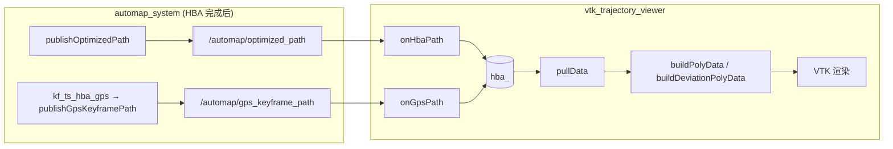

# VTK 轨迹曲线显示代码 — 计算与逻辑分析

## 0. Executive Summary

| 结论 | 说明 |
|------|------|
| **计算正确** | 偏差为逐帧欧氏距离；累积里程沿 HBA 轨迹累加；偏差曲线用固定 y 偏移与缩放 z 显示，逻辑正确。 |
| **数据源一致** | 发布端保证 `optimized_path` 与 `gps_keyframe_path` 同序、同长（同一关键帧集、按时间戳排序），VTK 端用 `gps_.size() == hba_.size()` 做一致性校验。 |
| **线程安全** | 订阅回调与定时器回调均通过同一 mutex 访问共享数据，无数据竞争。 |
| **需注意点** | ① 两路 Path 必须来自同一次 HBA 发布周期，否则长度可能不一致导致不显示；② 首次有数据前相机只按初始空几何 ResetCamera，建议首次成功拉取后再 ResetCamera；③ 单点轨迹/偏差在 VTK 中可能不绘制（退化线段）。 |

---

## 1. 数据流与角色



- **optimized_path**：HBA 优化后的关键帧位姿序列（map 系），按关键帧时间戳排序。
- **gps_keyframe_path**：与关键帧一一对应的 GPS 位置（map 系），无 GPS 时用 HBA 位置或按时间插值，同序同长。
- VTK 节点用 **TransientLocal** 订阅，可在 HBA 完成后启动仍收到“最后一次”发布。

---

## 2. 发布端顺序与一致性（关键）

**automap_system.cpp** 中 HBA 完成后顺序为：

1. `publishOptimizedPath(all_sm)`  
   - 遍历所有 submap 的 keyframes，收集 `(timestamp, T_w_b_optimized)`，**按 timestamp 排序**后发布。

2. 若 `gps_aligned_`，再构建 `kf_ts_hba_gps`：  
   - 同样遍历所有 keyframes，得到 `(timestamp, hba_pos, gps_map)`，**按 timestamp 排序**。  
   - `hba_positions`、`gps_positions_map` 与该顺序一致。  
   - 随后 `publishGpsKeyframePath(gps_positions_map)`。

因此：

- **optimized_path** 与 **hba_positions** 来自同一关键帧集、同一时间戳排序 → **点序与数量一致**。
- **gps_keyframe_path** = **gps_positions_map** → 与 **hba_positions** 同序同长。
- 故在**同一次 HBA 发布周期**内，两条 Path 的 **size 相等、下标 i 对应同一关键帧**。VTK 端用 `gps_.size() != hba_.size()` 拒绝不同步的配对，逻辑正确。

---

## 3. VTK 端计算逻辑

### 3.1 数据接收与校验（pullData）

```cpp
// 仅当“有更新 + 两条都非空 + 长度相等”才返回 true
if (!data_updated_ || hba_.empty() || gps_.size() != hba_.size())
  return false;
```

- **data_updated_**：任一路 Path 回调都会置 true；pullData 成功消费一次后置 false，避免重复用同一快照。
- **长度相等**：保证当前显示的 hba/gps 来自同一逻辑帧（同一次发布的配对），避免错位对比。

### 3.2 偏差（deviation）

```cpp
(*deviation_out)[i] = std::sqrt(dx*dx + dy*dy + dz*dz);
// dx = hba_.x[i] - gps_.x[i], 同理 dy, dz
```

- 即 **deviation[i] = ‖hba[i] − gps[i]‖**（map 系下欧氏距离），单位与轨迹一致（通常为米）。**计算正确**。

### 3.3 累积里程（cum_dist）

```cpp
double cum = 0.0;
for (size_t i = 0; i < hba_.size(); ++i) {
  // ... deviation[i] ...
  if (i > 0) {
    double ds = std::sqrt(
        std::pow(hba_.x[i]-hba_.x[i-1],2) +
        std::pow(hba_.y[i]-hba_.y[i-1],2) +
        std::pow(hba_.z[i]-hba_.z[i-1],2));
    cum += ds;
  }
  (*cum_dist_out)[i] = cum;
}
```

- **cum_dist[i]** = 沿 **HBA 轨迹**从第 0 点到第 i 点的累积弧长（米）。  
- 用于“偏差随里程”的横轴，语义正确。

### 3.4 偏差曲线在 3D 中的放置

```cpp
// buildDeviationPolyData: 点 (cum_dist[i], offset_y, deviation[i] * scale_z)
double scaleZ = (maxDev < 1e-6) ? 1.0 : (20.0 / maxDev);  // 最大偏差对应 VTK 高度 20
double offsetY = -30.0;  // 偏差曲线放在 y = -30 平面
```

- **x** = 累积里程；**y** = −30（与主轨迹在 y 方向错开）；**z** = 偏差 × scaleZ（最大偏差缩放到高度 20）。  
- 主轨迹在真实 xyz；偏差曲线在 (距离, −30, 缩放偏差)，便于同窗对比且不重叠。**逻辑正确**。
- **maxDev < 1e-6** 时 scaleZ=1，避免除零且仍可显示。

---

## 4. VTK 几何与管线

### 4.1 轨迹折线（buildPolyData）

- 输入：`x, y, z` 三个向量，等长。
- 一点：`points->InsertNextPoint(x[i], y[i], z[i])`。
- 一条线：`lines->InsertNextCell(n); for (i=0..n-1) InsertCellPoint(i);` → 一条 n 点折线。
- **单点 (n=1)**：VTK 中单点线段可能不绘制，属退化情况，一般轨迹至少 2 点。

### 4.2 偏差折线（buildDeviationPolyData）

- 同上，点为 `(cum_dist[i], offset_y, deviation[i]*scale_z)`，一条折线。  
- 单点或 cum_dist 未严格递增时仍为合法几何，仅显示可能不理想。

### 4.3 定时器与回调

- **200 ms** 定时器驱动：`spin_some(node)` → `pullData` → 若成功则更新三个 mapper 的 `SetInputData` 并 `Update()` → `Render()`。
- 使用 **vtkCallbackCommand + ClientData**，兼容 VTK 9.x，且 **client_data 中 node 为 VtkTrajectoryViewerNode**，可正确调用 `pullData`。
- 仅在 `pullData` 返回 true 时更新几何，否则保留上一帧画面，行为合理。

---

## 5. 潜在问题与建议

| 问题 | 严重性 | 说明与建议 |
|------|--------|------------|
| 两路 Path 来自不同发布周期 | 中 | 若 VTK 先收到旧的一次 gps_keyframe_path、后收到新的 optimized_path（或反之），则 size 可能不等，一直不显示。建议：文档中说明“需在同一次 HBA 后发布的两条 Path”；可选在节点内打日志当 size 不等时提示。 |
| 相机仅启动时 ResetCamera | 低 | 首次有数据更新后，轨迹范围可能与初始空几何差异大。建议：在**首次** `pullData` 成功并更新几何后调用一次 `renderer->ResetCamera()`（可用 client_data 中加 bool first_success 实现）。 |
| 单点/零长度轨迹 | 低 | 单点轨迹或单点偏差在 VTK 中可能不画。若需支持，可对 n==1 跳过 lines 或画成点（Points）。 |
| 坐标系与单位 | 说明 | 两条 Path 均为 map 系、单位米；偏差与累积里程也为米。与 rviz_publisher 注释一致。 |

---

## 6. 小结

- **数学与逻辑**：偏差、累积里程、偏差曲线放置和缩放均正确，且与发布端“同关键帧集、同时间戳序”的约定一致。
- **并发与一致性**：订阅与定时器通过 mutex 串行化访问，pullData 在锁内拷贝并置 `data_updated_=false`，无竞态。
- **显示行为**：仅在“有更新且两路长度相等”时刷新；否则保留上一帧，避免错位对比。
- **改进建议**：可做两处小优化——首次成功拉取后 ResetCamera；以及（可选）在 size 不一致时打一次日志便于排查“不显示”问题。

---

## 7. 相关文件

| 文件 | 作用 |
|------|------|
| `automap_pro/src/tools/vtk_trajectory_viewer_node.cpp` | VTK 节点：订阅、pullData、偏差/累积里程、PolyData 构建与渲染。 |
| `automap_pro/src/visualization/rviz_publisher.cpp` | publishOptimizedPath（按时间戳排序）、publishGpsKeyframePath。 |
| `automap_pro/src/system/automap_system.cpp` | HBA 后调用 publishOptimizedPath 与 publishGpsKeyframePath，保证同序同长。 |
