# 高精度高性能自动化点云建图系统架构文档（AutoMap-Pro · 代码对齐版）

## 版本信息

| 项目 | 内容 |
|------|------|
| 文档版本 | **v3.2**（增补多幅架构/时序/流程 Mermaid 图） |
| 同步代码基线 | 2026-03-30 起主干（V3 微内核 + ROS 2）；**本文修订**：v3.1 深度章节；v3.2 图示 |
| 系统名称 | AutoMap-Pro 自动化高精度点云建图 |
| 目标平台 | Ubuntu 22.04（推荐）、**ROS 2 Humble**；一键运行见仓库根目录 `run_automap.sh` |
| 硬件 | x86_64，建议 ≥32GB RAM；NVIDIA GPU 可选（语义/Overlap 加速，CPU 可回退） |

### 本文档定位

- **目标读者**：需要「从架构理解到能下钻源码」的研发、评审、运维。
- **读完应能回答**：数据从传感器进来到地图落盘经过了哪些进程/模块/事件？谁写 `MapRegistry`？回环与 iSAM2/HBA 如何衔接？为何要有 `EventMeta` / `alignment_epoch`？
- **非目标**：替代每一次运行的日志分析报告；具体数值调参以 `automap_pro/config/system_config*.yaml` 与 `ConfigManager` 为准。
- **配套索引**：[README.md](README.md)、[docs/README.md](docs/README.md)、[automap_pro/docs/V3_BARRIER_AND_META_CONTRACTS.md](automap_pro/docs/V3_BARRIER_AND_META_CONTRACTS.md)。
- **图示说明**：下文含多张 **Mermaid** 图（架构图、时序图、流程图）。在 GitHub / VS Code / Cursor 预览 Markdown 时可渲染；若仅看纯文本，可对照各图标题在 [Mermaid Live Editor](https://mermaid.live) 粘贴源码调试。

---

## 目录

1. [术语表](#1-术语表)
2. [系统目标与输入输出](#2-系统目标与输入输出)
3. [进程、启动与配置单源](#3-进程启动与配置单源)
4. [V3 微内核顶层模型](#4-v3-微内核顶层模型)
5. [EventBus 与 MapRegistry](#5-eventbus-与-mapregistry)
6. [事件类型与生产者/消费者矩阵](#6-事件类型与生产者消费者矩阵)
7. [端到端数据流与时序](#7-端到端数据流与时序)
8. [各模块计算逻辑详解](#8-各模块计算逻辑详解)
9. [后端因子图：IncrementalOptimizer 与 OptTaskItem](#9-后端因子图incrementaloptimizer-与-opttaskitem)
10. [HBA 与建图收尾](#10-hba-与建图收尾)
11. [回环检测管线（LoopDetector）](#11-回环检测管线loopdetector)
12. [目录结构与源码索引](#12-目录结构与源码索引)
13. [ROS2、坐标系与 RViz](#13-ros2坐标系与-rviz)
14. [并发、背压、屏障与健康检查](#14-并发背压屏障与健康检查)
15. [编译运行与环境变量（摘要）](#15-编译运行与环境变量摘要)
- [附录 A：主要第三方依赖](#附录-a主要第三方依赖)

**Mermaid 图示索引**：在正文搜索小节标题 **2.4、3.4、4.7、4.8、5.4、6.6、7.3、7.4、8.8.2、8.11、9.2.1、9.7、10.1、11.1.1、11.1.2、14.1**（各节含一幅或多幅图）。

---

## 1. 术语表

| 术语 | 含义 |
|------|------|
| **V3 微内核** | `v3::ModuleBase` 子类 + `EventBus` + `MapRegistry`；替代单体 God-node 内联逻辑。 |
| **EventBus** | 进程内发布/订阅总线；`publish` 同步调用全部订阅者（同线程栈上展开）。 |
| **MapRegistry** | 关键帧、子图、位姿版本、`alignment_epoch`、GPS 对齐状态的 **单一可信源（SSoT）**；优化后位姿经网关写入。 |
| **EventMeta** | 事件元数据：`event_id`、`session_id`、`idempotency_key`、`producer_seq`、`ref_version`、`ref_epoch`、`source_ts` 等；`isValid()` 失败的事件可被丢弃。 |
| **alignment_epoch** | GPS 对齐或坐标系跳变世代计数；用于丢弃「旧纪元」在途可视化帧，避免重影。 |
| **PoseFrame** | `ODOM` / `MAP` / `UNKNOWN`；严格模式下优化结果须为 MAP（对齐后）。 |
| **SyncedFrameEvent** | 前端时间对齐后的「一帧」：点云 + `T_odom_b` + 可选累积扫描（sweep）。 |
| **GraphTaskEvent** | 建图侧发给优化器的图任务（子图节点、里程计边、批量 GPS 等），由 `OptimizerModule` 转 `OptTaskItem`。 |
| **OptTaskItem** | 优化器任务队列元素：类型见 `automap_pro/include/automap_pro/core/opt_task_types.h`。 |
| **SubMap / KeyFrame** | 子图由 `SubMapManager` 切分；关键帧由 `MappingModule`/`KeyFrameManager` 创建并注册到 `MapRegistry`。 |

---

## 2. 系统目标与输入输出

### 2.1 目标

- 城市道路 / 园区 / 隧道 / 矿山等场景下 **在线或离线** 点云建图。
- **全局一致性**：融合里程计、（可选）GPS、回环约束；后端 **iSAM2 增量** + **HBA 分层 BA**。
- **模块化**：传感器接入（Fast-LIVO2）、语义（SLOAM + ONNX）、动态滤波、回环、优化、可视化可独立演进。

### 2.2 输入（典型）

| 数据 | 说明 |
|------|------|
| LiDAR 点云 | 经 Fast-LIVO2（或配置的内/外前端）与 IMU 紧耦合。 |
| IMU | 同上。 |
| GPS / GNSS | 经 `FrontEndModule` 转 `RawGPSEvent`，`GPSModule` 内 `GPSManager` 解析与对齐。 |
| 相机 | 随 Fast-LIVO2 配置可选。 |

### 2.3 输出（典型）

- 全局/子图点云（PCD 等）、轨迹、（可选）语义地标；RViz 调试可视化。
- 具体路径由 `system.output_dir` 等配置决定，见 `system_config.yaml`。

### 2.4 系统分层架构图（进程与逻辑）

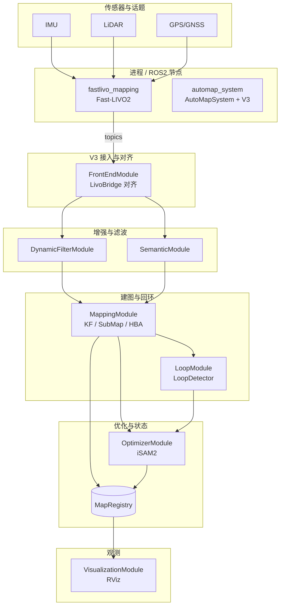

**读图**：实线表示主数据或调用关系；`automap_system` 内细节见第 4、7、8 章。

---

## 3. 进程、启动与配置单源

### 3.1 主进程

- 主节点：**`automap_system`（ROS 2 节点）**，类 `AutoMapSystem`（`automap_pro/include/automap_pro/system/automap_system.h`）。
- 前端：**`fastlivo_mapping`**（包 `fast_livo`）通常独立进程，经话题与 `LivoBridge` 对接。

### 3.2 启动链（摘要）

1. Launch（`automap_pro/launch/automap_offline.launch.py` / `automap_online.launch.py`）由 `run_automap.sh` 调用。
2. `AutoMapSystem` 加载 YAML：`ConfigManager::instance().load(config_path)`（**全局单例、同路径幂等；换路径会抛**）。
3. 延迟注册 V3 模块：`deferredSetupModules()`（见下节）。

### 3.3 配置单源

- 所有核心参数经 **`ConfigManager`**（`automap_pro/include/automap_pro/core/config_manager.h`）读取。
- 示例键：`gps.disable_altitude_constraint`、`gps.altitude_variance_override`、`contract.strict_mode`、`orchestrator.takeover_enabled`、`semantic.*`、`loop_closure.*`、`backend.*`。

### 3.4 启动与时序（Launch → V3 就绪）

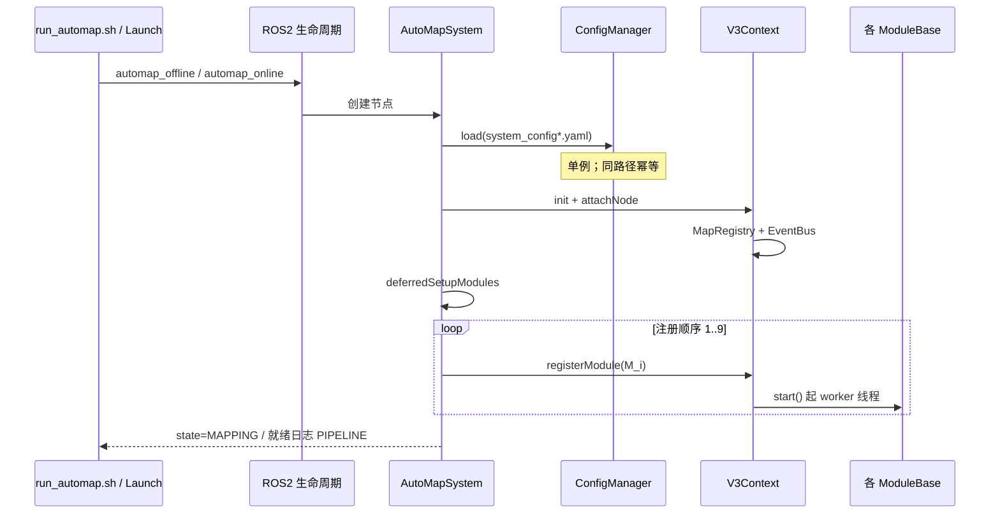

---

## 4. V3 微内核顶层模型

本章对应源码主路径：`v3_context.h`、`module_base.h`、`system_init.cpp`（`deferredSetupModules`）。

### 4.1 设计目标与边界

| 目标 | 实现要点 |
|------|-----------|
| **解耦** | 模块之间不直接 `#include` 彼此业务头；只依赖 `EventBus`、`MapRegistry`、ROS `Node`。 |
| **可测试 / 可观测** | 统一日志前缀 `[PIPELINE]`、`[V3]`；`ModuleIdleStatus` 导出队列深度与 heartbeat。 |
| **单向数据流** | 传感器 → 前端 →（语义/滤波）→ 建图 → 优化 → Registry；回环与 GPS 以 **事件** 注入优化器。 |
| **进程边界** | V3 模块均在 **`automap_system` 进程内**；Fast-LIVO2 多为 **独立进程**，经 ROS 话题对接。 |

不在本章展开：GTSAM 因子图内部符号表、HBA 服务端实现细节（见第 9、10 章）。

### 4.2 V3Context 生命周期（`v3_context.h`）

1. **构造**：`event_bus_ = std::make_shared<EventBus>()`（`MapRegistry` 尚未创建）。
2. **`init(node)`**：创建 **`MapRegistry(event_bus_)`**；若 `node` 非空则 **`startHealthMonitorIfNodeReady()`**。
3. **`attachNode(node)`**：父类构造后 `shared_from_this()` 安全时绑定 node，再次启动健康定时器。
4. **`registerModule(mod)`**（持 `module_mutex_`）：`modules_.push_back(mod)` → **`mod->start()`**（立即起线程）。
5. **健康巡检**：`node_->create_wall_timer(2s)` → `checkHealth()` → 构造 **`SystemStatusEvent`** 并 `event_bus_->publish`；心跳阈值：**`SemanticModule` 30s**，其余模块 **10s**（推理卡顿时减少误报）。
6. **析构**：取消定时器 → **`stopAll()`**：按 **注册顺序** 逐个 `stop()`（join 各模块 worker），再 `modules_.clear()`。

### 4.3 ModuleBase 线程模型（`module_base.h`）

- **`start()`**：若未运行，置 `running_=true`，`std::thread(&ModuleBase::run, this)`。
- **`stop()`**：`running_=false`，`cv_.notify_all()`，`thread_.join()`。
- **`onEvent<T>(handler)`**：在模块构造（或 `run` 前）把 handler 注册到 **全局同一 `EventBus`**；`publish` 在 **发布者线程** 同步调用 handler → 因此 handler 内应 **仅入队/O(1)**，重活放到 `run()`。
- **`quiesce(enable)`**：`quiescing_`；用于 finish_mapping / 保存前 **降低并发写入**（与 `SystemQuiesceRequestEvent` 配合）。
- **扩展点**：子类可覆写 `isIdle()`、`queueDepths()`、`idleDetail()` 供 `getIdleStatusSnapshot()` 与排空诊断。

### 4.4 注册顺序 vs 数据依赖（易混点）

**注册顺序**（`deferredSetupModules`）为：`… → OptimizerModule → MapOrchestrator → MappingModule`。

- **Mapping 在 Optimizer 之后注册** 并不表示「优化先于建图」：Mapping 在 **`run()` 线程** 内消费滤波帧并 **`publish(GraphTaskEvent)`**；Optimizer 早已 **`onEvent<GraphTaskEvent>`** 订阅，故 **只要 EventBus 已构造、两模块均已 `start()`**，任务即可入队。
- **硬性顺序要求**：`OptimizerModule` 须在 **收到第一条 `GraphTaskEvent` 前** 完成构造并订阅（当前顺序满足）；`LoopModule` 须在 **`LoopDetector::init(node_)`** 后 `start()`（代码中先 `loop_detector_.start()` 再 `ModuleBase::start()`）。

**语义模块失败策略**：`SemanticModule` 构造抛异常时，`deferredSetupModules` 打 **FATAL** 并 **`std::exit(1)`**（产品策略：禁止静默 Stub）。

### 4.5 模块注册表（职责 + 线程/队列）

| 序号 | 模块 | 职责摘要 | 典型内部队列 / 线程 |
|------|------|-----------|---------------------|
| 1 | `FrontEndModule` | `LivoBridge` 回调 + 缓存对齐 → `SyncedFrameEvent` / `Raw*` | `run()` 内同步；`odom/kfinfo/gps` 缓存 |
| 2 | `SemanticModule` | `SyncedFrameEvent` → ONNX/SLOAM → 语义事件 | **多 worker 线程** + 有界 `task_queue_` |
| 3 | `DynamicFilterModule` | 体素动态滤波 → `FilteredFrameEvent*` | `input_queue_` + `run()` |
| 4 | `GPSModule` | `RawGPSEvent` → `GPSManager` → `GPSAlignedEvent` | `gps_queue_` + `run()` |
| 5 | `LoopModule` | 子图间/内回环 → `LoopConstraintEvent` | `sm_queue_` / `intra_tasks_` + `LoopDetector` 内部 **desc worker 池 + match 线程** |
| 6 | `VisualizationModule` | RViz；Synced/语义云入队单线程处理 | `viz_work_queue_`（cap 512）+ `run()` |
| 7 | `OptimizerModule` | `OptTaskItem` 批处理 + iSAM2 `forceUpdate` | `task_queue_`（批取空） |
| 8 | `MapOrchestrator` | 观测 EventMeta → 可选 `RouteAdviceEvent` | meta 队列 + `run()` |
| 9 | `MappingModule` | 关键帧、子图、HBA、命令 | `frame_queue_`、优化/语义/命令等多队列 + `run()` |

### 4.6 架构总图（逻辑分层）

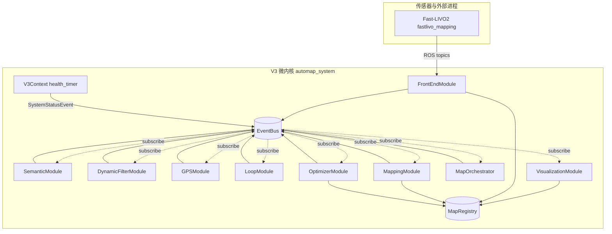

**读图说明**：实线 **指向** 表示「典型发布或写 Registry」；虚线表示 **订阅**。`V3Context` 不订阅业务事件，只发布 **`SystemStatusEvent`**。

### 4.7 模块注册顺序流程图（`deferredSetupModules`）

与 `automap_pro/src/system/modules/system_init.cpp` 中顺序一致：**自上而下依次 `registerModule` + `start()`**。

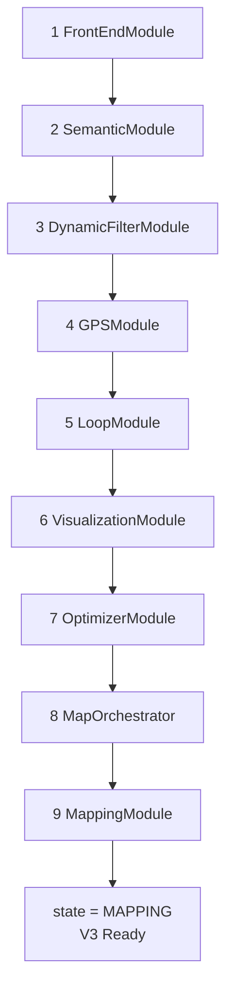

### 4.8 EventBus 同步分发示意（为何 handler 要轻量）


**说明**：`publish` 在 **发布者线程** 内 **顺序** 调用各 handler；耗时回调会阻塞发布者，故核心模块普遍 **入队 + 本模块 `run()` 线程处理**。

---

## 5. EventBus 与 MapRegistry

### 5.1 EventBus（`automap_pro/include/automap_pro/v3/event_bus.h`）

- **`subscribe<T>(handler)`**：`publish` 时 **在同一线程** 依次调用所有 handler（**会阻塞发布者**）。
- **`subscribeAsync<T>(handler)`**：每事件 **detach 新线程** 执行 handler；**顺序与因果不保证**。
- **工程约定**：需要与 `MapRegistry` 版本/纪元一致时，**禁止**依赖 `subscribeAsync` 做核心链路透传（见 `VisualizationModule` 头文件注释：SyncedFrame 仅入队，由模块 `run()` 单线程处理）。

### 5.2 MapRegistry（`automap_pro/include/automap_pro/v3/map_registry.h`）

- **关键帧**：`addKeyFrame`、按 id/时间戳/会话查询；`updatePoses` 批量更新子图与关键帧位姿并 **递增 `version`**。
- **对齐状态**：`setGPSAligned`、`getAlignmentEpoch`、`getGPSTransform`、`getGpsRenuOdom` 等。
- **约束**：`addConstraint` 保存回环等（供 HBA/诊断）。
- **快照**：`getPoseSnapshot()` 供可视化与一致性读取。

### 5.3 EventMeta 校验

- `EventMeta::isValid()` 要求非零 `event_id`、`idempotency_key`、`producer_seq`、`session_id`、`ref_epoch` 及有限时间戳等。
- 用途：**契约化排障**、跨会话隔离、幂等与乱序检测（详见 `automap_pro/docs/V3_BARRIER_AND_META_CONTRACTS.md`）。

### 5.4 MapRegistry 与写入来源（架构图）

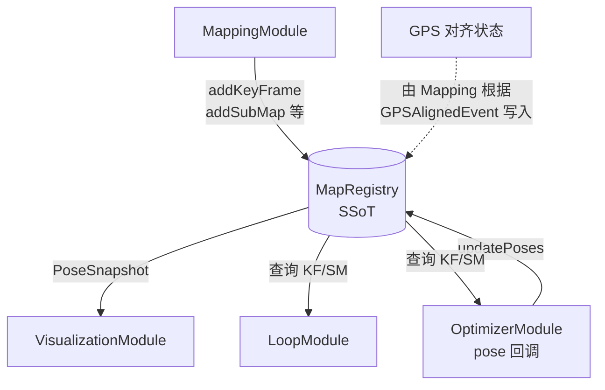

**说明**：**`GPSAlignedEvent` 不直接写 Registry**；对齐位姿由 **Mapping** 统一落盘到 Registry（与头文件注释一致）。

---

## 6. 事件类型与生产者/消费者矩阵

**定义位置**：绝大多数事件在 **`automap_pro/include/automap_pro/v3/map_registry.h`**；`GraphTaskEvent` 内嵌 **`OptTaskItem task`** + **`EventMeta meta`** + `ProcessingState processing_state`；各 `struct` 的 **`isValid()`** 为契约入口，无效事件常被丢弃并打 `[V3][CONTRACT]`。

### 6.1 按职能分类

| 类别 | 代表事件 | 作用 |
|------|-----------|------|
| **原始传感器/前端** | `RawOdometryEvent`、`RawCloudEvent`、`RawKFInfoEvent`、`RawGPSEvent` | 解耦 Livo 回调与下游；GPS 对齐需里程历史。 |
| **时间主轴帧** | `SyncedFrameEvent` | 带 `ref_map_version` / `ref_alignment_epoch` / `EventMeta`，供屏障与多会话。 |
| **滤波后帧** | `FilteredFrameEventOptionalDs`、`FilteredFrameEventRequiredDs` | 动态滤波输出；后者为 **Mapping 唯一建图输入**。 |
| **语义** | `SemanticLandmarkEvent`、`SemanticCloudEvent`、`SemanticTrunkVizEvent`、`SemanticInputEvent` | 地标入图 / RViz；`SemanticInputEvent` 由 Mapping 按配置发布，驱动语义侧关键帧处理。 |
| **地图与回环** | `MapUpdateEvent`、`IntraLoopTaskEvent`、`LoopConstraintEvent` | Registry 变更通知；子图内回环任务；回环因子。 |
| **优化** | `GraphTaskEvent`、`OptimizationResultEvent`、`OptimizationDeltaEvent` | 任务入 Optimizer；全量结果 vs **增量 delta**（Optimizer→Registry 路径常用 delta）。 |
| **GPS 对齐** | `GPSAlignRequestEvent`、`GPSAlignedEvent` | 请求/结果；**Registry 对齐位姿仅由 Mapping 根据 `GPSAlignedEvent.success` 写入**（头文件注释）。 |
| **系统控制** | `HBARequestEvent`、`LoadSessionRequestEvent`、`SaveMapRequestEvent`、`GlobalMapBuildRequest/Event`、`SystemQuiesceRequestEvent`、`BackpressureWarningEvent`、`SystemStatusEvent`、`FrontendPoseAdjustEvent` | 生产命令、静默、背压、健康巡检、前端修正。 |
| **编排** | `RouteAdviceEvent` | `MapOrchestrator` 建议 `suggested_owner` / `takeover_enabled` 等。 |

### 6.2 MapUpdateEvent 细分（`ChangeType`）

| `ChangeType` | 含义 | 典型订阅方 |
|--------------|------|------------|
| `KEYFRAME_ADDED` | 新关键帧进入 Registry | Loop（子图内任务由 Registry/建图侧投递）、诊断 |
| `SUBMAP_ADDED` | 新子图 | **LoopModule** 入队 `addSubmap` |
| `POSES_OPTIMIZED` | 位姿批量更新 | 可视化刷新等 |
| `CONSTRAINT_ADDED` | 回环约束写入 Registry | 诊断 / HBA |
| `GLOBAL_MAP_REBUILT` | 全局点云已构建并与 Registry 快照对齐 | **强制 RViz 与全局云一致**（见头文件注释） |

### 6.3 主链路事件矩阵（生产者 → 消费者）

| 事件 | 典型生产者 | 典型消费者 | 说明 |
|------|------------|------------|------|
| `RawOdometryEvent` | FrontEnd | GPSModule | `gps_manager_.addKeyFramePose` |
| `RawCloudEvent` / `RawKFInfoEvent` | FrontEnd | 诊断或其它 | 可选调试链路 |
| `RawGPSEvent` | FrontEnd | GPSModule | 入队后 `addGPSMeasurement` |
| `SyncedFrameEvent` | FrontEnd | Semantic、DynamicFilter、Viz（入队） | `cloud_frame` ∈ {body, world}；`pose_frame` 非 UNKNOWN |
| `SemanticLandmarkEvent` | SemanticModule | **MappingModule**、（间接）Viz | 圆柱/平面地标 |
| `SemanticCloudEvent` / `SemanticTrunkVizEvent` | SemanticModule | **VisualizationModule** | 语义云/树干调试 |
| `SemanticInputEvent` | **MappingModule** | SemanticModule | 配置 `semanticInputUseIndependentEvent` 时与 Graph 路径并行 |
| `FilteredFrameEventOptionalDs` | DynamicFilter | 内部拼接 | 可选语义分支 |
| `FilteredFrameEventRequiredDs` | DynamicFilter | **MappingModule** | `processFrame` 入口 |
| `GPSAlignedEvent` | GPSModule | **MappingModule**、Viz | `success` 决定 Registry 对齐；含 `R_enu_odom` 杆臂一致 |
| `GPSAlignRequestEvent` | 系统/服务 | GPSModule | `force` → `triggerRealign()` |
| `GPSFactorEvent` | （遗留/其它） | 视实现 | 子图级 GPS；主链路多为 KF 级 GPS |
| `MapUpdateEvent` | **MapRegistry** 内部逻辑 / Mapping | Loop、Viz | 带 `version` 与 `affected_ids` |
| `IntraLoopTaskEvent` | Registry/建图 | **LoopModule** | `submap` + `query_idx` |
| `LoopConstraintEvent` | LoopModule | **OptimizerModule** | `constraint` + `meta` |
| `GraphTaskEvent` | **MappingModule** | **OptimizerModule** | `ev.task` 为 `OptTaskItem`；`ev.isValid()` 查 meta |
| `OptimizationResultEvent` | Optimizer /（兼容路径） | Mapping、Viz | 全量表；`version`/`alignment_epoch`/`pose_frame` 有契约 |
| `OptimizationDeltaEvent` | **OptimizerModule**（pose 回调内） | Mapping、Viz | **对齐后 ODOM→MAP** 再发；`idempotency_key` 可用 batch hash |
| `RouteAdviceEvent` | MapOrchestrator | Mapping 等 | `event_type`、`suggested_owner`、`takeover_enabled` |
| `HBARequestEvent` 等命令 | 系统 UI / 服务 | MappingModule | 与 `command_queue_` 合并处理 |
| `BackpressureWarningEvent` | 各模块 | Orchestrator | 负载信号 |
| `SystemQuiesceRequestEvent` | 系统 | 各模块 `quiesce` | finish / 保存协作 |
| `SystemStatusEvent` | **V3Context::checkHealth** | 可扩展订阅 | 模块 heartbeat 是否超时 |
| `FrontendPoseAdjustEvent` | （前端修正） | 视实现 | 与轨迹连贯性相关 |

### 6.4 优化器写回与双事件

- **`OptimizationDeltaEvent`**：在 `registerPoseUpdateCallback` 内，若已 GPS 对齐且结果为 ODOM，则先将子图/KF 位姿左乘 **`T_map_odom`**，置 `MAP_COMPENSATION_APPLIED` 标志，再发布 delta。
- **`MapRegistry::updatePoses`**：同一回调内更新版本号；**`OptimizationResultEvent`** 在其它路径用于「全量通知」（如 Mapping 的 `onPoseOptimized`）；二者并存时 **以 Registry 版本与 epoch 为 SSoT**。

### 6.5 事件流简图（与第 7 章互补）

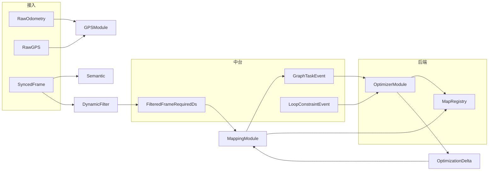

### 6.6 事件职能分流图（鸟瞰）

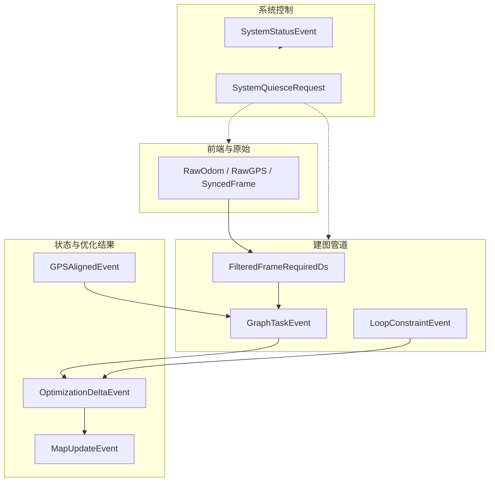

---

## 7. 端到端数据流与时序

### 7.1 主链路（文字）

1. **Fast-LIVO2** 发布点云/里程/关键帧信息 → **`LivoBridge`** 回调 **`FrontEndModule`**。
2. FrontEnd **时间对齐** 与可选 **多扫合并**（`sweep_buffer_`）→ 发布 **`SyncedFrameEvent`**（含 `EventMeta`、`ref_map_version`、`ref_alignment_epoch` 等）。
3. **SemanticModule** 并行 worker 推理 → **`SemanticLandmarkEvent`** 等（若启用且成功）。
4. **DynamicFilterModule** 体素投票滤动态物体 → **`FilteredFrameEventRequiredDs`**。
5. **MappingModule** `processFrame`：关键帧创建、`KeyFrameManager` / `SubMapManager`、向 **Optimizer** 发 **`GraphTaskEvent`**（子图节点、里程计边、GPS 批量等）；子图冻结时 **`LoopModule`** 取子图做 **子图间回环**；Registry 发 **子图内回环任务**。
6. **GPSModule** 消费 `RawGPSEvent`，`GPSManager` 触发对齐 → **`GPSAlignedEvent`** → Mapping 更新 `T_enu_map` 状态并驱动批量 GPS 因子任务。
7. **LoopModule** 消费子图队列 / `IntraLoopTaskEvent` → **`LoopConstraintEvent`** → Optimizer **`LOOP_FACTOR`**。
8. **OptimizerModule** 顺序处理 `OptTaskItem` → iSAM2 更新 → 回调 **`updatePoses`** + 发布优化相关事件。
9. **VisualizationModule** 单线程处理 viz 队列：等待 Registry **屏障**（版本/epoch）后把点云变到 **map** 帧发布。

### 7.2 时序图（简化）

```mermaid
sequenceDiagram
  participant LIO as Fast-LIVO2
  participant FE as FrontEndModule
  participant EB as EventBus
  participant SEM as SemanticModule
  participant DF as DynamicFilterModule
  participant MAP as MappingModule
  participant LOOP as LoopModule
  participant OPT as OptimizerModule
  participant REG as MapRegistry
  participant VIZ as VisualizationModule

  LIO->>FE: odom/cloud/kfinfo/gps
  FE->>EB: SyncedFrameEvent
  EB->>SEM: subscribe
  EB->>DF: subscribe
  SEM->>EB: SemanticLandmarkEvent
  DF->>EB: FilteredFrameEventRequiredDs
  EB->>MAP: subscribe
  MAP->>REG: addKeyFrame/updateSubMap
  MAP->>EB: GraphTaskEvent
  EB->>OPT: subscribe
  MAP->>LOOP: MapUpdate / IntraLoopTask (via EB+Registry)
  LOOP->>EB: LoopConstraintEvent
  EB->>OPT: LOOP_FACTOR
  OPT->>REG: updatePoses
  OPT->>EB: OptimizationResult/Delta
  EB->>MAP: subscribe
  EB->>VIZ: MapUpdate/GPSAligned/SyncedFrame queue
```

### 7.3 并行支路：GPS 对齐与批量因子（时序）

```mermaid
sequenceDiagram
  participant FE as FrontEndModule
  participant EB as EventBus
  participant GPSM as GPSModule
  participant GM as GPSManager
  participant MAP as MappingModule
  participant OPT as OptimizerModule
  participant REG as MapRegistry

  FE->>EB: RawOdometryEvent
  EB->>GPSM: subscribe
  FE->>EB: RawGPSEvent
  EB->>GPSM: subscribe
  GPSM->>GM: addKeyFramePose / addGPSMeasurement
  GM-->>GPSM: align callback
  GPSM->>EB: GPSAlignedEvent
  EB->>MAP: subscribe
  MAP->>MAP: 更新对齐网关 / 下发 GPS_BATCH_KF 等
  MAP->>EB: GraphTaskEvent
  EB->>OPT: subscribe
  OPT->>REG: updatePoses after batch
```

### 7.4 优化闭环：任务 → iSAM2 → Registry → Mapping（流程图）

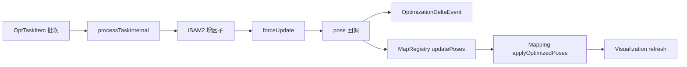

---

## 8. 各模块计算逻辑详解

以下按 **数据从上游到下游** 排列；每项均对应 `automap_pro/src/v3/<module>.cpp` 与头文件声明。

### 8.1 FrontEndModule

**头文件**：`automap_pro/include/automap_pro/v3/frontend_module.h`。

| 项目 | 说明 |
|------|------|
| **ROS 接入** | `LivoBridge::init(node, gps_enabled, gps_topic)`，注册 `onOdometry` / `onCloud` / `onKFInfo` / `onGPS`。 |
| **缓存** | `odom_cache_`（最大 5000）、`kfinfo_cache_`（2000）、`gps_cache_`（2000）；按时间戳 **最近邻/≤t** 查询，供同步。 |
| **FrameProcessor** | `ingress_queue_max_size`、`frame_queue_max_size` 来自 `frontendDomain()`；防前端洪峰。 |
| **Sweep 合并** | `sweep_buffer_` + `max_sweep_buffer_size_`（配置 `frontendSweepAccumulationFrames`）；`mergeSweepsToEventCloud` 与 FastLIVO2Adapter 语义对齐。 |
| **输出事件** | `RawOdometryEvent`、`RawGPSEvent`；合成 **`SyncedFrameEvent`**（填 `EventMeta`、`ref_map_version`、`ref_alignment_epoch`、`session_id` 等）。 |
| **节流** | `throttle_active_` / `throttle_until_`：高负载时限制发布（见 cpp 实现）。 |
| **线程** | `run()` 内完成对齐与发布；**禁止在 Livo 回调内做重计算**（大块逻辑进队列或 `run()`）。 |

### 8.2 SemanticModule

**头文件**：`semantic_module.h`。

| 项目 | 说明 |
|------|------|
| **Worker** | `semantic_processors_` 多实例 + `worker_threads_`；`active_worker_count_` 可随负载在 `min_worker_count_` 与配置上限间调整。 |
| **队列** | `task_queue_` 有界（如 `kMaxQueueSize=5`）；`kCoalesceThreshold` 在积压时 **合并为最新帧**，降低延迟。 |
| **输入** | 主路径：`SyncedFrameEvent`；另可 `SemanticInputEvent`、`GraphTaskEvent`（由 `handleSemanticInputEvent` / `handleGraphTaskEvent` 处理）。 |
| **输出** | `SemanticLandmarkEvent`（圆柱/平面）；`SemanticCloudEvent`、`SemanticTrunkVizEvent`（可视化）。 |
| **可靠性** | `consecutive_errors_` 超阈值 → `semantic_degraded_`；`terminateSystemOnInferenceFailure` 可在致命错误时 **终止进程**（产品策略）。 |
| **配置** | `semantic.*`、`semanticInputUseIndependentEvent` 等与 `ConfigManager` 绑定。 |

### 8.3 DynamicFilterModule

**头文件**：`dynamic_filter_module.h`。

| 项目 | 说明 |
|------|------|
| **算法** | 体素键 `(ix,iy,iz)` → `VoxelStat`（`observations`、`last_seen_seq`、`lru_stamp`）；`min_static_observations_` 次以上保留为静态点。 |
| **模式** | `enabled_` / `shadow_mode_`：shadow 只统计不改变点云；`FilterFallbackReason` 记录原因（空静态、输入非法、滤波关闭等）。 |
| **范围** | `min_range_m_` / `max_range_m_` 过滤距离；`voxel_size_`、`voxel_capacity_`、**硬容量** `enforceHardCapacity()` 防内存爆。 |
| **输出** | `processOne` → `FilteredFrameEventOptionalDs` → `makeRequiredEvent` → **`FilteredFrameEventRequiredDs`**（继承可选字段）。 |
| **背压** | `queue_max_size_`、`drop_if_queue_full_`；`kpi_queue_drop_total_` 等计数。 |
| **故障注入** | `applyFaultInjectionIfEnabled`：测试用（`fault_injection_*` 配置）。 |

### 8.4 GPSModule

**头文件**：`gps_module.h`；核心 **`GPSManager`**：`automap_pro/include/automap_pro/frontend/gps_manager.h`。

| 项目 | 说明 |
|------|------|
| **RawGPS 路径** | `onEvent<RawGPSEvent>` 入 `gps_queue_`；`run()` 出队 `gps_manager_.addGPSMeasurement(...)`。 |
| **里程路径** | `onEvent<RawOdometryEvent>` **同步**调用 `addKeyFramePose`（注释：内部快、持锁短）。 |
| **对齐请求** | `GPSAlignRequestEvent`：`force` → `triggerRealign()`，否则 `requestAlignment()`。 |
| **对齐回调** | `registerAlignCallback` → 组装 **`GPSAlignedEvent`**（`R_enu_to_map`、`t_enu_to_map`、`R_enu_odom`、`rmse`）；**不写 Registry**。 |
| **后端 Z 向** | `gps.disable_altitude_constraint` 等在 Optimizer/HBA/iSAM2 GPS 路径统一（见第 9 章）。 |

### 8.5 LoopModule

**头文件**：`loop_module.h`；**`LoopDetector`**：`loop_closure/loop_detector.h`。

| 项目 | 说明 |
|------|------|
| **子图间** | `MapUpdateEvent` 且 `SUBMAP_ADDED` → `sm_queue_` → `loop_detector_.addSubmap`（内部 **priority_queue** 按 overlap 优先级）。 |
| **子图内** | `IntraLoopTaskEvent` → `intra_tasks_` → `detectIntraSubmapLoop` → 多条 `LoopConstraintEvent`（每条约带新 `meta`）。 |
| **回调** | 构造时 `registerLoopCallback`：封装 `LoopConstraint` → `LoopConstraintEvent` → `event_bus_->publish`。 |
| **并发** | `LoopDetector` 内部 **desc_workers_** + **match_worker_**；与 LoopModule 自身 `run()` 队列分离。 |

### 8.6 OptimizerModule

**实现**：`automap_pro/src/v3/optimizer_module.cpp`。

| 项目 | 说明 |
|------|------|
| **订阅** | `LoopConstraintEvent` → 转 `OptTaskItem::LOOP_FACTOR`；`GraphTaskEvent` → `ev.task` 原样入队；`MapUpdateEvent` 当前 **预留空回调**。 |
| **批处理** | `run()` 一次 `wait_for` 唤醒后 **`tasks = std::move(task_queue_)`** 整批取出，循环 `processTaskInternal`；末尾 **`forceUpdate()`** 一次，减少 iSAM2 抖动。 |
| **RESET** | 批次中遇 `RESET` → `optimizer_.reset()`，并清除本批 `needs_update` 语义（见源码）。 |
| **pose 回调** | `registerPoseUpdateCallback`：契约检查 `PoseFrame`、有限性；GPS 对齐后 ODOM→MAP；`OptimizationDeltaEvent` + `updatePoses`；处理 **epoch 竞态重试一次**。 |
| **空闲** | `isIdle()` ⇔ `task_queue_.empty()`。 |

### 8.7 MapOrchestrator

**头文件**：`map_orchestrator.h`；**实现**：`map_orchestrator.cpp`。

| 项目 | 说明 |
|------|------|
| **观测** | `onEvent<>` 注册多种事件，仅 `enqueueObserved(event_name, meta)`；**不显式订阅 `RouteAdviceEvent` 自产**（防自激）。 |
| **run 循环** | `wait_for` + drain `queue_`，逐条 `observeMeta`；可据此发布 **`RouteAdviceEvent`**（`takeover_enabled` 来自 `orchestratorTakeoverEnabled()`）。 |
| **用途** | 策略层：建议「由谁消费」「是否 fallback legacy」；**MappingModule** 统计 `route_advice_recv_total_` 等可与之联动。 |

### 8.8 MappingModule

**头文件**：`mapping_module.h`；**实现体量大**：`mapping_module.cpp`。

| 项目 | 说明 |
|------|------|
| **输入队列** | `frame_queue_`、`pose_opt_queue_`、`pose_delta_queue_`、`gps_event_queue_`、`semantic_landmark_queue_`、`command_queue_`；`run()` 内按策略合并处理。 |
| **子图与 HBA** | `sm_manager_`：`init`/`startNewSession`/`registerSubmapFrozenCallback`；`hba_optimizer_.init()` + `start()` + **done 回调**写回位姿/触发构图。 |
| **冻结回调** | `onSubmapFrozen`：汇总回环约束、调用 HBA、发布 `MapUpdateEvent`、向前端/Registry 同步；**勿在回调里调用 `getFrozenSubmaps()`**（与 merge 死锁，见头文件注释）。 |
| **优化应用** | `applyOptimizedPoses`：**统一网关**（MAP/ODOM 补偿、`skip_optimize_driven_global_map_request` 避免与 HBA rebuild 双构图）；`shouldAcceptOptimizationEvent` 防过期版本。 |
| **语义** | `onSemanticLandmarks`；**pending_semantic_landmarks_** 解决 KF 尚未分配 `submap_id` 的竞态；超时/匹配容差 `semantic_timestamp_match_tolerance_s_`。 |
| **GraphTask 类型（V3 实际下发）** | `KEYFRAME_CREATE`、`SUBMAP_NODE`、`ODOM_FACTOR`、`FORCE_UPDATE`、`GPS_BATCH_KF`、`CYLINDER_LANDMARK_FACTOR`、`PLANE_LANDMARK_FACTOR`（见 `mapping_module.cpp` 中 `task_ev.task.type =`）。 |

#### 8.8.1 `processFrame` 关键步骤（与源码对齐）

实现位置：`automap_pro/src/v3/mapping_module.cpp` → `MappingModule::processFrame`。

1. **契约校验**：`event.cloud` / `cloud_ds` 非空；否则拒绝并打点 `FRAME_MISMATCH`。
2. **关键帧策略**：`kf_manager_.shouldCreateKeyFrame(T_odom_b, timestamp)` 为假则直接返回。
3. **运动连续性**：相对上一关键帧位移/旋转过大时丢弃（防退化跳变进后端）。
4. **坐标系**：若配置为 world 系点云，转换为 body 系再建帧（与回环几何管线一致）；日志 `[GEO_PIPELINE]`。
5. **创建关键帧**：`kf_manager_.createKeyFrame(...)`，携带滤波帧内嵌的 GPS 观测（若有）。
6. **对齐后位姿升级**：若 `MapRegistry` 已 GPS 对齐，将关键帧位姿从 ODOM 语义升级到 MAP（更新 `T_map_b_optimized`、`alignment_epoch` 等）。
7. **注册顺序**：`map_registry_->addKeyFrame(kf)` → **`sm_manager_.addKeyFrame(kf)`**（必须先子图管理器，再发优化任务，否则 `submap_id` 未就绪）。
8. **优化任务**：每次建帧发布 **`GraphTaskEvent`**，且 **`type = KEYFRAME_CREATE`**（注释明确：Optimizer 只认 `GraphTaskEvent`，省略会导致 iSAM2 无节点）。
9. **语义并行输入**：若 `semanticInputUseIndependentEvent` 为真，另发 **`SemanticInputEvent`**；与 `semanticInputAcceptGraphTask` 等组合时需避免双路重复（见代码注释）。

#### 8.8.2 `processFrame` 流程图（关键帧成功路径）

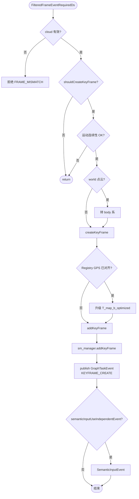

### 8.9 VisualizationModule

**头文件**：`visualization_module.h`（内含详细坐标与屏障注释）。

| 项目 | 说明 |
|------|------|
| **入队** | `SyncedFrameEvent`、`SemanticCloudEvent`、`SemanticTrunkVizEvent` → `enqueueVizWork`；满则 **丢最旧**。 |
| **屏障** | `waitRegistryBarrierForSyncedVisualization`：最多等 **5s**；超时仍可按降级路径发布（打 `VIZ_CONTRACT`）。 |
| **纪元** | 丢弃 `ev.ref_alignment_epoch < snapshot->alignment_epoch` 的 stale 帧。 |
| **坐标** | `pose_chain::resolveTMapOdomFromSnapshot`、`keyframeOptimizedInMapFrame`、`worldToMapFromAnchorChain`；GPS 对齐后可 **bypass 锚点链** 与 Mapping 一致。 |
| **多会话** | `publishEverything` 若检测到多 `session_id` KF → 打 WARN（全局 path 仅在单会话+单对齐下与真值严格一致）。 |
| **刷新** | `requestRefresh` → `publishEverything()`：轨迹、关键帧、语义地标 Marker。 |

### 8.10 模块交互小结表

| 从 → 到 | 机制 | 关键载荷 |
|---------|------|-----------|
| FrontEnd → 下游 | `EventBus::publish` | `SyncedFrameEvent`、`Raw*` |
| DynamicFilter → Mapping | 同上 | `FilteredFrameEventRequiredDs` |
| Mapping → Optimizer | 同上 | `GraphTaskEvent`（内嵌 `OptTaskItem`） |
| Loop → Optimizer | 同上 | `LoopConstraintEvent` |
| Optimizer → Registry | **直接调用** + 事件 | `updatePoses`、`OptimizationDeltaEvent` |
| GPSModule → Mapping | 事件 | `GPSAlignedEvent` |
| Registry → Loop | 通常 **MapRegistry 内 publish** | `MapUpdateEvent`、`IntraLoopTaskEvent` |
| Mapping / Optimizer → Viz | 事件 | `MapUpdateEvent`、`OptimizationResultEvent`、Synced 入队 |

### 8.11 子图冻结与回环 / HBA 协作（流程图）

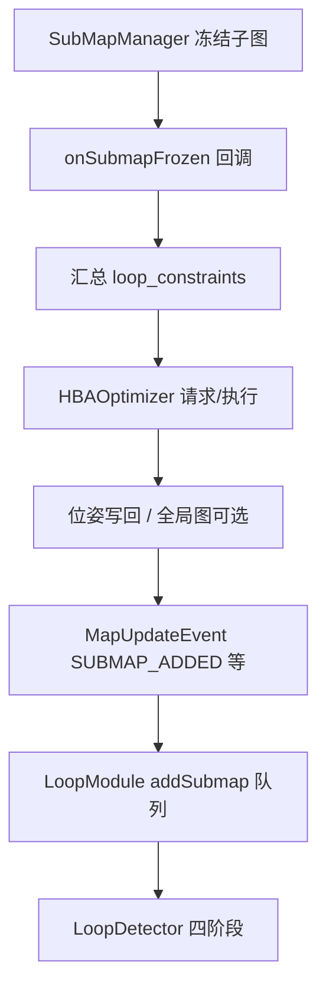

---

## 9. 后端因子图：IncrementalOptimizer 与 OptTaskItem

**头文件**：`opt_task_types.h`、`incremental_optimizer.h`；**V3 适配器**：`optimizer_module.cpp`。

### 9.1 OptTaskItem 全量枚举与 V3 处理状态

定义于 **`automap_pro/include/automap_pro/core/opt_task_types.h`**。

| `OptTaskItem::Type` | 主要载荷字段 | `OptimizerModule::processTaskInternal` | 说明 |
|---------------------|--------------|----------------------------------------|------|
| `LOOP_FACTOR` | `loop_constraint` | `optimizer_.addLoopFactor` | 来自 `LoopConstraintEvent`。 |
| `GPS_FACTOR` | `to_id`, `gps_pos`, `gps_cov` | `optimizer_.addGPSFactor` | 子图/节点级 GPS（主链路更多用 KF 批/单帧）。 |
| `SUBMAP_NODE` | `to_id`, `rel_pose`, `fixed` | `optimizer_.addSubMapNode` | 新子图锚点；`fixed` 用于首子图等特殊锚定。 |
| `ODOM_FACTOR` | `from_id`, `to_id`, `rel_pose`, `info_matrix` | `optimizer_.addOdomFactor` | 子图间/里程边；信息阵可由 `computeOdomInfoMatrixForKeyframes` 风格配置。 |
| `KEYFRAME_CREATE` | `keyframe`, `prev_keyframe`, `gps_aligned`, `gps_transform_*` | **`processKeyframeCreate`** | 见 9.3。 |
| `GPS_BATCH_KF` | （经 `GraphTaskEvent` 打包的批量任务） | **`processGPSBatchKF`** | 见 9.4。 |
| `CYLINDER_LANDMARK_FACTOR` | `cylinder_factors` | **`processCylinderLandmarkFactor`** | 逐因子 `addCylinderFactorForKeyFrame`。 |
| `PLANE_LANDMARK_FACTOR` | `plane_factors` | **`processPlaneLandmarkFactor`** | 逐因子 `addPlaneFactorForKeyFrame`。 |
| `FORCE_UPDATE` | — | 无直接调用；`run()` 末尾统一 `forceUpdate` | 显式要求本批结束后优化提交。 |
| `RESET` | — | `optimizer_.reset()` | 清空 iSAM2 状态；批次内后续任务仍会继续执行（源码注释）。 |
| `REBUILD` | `R_enu_to_map`, `submap_data`, … | **fallthrough `default`** | 枚举存在供 **legacy / `unified_task_queue`** 等路径；**当前 `processTaskInternal` 的 `switch` 无 case → 静默 no-op**。若迁移旧任务类型需在 `switch` 补全。 |
| `GPS_ALIGN_COMPLETE` | — | **同上 default** | 同左；对齐完成后的重建逻辑在 V3 中多由 **`GPS_BATCH_KF` 内 `transformHistoryAndRebuild`** 等替代。 |
| `INTRA_LOOP_BATCH` | `intra_loop_constraints` | **同上 default** | 若需 V3 支持应在 OptimizerModule 增加 case。 |
| `ACTIVE_SUBMAP_GPS_BIND` | — | **同上 default** | 视产品是否启用。 |

### 9.2 OptimizerModule 批处理与 `forceUpdate` 策略

源码：`OptimizerModule::run()`（`optimizer_module.cpp`）。

1. **唤醒**：`wait_for(100ms)`，避免永久阻塞。
2. **整批 dequeue**：将当前 `task_queue_` **全部** `move` 到局部 `tasks` 并 `clear()` —— **任务合并（coalescing）**，减少 `iSAM2::update` 频率。
3. **逐条 `processTaskInternal`**：遇 `RESET` 则 reset 并调整 `needs_update` 标志。
4. **批次末尾**：若 `needs_update && running_`，调用 **`optimizer_.forceUpdate()`**，触发 **`registerPoseUpdateCallback`**。

#### 9.2.1 `OptimizerModule::run()` 流程图

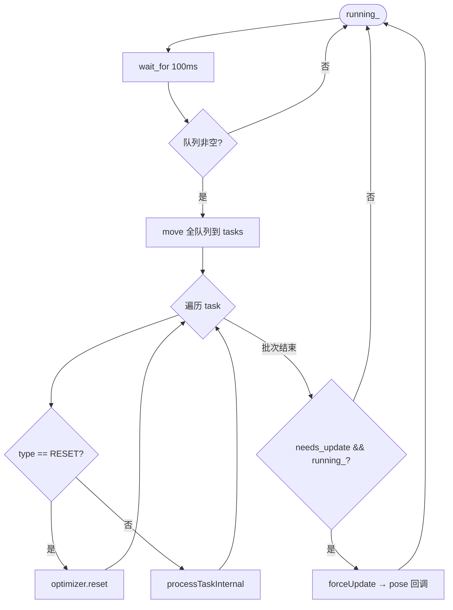

### 9.3 `processKeyframeCreate` 逻辑摘要

1. **GTSAM 符号限制**：`kf->id` 不得超过 `INT_MAX`（GTSAM 关键帧符号为 int）。
2. **首帧锚定**：`is_first_kf_of_submap = (kf->index_in_submap == 0)`，`sm_anchor = kf->submap_id`；若 `submap_id < 0` 打 WARN（应先 `sm_manager_.addKeyFrame`）。
3. **初始位姿**：**必须使用 `kf->T_map_b_optimized`** 作为节点初值（对齐前后已由 Mapping 维护；错误使用 `T_odom_b` 会在 MAP 系图中产生巨大初值误差）。
4. **节点与 Between**：`optimizer_.addKeyFrameNode(...)` 内部统一添加与上一 KF 的 **Between 因子**，**本函数不再重复 addOdom**，避免双重约束。
5. **单帧 GPS**：若 `task.gps_aligned` 且 `evaluateKeyframeGpsConstraint` 接受，则 `addGPSFactorForKeyFrame`；拒绝原因打 `[CONSTRAINT][GPS_KF]`（质量、时间窗、ENU/协方差等）。

### 9.4 `processGPSBatchKF` 与 ODOM→MAP 重建

1. 取 **全量** `map_registry_->getAllKeyFrames()`，按策略筛选 GPS 合格关键帧，组装 `GPSFactorItemKF` 向量。
2. 若当前 **`optimizer_.getPoseFrame() == PoseFrame::ODOM`**：构造 `T_map_odom`，调用 **`optimizer_.transformHistoryAndRebuild(T_map_odom, suppress_pose_notify=true)`** —— **避免 REBUILD 中间态误触发 pose 回调导致轨迹跳变**（源码注释 RC1）。
3. **`addGPSFactorsForKeyFramesBatch`**：批量注入后由 Optimizer 内部在合适时机 `notifyPoseUpdate`。
4. **位置计算**：`pos_map = R_enu_to_map * position_enu_imu + t_enu_to_map`（杆臂在前端/GPSManager 已与 `kf->gps.position_enu` 一致）。

### 9.5 IncrementalOptimizer（实现要点）

**头文件**：`automap_pro/include/automap_pro/backend/incremental_optimizer.h`（及 `.cpp`）。

- **iSAM2**：增量添加因子与变量；`forceUpdate` / `commitAndUpdate` 等接口供模块组合调用。
- **GPS Z 向**：`gps_disable_altitude_constraint_`、`gps_altitude_variance_override_` 与 `ConfigManager` 一致，**add 与 flush 路径统一**（与 `isam2_gps_manager`、`hba_optimizer` 同源策略）。
- **回调**：`registerPoseUpdateCallback` 产出 `OptimizationResult`（含 `pose_frame`、子图/KF 位姿表）；由 `OptimizerModule` 做 MAP 补偿与 Registry 写入。

### 9.6 日志与 KPI（排障）

- **GPS 关键帧**：`[CONSTRAINT][GPS_KF]`、`[CONSTRAINT_KPI][GPS_KF]`、`[Z_DRIFT_DIAG]`。
- **契约**：`[V3][CONTRACT]`（`PoseFrame::UNKNOWN`、非有限位姿等直接拒绝并打点 `metrics`）。

### 9.7 Pose 回调：ODOM→MAP 与 Registry 写入（流程图）

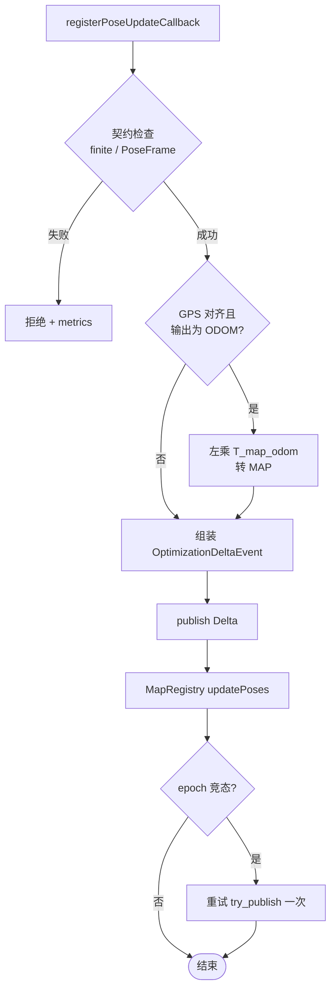

---

## 10. HBA 与建图收尾

- **HBAOptimizer**（`automap_pro/include/automap_pro/backend/hba_optimizer.h`）：分层 Bundle Adjustment，与外部 HBA ROS 服务或 GTSAM 回退协作（由配置 `backend.hba.*` 控制）。
- **MappingModule** 在子图冻结、建图结束等时机注册 **done 回调**，将 HBA 结果位姿写回并触发可视化/保存。
- **finish_mapping** 路径需 **flush 后端**、**冻结活跃子图**、处理 **iSAM2 首次 update** 等边界条件（详见 `CONFIG_SUMMARY.md` 与 `mapping_module.cpp` 相关注释）。

### 10.1 建图收尾与 HBA 协作（简图）

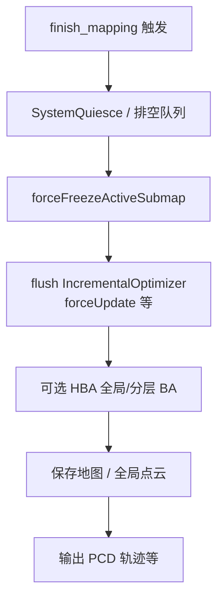

---

## 11. 回环检测管线（LoopDetector）

**头文件**：`automap_pro/include/automap_pro/loop_closure/loop_detector.h`  
**实现**：`automap_pro/src/loop_closure/loop_detector.cpp`（体量较大，建议配合日志关键字 `LOOP_COMPUTE`、`TEASER`、`INTRA_LOOP` 阅读）。

### 11.1 四阶段流水线（与类注释一致）

| Stage | 名称 | 行为摘要 | 实现要点 |
|-------|------|-----------|-----------|
| **0** | 描述子计算 | 子图（或关键帧）→ Range Image / 网络输入 → 描述子向量 | **`OverlapTransformerInfer overlap_infer_`**：LibTorch **进程内线程安全推理**；若定义 **`USE_OVERLAP_TRANSFORMER_MSGS`** 可走 **ROS Service** 异步回调推进。队列：**`desc_queue_`（priority_queue，overlap 高优先）**，mutex + `desc_cv_`。 |
| **1** | 候选检索 | 与历史库 **余弦相似度**，取 **TopK**；可选 **GPS 半径**、**几何距离预筛** | 参数：`overlap_threshold_`、`top_k_`、`gps_search_radius_`、`geo_prefilter_max_distance_m_`、`geo_prefilter_skip_above_score_`（高 score 跳过距离筛）。 |
| **2** | 几何粗配准 | **TEASER++**（FPFH 等特征 + 鲁棒估计） | **`TeaserMatcher teaser_matcher_`**；**`match_queue_` + `match_worker_` 单线程顺序执行**，避免多线程争抢 CPU。支持 **子图级** 与 **关键帧级**（`MatchTask::query_kf_idx`、`candidates_kf`）。可配置 **并行 TEASER 飞行数** `parallel_teaser_max_inflight_`。 |
| **3** | ICP 精化 | 对通过 TEASER 的候选做点-点/点-面 ICP 微调 | **`IcpRefiner`**（`icp_refiner.cpp`）；开关 **`use_icp_refine_`**（默认 true，配置可读 `loop_closure.teaser` 下 ICP 段）。 |

**验证门槛**（成员变量，由 `ConfigManager` / YAML 初始化）：**`min_inlier_ratio_`**、**`max_rmse_`** 等；另有 **`min_accept_overlap_score`**（ConfigManager）在 TEASER/ICP 通过后仍要求描述子分数下限，抑制低分伪回环。

### 11.1.1 四阶段数据流（流程图）

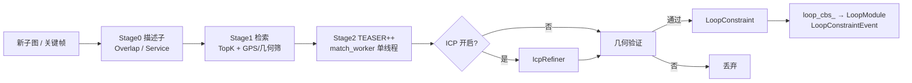

### 11.1.2 子图内 vs 子图间（架构分流）

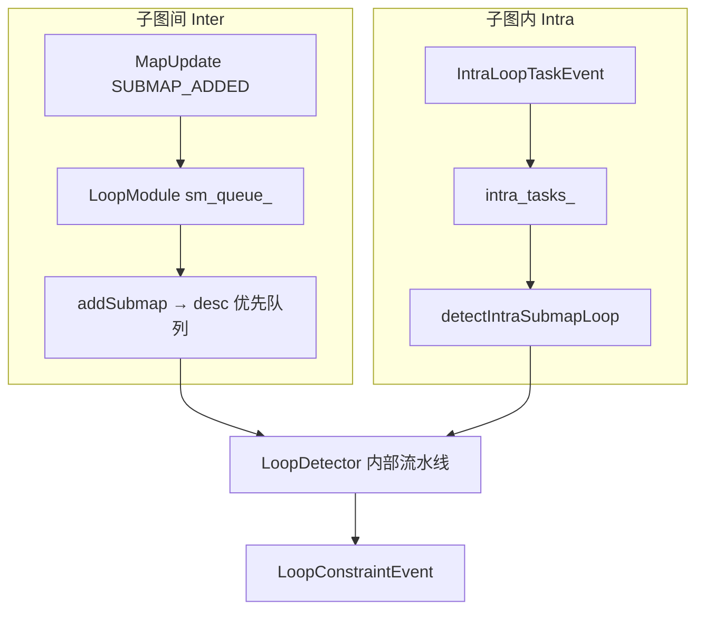

### 11.2 ScanContext 与其它回退路径

- **`SCManager sc_manager_`**：当 **`use_scancontext_`** 为真时参与检索；与 Overlap 形成 **双通道**。
- **回退策略**（配置）：`allow_sc_fallback_`、`allow_descriptor_fallback_`、`allow_svd_geom_fallback_`、`loop_flow_mode_`（如 `safe_degraded`）、`ot_preferred_flow_`。
- **临时 SVD 预算**：`svd_temp_enable_after_fpfh_critical_`、`svd_temp_enable_budget_max_` 等，在 FPFH/TEASER 连续失败时启用备选几何验证（见头文件字段）。

### 11.3 线程模型与队列背压

| 资源 | 说明 |
|------|------|
| **`desc_workers_`** | 多线程并行 **Stage 0**，I/O 与 GPU/CPU 推理重叠。 |
| **`match_worker_`** | **单线程**消费 `match_queue_`，执行 TEASER/ICP 重段。 |
| **数据库** | **`db_submaps_`** + `shared_mutex db_mutex_`；对外 `dbSize()`。 |
| **队列丢弃计数** | `loop_desc_queue_drop_total_`、`loop_match_queue_drop_total_`（超 `max_desc_queue_size` / `max_match_queue_size` 等配置时）。 |
| **并发安全** | **`intra_prepare_mutex_`**：`prepareIntraSubmapDescriptors` 与 `onDescriptorReady` 等路径互斥，**避免 double-free**（头文件注释）。 |

### 11.4 子图间：关键帧级 vs 子图级

| 配置项（`ConfigManager` / YAML） | 作用 |
|----------------------------------|------|
| `loop_closure.inter_keyframe_level` | **`inter_keyframe_level_enabled_`**：true 时 **关键帧↔关键帧** 候选。 |
| `loop_closure.inter_keyframe_sample_step` | query 子图内每 step 帧采 1 个 query。 |
| `loop_closure.inter_keyframe_top_k_per_submap` | 每个候选子图取 top-K 关键帧。 |
| `loop_closure.inter_submap_min_keyframe_gap` | 两关键帧全局索引最小间隔，抑相邻假回环。 |

**`MatchTask`**：`query_cloud` 入队时 **深拷贝**，避免 worker 读 `SubMap::downsampled_cloud` 与主线程并发 **UAF**（头文件注释）。

### 11.5 子图内回环（Intra-submap）

| 配置项 | 对应成员 | 含义 |
|--------|-----------|------|
| `loop_closure.intra_submap_enabled` | `intra_submap_enabled_` | 总开关 |
| `loop_closure.intra_submap_min_temporal_gap_s` | `intra_submap_min_temporal_gap_` | 时间间隔 |
| `loop_closure.intra_submap_min_keyframe_gap` | `intra_submap_min_keyframe_gap_` | 索引间隔 |
| `loop_closure.intra_submap_min_distance_gap_m` | `intra_submap_min_distance_gap_` | 距离间隔 |
| `loop_closure.intra_submap_overlap_threshold` | `intra_submap_overlap_threshold_` | 描述子相似度阈值 |
| `loop_closure.intra_submap_max_teaser_candidates` | `intra_submap_max_teaser_candidates_` | 单帧 TEASER 上限，防单帧 >10s |

**API**：`detectIntraSubmapLoop(submap, query_idx)`；**增量描述子**：`ensureIntraSubmapDescriptorsUpTo` 只算尾部，避免每帧全量 `prepare`。

### 11.6 输出与 ROS

- **回调**：`registerLoopCallback` 推送 **`LoopConstraint::Ptr`**；**`LoopModule`** 包装为 **`LoopConstraintEvent`** 并填 `EventMeta`（`ref_version`/`ref_epoch`/`session_id`）。
- **可选发布**：`constraint_pub_` 发布 **`automap_pro::msg::LoopConstraintMsg`** 供外部记录（视 launch 启用）。

### 11.7 诊断指标（原子计数器，头文件摘录）

可用于日志/监控：`loop_query_total_`、`loop_candidate_total_`、`loop_accept_total_`、`loop_ot_retrieval_total_`、`loop_sc_retrieval_total_`、`loop_teaser_geom_total_`、`loop_svd_geom_total_`、`loop_fallback_reject_total_`、`loop_teaser_async_inflight_max_`、`consecutive_zero_accept_queries_`（与 `zero_accept_warn_consecutive_queries_` 配合打 WARN）。

### 11.8 OverlapTransformer 相关配置（摘要）

- **`loop_closure.overlap_transformer`**：`use_cuda`、`proj_H`/`proj_W`、`fov_up`/`fov_down`、模型路径 `overlapModelPath()` 等（见 `config_manager.h` 中 `rangeImageH/W`、`overlapUseCuda` 等 API）。
- **外部服务**：`run_automap.sh` 支持 `--external-overlap`；需 config 中 **`loop_closure.overlap_transformer.mode: external_service`** 等与实现一致。

---

## 12. 目录结构与源码索引

| 路径 | 内容 |
|------|------|
| `automap_pro/include/automap_pro/v3/` | V3 模块、EventBus、MapRegistry 事件定义 |
| `automap_pro/src/v3/` | 各模块 `.cpp` 实现 |
| `automap_pro/src/system/modules/system_init.cpp` | **模块注册顺序** |
| `automap_pro/include/automap_pro/core/config_manager.h` | 配置访问 API |
| `automap_pro/include/automap_pro/backend/` | 增量优化器、HBA、iSAM2 GPS 管理 |
| `automap_pro/include/automap_pro/loop_closure/` | LoopDetector、TEASER、ICP、Overlap |
| `automap_pro/include/automap_pro/submap/` | SubMapManager |
| `automap_pro/include/automap_pro/frontend/` | LivoBridge、GPSManager、KeyframeManager |
| `automap_pro/src/modular/fast-livo2-humble/` | Fast-LIVO2  ROS2 包 |
| `automap_pro/config/system_config.yaml` | 默认系统配置 |
| `automap_ws/` | colcon 工作空间（build/install/log） |
| `run_automap.sh` | 一键 Docker 编译运行 |

---

## 13. ROS2、坐标系与 RViz

- **常用坐标系**：`odom`、`map`、`body`/雷达帧；对齐后点云发布多使用 **`map`**（见 `RvizPublisher`）。
- **TF**：由前端与系统配置共同决定；可视化侧依赖 `PoseSnapshot` 中 **`R_enu_to_map` / `t_enu_to_map`** 等与关键帧优化位姿融合。
- **话题**：以 `rviz_publisher.cpp` 与 launch 为准（如 `/automap/...` 前缀）；语义相关见 `VisualizationModule` 注释。

---

## 14. 并发、背压、屏障与健康检查

| 主题 | 实现要点 |
|------|-----------|
| **EventBus 同步 publish** | 发布者被慢回调阻塞 → 各模块用 **内部队列** 将工作挪到 module `run()` 线程。 |
| **subscribeAsync** | 仅用于明确可乱序场景；核心链路避免。 |
| **Visualization 屏障** | `ref_map_version` / `ref_alignment_epoch` 与 Registry 对齐后再变换点云。 |
| **quiesce** | `ModuleBase::quiesce` + `SystemQuiesceRequestEvent` 协作 finish/保存阶段。 |
| **健康检查** | `V3Context` 定时器 + `ModuleBase::checkHealth`（如内存阈值）；日志关键字 `[PIPELINE]`、`[V3]`。 |

### 14.1 Visualization 屏障与纪元（流程图）

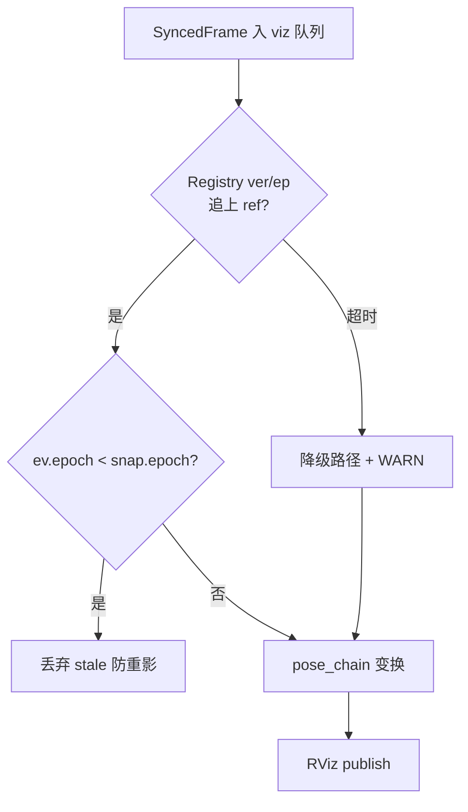

---

## 15. 编译运行与环境变量（摘要）

- **推荐**：仓库根目录 `bash run_automap.sh [--offline --bag-file ... --config system_config_M2DGR.yaml]`。
- **容器内路径**：`/root/automap_ws`、`/data`、`/root/run_logs`；缓存 `thrid_party/automap_cache`。
- **详尽说明**：[docs/BUILD_DEPLOY_RUN.md](docs/BUILD_DEPLOY_RUN.md) 与 `run_automap.sh --help` 中的环境变量列表（`AUTOMAP_*`、`LIBTORCH_*`、`ONNXRUNTIME_*` 等）。

---

## 附录 A：主要第三方依赖

- **ROS 2 Humble**、**PCL**、**GTSAM**、**Eigen**。
- **Fast-LIVO2**（子模块包）、**TEASER++**、**Ceres**（视构建选项）。
- **ONNX Runtime** + **SLOAM** 语义库（启用 `AUTOMAP_USE_SLOAM_SEMANTIC` 时）。
- **LibTorch**：OverlapTransformer 描述子推理（可选外部服务）。
- 完整列表以 `automap_pro/CMakeLists.txt` 与 `package.xml` 为准。

---

**文档维护**：若 `deferredSetupModules` 顺序、`map_registry.h` 事件、`OptTaskItem` 枚举或 `OptimizerModule::processTaskInternal` 的 `switch` 分支变更，请同步更新 **第 4、6、8、9、11 章**及 **相关 Mermaid 图**；并 bump 文档版本号（当前 **v3.2**）。
